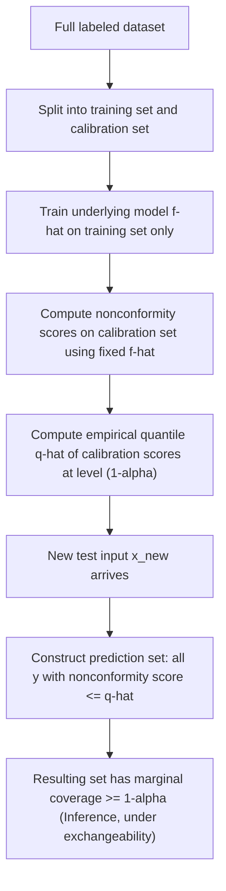

## Conformal Prediction

### Overview

Conformal prediction is a framework for constructing prediction sets or intervals that carry a distribution-free, finite-sample coverage guarantee, under a specific assumption about the data (exchangeability, defined below). Unlike Bayesian credible intervals, it does not require a prior. Unlike many classical confidence interval constructions, it does not rely on asymptotic approximations or assumptions about the underlying distribution's parametric form. This property is why it has drawn interest for uncertainty quantification in ML systems where the underlying model (e.g., a deep neural network) has no tractable closed-form sampling distribution.

### The Core Assumption: Exchangeability

Conformal prediction requires that the data points — typically the training set plus the new test point — are **exchangeable**: the joint distribution of the data is invariant under any permutation of the ordering of the points. This is a weaker assumption than i.i.d. (independent and identically distributed), since i.i.d. data is always exchangeable, but exchangeable data need not be strictly i.i.d.

[Inference] This distinction (i.i.d. implies exchangeable, but not the converse) follows directly from the mathematical definitions of both properties, so it is a logical consequence of the definitions rather than an empirical finding requiring a separate citation.

If the exchangeability assumption is violated — for example, under distribution shift between training and test data — the coverage guarantee described below is not established to hold. [Unverified] I do not have access to a specific source quantifying the precise degradation in coverage under specific types or magnitudes of distribution shift; this is likely to depend on the nature and severity of the shift.

### The Coverage Guarantee

For a desired miscoverage rate $\alpha$ (e.g., $\alpha = 0.1$ for 90% coverage), conformal prediction constructs a prediction set $C(x)$ for a new input $x$ such that:

$$
\mathbb{P}\big(y_{\text{new}} \in C(x_{\text{new}})\big) \ge 1 - \alpha
$$

This probability is marginal — taken over the randomness of the training data, the calibration data, and the new test point jointly — rather than conditional on any particular input $x$. This is an important caveat: the guarantee is about average coverage across the distribution of test points, not about guaranteed coverage for any single specific $x$.

[Inference] This marginal (rather than conditional) nature of the coverage guarantee is a standard point emphasized in conformal prediction literature, since achieving exact conditional coverage for every individual $x$ under a distribution-free assumption is a stronger requirement that is not generally achievable without additional assumptions. I cannot verify the precise theoretical limits on conditional coverage without a specific citation.

### Nonconformity Scores

The mechanism underlying conformal prediction is a **nonconformity score**, a function $s(x, y)$ that measures how unusual or atypical a candidate label $y$ is for a given input $x$, according to the underlying trained model. Higher scores indicate the pair is less consistent with the model's fit.

A common nonconformity score for regression is the absolute residual:

$$
s(x, y) = |y - \hat{f}(x)|
$$

where $\hat{f}(x)$ is the point prediction from the trained model. For classification, a common choice uses one minus the predicted probability of the candidate class:

$$
s(x, y) = 1 - \hat{p}(y \mid x)
$$

[Inference] Many variants of nonconformity scores exist beyond these two examples (e.g., normalized residuals for heteroscedastic regression, or scores based on the softmax rank rather than raw probability). I cannot verify which specific variant is most standard or most commonly used across current applied literature without a specific citation.

### Split Conformal Prediction (Inductive Conformal Prediction)

The most commonly used practical variant is **split conformal prediction**, which avoids the computational cost of retraining the model repeatedly. It proceeds as follows:

1. Split the available labeled data into a **training set** and a separate **calibration set**.
2. Fit the underlying model $\hat{f}$ using only the training set.
3. Compute nonconformity scores $s_i = s(x_i, y_i)$ for every point in the calibration set, using the fixed trained model.
4. Compute $\hat{q}$, the $\lceil (n+1)(1-\alpha) \rceil / n$ empirical quantile of the calibration scores $\{s_1, \dots, s_n\}$, where $n$ is the calibration set size.
5. For a new test point $x_{\text{new}}$, construct the prediction set as all candidate labels $y$ whose nonconformity score does not exceed $\hat{q}$:

$$
C(x_{\text{new}}) = \{y : s(x_{\text{new}}, y) \le \hat{q}\}
$$

For regression with the absolute residual score, this reduces to a simple symmetric interval:

$$
C(x_{\text{new}}) = \big[\hat{f}(x_{\text{new}}) - \hat{q},\; \hat{f}(x_{\text{new}}) + \hat{q}\big]
$$

The specific quantile formula in step 4 (using $\lceil (n+1)(1-\alpha) \rceil$ rather than a simpler $n(1-\alpha)$) is a finite-sample correction. [Inference] This adjustment is what allows the method's coverage guarantee to hold exactly for finite $n$ rather than only asymptotically as $n \to \infty$, which follows from the derivation of the method based on exchangeability, though I cannot verify the full formal proof without citing the specific original source.

### Diagram: Split Conformal Prediction Pipeline

### Diagram: Conformal Prediction Interval Construction

<svg xmlns="http://www.w3.org/2000/svg" viewBox="0 0 700 380">
  <text x="350" y="28" text-anchor="middle" font-size="17" font-weight="bold" fill="#1a1a1a">Conformal Interval Construction (svg_diagram)</text>

  <text x="175" y="60" text-anchor="middle" font-size="13" font-weight="bold" fill="#333">Calibration Set Residuals</text>
  <line x1="50" y1="300" x2="330" y2="300" stroke="#333" stroke-width="1" />
  <circle cx="70" cy="290" r="4" fill="#4c72b0" />
  <circle cx="95" cy="270" r="4" fill="#4c72b0" />
  <circle cx="120" cy="295" r="4" fill="#4c72b0" />
  <circle cx="150" cy="250" r="4" fill="#4c72b0" />
  <circle cx="175" cy="285" r="4" fill="#4c72b0" />
  <circle cx="200" cy="260" r="4" fill="#4c72b0" />
  <circle cx="230" cy="292" r="4" fill="#4c72b0" />
  <circle cx="260" cy="240" r="4" fill="#4c72b0" />
  <circle cx="290" cy="280" r="4" fill="#4c72b0" />
  <circle cx="310" cy="265" r="4" fill="#c44e52" />
  <text x="175" y="320" text-anchor="middle" font-size="11" fill="#555">Each point: |y_i - f-hat(x_i)| on calibration data</text>
  <text x="175" y="338" text-anchor="middle" font-size="11" fill="#c44e52">Red = largest scores near the (1-alpha) quantile</text>

  <text x="530" y="60" text-anchor="middle" font-size="13" font-weight="bold" fill="#333">Resulting Prediction Interval</text>
  <line x1="420" y1="200" x2="640" y2="200" stroke="#333" stroke-width="1" />
  <circle cx="530" cy="200" r="5" fill="#1a1a1a" />
  <text x="530" y="185" text-anchor="middle" font-size="11" fill="#333">f-hat(x_new)</text>

  <line x1="470" y1="200" x2="590" y2="200" stroke="#4c72b0" stroke-width="4" />
  <line x1="470" y1="190" x2="470" y2="210" stroke="#4c72b0" stroke-width="2" />
  <line x1="590" y1="190" x2="590" y2="210" stroke="#4c72b0" stroke-width="2" />
  <text x="470" y="225" text-anchor="middle" font-size="10" fill="#333">f-hat - q-hat</text>
  <text x="590" y="225" text-anchor="middle" font-size="10" fill="#333">f-hat + q-hat</text>
  <text x="530" y="260" text-anchor="middle" font-size="11" fill="#555">Width = 2 * q-hat</text>
  <text x="530" y="280" text-anchor="middle" font-size="11" fill="#555">(fixed width, from calibration quantile)</text>
</svg>

### Relationship to Confidence and Credible Intervals

Conformal prediction sets share the coverage-probability framing of frequentist confidence intervals but are constructed without assuming a specific parametric sampling distribution for an estimator. They differ from Bayesian credible intervals in that no prior over parameters is specified, and the resulting set is not a posterior probability statement about a parameter — it is a statement about where a new outcome $y_{\text{new}}$ is likely to fall, given the exchangeability assumption.

[Unverified] Whether conformal prediction should be classified primarily as a frequentist method, a distinct "distribution-free" category, or something that intersects both framings is a matter of framing choice across different literature sources, and I do not have access to a specific source establishing a single settled classification.

### Adaptive and Conditional Coverage Extensions

Because standard split conformal prediction only guarantees marginal coverage, several extensions attempt to approximate coverage that is more locally accurate for specific regions of the input space or specific subgroups:

- **Mondrian conformal prediction** partitions the calibration data into predefined groups (e.g., by class label or a sensitive attribute) and computes separate quantiles per group, aiming for coverage that holds within each group rather than only in aggregate.
- **Conformalized quantile regression (CQR)** uses quantile regression as the underlying model to produce intervals whose width can vary by input, rather than the fixed-width interval produced by the basic absolute-residual approach shown above.

[Unverified] I do not have access to a specific source to confirm the exact conditions under which these extensions achieve meaningfully improved local coverage relative to the marginal guarantee of standard split conformal prediction, and their practical performance is likely to depend on the specific grouping or quantile model used.

### Practical Considerations

- The calibration set must be held out from model training and reused only for computing nonconformity scores and the quantile $\hat{q}$; reusing training data for calibration invalidates the coverage guarantee.
- Prediction set width (or interval width) is not fixed to a single value across all conformal methods — basic split conformal regression produces constant width, while methods like CQR can produce input-dependent width.
- A larger calibration set generally produces a more stable estimate of $\hat{q}$, though [Unverified] I do not have access to a specific source specifying a minimum recommended calibration set size for general use, as this is likely to depend on the desired $\alpha$ and the acceptable variance in coverage.
- The coverage guarantee is about the prediction set as a whole, not about the correctness of the underlying model's point prediction; a poorly fit model will generally produce wider or less useful (though still marginally valid) prediction sets. [Inference] This follows from the fact that nonconformity scores are computed relative to the model's own fit, so a worse-fitting model tends to produce larger residuals and therefore a larger $\hat{q}$, though I cannot verify the precise quantitative relationship without empirical evaluation on a specific case.

### Common Pitfalls

- Interpreting the marginal coverage guarantee as if it applies conditionally to every individual input $x$. [Inference] This is a known distinction in the conformal prediction literature between marginal and conditional coverage, following directly from the definition of the guarantee stated above as an expectation over the joint distribution rather than a per-point statement.
- Applying standard conformal prediction to data with known temporal or spatial dependence without addressing the exchangeability assumption, since such dependence can violate exchangeability. [Unverified] I do not have access to a specific source cataloguing which specific dependence structures are known to break the guarantee versus which are tolerable in practice.
- Assuming conformal prediction sets are automatically small or practically useful. A valid but very wide prediction set can technically satisfy the coverage guarantee while providing little actionable information; set size is a separate efficiency criterion from coverage validity.

Behavior of any specific implementation, library, or trained model under conformal prediction is not guaranteed and may vary depending on the nonconformity score chosen, the calibration set characteristics, and whether the exchangeability assumption holds for the specific deployment setting; empirical verification on the task at hand is advisable before relying on these guarantees in a production system.

**Related Topics**
- Split conformal vs. full (transductive) conformal prediction
- Conformalized quantile regression (CQR) in depth
- Mondrian conformal prediction and group-conditional coverage
- Confidence intervals vs. credible intervals (related uncertainty framing)
- Distribution shift and its effect on exchangeability assumptions
- Nonconformity score design for structured or multi-output prediction
- Conformal prediction for classification: set-valued vs. single-label output