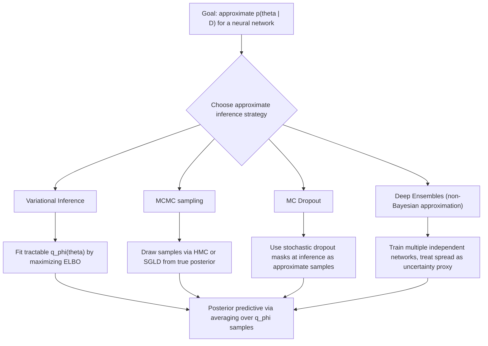

## Bayesian Neural Networks

### Overview

A Bayesian neural network (BNN) treats the network's weights as random variables with a probability distribution, rather than as fixed point values learned via a single optimization run. Instead of training to find one "best" set of weights, a BNN aims to characterize a posterior distribution over plausible weight configurations given the observed training data, then integrates over that posterior to make predictions.

### Formal Setup

Given a network architecture with weights $\theta$, a prior distribution $p(\theta)$ is specified over the weights before observing any data. Given training data $D = \{(x_i, y_i)\}_{i=1}^n$, the likelihood $p(D \mid \theta)$ describes how probable the observed data is under a specific weight setting. Bayes' rule gives the posterior:

$$
p(\theta \mid D) = \frac{p(D \mid \theta)\, p(\theta)}{p(D)}
$$

where $p(D) = \int p(D \mid \theta)\, p(\theta)\, d\theta$ is the marginal likelihood (evidence), which normalizes the posterior.

Predictions for a new input $x_{\text{new}}$ are made by integrating over the full posterior rather than plugging in a single point estimate:

$$
p(y_{\text{new}} \mid x_{\text{new}}, D) = \int p(y_{\text{new}} \mid x_{\text{new}}, \theta)\, p(\theta \mid D)\, d\theta
$$

This integral is called the **posterior predictive distribution**. It naturally incorporates epistemic uncertainty, since it accounts for the full range of plausible weight settings rather than relying on one fixed value.

### Why Exact Bayesian Inference Is Intractable

For neural networks, the marginal likelihood $p(D)$ involves integrating the likelihood over a highly nonlinear function of $\theta$ across a parameter space with potentially millions or billions of dimensions. [Inference] This integral does not have a closed-form solution for any standard neural network architecture, because the likelihood is a nonlinear, non-conjugate function of $\theta$ once passed through multiple nonlinear layers. I cannot verify this claim against a specific formal proof without citing a specific source, though it follows from the general mathematical structure of neural network likelihoods.

Because exact computation of $p(\theta \mid D)$ is not feasible at this scale, essentially all practical Bayesian neural network methods rely on **approximate inference** techniques rather than exact posterior computation.

### Variational Inference for BNNs

Variational inference approximates the true posterior $p(\theta \mid D)$ with a simpler, tractable distribution $q_\phi(\theta)$, parameterized by variational parameters $\phi$ (for example, a Gaussian with a mean and variance for each weight). The approximation is fit by minimizing the KL divergence between $q_\phi(\theta)$ and the true posterior:

$$
\phi^* = \arg\min_\phi D_{KL}\big(q_\phi(\theta) \,\|\, p(\theta \mid D)\big)
$$

Because this KL divergence itself depends on the intractable posterior, it is not minimized directly. Instead, the equivalent **Evidence Lower Bound (ELBO)** is maximized, which is tractable:

$$
\text{ELBO}(\phi) = \mathbb{E}_{q_\phi(\theta)}\big[\log p(D \mid \theta)\big] - D_{KL}\big(q_\phi(\theta) \,\|\, p(\theta)\big)
$$

The first term rewards $q_\phi$ for assigning high probability to weight settings that explain the data well (data fit). The second term penalizes $q_\phi$ for deviating from the prior (regularization). Maximizing the ELBO is mathematically equivalent to minimizing the KL divergence to the true posterior, up to a constant that does not depend on $\phi$.

[Inference] This equivalence follows from a standard algebraic identity: $\log p(D) = \text{ELBO}(\phi) + D_{KL}(q_\phi(\theta) \| p(\theta \mid D))$, and since $\log p(D)$ is constant with respect to $\phi$, maximizing the ELBO is equivalent to minimizing the KL term. I present this as a mathematical derivation rather than a claim requiring external verification, since it can be checked directly by algebraic expansion.

A widely used practical instantiation of this approach is **Bayes by Backprop**, which places an independent Gaussian $q_\phi(\theta_j) = \mathcal{N}(\mu_j, \sigma_j^2)$ on each weight and optimizes $\mu_j, \sigma_j$ via gradient-based methods, using the reparameterization trick to allow gradients to flow through the sampling step. [Unverified] I do not have access to a specific source to confirm this is the single most widely used variational BNN method in current applied practice versus other variational formulations; multiple variants exist in the literature.

### Diagram: Variational Inference Approximation

<svg xmlns="http://www.w3.org/2000/svg" viewBox="0 0 700 380">
  <text x="350" y="28" text-anchor="middle" font-size="17" font-weight="bold" fill="#1a1a1a">Variational Approximation to the Posterior (svg_diagram)</text>

  <line x1="60" y1="320" x2="640" y2="320" stroke="#333" stroke-width="1" />
  <text x="350" y="345" text-anchor="middle" font-size="12" fill="#333">Weight value θ</text>

  <path d="M 80 320 Q 150 320 200 280 Q 250 200 300 160 Q 330 130 360 160 Q 400 210 440 270 Q 470 300 520 315 Q 560 320 600 320 Z" fill="none" stroke="#c44e52" stroke-width="2.5" />
  <text x="330" y="115" text-anchor="middle" font-size="12" fill="#c44e52" font-weight="bold">True posterior p(θ|D)</text>
  <text x="330" y="132" text-anchor="middle" font-size="10" fill="#c44e52">(complex, possibly multimodal)</text>

  <path d="M 80 320 Q 200 320 280 280 Q 330 240 380 280 Q 460 320 600 320 Z" fill="#cde3f7" opacity="0.6" stroke="#4c72b0" stroke-width="2.5" />
  <text x="480" y="255" text-anchor="middle" font-size="12" fill="#4c72b0" font-weight="bold">Variational approx q_φ(θ)</text>
  <text x="480" y="272" text-anchor="middle" font-size="10" fill="#4c72b0">(simple, e.g., Gaussian)</text>

  <text x="350" y="60" text-anchor="middle" font-size="12" fill="#555">Fit by maximizing ELBO, equivalently minimizing KL(q_φ || p(θ|D))</text>
</svg>

### Monte Carlo Dropout as Approximate Inference

Monte Carlo Dropout applies dropout not only during training but also at test time, treating each stochastic forward pass (with a different random dropout mask) as an approximate sample from a posterior distribution over network configurations. [Unverified] The precise theoretical status of MC Dropout as a formal variational approximation to a specific Bayesian model has been discussed and, in some later literature, disputed. I do not have access to a specific source to confirm the current state of consensus on this theoretical connection, and I present this only as a description of the method's mechanism rather than a settled theoretical claim.

Practically, MC Dropout is often used because it requires no change to a standard dropout-trained network's architecture — uncertainty estimates are obtained simply by running multiple stochastic forward passes at inference and examining the variance of the outputs.

### Markov Chain Monte Carlo (MCMC) for BNNs

An alternative to variational inference is to draw samples directly from the posterior using MCMC methods, which construct a Markov chain whose stationary distribution is the true posterior $p(\theta \mid D)$, without requiring a parametric approximation like $q_\phi$.

**Hamiltonian Monte Carlo (HMC)** uses gradient information about the posterior to propose more efficient moves through parameter space than simpler random-walk MCMC methods. **Stochastic Gradient Langevin Dynamics (SGLD)** adapts MCMC to work with mini-batches of data, making it more compatible with the scale of typical deep learning training.

[Unverified] I do not have access to a specific source to confirm the relative sample efficiency or scalability of MCMC-based methods compared to variational methods for large modern neural network architectures; this is an active area of research and reported comparative performance is likely to depend on the specific architecture, dataset, and MCMC variant used.

### Diagram: BNN Inference Approaches

### The Role of the Prior

The prior $p(\theta)$ in a BNN encodes assumptions about plausible weight values before seeing data. A common default choice is an independent zero-mean Gaussian prior on each weight:

$$
p(\theta_j) = \mathcal{N}(0, \sigma_0^2)
$$

[Inference] This choice has a direct mathematical connection to L2 (weight decay) regularization in standard point-estimate training, since maximizing the log-posterior under a Gaussian prior is equivalent to minimizing the negative log-likelihood plus an L2 penalty term on the weights. This equivalence can be derived algebraically from the log-posterior expression, so I present it as a mathematical derivation rather than an empirical claim requiring a separate citation.

[Unverified] The extent to which the specific choice of prior variance $\sigma_0^2$ meaningfully affects predictive performance or calibration for large modern architectures is a subject of ongoing research, and I do not have access to a specific source to confirm general best practices across architectures.

### Predictive Uncertainty from the Posterior Predictive

Because the posterior predictive distribution integrates over many plausible weight settings, predictions from a BNN naturally carry a measure of epistemic uncertainty — inputs far from the training data distribution tend to produce higher disagreement across posterior samples, since different plausible weight settings can extrapolate very differently in regions with little or no training data.

This connects directly to the aleatoric/epistemic decomposition: the posterior predictive's total uncertainty can be split into the expected uncertainty of a single weight sample (aleatoric) and the variability across weight samples (epistemic), following the same decomposition structure described in that topic.

[Inference] Whether this epistemic uncertainty signal reliably identifies out-of-distribution inputs in practice for any specific architecture is a claim requiring empirical validation on the specific task. I do not have access to a specific source to confirm general reliability of this signal across architectures and datasets, and this should not be treated as a settled behavioral guarantee.

### Computational Cost Considerations

BNNs generally require substantially more computation than standard point-estimate networks, both because approximate inference methods (variational or MCMC) typically require more parameters, more forward passes, or longer training than a single deterministic network, and because the posterior predictive integral in practice is approximated via Monte Carlo sampling — averaging over multiple forward passes at inference time rather than a single pass.

[Unverified] I do not have access to a specific source quantifying the exact computational overhead (e.g., a specific multiplier on training time or inference latency) for any particular BNN method relative to standard training, as this depends heavily on the specific method, architecture, and implementation.

### Common Pitfalls

- Assuming any dropout-trained network automatically provides valid Bayesian uncertainty estimates without applying MC Dropout's specific test-time sampling procedure. [Inference] Standard dropout is typically disabled at test time in conventional (non-Bayesian) usage, so simply having dropout layers present during training does not by itself provide the stochastic test-time sampling that MC Dropout relies on.
- Treating variational inference's approximate posterior $q_\phi(\theta)$ as identical to the true posterior $p(\theta \mid D)$. [Inference] Because $q_\phi$ is restricted to a chosen tractable family (e.g., independent Gaussians), it generally cannot represent complex, correlated, or multimodal aspects of the true posterior, which follows directly from the limited expressiveness of the chosen variational family relative to an unconstrained posterior.
- Assuming a BNN's uncertainty estimates are correct or well calibrated simply because the method is labeled "Bayesian." [Unverified] I do not have access to a specific source confirming that Bayesian framing guarantees good calibration in practice; the quality of uncertainty estimates depends on prior choice, approximation quality, and how well the model architecture matches the true data-generating process, none of which are automatically ensured by the Bayesian framework itself.

Behavior of any specific BNN implementation, library, or trained model described above is not guaranteed and may vary depending on architecture, prior specification, approximate inference method, and dataset characteristics; empirical validation on the specific task is advisable before relying on these uncertainty estimates in a deployed system.

**Related Topics**
- Variational autoencoders as a related application of variational inference
- Gaussian processes as an alternative Bayesian non-parametric approach
- Aleatoric vs. epistemic uncertainty (prerequisite / related concept)
- Deep ensembles as a non-Bayesian approximation to epistemic uncertainty
- Laplace approximation as a post-hoc Bayesian approximation method
- Reparameterization trick: derivation and role in variational inference
- Calibration of probabilistic predictions (related but distinct concept)