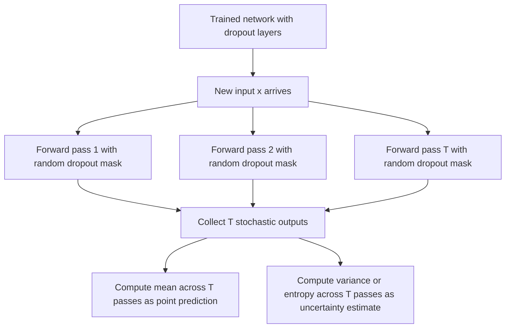

## Monte Carlo Dropout

### Overview

Monte Carlo Dropout (MC Dropout) is a technique that applies dropout — normally a training-only regularization method — at inference time as well, using the spread of predictions across multiple stochastic forward passes as an approximate measure of a model's uncertainty. Its practical appeal is that it requires no architectural changes beyond a network that already uses dropout, and no separate Bayesian inference machinery beyond running repeated forward passes.

### Mechanism

Standard dropout, during training, randomly zeroes out a subset of activations in a layer with some probability $p$ at each forward pass, which is a well-established regularization technique to reduce overfitting. At test time in conventional (non-Bayesian) usage, dropout is disabled, and the network uses all units with weights typically rescaled to account for the expected value of the dropped-out activations during training.

MC Dropout instead keeps dropout **active** at test time. For a given input $x$, the network is run through $T$ independent stochastic forward passes, each with an independently sampled dropout mask, producing $T$ different outputs:

$$
\hat{y}^{(1)}, \hat{y}^{(2)}, \dots, \hat{y}^{(T)} \sim p(y \mid x, \hat{\theta}, \text{mask}^{(t)})
$$

The empirical mean of these outputs is used as the point prediction, and their empirical variance is used as an uncertainty estimate:

$$
\hat{\mu}(x) = \frac{1}{T}\sum_{t=1}^{T} \hat{y}^{(t)}, \qquad \hat{\sigma}^2(x) = \frac{1}{T}\sum_{t=1}^{T} \left(\hat{y}^{(t)} - \hat{\mu}(x)\right)^2
$$

For classification, the equivalent procedure averages the $T$ softmax output vectors to get a mean predictive distribution, and can use metrics such as the variance or entropy across the $T$ passes as an uncertainty signal.

### Theoretical Motivation

The original motivation presented for MC Dropout frames it as an approximate variational inference method: under this framing, applying dropout at test time and averaging over many stochastic passes approximates sampling from an approximate posterior distribution over the network's weights, where the dropout-induced randomness plays the role of the variational distribution $q_\phi(\theta)$ described in Bayesian neural network approximate inference.

[Unverified] I cannot verify the precise technical conditions under which this variational-inference interpretation is considered mathematically exact, nor the current state of consensus regarding this theoretical connection, without access to a specific source. I do not have access to that information as part of this conversation.

[Unverified] Some later literature has, to varying degrees, disputed or qualified this theoretical justification. I do not have access to a specific source confirming what the current settled position is across the field, and this should be treated as a contested rather than settled theoretical claim.

### Diagram: MC Dropout Inference Procedure

[Unverified] This diagram describes the mechanical procedure as commonly described for MC Dropout. I cannot verify that every implementation follows precisely this sequence without inspecting the specific codebase or paper in question.

### Diagram: Single Pass vs. Multiple Stochastic Passes

<svg xmlns="http://www.w3.org/2000/svg" viewBox="0 0 700 340">
  <text x="350" y="28" text-anchor="middle" font-size="17" font-weight="bold" fill="#1a1a1a">MC Dropout: Multiple Stochastic Forward Passes (svg_diagram)</text>

  <rect x="40" y="150" width="80" height="60" rx="6" fill="#e8e8e8" stroke="#666" />
  <text x="80" y="185" text-anchor="middle" font-size="12" fill="#222">Input x</text>

  <line x1="120" y1="170" x2="200" y2="110" stroke="#4c72b0" stroke-width="1.5" />
  <line x1="120" y1="180" x2="200" y2="180" stroke="#4c72b0" stroke-width="1.5" />
  <line x1="120" y1="190" x2="200" y2="250" stroke="#4c72b0" stroke-width="1.5" />

  <rect x="200" y="85" width="150" height="45" rx="5" fill="#cde3f7" stroke="#4c72b0" />
  <text x="275" y="112" text-anchor="middle" font-size="11" fill="#333">Pass 1: mask A</text>

  <rect x="200" y="158" width="150" height="45" rx="5" fill="#cde3f7" stroke="#4c72b0" />
  <text x="275" y="185" text-anchor="middle" font-size="11" fill="#333">Pass 2: mask B</text>

  <rect x="200" y="228" width="150" height="45" rx="5" fill="#cde3f7" stroke="#4c72b0" />
  <text x="275" y="255" text-anchor="middle" font-size="11" fill="#333">Pass T: mask Z</text>

  <line x1="350" y1="107" x2="440" y2="170" stroke="#4c72b0" stroke-width="1.5" />
  <line x1="350" y1="180" x2="440" y2="180" stroke="#4c72b0" stroke-width="1.5" />
  <line x1="350" y1="250" x2="440" y2="190" stroke="#4c72b0" stroke-width="1.5" />

  <rect x="440" y="150" width="220" height="70" rx="6" fill="#f7d8c4" stroke="#dd8452" />
  <text x="550" y="175" text-anchor="middle" font-size="12" fill="#222">Aggregate T outputs</text>
  <text x="550" y="193" text-anchor="middle" font-size="11" fill="#333">mean = prediction</text>
  <text x="550" y="209" text-anchor="middle" font-size="11" fill="#333">variance = uncertainty</text>
</svg>

### Relationship to Aleatoric and Epistemic Uncertainty

MC Dropout is typically presented as producing an epistemic-style uncertainty signal, since the variance across passes reflects sensitivity to which subnetwork (induced by the dropout mask) is being evaluated, which is conceptually related to model/parameter uncertainty rather than data noise. Some extensions of the technique combine MC Dropout's variance with an explicit heteroscedastic output head to attempt to separate aleatoric and epistemic components, following the general decomposition structure described in the aleatoric/epistemic uncertainty topic.

[Inference] Framing plain MC Dropout's raw output variance as a clean, isolated epistemic signal is a reasoned extension of its variational-inference motivation, but I cannot verify this framing against a specific confirmed source, and I do not have access to information establishing how cleanly this separation holds in practice.

### Practical Parameters

Two practical choices affect the resulting uncertainty estimate: the dropout rate $p$ used in the network, and the number of stochastic passes $T$ performed at inference.

[Unverified] I do not have access to a specific source establishing a universally recommended value for either $p$ or $T$ across architectures and tasks. Reported values vary across different studies and applications, and I cannot verify a single correct default without a specific citation.

A larger $T$ produces a more stable Monte Carlo estimate of the mean and variance, at the direct cost of $T$ times the inference compute of a single forward pass. This computational relationship follows from the definition of the procedure itself (running $T$ independent forward passes) rather than requiring external verification.

### Comparison to Other Uncertainty Methods

| Property | MC Dropout | Deep Ensembles | Full Bayesian NN (variational) |
|---|---|---|---|
| Requires architecture change | Minimal (needs existing dropout layers) | No, but requires training multiple models | Yes, typically (weight distributions) |
| Training cost relative to standard network | Same as standard training | Multiplied by number of ensemble members | Generally higher |
| Inference cost | T forward passes | N forward passes (N ensemble members) | Typically multiple forward passes over posterior samples |
| Theoretical grounding | [Unverified] contested, as noted above | [Unverified] debated whether it is a true Bayesian approximation | Explicit approximate Bayesian framework |

[Unverified] I cannot verify that this table captures every relevant comparison dimension discussed in the broader literature, and specific quantitative comparisons (e.g., exact relative accuracy of uncertainty estimates between these methods) would require a specific cited empirical study that I do not have access to in this conversation.

### Common Pitfalls

- Assuming a network trained with standard dropout automatically provides valid MC Dropout uncertainty estimates without explicitly keeping dropout active at test time and running multiple passes. [Inference] Since dropout is disabled by default at test time in conventional non-Bayesian usage, this specific test-time procedure is a hard requirement for MC Dropout to function as described, not an optional addition.
- Treating MC Dropout's uncertainty estimate as automatically well calibrated. [Unverified] I do not have access to a specific source confirming that MC Dropout uncertainty estimates are reliably calibrated across architectures and tasks; calibration is a separate property that is not guaranteed by the method's construction, and behavior may vary by architecture, dropout configuration, dataset, and task.
- Assuming higher dropout rate always produces more informative uncertainty estimates. [Speculation] It is plausible that very high or very low dropout rates could distort the estimate in ways not aligned with genuine epistemic uncertainty, but I do not have access to a specific source confirming this relationship, and I present it here only as an unconfirmed possibility rather than an established finding.
- Assuming the number of forward passes $T$ used in a specific implementation is sufficient for a stable estimate without checking convergence. [Unverified] I do not have access to a specific source specifying a minimum sufficient $T$ for general use.

For any claims regarding how MC Dropout behaves in a specific model, library, or deployed system: this is [Unverified] without direct testing of that specific implementation, and behavior is not guaranteed to match the general description above — it may vary depending on architecture, dropout placement, dropout rate, number of passes, dataset, and task.

**Related Topics**
- Bayesian neural networks (prerequisite / related framework)
- Deep ensembles as an alternative epistemic uncertainty method
- Aleatoric vs. epistemic uncertainty (related decomposition)
- Variational inference: ELBO derivation and ties to MC Dropout's original motivation
- Calibration of probabilistic predictions (related but distinct evaluation concept)
- Reparameterization trick and its role in variational approximate inference