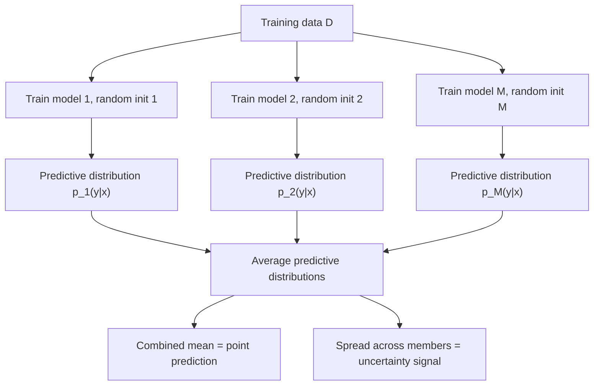

## Ensemble Methods for Uncertainty Estimation

### Overview

Ensemble methods estimate predictive uncertainty by training multiple models and examining the spread, or disagreement, across their predictions. Rather than relying on an explicit Bayesian posterior over a single model's parameters, an ensemble uses a discrete collection of separately trained models as a proxy for the range of plausible functions consistent with the data.

### Deep Ensembles

The most widely used variant in deep learning is the **deep ensemble**: $M$ neural networks with identical architecture are trained independently, typically differing only in random weight initialization and, often, the order in which mini-batches are presented during training (stochastic data shuffling).

For regression, each ensemble member $m$ produces a predictive distribution, commonly Gaussian:

$$
p_m(y \mid x) = \mathcal{N}\big(y;\, \mu_m(x),\, \sigma_m^2(x)\big)
$$

with the mean and variance both output by the network, following the same heteroscedastic parameterization described under aleatoric uncertainty modeling. The ensemble's combined predictive distribution is typically formed as a uniformly weighted mixture:

$$
p(y \mid x) = \frac{1}{M}\sum_{m=1}^{M} p_m(y \mid x)
$$

For this Gaussian-mixture case, the combined mean and variance can be computed in closed form:

$$
\mu(x) = \frac{1}{M}\sum_{m=1}^{M} \mu_m(x)
$$

$$
\sigma^2(x) = \frac{1}{M}\sum_{m=1}^{M}\left(\sigma_m^2(x) + \mu_m(x)^2\right) - \mu(x)^2
$$

This variance decomposition contains both the average of each member's own predicted variance (an aleatoric-style component) and the variance of the means across members (an epistemic-style component), which mirrors the general aleatoric/epistemic decomposition structure.

For classification, each ensemble member produces a softmax distribution, and these are typically averaged to form the ensemble's combined predictive distribution:

$$
p(y \mid x) = \frac{1}{M}\sum_{m=1}^{M} p_m(y \mid x)
$$

with disagreement across members (e.g., variance of predicted class probabilities, or entropy of the averaged distribution relative to the average entropy of individual members) used as an uncertainty signal.

### Diagram: Deep Ensemble Prediction Aggregation

### Diagram: Ensemble Disagreement as Uncertainty Signal

<svg xmlns="http://www.w3.org/2000/svg" viewBox="0 0 700 360">
  <text x="350" y="28" text-anchor="middle" font-size="17" font-weight="bold" fill="#1a1a1a">Ensemble Member Disagreement (svg_diagram)</text>

  <text x="175" y="60" text-anchor="middle" font-size="13" font-weight="bold" fill="#333">In-distribution input</text>
  <line x1="50" y1="280" x2="330" y2="280" stroke="#333" stroke-width="1" />
  <path d="M 100 280 Q 130 200 190 190 Q 250 200 280 280 Z" fill="#cde3f7" stroke="#4c72b0" stroke-width="2" />
  <line x1="130" y1="280" x2="130" y2="230" stroke="#4c72b0" stroke-width="1.5" />
  <line x1="160" y1="280" x2="160" y2="205" stroke="#4c72b0" stroke-width="1.5" />
  <line x1="190" y1="280" x2="190" y2="192" stroke="#4c72b0" stroke-width="1.5" />
  <line x1="220" y1="280" x2="220" y2="210" stroke="#4c72b0" stroke-width="1.5" />
  <line x1="250" y1="280" x2="250" y2="235" stroke="#4c72b0" stroke-width="1.5" />
  <text x="175" y="305" text-anchor="middle" font-size="11" fill="#555">Members agree closely</text>
  <text x="175" y="322" text-anchor="middle" font-size="11" fill="#555">Low predictive spread</text>

  <text x="530" y="60" text-anchor="middle" font-size="13" font-weight="bold" fill="#333">Out-of-distribution input</text>
  <line x1="420" y1="280" x2="680" y2="280" stroke="#333" stroke-width="1" />
  <line x1="450" y1="280" x2="450" y2="240" stroke="#c44e52" stroke-width="1.5" />
  <line x1="490" y1="280" x2="490" y2="150" stroke="#c44e52" stroke-width="1.5" />
  <line x1="530" y1="280" x2="530" y2="200" stroke="#c44e52" stroke-width="1.5" />
  <line x1="570" y1="280" x2="570" y2="110" stroke="#c44e52" stroke-width="1.5" />
  <line x1="610" y1="280" x2="610" y2="180" stroke="#c44e52" stroke-width="1.5" />
  <line x1="650" y1="280" x2="650" y2="230" stroke="#c44e52" stroke-width="1.5" />
  <text x="530" y="305" text-anchor="middle" font-size="11" fill="#555">Members diverge widely</text>
  <text x="530" y="322" text-anchor="middle" font-size="11" fill="#555">High predictive spread</text>
</svg>

The pattern shown — greater member disagreement on out-of-distribution inputs than on in-distribution inputs — is a commonly reported qualitative behavior for deep ensembles. [Unverified] I do not have access to a specific source confirming this pattern holds consistently across architectures, datasets, and types of distribution shift, and I cannot verify the magnitude of this effect without a specific citation. Behavior for any specific model is not guaranteed and may vary.

### Why Ensembles Produce Diverse Predictions

The theoretical basis for using ensemble spread as an uncertainty proxy rests on the idea that independently initialized and trained networks can converge to different local optima in a highly non-convex loss landscape, and that these different optima can generalize differently — particularly in regions of input space with little or no training data, where the training loss provides little constraint on the function's behavior.

[Inference] This explanation — that non-convexity and underconstrained regions of input space lead to functional diversity among ensemble members — is a commonly given account of why deep ensembles work. I cannot verify this account against a specific formal theoretical proof without a citation, and I do not have access to a source establishing this as a settled explanation versus one plausible account among others discussed in the literature.

### Relationship to Bayesian Model Averaging

The averaging formula used for deep ensembles is structurally similar to the Bayesian posterior predictive integral described in the Bayesian neural network topic, in which prediction involves integrating over a distribution of plausible weight settings weighted by the posterior. A deep ensemble can be viewed informally as approximating this integral with a small number of discrete point samples, rather than a continuous posterior distribution.

[Unverified] Whether deep ensembles constitute a formally justified approximation to Bayesian model averaging, or should instead be understood as a distinct, non-Bayesian heuristic that happens to produce similar practical benefits, is a matter of active discussion in the literature. I do not have access to a specific source establishing a settled resolution to this question, and I present both framings here as competing views rather than a confirmed conclusion.

### Random Initialization vs. Bootstrap Resampling

Two distinct sources of diversity are used across different ensemble variants:

**Random initialization only**: all ensemble members train on the same full dataset $D$, differing only in initial weights (and typically batch order). This is the standard approach in most deep ensemble literature as commonly described.

**Bootstrap aggregation (bagging)**: each ensemble member trains on a different bootstrap resample of $D$ (sampling with replacement), which is the classical approach used in random forests and related methods.

[Unverified] Whether random-initialization-only diversity or bootstrap-resampling diversity produces more useful uncertainty estimates for deep neural networks specifically is a comparison I do not have access to a specific confirmed source for. Some reported findings in the literature have suggested one approach outperforms the other in certain settings, but I cannot verify the generality of any such finding without a specific citation, and I present this only as an open comparison rather than a settled result.

### Practical Cost Considerations

Training $M$ ensemble members requires approximately $M$ times the training compute of a single network, and inference requires $M$ forward passes rather than one, since each member must be evaluated separately before combining outputs. This scaling relationship follows directly from the definition of the method (training and running $M$ separate networks) rather than requiring external verification.

[Unverified] I do not have access to a specific source establishing a universally recommended value of $M$ for general use; reported values vary across studies, and the appropriate choice likely depends on the acceptable computational budget and the specific task's sensitivity to ensemble size.

### Comparison Across Uncertainty Methods

| Property | Deep Ensembles | MC Dropout | Bayesian NN (variational) |
|---|---|---|---|
| Source of diversity | Independent training runs | Stochastic dropout masks at inference | Sampled weights from approximate posterior $q_\phi$ |
| Training cost | $M \times$ single-model cost | Same as standard training | Generally higher than standard training |
| Inference cost | $M$ forward passes | $T$ forward passes | Multiple forward passes over posterior samples |
| Requires existing dropout layers | No | Yes | No |
| Formal Bayesian justification | [Unverified] debated, as noted above | [Unverified] contested, as noted in the MC Dropout topic | Explicit approximate Bayesian framework by construction |

[Unverified] I cannot verify that this table captures every relevant dimension of comparison discussed across the broader literature on these methods, and I do not have access to a specific source for direct quantitative benchmarking across all three approaches on a common task.

### Common Pitfalls

- Assuming ensemble disagreement is a mathematically exact measure of epistemic uncertainty in the Bayesian sense. [Unverified] I do not have access to a specific source confirming the precise conditions, if any, under which ensemble variance is formally equivalent to the epistemic term in the Bayesian decomposition described under aleatoric vs. epistemic uncertainty; it is generally presented as an approximate proxy rather than a proven equivalence.
- Using too few ensemble members and assuming the resulting spread estimate is stable. [Inference] Since the empirical variance across $M$ samples is itself an estimate subject to sampling variability, a small $M$ is expected to produce a noisier estimate of the true spread than a larger $M$, which follows from general statistical properties of sample variance estimation rather than requiring a specific citation for this general statistical fact.
- Assuming all ensemble members are meaningfully diverse simply because they were initialized differently. [Speculation] It is possible for some training setups or datasets to produce ensemble members that converge to very similar functions despite different initializations, which would reduce the usefulness of the ensemble's spread as an uncertainty signal, but I do not have access to a specific source confirming how often this occurs in practice, and I present this only as an unconfirmed possibility.
- Assuming ensemble-based uncertainty estimates are automatically well calibrated. [Unverified] I do not have access to a specific source confirming that ensemble methods reliably produce calibrated uncertainty estimates across architectures and tasks; this is a separate property from the method's construction and is not guaranteed.

For any claims regarding how a specific ensemble implementation, library, or trained set of models behaves: this is [Unverified] without direct testing of that specific setup, and behavior is not guaranteed to match the general descriptions above — it may vary depending on architecture, training procedure, ensemble size, diversity source, dataset, and task.

**Related Topics**
- Bayesian neural networks and the formal posterior predictive framework
- Monte Carlo Dropout as an alternative approximate uncertainty method
- Aleatoric vs. epistemic uncertainty (underlying decomposition)
- Calibration of probabilistic predictions (related but distinct evaluation concept)
- Bagging and bootstrap methods in classical ensemble learning
- Snapshot ensembles and other reduced-cost ensemble training strategies
- Out-of-distribution detection using predictive uncertainty signals