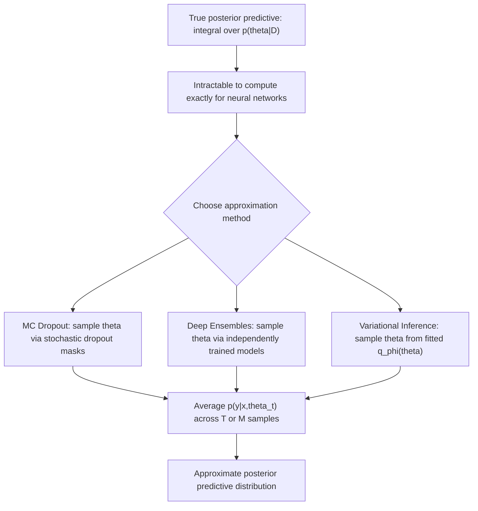

## Predictive Distributions

### Overview

A predictive distribution is the full probability distribution a model assigns over possible outcomes $y$ for a given input $x$, rather than a single point estimate. This concept underlies nearly every topic covered so far in this series — calibration, aleatoric and epistemic uncertainty, Bayesian neural networks, conformal prediction, and ensemble methods all describe different ways of constructing, approximating, or evaluating a predictive distribution.

### Formal Definition

For a model with parameters $\theta$, the predictive distribution given a specific fixed $\theta$ is simply the model's conditional distribution over outcomes:

$$
p(y \mid x, \theta)
$$

This is what a standard, non-Bayesian point-estimate model produces after training — a single fixed $\hat{\theta}$ is learned, and predictions are read directly from $p(y \mid x, \hat{\theta})$.

In a Bayesian setting, the **posterior predictive distribution** instead integrates over the full posterior distribution of $\theta$ given training data $D$:

$$
p(y \mid x, D) = \int p(y \mid x, \theta)\, p(\theta \mid D)\, d\theta
$$

This distinction — a predictive distribution conditioned on one fixed parameter value versus one that integrates over a distribution of plausible parameter values — is the same distinction that separates a standard point-estimate network's output from a Bayesian neural network's posterior predictive output, as described in that topic.

### Point Predictions vs. Full Distributions

A point prediction (e.g., a single predicted class label, or a single predicted regression value) can always be derived from a predictive distribution — for example, by taking the mean, median, or mode — but a predictive distribution carries substantially more information than any single point summary. Two predictive distributions can share the same mean while differing enormously in spread, skew, or multimodality, and a point prediction alone cannot convey this difference.

[Inference] This is a direct mathematical consequence of the fact that a distribution is a function over the full outcome space, while a point summary statistic collapses that function to a single number, so information is necessarily lost in that reduction. This follows from the definitions involved rather than requiring a separate empirical citation.

### Diagram: Point Prediction vs. Predictive Distribution

<svg xmlns="http://www.w3.org/2000/svg" viewBox="0 0 700 340">
  <text x="350" y="28" text-anchor="middle" font-size="17" font-weight="bold" fill="#1a1a1a">Point Prediction vs. Predictive Distribution (svg_diagram)</text>

  <text x="175" y="60" text-anchor="middle" font-size="13" font-weight="bold" fill="#333">Point Prediction Only</text>
  <line x1="60" y1="280" x2="290" y2="280" stroke="#333" stroke-width="1" />
  <circle cx="175" cy="280" r="6" fill="#4c72b0" />
  <text x="175" y="305" text-anchor="middle" font-size="11" fill="#555">Single value: y-hat = 4.2</text>
  <text x="175" y="325" text-anchor="middle" font-size="11" fill="#c44e52">No spread or shape information</text>

  <text x="530" y="60" text-anchor="middle" font-size="13" font-weight="bold" fill="#333">Full Predictive Distribution</text>
  <line x1="410" y1="280" x2="660" y2="280" stroke="#333" stroke-width="1" />
  <path d="M 410 280 Q 450 280 480 220 Q 520 150 535 150 Q 550 150 580 220 Q 610 280 660 280 Z" fill="#cde3f7" stroke="#4c72b0" stroke-width="2" />
  <line x1="535" y1="280" x2="535" y2="150" stroke="#1a1a1a" stroke-width="1" stroke-dasharray="3,2" />
  <text x="535" y="305" text-anchor="middle" font-size="11" fill="#555">Mean = 4.2, same as point value</text>
  <text x="535" y="325" text-anchor="middle" font-size="11" fill="#555">Shape reveals spread, skew, confidence</text>
</svg>

### Predictive Distributions in Regression

For regression, a predictive distribution is commonly parameterized as Gaussian, with the model outputting both a mean and a variance conditioned on the input, as described under aleatoric uncertainty:

$$
p(y \mid x, \theta) = \mathcal{N}\big(y;\, \mu_\theta(x),\, \sigma_\theta^2(x)\big)
$$

More flexible parametric families — such as mixture density networks, which output the parameters of a mixture of several Gaussians — can represent multimodal predictive distributions, which a single Gaussian cannot. This matters when a genuinely ambiguous input could plausibly correspond to multiple distinct, well-separated outcome values rather than a single unimodal spread around one value.

$$
p(y \mid x, \theta) = \sum_{k=1}^{K} \pi_k(x)\, \mathcal{N}\big(y;\, \mu_k(x),\, \sigma_k^2(x)\big)
$$

where $\pi_k(x)$ are input-dependent mixture weights satisfying $\sum_k \pi_k(x) = 1$.

[Inference] The ability of a mixture model to represent multiple separated modes, which a single Gaussian structurally cannot, follows directly from the mathematical form of a mixture distribution as a weighted sum of component distributions with potentially different means. I present this as a mathematical property rather than an empirical claim.

### Predictive Distributions in Classification

For classification, the predictive distribution is the categorical distribution over class labels produced by the softmax output:

$$
p(y = k \mid x, \theta) = \frac{\exp(z_k)}{\sum_{j=1}^{K} \exp(z_j)}
$$

where $z_k$ are the pre-softmax logits for class $k$. This categorical distribution is already a full distribution over a discrete outcome space, in contrast to regression, where additional structure (e.g., a Gaussian assumption) must be explicitly imposed to move from a point estimate to a distribution.

### Sources of Spread in a Predictive Distribution

The overall shape of a Bayesian posterior predictive distribution reflects two combined sources of uncertainty, as established under the aleatoric/epistemic decomposition:

$$
p(y \mid x, D) = \int p(y \mid x, \theta)\, p(\theta \mid D)\, d\theta
$$

The inner term $p(y \mid x, \theta)$ contributes aleatoric spread — variability present even for one fixed, known $\theta$. The integration over $p(\theta \mid D)$ contributes epistemic spread — additional variability arising because $\theta$ itself is uncertain. A point-estimate model that outputs only $p(y \mid x, \hat{\theta})$ for a single fixed $\hat{\theta}$ captures, at most, only the aleatoric component and does not represent epistemic uncertainty at all in its output distribution.

[Inference] This follows directly from the structure of the integral: a point-estimate model's distribution is equivalent to evaluating the integrand at one specific $\theta$ rather than integrating over the full posterior, so the epistemic contribution — which arises specifically from variability across the posterior — cannot be present in a single-$\theta$ output by construction.

### Approximating the Predictive Distribution in Practice

Since the exact posterior predictive integral is generally intractable for neural networks, as discussed under Bayesian neural networks, practical methods approximate it via Monte Carlo averaging over a finite set of samples $\theta^{(1)}, \dots, \theta^{(T)}$ drawn or constructed from an approximate posterior:

$$
p(y \mid x, D) \approx \frac{1}{T}\sum_{t=1}^{T} p(y \mid x, \theta^{(t)})
$$

This is the same underlying operation performed by MC Dropout (using stochastic dropout masks as approximate $\theta^{(t)}$ samples), deep ensembles (using independently trained networks as $\theta^{(t)}$), and variational inference combined with Monte Carlo sampling from $q_\phi(\theta)$.

[Inference] Framing all three of these methods as instances of the same general Monte Carlo approximation to the posterior predictive integral is a structural observation that follows from comparing their respective aggregation formulas, each of which averages a model's output distribution over a finite set of parameter samples. I cannot verify that every source in the literature frames these three methods under this exact unified description without a specific citation, though the underlying mathematical similarity can be checked directly from each method's definition.

### Diagram: Approximating the Posterior Predictive

### Evaluating a Predictive Distribution

A predictive distribution's quality can be assessed along at least two distinct axes, which are related to but not identical with each other: **calibration**, described in the calibration topic, measures whether stated probabilities match empirical frequencies, and **sharpness** (or resolution) measures how concentrated or informative the distribution is, independent of whether it is calibrated.

A predictive distribution that always outputs the same wide, uninformative spread regardless of input could be well calibrated on average while being practically useless, since it fails to distinguish confident cases from uncertain ones. Proper scoring rules such as the Brier score and negative log-likelihood, described under calibration, are designed to jointly reward both calibration and sharpness, penalizing distributions that are either miscalibrated or unnecessarily diffuse.

[Inference] This joint sensitivity to both calibration and sharpness is a property attributed to proper scoring rules in the calibration topic's discussion of the Brier score decomposition, where resolution (related to sharpness) and reliability (related to calibration) both appear as separate terms. I present this as following from that established decomposition rather than as a new independent claim.

### Common Pitfalls

- Reporting only a point prediction (e.g., a single accuracy number or single predicted value) when the underlying task requires knowledge of the full predictive distribution, such as risk-sensitive decision-making. [Inference] This follows from the definitional loss of information discussed above when collapsing a distribution to a single summary statistic.
- Assuming a unimodal Gaussian predictive distribution is adequate for all regression tasks. [Unverified] Whether a given task's true underlying uncertainty is genuinely multimodal, and therefore poorly served by a Gaussian assumption, depends on the specific data-generating process, and I do not have access to a specific source establishing how common this issue is across applied regression tasks in general.
- Assuming a well-calibrated predictive distribution is automatically sharp or informative, or vice versa. [Inference] These are established as separate axes in the Brier score decomposition discussed under calibration, so strong performance on one axis does not by itself imply strong performance on the other, which follows from their definition as distinct decomposition terms rather than requiring a new citation.
- Conflating a point-estimate model's single-$\theta$ output distribution with a true Bayesian posterior predictive distribution. [Inference] As shown above, these differ specifically in whether epistemic uncertainty is represented, which follows directly from the mathematical structure of the posterior predictive integral relative to a single-$\theta$ evaluation.

For any claims regarding how a specific model, library, or trained system represents or approximates its predictive distribution in practice: this is [Unverified] without direct inspection of that specific implementation, and behavior is not guaranteed to match the general descriptions above — it may vary depending on architecture, output parameterization, training procedure, and the specific approximate inference method used, if any.

**Related Topics**
- Aleatoric vs. epistemic uncertainty (underlying decomposition of predictive spread)
- Calibration of probabilistic predictions (evaluating predictive distribution quality)
- Bayesian neural networks (formal posterior predictive framework)
- Mixture density networks for multimodal regression outputs
- Proper scoring rules: Brier score, log score, and CRPS in depth
- Conformal prediction as a distribution-free alternative to parametric predictive distributions
- Quantile regression as a non-parametric approach to predictive distributions