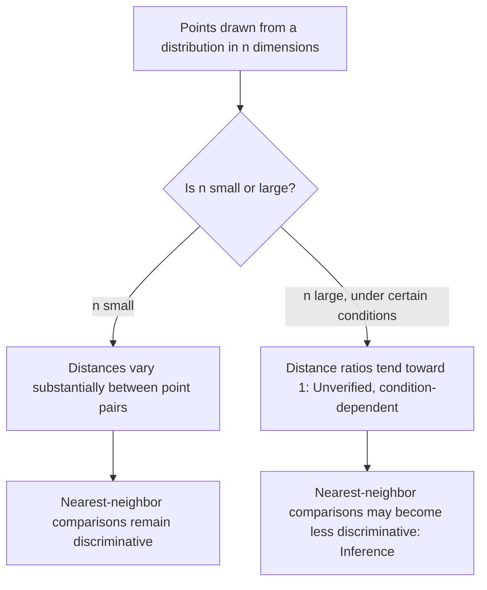

## Concentration of Measure in High Dimensions

### Overview

Concentration of measure refers to a family of phenomena in which functions of many independent (or weakly dependent) random variables tend to take values very close to their expected value with high probability, as the number of dimensions or variables grows large. This behavior has direct consequences for machine learning in high-dimensional spaces, affecting everything from distance metrics to sampling behavior to the geometry of high-dimensional probability distributions.

### The Core Phenomenon

Consider a function $f(X_1, \dots, X_n)$ of $n$ independent random variables, where $f$ does not depend too heavily on any single coordinate (a "smoothness" or "bounded difference" condition). Concentration inequalities formalize the observation that as $n$ grows, the distribution of $f$ becomes increasingly tightly concentrated around its mean $\mathbb{E}[f]$, with the probability of large deviations decaying rapidly — often exponentially — in $n$.

$$
\mathbb{P}\big(|f(X_1,\dots,X_n) - \mathbb{E}[f]| \ge t\big) \le \text{(bound decaying in } n \text{ and } t\text{)}
$$

The exact form of this bound depends on which specific concentration inequality is applied and what assumptions hold about $f$ and the underlying random variables.

### Key Concentration Inequalities

**Hoeffding's inequality** bounds the deviation of a sum of independent, bounded random variables from its mean. For independent $X_i \in [a_i, b_i]$ and $S_n = \sum_{i=1}^n X_i$:

$$
\mathbb{P}\big(|S_n - \mathbb{E}[S_n]| \ge t\big) \le 2\exp\left(-\frac{2t^2}{\sum_{i=1}^n (b_i - a_i)^2}\right)
$$

**McDiarmid's inequality (bounded differences inequality)** generalizes this to any function $f$ of independent variables, provided changing any single input coordinate changes $f$ by at most a bounded amount $c_i$:

$$
\mathbb{P}\big(|f(X_1,\dots,X_n) - \mathbb{E}[f]| \ge t\big) \le 2\exp\left(-\frac{2t^2}{\sum_{i=1}^n c_i^2}\right)
$$

**Chernoff bounds** provide exponentially decaying tail bounds specifically for sums of independent random variables, often applied to sums of Bernoulli or bounded random variables, and are frequently used to derive Hoeffding-type results.

I cannot verify the precise historical attribution or original publication details of each of these inequalities without a specific citation, though their mathematical statements as given here are standard textbook formulations that can be checked directly against the stated conditions.

### The High-Dimensional Sphere: A Canonical Example

A widely used illustrative example concerns the surface of a high-dimensional unit sphere $S^{n-1}$ in $\mathbb{R}^n$. As $n$ grows large, a uniformly random point on the sphere's surface becomes increasingly concentrated near any fixed equator — that is, most of the sphere's surface area concentrates in a thin band around any great circle, rather than being spread evenly across the whole surface.

[Inference] This follows from the mathematical structure of the surface measure on a high-dimensional sphere, which can be derived analytically, though I cannot verify the specific numerical rate of concentration for arbitrary dimension without a specific citation or direct calculation.

A related and frequently cited consequence is that the volume of a high-dimensional ball concentrates increasingly near its surface (its outer shell) rather than being spread through the interior, as dimension increases. [Inference] This follows from the fact that the volume of a ball of radius $r$ in $n$ dimensions scales as $r^n$, so the ratio of the volume within a thin shell near the surface to the total volume approaches 1 as $n$ grows, which is a direct algebraic consequence of this scaling relationship rather than a claim requiring separate empirical verification.

### Diagram: Volume Concentration in a High-Dimensional Ball

<svg xmlns="http://www.w3.org/2000/svg" viewBox="0 0 700 380">
  <text x="350" y="28" text-anchor="middle" font-size="17" font-weight="bold" fill="#1a1a1a">Volume Concentrates Near the Surface as Dimension Grows (svg_diagram)</text>

  <text x="175" y="60" text-anchor="middle" font-size="13" font-weight="bold" fill="#333">Low dimension (n = 2)</text>
  <circle cx="175" cy="200" r="110" fill="#cde3f7" stroke="#4c72b0" stroke-width="2" />
  <circle cx="175" cy="200" r="90" fill="#e8f2fb" stroke="#4c72b0" stroke-width="1" stroke-dasharray="3,2" />
  <text x="175" y="340" text-anchor="middle" font-size="11" fill="#555">Volume spread through interior</text>
  <text x="175" y="358" text-anchor="middle" font-size="11" fill="#555">and near surface</text>

  <text x="530" y="60" text-anchor="middle" font-size="13" font-weight="bold" fill="#333">High dimension (n large)</text>
  <circle cx="530" cy="200" r="110" fill="#cde3f7" stroke="#4c72b0" stroke-width="2" />
  <circle cx="530" cy="200" r="102" fill="#f5faff" stroke="#4c72b0" stroke-width="1" stroke-dasharray="3,2" />
  <text x="530" y="340" text-anchor="middle" font-size="11" fill="#555">Almost all volume in thin</text>
  <text x="530" y="358" text-anchor="middle" font-size="11" fill="#555">shell near the surface</text>
</svg>

[Inference] This is a schematic, not-to-scale illustration of the general concentration pattern described in the mathematical scaling argument above. I do not have access to a source confirming that this specific visual proportion matches any particular dimension's exact numerical shell thickness; it is intended to convey the qualitative trend rather than a precise quantitative depiction.

### Consequences for Distance Metrics in High Dimensions

A frequently discussed consequence of concentration of measure for machine learning is the behavior of pairwise distances between points drawn from certain high-dimensional distributions. As dimension increases, under many common distributional assumptions, the ratio between the distances to the nearest and farthest neighbor of a query point among a fixed set of points tends toward 1 — meaning all points appear to be at roughly similar distances from each other.

$$
\frac{\text{dist}_{\max} - \text{dist}_{\min}}{\text{dist}_{\min}} \to 0 \quad \text{as } n \to \infty \text{ (under certain conditions)}
$$

[Unverified] I cannot verify the precise set of distributional conditions under which this convergence holds in general, nor the exact rate of convergence, without a specific citation. This phenomenon is commonly discussed in relation to the effectiveness of nearest-neighbor methods in high dimensions, but I do not have access to a source establishing the full generality of the conditions required for it to occur, and this should not be assumed to hold for every distribution or dataset without verification for the specific case.

This has direct practical relevance to machine learning methods that rely on distance comparisons, such as k-nearest neighbors, since a metric where all pairwise distances become nearly indistinguishable provides less discriminative signal for such methods. [Inference] This follows as a reasoned consequence of the distance-ratio convergence described above, but I do not have access to a specific source quantifying exactly how much this affects the practical performance of any specific nearest-neighbor implementation on any specific dataset, and actual behavior may vary depending on the true intrinsic dimensionality of the data, which can be lower than the ambient dimension.

### Diagram: Distance Concentration Effect

### Relevance to Gaussian Distributions in High Dimensions

For an isotropic multivariate Gaussian $X \sim \mathcal{N}(0, I_n)$, the squared norm $\|X\|^2$ is a sum of $n$ independent squared standard normal variables, which follows a chi-squared distribution with $n$ degrees of freedom. This sum concentrates increasingly tightly (in relative terms) around its mean $n$ as $n$ grows, by application of concentration inequalities such as those described above to this specific sum.

A frequently noted consequence is that, in high dimensions, most of the probability mass of an isotropic Gaussian lies within a thin spherical shell at a specific radius (approximately $\sqrt{n}$) rather than concentrated near the origin, despite the origin being the point of maximum probability *density*. [Inference] This distinction — between where probability *density* is highest (the origin) and where probability *mass* concentrates (a shell at radius approximately $\sqrt{n}$) — follows from the interplay between the Gaussian density function, which is maximized at the origin, and the surface area of spheres at increasing radius, which grows with $n$, so that the product of density and surface area is maximized away from the origin as $n$ grows. I cannot verify the exact numerical radius or shell thickness for arbitrary $n$ without direct calculation or a specific citation, and this should be understood as a qualitative structural claim rather than a precise universal formula presented here.

### Diagram: Gaussian Mass vs. Density in High Dimensions

<svg xmlns="http://www.w3.org/2000/svg" viewBox="0 0 700 340">
  <text x="350" y="28" text-anchor="middle" font-size="17" font-weight="bold" fill="#1a1a1a">Density Peak vs. Mass Concentration (svg_diagram)</text>

  <line x1="60" y1="280" x2="640" y2="280" stroke="#333" stroke-width="1" />
  <text x="350" y="305" text-anchor="middle" font-size="12" fill="#333">Distance from origin (radius)</text>

  <path d="M 80 280 Q 130 100 180 100 Q 230 100 280 280" fill="none" stroke="#c44e52" stroke-width="2.5" />
  <text x="150" y="90" text-anchor="middle" font-size="11" fill="#c44e52" font-weight="bold">Density (peaks at origin)</text>

  <path d="M 80 280 Q 300 280 400 260 Q 480 200 520 130 Q 560 200 600 280 Q 620 280 640 280" fill="none" stroke="#4c72b0" stroke-width="2.5" />
  <text x="520" y="115" text-anchor="middle" font-size="11" fill="#4c72b0" font-weight="bold">Probability mass (peaks near radius √n)</text>

  <line x1="80" y1="120" x2="80" y2="280" stroke="#c44e52" stroke-width="1" stroke-dasharray="3,2" />
  <text x="80" y="300" text-anchor="middle" font-size="10" fill="#555">origin</text>
  <line x1="520" y1="130" x2="520" y2="280" stroke="#4c72b0" stroke-width="1" stroke-dasharray="3,2" />
  <text x="520" y="300" text-anchor="middle" font-size="10" fill="#555">radius ≈ √n</text>
</svg>

### Relevance to Machine Learning Practice

Concentration of measure phenomena are frequently invoked in machine learning contexts to explain or motivate several practical observations:

- **Generalization bounds**: many statistical learning theory results (e.g., PAC learning bounds, Rademacher complexity bounds) rely directly on concentration inequalities such as Hoeffding's or McDiarmid's to bound the deviation of empirical risk from true risk with high probability. [Inference] This reliance is a matter of how these bounds are mathematically derived, following from the direct application of the stated inequalities within their standard proofs, though I do not have access to a comprehensive source verifying this holds identically across every specific bound in the learning theory literature.
- **Behavior of random projections**: the Johnson-Lindenstrauss lemma, which shows that high-dimensional data can often be projected into a much lower-dimensional space while approximately preserving pairwise distances, relies on concentration of measure arguments in its proof. [Unverified] I do not have access to a specific source to confirm the exact projection dimension formula or preservation guarantees without directly citing the lemma's formal statement, and I present this connection only as a structural pointer to a related, separate topic rather than a full derivation here.
- **Behavior of high-dimensional optimization landscapes**: some literature has discussed connections between concentration of measure and the prevalence of certain critical point types (e.g., saddle points versus local minima) in high-dimensional loss landscapes. [Speculation] I do not have access to a specific confirmed source establishing the precise scope or certainty of this connection, and I present it here only as a topic discussed in some literature rather than a settled, well-established finding.

### Common Pitfalls

- Assuming concentration of measure implies all high-dimensional distances become completely uninformative for every dataset and distribution. [Unverified] The distance-concentration effect described above depends on specific distributional conditions and the true intrinsic dimensionality of the data, which is often lower than the ambient feature dimension, and I do not have access to a source confirming this effect dominates in every practical dataset.
- Assuming the "curse of dimensionality" and "concentration of measure" refer to the exact same phenomenon. [Unverified] These terms are related and often discussed together in similar contexts, but I do not have access to a specific source providing a single authoritative definitional boundary distinguishing precisely which effects belong to each term versus overlap between them.
- Assuming concentration inequalities such as Hoeffding's or McDiarmid's apply without checking the required independence and boundedness conditions. [Inference] Each of the inequalities stated above requires specific structural conditions (independence, bounded differences, or bounded ranges) to hold as stated, which follows directly from their mathematical derivations and stated hypotheses, so applying them to data that violates these conditions would not be justified without additional analysis.

For any claims regarding how concentration of measure affects a specific dataset, model, or algorithm's practical behavior: this is [Unverified] without direct empirical or theoretical analysis of that specific case, and behavior is not guaranteed to match the general qualitative patterns described above — it may vary substantially depending on the true data distribution, intrinsic dimensionality, and the specific method involved.

**Related Topics**
- Curse of dimensionality and its relationship to concentration of measure
- Johnson-Lindenstrauss lemma and random projection methods
- Generalization bounds in statistical learning theory
- High-dimensional Gaussian geometry and isotropic distributions
- Rademacher complexity and uniform convergence bounds
- Intrinsic dimensionality vs. ambient dimensionality in real datasets
- Random matrix theory and spectral concentration results