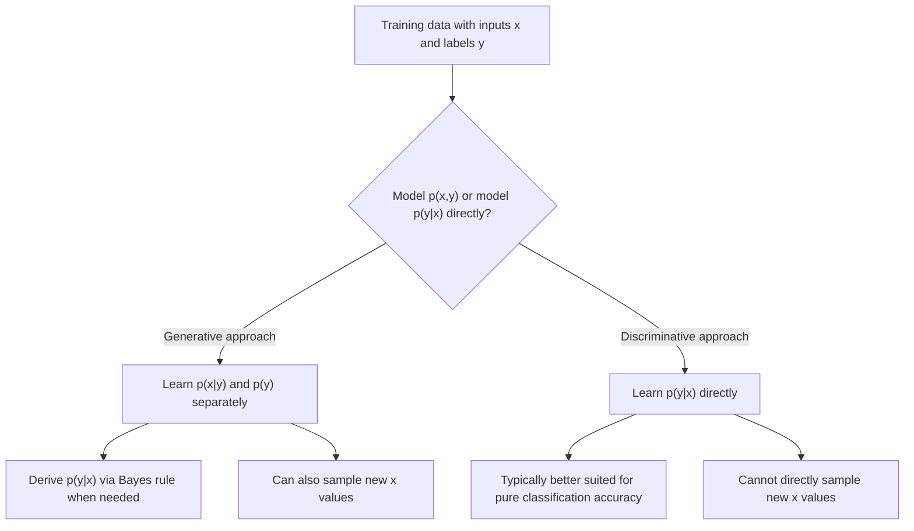

## Probabilistic Generative Models Overview

### Definition and Core Idea

A probabilistic generative model specifies (or approximates) a joint probability distribution $p(x, y)$ over inputs and labels, or a distribution $p(x)$ over data alone, in contrast to a discriminative model, which models only the conditional $p(y \mid x)$ directly without representing how the inputs themselves are distributed. Because a generative model captures the full joint or data distribution, it can in principle be used to sample new data points, evaluate the likelihood of existing data points, and derive the conditional $p(y \mid x)$ via Bayes' rule when labels are involved.

$$
p(y \mid x) = \frac{p(x \mid y)\, p(y)}{p(x)}
$$

This relationship — deriving a discriminative conditional from a generative joint model via Bayes' rule — is a direct algebraic consequence of the definition of conditional probability, so it holds by construction rather than requiring separate empirical verification.

### Generative vs. Discriminative: A Structural Comparison

| Property | Generative Model | Discriminative Model |
|---|---|---|
| What is modeled | $p(x, y)$ or $p(x)$ | $p(y \mid x)$ directly |
| Can sample new data | Yes, by construction | Not directly |
| Can compute likelihood of data | Yes, by construction | Generally no |
| Typical goal | Density estimation, data synthesis | Classification/regression accuracy |
| Example methods | Naive Bayes, Gaussian Mixture Models, VAEs, GANs, normalizing flows, diffusion models | Logistic regression, standard feedforward classifiers, SVMs |

[Inference] This table reflects a standard textbook framing of the generative/discriminative distinction found broadly across machine learning literature. I cannot verify a single canonical source for this exact table's contents without a specific citation, though the structural claims (e.g., that a joint distribution permits sampling by construction) follow from the mathematical definitions involved.

### Maximum Likelihood as the Standard Training Objective

Most probabilistic generative models are trained by maximizing the likelihood of the observed training data $D = \{x_1, \dots, x_n\}$ under the model's parameters $\theta$:

$$
\theta^* = \arg\max_\theta \sum_{i=1}^{n} \log p_\theta(x_i)
$$

This is the same maximum likelihood estimation principle used broadly across probabilistic modeling, connecting generative modeling directly to the general MLE framework used for supervised loss functions.

[Inference] Framing generative model training as a specific instance of the general MLE principle is a structural observation that follows from comparing the stated objective function directly to the standard MLE formulation, rather than an independent claim requiring separate verification.

### Diagram: Generative vs. Discriminative Modeling

### Classical Generative Models

**Naive Bayes** assumes conditional independence of features given the class label:

$$
p(x_1, \dots, x_d \mid y) = \prod_{j=1}^{d} p(x_j \mid y)
$$

This strong independence assumption makes the model computationally simple and often effective on high-dimensional sparse data (e.g., text classification with bag-of-words features), even when the independence assumption does not literally hold. [Inference] The description of Naive Bayes as "often effective despite an unrealistic independence assumption" is a commonly repeated characterization in machine learning literature. I cannot verify the precise scope or magnitude of this effectiveness across all applications without a specific citation, and actual performance varies by dataset and task.

**Gaussian Mixture Models (GMMs)** model $p(x)$ as a weighted sum of $K$ Gaussian components:

$$
p(x) = \sum_{k=1}^{K} \pi_k\, \mathcal{N}(x;\, \mu_k, \Sigma_k)
$$

with mixture weights $\pi_k$ satisfying $\sum_k \pi_k = 1$. GMMs are typically fit via the Expectation-Maximization (EM) algorithm, since the log-likelihood of a mixture model does not have a closed-form maximum due to the sum inside the logarithm.

**Hidden Markov Models (HMMs)** extend this generative framing to sequential data, modeling a joint distribution over a sequence of observations and an underlying sequence of discrete latent states, with the observations at each time step generated conditionally on the corresponding latent state.

### Modern Deep Generative Models

**Variational Autoencoders (VAEs)** model $p(x)$ via a latent variable $z$ and a decoder network $p_\theta(x \mid z)$, combined with an approximate posterior $q_\phi(z \mid x)$ (the encoder), trained by maximizing an evidence lower bound (ELBO) — structurally the same ELBO objective used in variational inference for Bayesian neural networks, but applied here to a latent variable $z$ rather than to network weights $\theta$ directly:

$$
\text{ELBO} = \mathbb{E}_{q_\phi(z|x)}\big[\log p_\theta(x \mid z)\big] - D_{KL}\big(q_\phi(z \mid x) \,\|\, p(z)\big)
$$

**Generative Adversarial Networks (GANs)** take a different approach, training a generator network to produce samples and a discriminator network to distinguish generated samples from real data, with the two trained in a minimax adversarial objective rather than direct likelihood maximization. [Inference] The description of GANs as not directly maximizing an explicit data likelihood, in contrast to VAEs and normalizing flows, is a structural characterization based on comparing the stated training objectives of each method. I cannot verify every technical nuance or later variant of GAN training across the full literature without specific citations.

**Normalizing Flows** construct $p(x)$ by applying a sequence of invertible, differentiable transformations to a simple base distribution (e.g., a standard Gaussian), using the change-of-variables formula to compute an exact log-likelihood:

$$
\log p(x) = \log p_z(f^{-1}(x)) + \log \left|\det \frac{\partial f^{-1}(x)}{\partial x}\right|
$$

where $f$ is the composed invertible transformation. Because this likelihood is computed exactly (unlike the VAE's lower bound), normalizing flows can be trained via direct maximum likelihood.

**Diffusion Models** define a generative process as the reverse of a gradual noising process applied to data, learning to iteratively denoise a sample starting from pure noise back toward the data distribution. [Unverified] The precise theoretical connection between the diffusion training objective and exact log-likelihood maximization involves technical derivations (e.g., a variational bound similar in spirit to the VAE's ELBO) that I do not have access to verify in full detail without a specific citation.

### Diagram: Deep Generative Model Families

<svg xmlns="http://www.w3.org/2000/svg" viewBox="0 0 740 400">
  <text x="370" y="28" text-anchor="middle" font-size="17" font-weight="bold" fill="#1a1a1a">Deep Generative Model Families (svg_diagram)</text>

  <rect x="40" y="70" width="160" height="100" rx="6" fill="#cde3f7" stroke="#4c72b0" />
  <text x="120" y="100" text-anchor="middle" font-size="13" font-weight="bold" fill="#222">VAE</text>
  <text x="120" y="120" text-anchor="middle" font-size="10" fill="#333">Encoder + decoder</text>
  <text x="120" y="136" text-anchor="middle" font-size="10" fill="#333">Trains via ELBO</text>
  <text x="120" y="152" text-anchor="middle" font-size="10" fill="#333">(approximate likelihood)</text>

  <rect x="220" y="70" width="160" height="100" rx="6" fill="#f7d8c4" stroke="#dd8452" />
  <text x="300" y="100" text-anchor="middle" font-size="13" font-weight="bold" fill="#222">GAN</text>
  <text x="300" y="120" text-anchor="middle" font-size="10" fill="#333">Generator + discriminator</text>
  <text x="300" y="136" text-anchor="middle" font-size="10" fill="#333">Adversarial minimax</text>
  <text x="300" y="152" text-anchor="middle" font-size="10" fill="#333">(no explicit likelihood)</text>

  <rect x="400" y="70" width="160" height="100" rx="6" fill="#d5e8d4" stroke="#6a994e" />
  <text x="480" y="100" text-anchor="middle" font-size="13" font-weight="bold" fill="#222">Normalizing Flow</text>
  <text x="480" y="120" text-anchor="middle" font-size="10" fill="#333">Invertible transforms</text>
  <text x="480" y="136" text-anchor="middle" font-size="10" fill="#333">Exact log-likelihood</text>
  <text x="480" y="152" text-anchor="middle" font-size="10" fill="#333">Direct MLE training</text>

  <rect x="580" y="70" width="160" height="100" rx="6" fill="#e6d5f7" stroke="#8456a3" />
  <text x="660" y="100" text-anchor="middle" font-size="13" font-weight="bold" fill="#222">Diffusion Model</text>
  <text x="660" y="120" text-anchor="middle" font-size="10" fill="#333">Iterative denoising</text>
  <text x="660" y="136" text-anchor="middle" font-size="10" fill="#333">Reverse noising process</text>
  <text x="660" y="152" text-anchor="middle" font-size="10" fill="#333">Variational-style bound</text>

  <text x="370" y="220" text-anchor="middle" font-size="12" fill="#555">All four define or approximate a distribution p(x) capable of generating new samples</text>
  <text x="370" y="240" text-anchor="middle" font-size="11" fill="#777">Training objectives and likelihood tractability differ substantially between families</text>
</svg>

### Sampling from Generative Models

A defining practical capability of a generative model is the ability to draw new samples $x \sim p(x)$ (or $x \sim p(x \mid y)$ for a class-conditional generative model). The specific sampling mechanism differs substantially by model family: GMMs and Naive Bayes allow direct closed-form sampling from their parametric components; VAEs sample a latent $z$ from the prior and pass it through the decoder; GANs sample directly from the generator given random noise input; normalizing flows sample from the base distribution and apply the forward transformation; diffusion models iteratively apply the learned reverse denoising process starting from noise.

[Inference] These sampling-mechanism descriptions follow directly from each method's construction as defined above, since the generative process for producing new samples is typically defined as part of each model's architecture. I cannot verify implementation-specific sampling details (e.g., exact numbers of denoising steps used in a specific diffusion model) without a specific citation or direct inspection of that implementation.

### Connection to Density Estimation and Anomaly Detection

Because generative models explicitly represent (or approximate) $p(x)$, they can, in principle, assign a likelihood or likelihood-proxy score to any new input, including inputs that differ substantially from the training distribution. This property underlies their use in anomaly or out-of-distribution detection, where low likelihood under the trained generative model is used as a signal that an input is unusual.

[Unverified] The reliability of likelihood-based out-of-distribution detection using generative models has been questioned in some literature — for instance, cases where certain generative models have been reported to assign higher likelihood to some out-of-distribution inputs than to in-distribution inputs. I do not have access to a specific source to confirm the current scope, prevalence, or resolution status of this reported issue across model families, and this should be treated as a documented concern rather than a settled characterization of all generative models' behavior.

### Common Pitfalls

- Assuming a generative model is always the "richer" or strictly better choice because it models more (the joint distribution rather than just the conditional). [Inference] Modeling the full joint distribution is a harder statistical estimation problem in general than modeling the conditional directly, since it requires capturing the structure of $p(x)$ in addition to the relationship between $x$ and $y$, which can require more data or stronger assumptions to estimate reliably — this is a structural, comparative reasoning point rather than a claim verified against a specific empirical benchmark.
- Assuming all "generative models" produce tractable exact likelihoods. [Inference] As shown above, this varies substantially by method — normalizing flows provide exact likelihoods, VAEs provide only a lower bound, and GANs generally provide no explicit likelihood at all — so this is a direct consequence of comparing each method's stated construction rather than a uniform property of the general term "generative model."
- Assuming likelihood values from any specific generative model reliably indicate whether a sample is in-distribution or anomalous. [Unverified] As noted above, this has been reported as an unreliable assumption in some specific cases in the literature, and I do not have access to a source establishing how broadly this concern applies across all generative model families and datasets.
- Confusing "generative AI" as a broad marketing or colloquial term with "generative model" as the formal statistical term defined here. [Unverified] I do not have access to a source establishing a single precise, universally agreed boundary between how these terms are used across different communities and contexts; usage may vary.

For any claims regarding the specific behavior, training stability, sample quality, or likelihood characteristics of a particular generative model implementation: this is [Unverified] without direct testing or a specific citation for that implementation, and behavior is not guaranteed to match the general descriptions above — it may vary substantially depending on architecture, training procedure, dataset, and hyperparameters.

**Related Topics**
- Variational Autoencoders: detailed ELBO derivation and latent space structure
- Generative Adversarial Networks: minimax objective and training stability challenges
- Normalizing flows: change-of-variables derivation and architectural constraints
- Diffusion models: forward and reverse process formulation in depth
- Naive Bayes classifiers: independence assumptions and practical performance
- Expectation-Maximization algorithm for latent variable models
- Out-of-distribution detection using generative model likelihoods