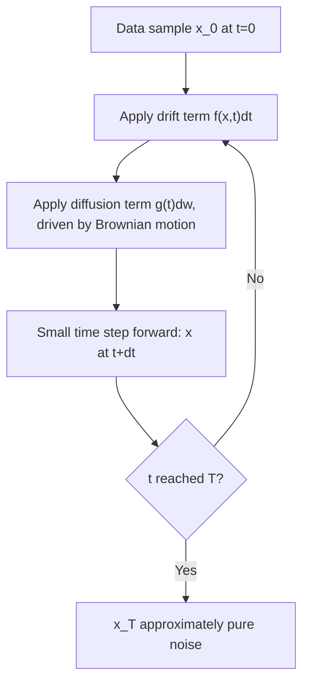

## Diffusion Models and Stochastic Differential Equations

### Overview

Diffusion models generate data by learning to reverse a gradual noising process. The stochastic differential equation (SDE) framing unifies discrete-time diffusion models under a continuous-time formulation, describing both the forward noising process and the reverse generative process as solutions to differential equations driven by Brownian motion. This framing connects diffusion models directly to established stochastic calculus theory.

### The Forward SDE

The forward process gradually corrupts a data sample $x_0 \sim p_{\text{data}}$ into noise over continuous time $t \in [0, T]$. It is described by a general Itô SDE:

$$
dx = f(x, t)\, dt + g(t)\, dw
$$

where $f(x, t)$ is the drift coefficient, $g(t)$ is the diffusion coefficient, and $w$ is a standard Wiener process (Brownian motion). This equation describes how $x$ evolves as a combination of a deterministic drift term and a stochastic noise term accumulated over time.

[Inference] This general SDE form is presented in the diffusion modeling literature as unifying earlier discrete-time formulations such as denoising diffusion probabilistic models (DDPMs) and score-based generative models, by showing that both correspond to specific discretizations of this continuous-time equation. I cannot verify the precise original source establishing this unification without a specific citation, though the mathematical claim that discrete update rules can be viewed as Euler-Maruyama discretizations of an SDE is a standard numerical-methods correspondence.

Two commonly discussed specific choices of $f$ and $g$ correspond to named variants:

**Variance Preserving (VP) SDE**, corresponding to the DDPM formulation:

$$
dx = -\frac{1}{2}\beta(t)\, x\, dt + \sqrt{\beta(t)}\, dw
$$

**Variance Exploding (VE) SDE**, corresponding to score-matching formulations with increasing noise scales:

$$
dx = \sqrt{\frac{d[\sigma^2(t)]}{dt}}\, dw
$$

[Unverified] I do not have access to a specific source to confirm whether these two named variants (VP and VE) are exhaustive of all practically used diffusion SDE formulations, or whether additional named variants have become standard since. I cannot verify current usage patterns across the field without a specific citation.

### Diagram: Forward Diffusion as an SDE

### The Reverse SDE

A central theoretical result underlying diffusion models states that the forward SDE has a corresponding reverse-time SDE that, when solved backward from $t=T$ to $t=0$, transforms noise back into samples from the original data distribution:

$$
dx = \left[f(x, t) - g(t)^2 \nabla_x \log p_t(x)\right] dt + g(t)\, d\bar{w}
$$

where $\bar{w}$ is a Wiener process running backward in time, and $\nabla_x \log p_t(x)$ is the **score function** — the gradient of the log probability density of the noised data at time $t$.

[Unverified] I cannot verify the precise original formal derivation or citation for this reverse-time SDE result without direct access to the specific source establishing it; this is a well-known result attributed to work on time-reversal of diffusion processes in the stochastic calculus literature, but I do not have a specific citation available in this conversation to confirm attribution details.

The critical practical consequence is that generating a sample requires knowing the score function $\nabla_x \log p_t(x)$ at every noise level $t$ — since this is generally intractable to compute analytically for real data distributions, it must be **approximated by a trained neural network**.

### Score Matching: Learning the Score Function

A neural network $s_\theta(x, t)$ is trained to approximate the score function $\nabla_x \log p_t(x)$ at every noise level $t$. This is typically done via **denoising score matching**, which trains the network to predict the noise (or equivalently, the score) added to a clean sample at a given noise level, using a tractable regression-style loss:

$$
\mathcal{L}(\theta) = \mathbb{E}_{t, x_0, \epsilon}\left[\left\| s_\theta(x_t, t) - \nabla_{x_t} \log p(x_t \mid x_0) \right\|^2\right]
$$

where $x_t$ is the noised version of $x_0$ at time $t$, and the conditional score $\nabla_{x_t} \log p(x_t \mid x_0)$ has a tractable closed form when the forward noising process is Gaussian, since $p(x_t \mid x_0)$ is then itself a known Gaussian distribution.

[Inference] The tractability of this conditional score term follows directly from the fact that the gradient of the log-density of a Gaussian distribution has a simple closed-form expression in terms of its mean and variance, so this is a mathematical consequence of the Gaussian forward process assumption rather than an independent empirical claim.

### Diagram: Score-Based Generation via the Reverse SDE

<svg xmlns="http://www.w3.org/2000/svg" viewBox="0 0 700 360">
  <text x="350" y="28" text-anchor="middle" font-size="17" font-weight="bold" fill="#1a1a1a">Reverse SDE Sampling Process (svg_diagram)</text>

  <rect x="40" y="150" width="140" height="60" rx="6" fill="#e8e8e8" stroke="#666" />
  <text x="110" y="185" text-anchor="middle" font-size="12" fill="#222">Pure noise x_T</text>

  <line x1="180" y1="180" x2="240" y2="180" stroke="#4c72b0" stroke-width="2" />
  <polygon points="240,175 250,180 240,185" fill="#4c72b0" />

  <rect x="250" y="150" width="180" height="60" rx="6" fill="#cde3f7" stroke="#4c72b0" />
  <text x="340" y="175" text-anchor="middle" font-size="11" fill="#222">Trained score network</text>
  <text x="340" y="192" text-anchor="middle" font-size="11" fill="#222">s_theta(x,t) approximates score</text>

  <line x1="430" y1="180" x2="490" y2="180" stroke="#4c72b0" stroke-width="2" />
  <polygon points="490,175 500,180 490,185" fill="#4c72b0" />

  <rect x="500" y="150" width="160" height="60" rx="6" fill="#f7d8c4" stroke="#dd8452" />
  <text x="580" y="175" text-anchor="middle" font-size="11" fill="#222">Step reverse SDE</text>
  <text x="580" y="192" text-anchor="middle" font-size="11" fill="#222">from t toward 0</text>

  <text x="350" y="250" text-anchor="middle" font-size="12" fill="#555">Repeated small backward steps gradually transform noise into a data-like sample</text>
  <text x="350" y="270" text-anchor="middle" font-size="11" fill="#777">Each step uses the learned score in place of the true, intractable score</text>
</svg>

### The Probability Flow ODE

A related and widely discussed result states that there exists a deterministic ordinary differential equation (ODE) — the **probability flow ODE** — whose trajectories, for a fixed set of initial noise samples, produce the same marginal probability densities $p_t(x)$ at every time $t$ as the stochastic reverse SDE:

$$
dx = \left[f(x, t) - \frac{1}{2} g(t)^2 \nabla_x \log p_t(x)\right] dt
$$

Because this equation contains no stochastic term, sampling can proceed via deterministic ODE solvers rather than stochastic SDE solvers, which [Inference] is described in the literature as enabling faster sampling with fewer steps in some cases, and as allowing exact likelihood computation via the instantaneous change-of-variables formula, connecting this formulation conceptually to normalizing flows. I do not have access to a specific source to confirm the precise conditions or magnitude of any sampling speed advantage for a specific implementation, and behavior may vary depending on the solver, step count, and model used.

### Diagram: SDE vs. ODE Sampling Paths

<svg xmlns="http://www.w3.org/2000/svg" viewBox="0 0 700 360">
  <text x="350" y="28" text-anchor="middle" font-size="17" font-weight="bold" fill="#1a1a1a">Stochastic vs. Deterministic Reverse Trajectories (svg_diagram)</text>

  <text x="175" y="60" text-anchor="middle" font-size="13" font-weight="bold" fill="#333">Reverse SDE</text>
  <line x1="60" y1="300" x2="300" y2="300" stroke="#333" stroke-width="1" />
  <path d="M 80 90 Q 120 140 100 180 Q 90 210 130 230 Q 160 250 140 270 Q 130 285 175 295" fill="none" stroke="#c44e52" stroke-width="2" />
  <path d="M 90 90 Q 140 130 150 170 Q 165 210 140 240 Q 120 260 170 290" fill="none" stroke="#dd8452" stroke-width="2" />
  <text x="175" y="320" text-anchor="middle" font-size="11" fill="#555">Multiple noisy, varied paths per run</text>

  <text x="530" y="60" text-anchor="middle" font-size="13" font-weight="bold" fill="#333">Probability Flow ODE</text>
  <line x1="420" y1="300" x2="660" y2="300" stroke="#333" stroke-width="1" />
  <path d="M 440 90 Q 480 150 500 200 Q 520 250 545 295" fill="none" stroke="#4c72b0" stroke-width="2.5" />
  <text x="530" y="320" text-anchor="middle" font-size="11" fill="#555">Single smooth deterministic path</text>
</svg>

### Relationship to Denoising Diffusion Probabilistic Models (DDPM)

DDPM, the original widely cited discrete-time formulation, defines a forward Markov chain that adds Gaussian noise over a fixed number of discrete steps and a reverse Markov chain trained to denoise step by step. [Inference] The SDE framing described above generalizes this discrete-time DDPM formulation by taking the number of discrete steps to infinity, in which case the discrete Markov chain update rule converges to the continuous-time SDE describing the same underlying noising process. I cannot verify this precise limiting argument's full mathematical derivation without a specific citation, though it follows the general correspondence between discrete Markov chain approximations and continuous-time stochastic processes as the step size shrinks, which is a standard technique in stochastic process theory.

### Practical Sampling Considerations

Solving either the reverse SDE or the probability flow ODE in practice requires numerical discretization, since exact continuous-time solutions are generally intractable. This introduces a trade-off between the number of discretization steps used (more steps generally yield more accurate approximations to the true continuous-time process) and the computational cost of sampling (more steps require more evaluations of the trained score network).

[Unverified] I do not have access to a specific source to confirm the precise number of steps required for acceptable sample quality in any particular implementation, as this depends heavily on the specific solver, noise schedule, and trained model used, and reported values vary substantially across different published methods and implementations.

Several specialized numerical solvers (e.g., higher-order ODE solvers, predictor-corrector SDE solvers) have been developed specifically to reduce the number of steps required while maintaining sample quality. [Unverified] I do not have access to a specific source to confirm the comparative performance of these solvers across different model architectures and datasets, and their relative effectiveness is likely to depend on the specific setting.

### Common Pitfalls

- Assuming the score function $\nabla_x \log p_t(x)$ can be computed exactly for real-world data distributions. [Inference] This gradient requires knowledge of the true, generally unknown data density $p_t(x)$, which is why it must be approximated by a trained neural network rather than computed analytically — this follows directly from the fact that the true data distribution is not known in closed form for most real datasets.
- Confusing the probability flow ODE's deterministic trajectories with the reverse SDE's stochastic trajectories as producing identical individual samples for the same noise input. [Inference] While both are constructed to match the same marginal probability densities $p_t(x)$ at each time $t$, this does not imply that a specific noise sample maps to the identical output sample under both formulations, since the SDE's stochastic term introduces path-level randomness that the deterministic ODE does not have; this follows from the structural difference between a stochastic and a deterministic differential equation.
- Assuming the choice between VP and VE SDE formulations (or other schedule choices) has no effect on practical sample quality or training stability. [Unverified] I do not have access to a specific source confirming the precise comparative effects of different SDE formulations on outcomes for specific datasets or architectures, and this is likely to vary by implementation.

For any claims regarding the specific sampling speed, sample quality, training stability, or numerical behavior of a particular diffusion model implementation, solver, or noise schedule: this is [Unverified] without direct testing of that specific implementation, and behavior is not guaranteed to match the general descriptions above — it may vary substantially depending on architecture, noise schedule, solver choice, step count, and dataset.

**Related Topics**
- Denoising Diffusion Probabilistic Models (DDPM): discrete-time formulation in depth
- Score matching and denoising score matching: full derivation
- Probability flow ODE and connections to normalizing flows
- Noise schedule design: linear, cosine, and learned schedules
- Classifier-free and classifier guidance for conditional diffusion sampling
- Numerical SDE and ODE solvers for generative sampling
- Probabilistic generative models overview (prerequisite / related framework)