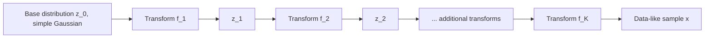

## Normalizing Flows

### Overview

Normalizing flows construct a complex probability distribution by applying a sequence of invertible, differentiable transformations to a simple base distribution, most commonly a standard multivariate Gaussian. Unlike VAEs, which optimize a lower bound on the data likelihood, and unlike GANs, which use no explicit likelihood at all, normalizing flows permit exact computation of the data likelihood, which allows them to be trained via direct maximum likelihood estimation.

### The Change of Variables Formula

The mathematical foundation of normalizing flows is the change of variables formula for probability densities. Let $z$ be a random variable with a known, tractable density $p_z(z)$, and let $x = f(z)$ for some invertible, differentiable function $f$. Then the density of $x$ is:

$$
p_x(x) = p_z(f^{-1}(x)) \left| \det \frac{\partial f^{-1}(x)}{\partial x} \right|
$$

Equivalently, expressed in terms of the forward transformation's Jacobian:

$$
p_x(x) = p_z(z) \left| \det \frac{\partial f(z)}{\partial z} \right|^{-1}
$$

The determinant of the Jacobian accounts for how the transformation $f$ locally expands or contracts volume in the space, which is required to keep the transformed density properly normalized (integrating to 1).

This formula is a standard result in probability theory concerning transformations of continuous random variables, and it can be verified directly by derivation from the definition of a cumulative distribution function under a change of variables, so I present it as an established mathematical identity rather than an empirical claim.

### Composing Multiple Transformations

A single simple invertible transformation is generally insufficient to capture the complexity of a real data distribution, so normalizing flows compose a sequence of $K$ simpler invertible transformations $f_1, f_2, \dots, f_K$:

$$
x = f_K \circ f_{K-1} \circ \cdots \circ f_1(z_0), \qquad z_0 \sim p_{z_0}(z_0)
$$

The log-likelihood of the resulting distribution accumulates as a sum of log-determinant terms across each transformation, since the log of a product of Jacobian determinants becomes a sum of logs:

$$
\log p_x(x) = \log p_{z_0}(z_0) - \sum_{k=1}^{K} \log \left| \det \frac{\partial f_k(z_{k-1})}{\partial z_{k-1}} \right|
$$

where $z_k = f_k(z_{k-1})$ for each step. This additive structure across the composed transformations gives the method its name: a "flow" of the base distribution's probability mass through a sequence of steps, with the log-density updated incrementally at each step.

### Diagram: Composed Flow of Transformations

### The Computational Bottleneck: The Jacobian Determinant

For an arbitrary invertible neural network transformation, computing the determinant of the Jacobian matrix has a computational cost that scales cubically with dimensionality in the general case, since computing a determinant of a general $d \times d$ matrix is an $O(d^3)$ operation. [Inference] This cubic scaling follows from standard results in numerical linear algebra regarding general matrix determinant computation, so this is a mathematical property of general matrices rather than a claim specific to normalizing flows requiring separate empirical verification.

Because this cost would be prohibitive for the high-dimensional data typical in machine learning applications (e.g., images with thousands of pixels), essentially all practical normalizing flow architectures are specifically designed so that their Jacobian matrices have a **tractable structure** — most commonly triangular — for which the determinant can be computed in linear time as simply the product of the diagonal entries.

### Diagram: Why Jacobian Structure Matters

<svg xmlns="http://www.w3.org/2000/svg" viewBox="0 0 700 340">
  <text x="350" y="28" text-anchor="middle" font-size="17" font-weight="bold" fill="#1a1a1a">General vs. Triangular Jacobian (svg_diagram)</text>

  <text x="175" y="60" text-anchor="middle" font-size="13" font-weight="bold" fill="#333">General Jacobian</text>
  <rect x="80" y="80" width="180" height="180" fill="#f7d8c4" stroke="#dd8452" stroke-width="1.5" />
  <text x="170" y="175" text-anchor="middle" font-size="12" fill="#333">All entries populated</text>
  <text x="170" y="280" text-anchor="middle" font-size="11" fill="#555">Determinant: O(d³) cost</text>

  <text x="530" y="60" text-anchor="middle" font-size="13" font-weight="bold" fill="#333">Triangular Jacobian</text>
  <rect x="440" y="80" width="180" height="180" fill="#e8e8e8" stroke="#999" stroke-width="1" />
  <path d="M 440 80 L 620 80 L 620 260 Z" fill="#cde3f7" stroke="#4c72b0" stroke-width="1.5" />
  <line x1="440" y1="80" x2="620" y2="260" stroke="#4c72b0" stroke-width="2" />
  <text x="530" y="175" text-anchor="middle" font-size="12" fill="#333">Only upper (or lower)</text>
  <text x="530" y="192" text-anchor="middle" font-size="12" fill="#333">triangle populated</text>
  <text x="530" y="280" text-anchor="middle" font-size="11" fill="#555">Determinant: O(d) cost, product of diagonal</text>
</svg>

### Coupling Layers

A widely used architectural pattern for achieving a tractable triangular Jacobian is the **coupling layer**, introduced in models such as RealNVP and NICE. A coupling layer splits the input $z$ into two parts, $z_a$ and $z_b$, and transforms only one part conditioned on the other, leaving the conditioning part unchanged:

$$
x_a = z_a
$$
$$
x_b = z_b \odot \exp(s(z_a)) + t(z_a)
$$

where $s(\cdot)$ and $t(\cdot)$ are arbitrary neural networks (no invertibility constraint needed on $s$ or $t$ themselves, since they only take $z_a$ as input and are not required to be inverted), and $\odot$ denotes elementwise multiplication.

Because $x_a = z_a$ is passed through unchanged, and $x_b$ depends on $z_b$ only through a simple elementwise affine transformation, the Jacobian of this transformation is triangular by construction, and its determinant reduces to the product of the scaling terms $\exp(s(z_a))$:

$$
\left| \det \frac{\partial x}{\partial z} \right| = \prod_i \exp(s(z_a)_i) = \exp\left(\sum_i s(z_a)_i\right)
$$

[Inference] This triangular structure follows directly from the fact that $x_a$ does not depend on $z_b$ at all, which places zeros in the corresponding block of the Jacobian matrix by construction, making the overall matrix triangular. This is a direct consequence of the architectural definition given above rather than an independently verified empirical claim.

To ensure all dimensions of the input are eventually transformed (since $z_a$ passes through unchanged in a single coupling layer), multiple coupling layers are stacked with the roles of $z_a$ and $z_b$ alternated or permuted between layers.

### Autoregressive Flows

A related architectural family, **autoregressive flows**, defines each output dimension as a function of only the preceding input dimensions:

$$
x_i = z_i \cdot \sigma_i(z_{<i}) + \mu_i(z_{<i})
$$

where $z_{<i}$ denotes all dimensions before index $i$. This construction also yields a triangular Jacobian by design, since $x_i$ depends only on $z_j$ for $j \le i$.

Two prominent variants trade off computational cost differently between the forward and inverse directions: **Masked Autoregressive Flow (MAF)** computes the forward direction ($z \to x$) sequentially (slow) but the inverse direction ($x \to z$) in parallel (fast), while **Inverse Autoregressive Flow (IAF)** has the opposite trade-off — parallel forward computation but sequential inverse computation.

[Unverified] I do not have access to a specific source to confirm the precise current state of comparative usage or preference between MAF and IAF across different applied contexts (e.g., density estimation versus fast sampling use cases), as this choice depends on which direction (density evaluation or sampling) needs to be fast for a specific application, and reported practices may have evolved since any specific source I might cite.

### Diagram: Coupling Layer Mechanism

<svg xmlns="http://www.w3.org/2000/svg" viewBox="0 0 700 320">
  <text x="350" y="28" text-anchor="middle" font-size="17" font-weight="bold" fill="#1a1a1a">Coupling Layer Transformation (svg_diagram)</text>

  <rect x="60" y="80" width="120" height="50" rx="5" fill="#e8e8e8" stroke="#666" />
  <text x="120" y="110" text-anchor="middle" font-size="12" fill="#222">z_a</text>

  <rect x="60" y="160" width="120" height="50" rx="5" fill="#e8e8e8" stroke="#666" />
  <text x="120" y="190" text-anchor="middle" font-size="12" fill="#222">z_b</text>

  <line x1="180" y1="105" x2="480" y2="105" stroke="#4c72b0" stroke-width="2" />
  <polygon points="480,100 490,105 480,110" fill="#4c72b0" />
  <text x="330" y="95" text-anchor="middle" font-size="11" fill="#555">passed through unchanged</text>

  <line x1="180" y1="105" x2="300" y2="200" stroke="#dd8452" stroke-width="1.5" stroke-dasharray="3,2" />
  <rect x="300" y="175" width="140" height="50" rx="5" fill="#f7d8c4" stroke="#dd8452" />
  <text x="370" y="205" text-anchor="middle" font-size="11" fill="#222">s(z_a), t(z_a)</text>

  <line x1="180" y1="185" x2="300" y2="200" stroke="#4c72b0" stroke-width="1.5" />
  <line x1="440" y1="200" x2="480" y2="200" stroke="#4c72b0" stroke-width="2" />
  <polygon points="480,195 490,200 480,205" fill="#4c72b0" />

  <rect x="490" y="80" width="130" height="50" rx="5" fill="#cde3f7" stroke="#4c72b0" />
  <text x="555" y="110" text-anchor="middle" font-size="12" fill="#222">x_a = z_a</text>

  <rect x="490" y="175" width="130" height="50" rx="5" fill="#cde3f7" stroke="#4c72b0" />
  <text x="555" y="205" text-anchor="middle" font-size="11" fill="#222">x_b = z_b·exp(s)+t</text>
</svg>

### Sampling and Density Evaluation

Normalizing flows support both operations that generative models are typically evaluated on:

**Sampling** proceeds by drawing $z_0$ from the base distribution and applying the forward composed transformation $f = f_K \circ \cdots \circ f_1$ to obtain $x$.

**Exact density evaluation** for a given data point $x$ proceeds by applying the inverse composed transformation $f^{-1}$ to recover $z_0$, then evaluating the base density $p_{z_0}(z_0)$ and multiplying (in log-space, adding) the accumulated log-determinant correction terms.

Both operations require the transformation to be efficiently invertible in the relevant direction, which is why architectural choices such as coupling layers versus autoregressive layers are selected partly based on whether the application prioritizes fast sampling, fast density evaluation, or both.

### Training via Direct Maximum Likelihood

Because the exact log-likelihood is computable, training proceeds by directly maximizing it over the training data, without requiring a variational bound as in VAEs or an adversarial objective as in GANs:

$$
\theta^* = \arg\max_\theta \sum_{i=1}^{n} \log p_x(x_i; \theta) = \arg\max_\theta \sum_{i=1}^{n} \left[\log p_{z_0}(f_\theta^{-1}(x_i)) + \log \left|\det \frac{\partial f_\theta^{-1}(x_i)}{\partial x_i}\right|\right]
$$

This direct connection to exact maximum likelihood is often cited as a key theoretical advantage of normalizing flows relative to VAEs and GANs. [Inference] This characterization follows from directly comparing the stated training objectives across the three model families, as established under the probabilistic generative models overview: VAEs optimize a lower bound rather than the exact likelihood, and GANs use no explicit likelihood term at all, while normalizing flows use the exact likelihood by construction. I cannot verify every claimed downstream practical consequence of this theoretical distinction (e.g., specific comparative sample quality outcomes) without a specific citation, and actual comparative performance may vary by task, architecture, and dataset.

### Architectural Constraints and Trade-offs

The requirement for exact invertibility and a tractable Jacobian imposes structural constraints not present in VAEs or GANs, where the decoder or generator network can be an arbitrary feedforward architecture with no invertibility requirement. [Inference] This follows directly from the definitional requirement that a normalizing flow's transformation be invertible with a computable Jacobian determinant, which VAEs and GANs do not require of their respective networks — this is a structural comparison based on each method's stated construction rather than an independent empirical finding.

[Unverified] I do not have access to a specific source to confirm the precise practical impact of these architectural constraints on model capacity or expressiveness relative to unconstrained architectures for any specific task, and this is likely to depend on the specific flow architecture and application.

A further practical constraint is that the latent dimension $z$ must match the data dimension $x$ exactly, since $f$ is required to be a bijection — this differs from VAEs, where the latent dimension is a free hyperparameter that is often chosen to be much smaller than the data dimension for compression or representation-learning purposes.

### Common Pitfalls

- Assuming a normalizing flow can use an arbitrary neural network architecture as its transformation without any structural constraint. [Inference] As established above, the transformation must be invertible with an efficiently computable Jacobian determinant, which rules out many standard unconstrained architectures unless specifically designed (e.g., via coupling or autoregressive structure) to satisfy these requirements.
- Assuming exact likelihood computation implies a normalizing flow necessarily produces higher-quality samples than VAEs or GANs. [Unverified] Exact likelihood tractability is a distinct property from sample quality, and I do not have access to a specific source establishing a general, consistent superiority in sample quality for normalizing flows across tasks and datasets; comparative performance is likely to depend on the specific architectures and tasks being compared.
- Confusing the base distribution's simplicity (e.g., a standard Gaussian) with a limitation on the complexity of the final modeled distribution $p_x(x)$. [Inference] The composed sequence of nonlinear transformations is specifically what allows a normalizing flow to represent complex, multimodal distributions despite a simple base distribution, which follows from the general expressiveness of composed nonlinear functions rather than being limited by the simplicity of the starting point alone.

For any claims regarding the specific training stability, sample quality, computational efficiency, or comparative performance of a particular normalizing flow implementation or architecture: this is [Unverified] without direct testing of that specific implementation, and behavior is not guaranteed to match the general descriptions above — it may vary substantially depending on architecture, dataset, dimensionality, and training procedure.

**Related Topics**
- Coupling layer architectures: RealNVP and NICE in depth
- Autoregressive flows: MAF and IAF architectural trade-offs
- Continuous normalizing flows and connections to neural ODEs
- Probabilistic generative models overview (prerequisite / related framework)
- Diffusion models and stochastic differential equations (related generative framework)
- Variational Autoencoders: ELBO derivation and comparison to exact-likelihood methods
- Change of variables formula: full derivation and multivariate extensions