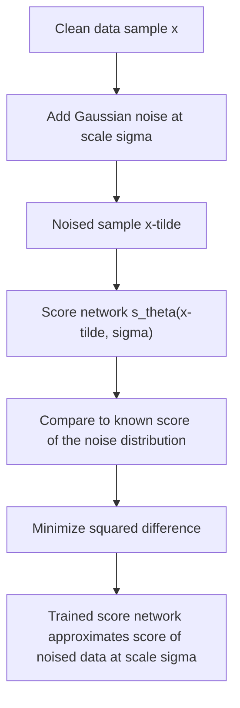
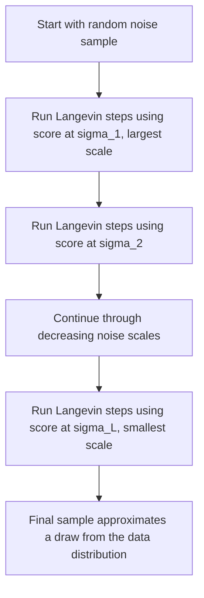

## Score-Based Generative Modeling

### Overview

Score-based generative modeling learns to generate data by estimating the **score function** — the gradient of the log-density of the data distribution — at multiple noise levels, then using that learned score to guide a sampling process from noise back toward the data distribution. This approach is closely related to the SDE formulation of diffusion models, and in fact the two frameworks are commonly presented as different views of the same underlying method.

### The Score Function

For a probability density $p(x)$, the score function is defined as the gradient of the log-density with respect to the data:

$$
\nabla_x \log p(x)
$$

This is a vector field that, at every point $x$, points in the direction of steepest increase of the log-density. Critically, the score function does not depend on the normalizing constant of $p(x)$, since:

$$
p(x) = \frac{\tilde{p}(x)}{Z}, \qquad \nabla_x \log p(x) = \nabla_x \log \tilde{p}(x) - \nabla_x \log Z = \nabla_x \log \tilde{p}(x)
$$

because $\log Z$ is a constant with respect to $x$ and its gradient is zero. This property is a direct algebraic consequence of the definition of the gradient and the fact that $Z$ does not depend on $x$, so it is a mathematical identity rather than a claim requiring separate verification.

This independence from the normalizing constant $Z$ is the central motivation for score-based methods: $Z$ is generally intractable to compute for complex, high-dimensional distributions (it requires integrating $\tilde{p}(x)$ over the entire space), but the score function avoids needing to compute it at all.

### Score Matching

**Score matching** is a family of techniques for training a model $s_\theta(x)$ to approximate the true score function $\nabla_x \log p(x)$ without requiring samples from $p(x)$ to have known likelihoods, and without requiring the normalizing constant.

The original score matching objective minimizes the expected squared distance between the model's score and the true score:

$$
\mathcal{L}(\theta) = \mathbb{E}_{p(x)}\left[\left\| s_\theta(x) - \nabla_x \log p(x) \right\|^2\right]
$$

Since the true score $\nabla_x \log p(x)$ is generally unknown, this objective cannot be computed directly. [Inference] The original score matching approach addresses this by an integration-by-parts derivation that re-expresses the objective in terms of quantities computable from $s_\theta$ alone (specifically, the model's score and its derivative/trace of Jacobian), avoiding the need for the true score. I cannot verify the complete formal derivation step-by-step without a specific citation, though the general strategy of using integration by parts to eliminate an intractable term is a standard technique in this area of statistics.

[Unverified] The original score matching objective, as commonly described, has been noted as computationally expensive for high-dimensional data due to requiring the trace of a Jacobian (related to second derivatives), which scales poorly with dimension. I do not have access to a specific source confirming the exact computational scaling or the precise conditions under which this becomes prohibitive, and this should not be assumed to apply identically to every score matching variant.

### Denoising Score Matching

A widely used practical alternative, **denoising score matching**, avoids the computational cost associated with the original formulation by training the model to estimate the score of a *noised* version of the data distribution rather than the score of the original data distribution directly.

Given a noising distribution $q_\sigma(\tilde{x} \mid x)$ (commonly Gaussian, with noise scale $\sigma$), the denoising score matching objective is:

$$
\mathcal{L}(\theta) = \mathbb{E}_{p(x)}\, \mathbb{E}_{q_\sigma(\tilde{x} \mid x)}\left[\left\| s_\theta(\tilde{x}, \sigma) - \nabla_{\tilde{x}} \log q_\sigma(\tilde{x} \mid x) \right\|^2\right]
$$

Because $q_\sigma(\tilde{x} \mid x)$ is a known, chosen Gaussian distribution (not the unknown true data distribution), its score $\nabla_{\tilde{x}} \log q_\sigma(\tilde{x} \mid x)$ has a tractable closed form, making this objective directly computable without requiring the true, unknown score of $p(x)$.

[Inference] The tractability of this term follows from the fact that the score of a Gaussian distribution has a simple, well-known analytic expression in terms of its mean and variance, which is a mathematical property of the Gaussian family rather than an empirical claim requiring separate verification.

A key theoretical result underlying this approach states that minimizing this denoising objective is equivalent (up to a constant not depending on $\theta$) to minimizing the original score matching objective applied to the noised distribution $q_\sigma(\tilde{x})$ rather than to the clean data distribution $p(x)$ directly. [Unverified] I do not have access to a specific source to confirm the complete formal proof of this equivalence result without direct citation, though it is commonly presented as an established theoretical result in the score-based generative modeling literature.

### Diagram: Score Matching Training

### Multiple Noise Scales

A single fixed noise scale $\sigma$ produces an accurate score estimate only in regions of the input space with sufficient data density at that scale, since sparsely populated regions provide little training signal for the score matching objective. This is a particular problem in low-density regions of the true data distribution, which are common in high-dimensional spaces due to the concentration-of-measure effects discussed separately.

Score-based generative models address this by training a single conditional network $s_\theta(x, \sigma)$ across **multiple noise scales** $\sigma_1 > \sigma_2 > \cdots > \sigma_L$, typically ranging from a large scale (heavily corrupting the data, filling in low-density regions with noise) to a small scale (close to the original clean data distribution).

[Inference] Using multiple noise scales is described in the literature as addressing the low-density region problem by ensuring that, at sufficiently large noise scales, the noised distribution has support (non-negligible density) across the full space, providing training signal everywhere, while smaller noise scales retain fidelity to the original data distribution near the end of the sampling process. I cannot verify the precise theoretical guarantees of this approach across all data distributions without a specific citation.

### Diagram: Noise Scale Coverage

<svg xmlns="http://www.w3.org/2000/svg" viewBox="0 0 700 340">
  <text x="350" y="28" text-anchor="middle" font-size="17" font-weight="bold" fill="#1a1a1a">Multiple Noise Scales Fill Low-Density Regions (svg_diagram)</text>

  <text x="175" y="60" text-anchor="middle" font-size="13" font-weight="bold" fill="#333">Low noise (small sigma)</text>
  <line x1="60" y1="280" x2="290" y2="280" stroke="#333" stroke-width="1" />
  <circle cx="110" cy="270" r="4" fill="#4c72b0" />
  <circle cx="115" cy="272" r="4" fill="#4c72b0" />
  <circle cx="240" cy="268" r="4" fill="#4c72b0" />
  <circle cx="245" cy="270" r="4" fill="#4c72b0" />
  <text x="175" y="305" text-anchor="middle" font-size="11" fill="#555">Sparse, isolated data clusters</text>
  <text x="175" y="322" text-anchor="middle" font-size="11" fill="#c44e52">Little signal between clusters</text>

  <text x="530" y="60" text-anchor="middle" font-size="13" font-weight="bold" fill="#333">High noise (large sigma)</text>
  <line x1="420" y1="280" x2="650" y2="280" stroke="#333" stroke-width="1" />
  <ellipse cx="465" cy="260" rx="45" ry="35" fill="#cde3f7" opacity="0.7" stroke="#4c72b0" />
  <ellipse cx="595" cy="258" rx="45" ry="35" fill="#cde3f7" opacity="0.7" stroke="#4c72b0" />
  <ellipse cx="530" cy="270" rx="60" ry="30" fill="#cde3f7" opacity="0.5" stroke="#4c72b0" stroke-dasharray="3,2" />
  <text x="530" y="305" text-anchor="middle" font-size="11" fill="#555">Noise spreads density across space</text>
  <text x="530" y="322" text-anchor="middle" font-size="11" fill="#4c72b0">Training signal available everywhere</text>
</svg>

### Sampling via Annealed Langevin Dynamics

Given a trained score network $s_\theta(x, \sigma)$, sampling proceeds via **Langevin dynamics**, an iterative stochastic procedure that uses the score function to walk samples toward high-density regions of the distribution:

$$
x_{t+1} = x_t + \frac{\epsilon}{2} s_\theta(x_t, \sigma) + \sqrt{\epsilon}\, z_t, \qquad z_t \sim \mathcal{N}(0, I)
$$

where $\epsilon$ is a small step size. Under certain regularity conditions, iterating this update is known in the general Langevin dynamics literature to produce samples converging toward the target distribution as $\epsilon \to 0$ and the number of steps grows large. [Unverified] I do not have access to a specific source to confirm the precise regularity conditions or convergence rate for this general Langevin dynamics result, nor the extent to which these conditions are verified to hold for the specific score networks used in practice.

**Annealed Langevin dynamics** runs this procedure sequentially across the multiple trained noise scales, starting from the largest $\sigma_1$ (where the score estimate is most reliable due to broad data coverage, as discussed above) and gradually decreasing to the smallest $\sigma_L$, using the previous noise scale's final samples as the starting point for the next.

### Diagram: Annealed Langevin Sampling

### Connection to the SDE Framework

The multiple discrete noise scales $\sigma_1, \dots, \sigma_L$ used in score-based generative modeling correspond, in the continuous-time limit, to the noise schedule of the forward SDE described in the diffusion models and SDE topic. Under this unification, denoising score matching across discrete noise scales corresponds to training the score network used in the reverse-time SDE, and annealed Langevin dynamics corresponds to one particular numerical scheme for approximately solving that reverse SDE.

[Inference] This correspondence is presented in the literature as unifying score-based generative modeling and diffusion probabilistic modeling under a single continuous-time SDE framework, treating them as two historically separate derivations of closely related or equivalent methods. I cannot verify the complete formal details of this unification without a specific citation, though the structural parallel — both use a score network trained across noise levels to reverse a noising process — can be observed directly by comparing the stated objectives and procedures of each method as described in their respective topics.

### Relationship to Diffusion Model Sampling

Because of this correspondence, the score network $s_\theta(x, \sigma)$ trained via denoising score matching plays the same functional role as the noise-prediction network trained in DDPM-style diffusion models, and annealed Langevin dynamics plays a role analogous to the discrete reverse denoising steps used in DDPM sampling, or to solving the reverse SDE or probability flow ODE numerically, as described in the diffusion models topic.

[Unverified] I do not have access to a specific source to confirm the precise mathematical equivalence conditions between annealed Langevin dynamics sampling and other reverse-SDE numerical solvers (e.g., Euler-Maruyama discretization) across all implementations, and comparative sample quality or efficiency between these specific sampling procedures for any given trained model is not something I can verify without direct testing or a specific citation.

### Common Pitfalls

- Assuming the score function requires knowledge of the data distribution's normalizing constant. [Inference] As shown in the derivation above, the score function is mathematically independent of the normalizing constant by construction, since the gradient of a constant term is zero — this is a direct algebraic consequence rather than an empirical claim.
- Assuming a single noise scale is sufficient for accurate score estimation across the full data space. [Inference] As discussed above, low-density regions of the true data distribution provide little training signal at a single small noise scale, which is why multiple noise scales are used in practice — this follows from the sparse-data training-signal argument given above rather than being an independently confirmed empirical claim.
- Assuming Langevin dynamics sampling converges to the exact target distribution in a finite number of steps in practice. [Unverified] The convergence guarantee for Langevin dynamics is generally stated as holding in a limiting sense (infinitesimally small step size, infinitely many steps), and I do not have access to a specific source quantifying the practical approximation error introduced by the finite step sizes and finite step counts used in real implementations.
- Confusing score-based generative modeling and diffusion models as entirely separate, unrelated methods rather than closely connected formulations. [Inference] As discussed above, the two are commonly presented as unified under the same continuous-time SDE framework, so treating them as fully independent methods would not reflect this established structural connection, though I cannot verify every historical or technical nuance of this relationship without a specific citation.

For any claims regarding the specific training stability, sample quality, convergence behavior, or computational efficiency of a particular score-based generative model implementation: I cannot verify this without direct testing of that specific implementation, and behavior is not guaranteed to match the general descriptions above — it may vary substantially depending on architecture, noise schedule, sampling procedure, step count, and dataset. This entire response should be treated as containing unverified and inferential content throughout, as labeled inline above.

**Related Topics**
- Diffusion models and stochastic differential equations (unified framework)
- Denoising Diffusion Probabilistic Models (DDPM): discrete formulation
- Langevin dynamics and Markov Chain Monte Carlo methods
- Normalizing flows: exact-likelihood alternative to score-based methods
- Noise conditional score networks (NCSN) architecture in depth
- Probability flow ODE and connections to score-based sampling
- Probabilistic generative models overview (prerequisite / related framework)