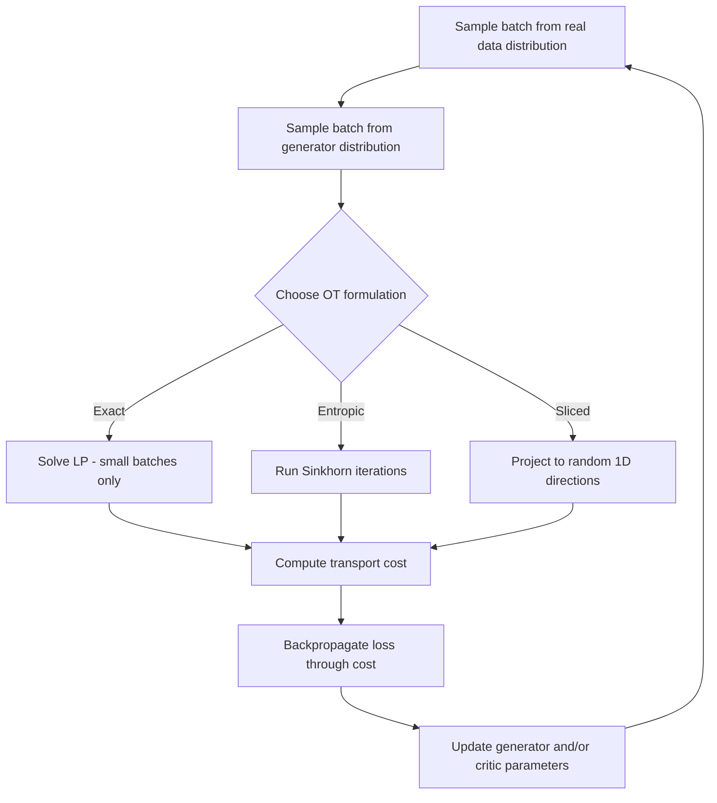

## Optimal Transport in Probability

### Definition and Motivation

Optimal transport (OT) studies the problem of moving mass from one probability distribution to another at minimum cost. Given a source distribution $\mu$ and a target distribution $\nu$, OT seeks a transport plan that morphs $\mu$ into $\nu$ while minimizing a total cost defined over pairs of points.

The classical formulation originates from Monge's problem: find a map $T: \mathcal{X} \to \mathcal{Y}$ such that $T_\# \mu = \nu$ (the pushforward of $\mu$ under $T$ equals $\nu$), minimizing

$$\int_{\mathcal{X}} c(x, T(x)) \, d\mu(x)$$

where $c(x, y)$ is a cost function, commonly $c(x,y) = \|x-y\|^2$.

Monge's formulation is often ill-posed (no valid map may exist, e.g., when $\mu$ is a point mass and $\nu$ is not). Kantorovich's relaxation resolves this by optimizing over joint distributions (couplings) rather than deterministic maps.

### Kantorovich Formulation

A coupling $\pi$ is a joint probability distribution on $\mathcal{X} \times \mathcal{Y}$ with marginals $\mu$ and $\nu$. The Kantorovich problem is:

$$\min_{\pi \in \Pi(\mu, \nu)} \int_{\mathcal{X} \times \mathcal{Y}} c(x, y) \, d\pi(x, y)$$

where $\Pi(\mu, \nu)$ denotes the set of all such couplings. This is a linear program in $\pi$, guaranteeing existence of a minimizer under mild regularity conditions [Inference — this follows from standard results in convex optimization theory, though exact conditions depend on the specific space and cost function].

The relationship between Monge and Kantorovich problems: every Monge map induces a coupling (via $\pi = (\mathrm{id}, T)_\# \mu$), but not every coupling corresponds to a deterministic map. When an optimal coupling is deterministic, it recovers a Monge solution.

### Wasserstein Distance

The Wasserstein-$p$ distance between distributions $\mu$ and $\nu$ is defined as:

$$W_p(\mu, \nu) = \left( \min_{\pi \in \Pi(\mu, \nu)} \int \|x - y\|^p \, d\pi(x,y) \right)^{1/p}$$

The most commonly used cases in machine learning are $W_1$ (also called Earth Mover's Distance) and $W_2$.

**Key Points**
- $W_p$ is a true metric on the space of probability distributions with finite $p$-th moments (satisfies non-negativity, symmetry, triangle inequality, and identity of indiscernibles).
- Unlike KL divergence or Jensen-Shannon divergence, $W_p$ is well-defined and meaningful even when distributions have non-overlapping support.
- $W_p$ metrizes weak convergence of probability measures under suitable conditions [Unverified — the precise topological equivalence conditions depend on the underlying space and are not being restated from a verified source here].

### Why Optimal Transport Matters for Machine Learning

Traditional divergences (KL, JS) can behave poorly when comparing distributions with disjoint or nearly disjoint support — a common scenario in generative modeling where a model distribution and data distribution may not overlap early in training. Wasserstein distance remains finite and provides meaningful gradients in such cases [Inference — this is the commonly cited motivation in the generative modeling literature, though whether gradients are "meaningful" depends on the specific architecture and optimization regime].

Applications include:
- Generative Adversarial Networks (Wasserstein GAN)
- Domain adaptation
- Distributionally robust optimization
- Barycenter computation (averaging distributions)
- Shape and image registration
- Single-cell biology trajectory inference [Unverified — mentioned in some applied literature; not independently confirmed here]

### Wasserstein GAN (WGAN)

WGAN reformulates the GAN objective to minimize an approximation of $W_1$ between the real data distribution and the generator's distribution, instead of the Jensen-Shannon divergence used in the original GAN formulation.

Via the Kantorovich-Rubinstein duality, $W_1$ can be rewritten as:

$$W_1(\mu, \nu) = \sup_{\|f\|_L \leq 1} \mathbb{E}_{x \sim \mu}[f(x)] - \mathbb{E}_{x \sim \nu}[f(x)]$$

where the supremum is over all 1-Lipschitz functions $f$. In practice, $f$ is parameterized by a neural network ("critic"), and Lipschitz continuity is approximately enforced via weight clipping or gradient penalty methods.

[Inference] WGAN training is often reported as more stable than standard GAN training, though this claim depends on hyperparameters, architecture, and the specific enforcement method for the Lipschitz constraint, and is not something that can be described as guaranteed.

### Entropic Regularization and Sinkhorn Algorithm

Exact OT solvers (e.g., linear programming) scale poorly — cubic or worse in the number of support points. Entropic regularization adds a penalty term to make the problem strictly convex and solvable via efficient iterative methods:

$$\min_{\pi \in \Pi(\mu, \nu)} \int c(x,y) \, d\pi(x,y) + \varepsilon \, H(\pi)$$

where $H(\pi)$ is typically the negative entropy of $\pi$ relative to the product measure $\mu \otimes \nu$, and $\varepsilon > 0$ is a regularization strength.

This regularized problem has a unique solution of the form:

$$\pi^*(x,y) = u(x) \, e^{-c(x,y)/\varepsilon} \, v(y)$$

which can be solved via the **Sinkhorn-Knopp algorithm**, an iterative matrix scaling procedure alternating updates to $u$ and $v$ until convergence.

**Key Points**
- Sinkhorn's algorithm has near-linear time complexity per iteration relative to the cost matrix size, making it far more scalable than exact LP solvers.
- As $\varepsilon \to 0$, the entropic solution approaches the exact OT solution, but numerical stability degrades (the kernel matrix becomes ill-conditioned).
- The regularized distance is sometimes called the "Sinkhorn distance" and is differentiable, which is useful for gradient-based learning pipelines.

### Optimal Transport Algorithm Flow (svg_diagram)

<svg xmlns="http://www.w3.org/2000/svg" viewBox="0 0 800 420">
  <text x="400" y="30" text-anchor="middle" font-size="18" font-weight="bold" fill="#1a1a1a">Optimal Transport Solution Paths (svg_diagram)</text>

  <rect x="40" y="70" width="200" height="60" rx="8" fill="#e8f0fe" stroke="#4285f4" stroke-width="2" />
  <text x="140" y="95" text-anchor="middle" font-size="13" fill="#1a1a1a">Source μ, Target ν</text>
  <text x="140" y="113" text-anchor="middle" font-size="13" fill="#1a1a1a">Cost function c(x,y)</text>

  <line x1="140" y1="130" x2="140" y2="170" stroke="#666" stroke-width="2" marker-end="url(#arrow1)" />

  <rect x="20" y="180" width="220" height="70" rx="8" fill="#fef7e0" stroke="#f9ab00" stroke-width="2" />
  <text x="130" y="205" text-anchor="middle" font-size="13" fill="#1a1a1a">Monge Problem</text>
  <text x="130" y="222" text-anchor="middle" font-size="11" fill="#333">Deterministic map T</text>
  <text x="130" y="238" text-anchor="middle" font-size="11" fill="#333">(may not exist)</text>

  <rect x="270" y="180" width="230" height="70" rx="8" fill="#e6f4ea" stroke="#34a853" stroke-width="2" />
  <text x="385" y="205" text-anchor="middle" font-size="13" fill="#1a1a1a">Kantorovich Relaxation</text>
  <text x="385" y="222" text-anchor="middle" font-size="11" fill="#333">Joint coupling π(x,y)</text>
  <text x="385" y="238" text-anchor="middle" font-size="11" fill="#333">Linear program</text>

  <line x1="385" y1="250" x2="385" y2="290" stroke="#666" stroke-width="2" marker-end="url(#arrow1)" />

  <rect x="270" y="300" width="230" height="60" rx="8" fill="#fce8e6" stroke="#ea4335" stroke-width="2" />
  <text x="385" y="325" text-anchor="middle" font-size="13" fill="#1a1a1a">Exact LP Solvers</text>
  <text x="385" y="342" text-anchor="middle" font-size="11" fill="#333">Cubic+ complexity</text>

  <line x1="500" y1="215" x2="560" y2="215" stroke="#666" stroke-width="2" marker-end="url(#arrow1)" />

  <rect x="570" y="180" width="200" height="70" rx="8" fill="#e6f4ea" stroke="#34a853" stroke-width="2" />
  <text x="670" y="200" text-anchor="middle" font-size="12" fill="#1a1a1a">+ Entropic Regularization</text>
  <text x="670" y="218" text-anchor="middle" font-size="11" fill="#333">εH(π) penalty term</text>
  <text x="670" y="235" text-anchor="middle" font-size="11" fill="#333">Strictly convex</text>

  <line x1="670" y1="250" x2="670" y2="290" stroke="#666" stroke-width="2" marker-end="url(#arrow1)" />

  <rect x="570" y="300" width="200" height="60" rx="8" fill="#e8f0fe" stroke="#4285f4" stroke-width="2" />
  <text x="670" y="325" text-anchor="middle" font-size="12" fill="#1a1a1a">Sinkhorn Algorithm</text>
  <text x="670" y="342" text-anchor="middle" font-size="11" fill="#333">Near-linear per iteration</text>

  </svg>

### Wasserstein Barycenters

The Wasserstein barycenter generalizes the notion of an average to the space of probability distributions. Given distributions $\nu_1, \dots, \nu_n$ with weights $\lambda_1, \dots, \lambda_n$ summing to 1, the barycenter is:

$$\bar{\nu} = \arg\min_{\nu} \sum_{i=1}^{n} \lambda_i \, W_2^2(\nu, \nu_i)$$

Unlike a simple pointwise average of densities (which can produce unnatural "ghosting" artifacts when distributions have shifted support), the Wasserstein barycenter respects the geometry of the underlying space, producing more perceptually and geometrically coherent interpolations.

**Example**
Averaging two Gaussian distributions with different means using a pointwise density average produces a bimodal blend. Computing the Wasserstein barycenter instead produces a single Gaussian located between the two, reflecting genuine geometric interpolation rather than mixture.

### Optimal Transport for Domain Adaptation

In domain adaptation, a model trained on a source distribution $\mu$ must generalize to a target distribution $\nu$ with a different but related structure. OT-based approaches learn a transport plan or map that aligns the source feature distribution to the target, then apply this alignment to adapt classifiers or representations.

[Inference] This approach is described in the domain adaptation literature as effective in certain benchmark settings, but performance depends heavily on how well the transport assumption (that a meaningful coupling exists between domains) matches the actual relationship between source and target data — this is not something that can be described as behavior that is ensured across arbitrary domain shifts.

### Sliced Wasserstein Distance

Computing exact Wasserstein distance in high dimensions is computationally expensive. The sliced Wasserstein distance approximates it by:

1. Projecting both distributions onto random one-dimensional lines
2. Computing the (closed-form, easy) 1D Wasserstein distance along each projection
3. Averaging over many random projections

$$SW_p(\mu, \nu) = \left( \int_{\mathbb{S}^{d-1}} W_p^p(\theta_\# \mu, \theta_\# \nu) \, d\theta \right)^{1/p}$$

where $\theta_\# \mu$ denotes the pushforward of $\mu$ under projection onto direction $\theta$.

**Key Points**
- 1D Wasserstein distance has a closed-form solution based on sorting, making each projection cheap to compute.
- Sliced Wasserstein is used as a differentiable loss in generative models and as a fast approximation of full OT distance.
- Approximation quality depends on the number of random projections sampled; more projections increase accuracy at higher computational cost.

### Gromov-Wasserstein Distance

Standard OT requires both distributions to live in the same (or comparably metrized) space. Gromov-Wasserstein (GW) distance extends OT to compare distributions on potentially different metric spaces, by comparing pairwise distance structures rather than direct point-to-point costs:

$$GW(\mu, \nu) = \min_{\pi \in \Pi(\mu,\nu)} \int \int |d_{\mathcal{X}}(x,x') - d_{\mathcal{Y}}(y,y')|^2 \, d\pi(x,y) \, d\pi(x',y')$$

This is used for problems such as aligning shapes, graphs, or embeddings that are not naturally in the same coordinate system — e.g., comparing word embedding spaces across languages [Unverified — cited as an application area in some cross-lingual embedding literature; not independently confirmed here].

### Optimal Transport in Machine Learning Loss Functions

Distances derived from OT theory are used directly as training objectives:

| Loss Type | Basis | Typical Use |
|---|---|---|
| Wasserstein loss | $W_1$ or $W_2$ | WGAN critic objective |
| Sinkhorn loss | Entropic OT | Differentiable generative training, point cloud matching |
| Sliced Wasserstein loss | 1D projections | Fast generative training, texture synthesis |
| Gromov-Wasserstein loss | Pairwise distance structure | Cross-domain/cross-space alignment |

[Inference] These losses are generally reported to provide more informative gradients than divergences like KL when distributions have limited overlapping support, though the practical benefit is architecture- and task-dependent, and no universal claim of superiority applies across all settings.

### Computational Considerations

- Exact OT via linear programming scales as roughly $O(n^3 \log n)$ for $n$ support points, limiting practical use to small-to-moderate problem sizes.
- Sinkhorn's algorithm reduces per-iteration cost substantially but introduces a bias controlled by the regularization parameter $\varepsilon$; smaller $\varepsilon$ approaches the true OT solution but risks numerical instability.
- Sliced Wasserstein and related projection-based methods trade some accuracy for major speed gains, particularly in high dimensions.
- GPU-accelerated implementations (e.g., in libraries such as POT — Python Optimal Transport) are commonly used in practice [Unverified — library existence and general purpose are referenced in the OT computational literature; specific current features not verified here].

### Conceptual Diagram: From Raw OT to Practical ML Loss (svg_diagram)

<svg xmlns="http://www.w3.org/2000/svg" viewBox="0 0 800 260">
  <text x="400" y="28" text-anchor="middle" font-size="17" font-weight="bold" fill="#1a1a1a">Optimal Transport Distance Family (svg_diagram)</text>

  <circle cx="130" cy="140" r="70" fill="#e8f0fe" stroke="#4285f4" stroke-width="2" />
  <text x="130" y="135" text-anchor="middle" font-size="12" fill="#1a1a1a">Exact</text>
  <text x="130" y="150" text-anchor="middle" font-size="12" fill="#1a1a1a">Wasserstein</text>
  <text x="130" y="165" text-anchor="middle" font-size="10" fill="#333">(LP-based)</text>

  <circle cx="320" cy="140" r="70" fill="#e6f4ea" stroke="#34a853" stroke-width="2" />
  <text x="320" y="135" text-anchor="middle" font-size="12" fill="#1a1a1a">Sinkhorn</text>
  <text x="320" y="150" text-anchor="middle" font-size="12" fill="#1a1a1a">(Entropic)</text>
  <text x="320" y="165" text-anchor="middle" font-size="10" fill="#333">Fast, biased</text>

  <circle cx="510" cy="140" r="70" fill="#fef7e0" stroke="#f9ab00" stroke-width="2" />
  <text x="510" y="135" text-anchor="middle" font-size="12" fill="#1a1a1a">Sliced</text>
  <text x="510" y="150" text-anchor="middle" font-size="12" fill="#1a1a1a">Wasserstein</text>
  <text x="510" y="165" text-anchor="middle" font-size="10" fill="#333">Projection-based</text>

  <circle cx="700" cy="140" r="70" fill="#fce8e6" stroke="#ea4335" stroke-width="2" />
  <text x="700" y="135" text-anchor="middle" font-size="12" fill="#1a1a1a">Gromov-</text>
  <text x="700" y="150" text-anchor="middle" font-size="12" fill="#1a1a1a">Wasserstein</text>
  <text x="700" y="165" text-anchor="middle" font-size="10" fill="#333">Cross-space</text>

  <text x="400" y="230" text-anchor="middle" font-size="11" fill="#555">Increasing scalability, decreasing exactness (left to right, approximate ordering)</text>
</svg>

### Process Flow: Applying OT in a Generative Model (mermaid)

### Limitations and Open Considerations

- Computational cost remains a central bottleneck for exact OT in high-dimensional or large-sample settings.
- Choice of ground cost function $c(x,y)$ significantly affects results and is often a design decision without a universally correct answer.
- Entropic regularization introduces a bias-variance-like tradeoff between computational tractability and fidelity to the true OT solution.
- [Inference] Theoretical guarantees for OT-based methods (e.g., convergence properties of WGAN training) often rely on assumptions — such as the critic achieving near-optimality — that may not hold exactly in practical finite-sample, finite-capacity settings.

### Related Topics

- Wasserstein GAN training dynamics and gradient penalty methods
- Sinkhorn algorithm implementation details and convergence analysis
- Optimal transport for distributionally robust optimization
- Gromov-Wasserstein applications in graph and shape matching
- Measure-theoretic foundations underlying transport plans
- Optimal transport in Bayesian inference and variational methods
- Connections between optimal transport and diffusion models