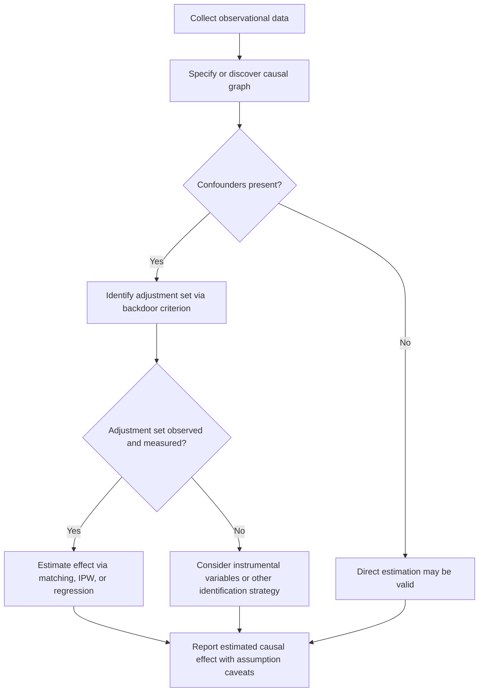

## Causal Inference and Probabilistic Reasoning

### Definition and Motivation

Causal inference is the study of determining cause-and-effect relationships from data, distinguishing genuine causal effects from mere statistical association. Standard probabilistic models capture correlations — $P(Y \mid X)$ — but do not by themselves distinguish whether $X$ causes $Y$, $Y$ causes $X$, or both are driven by a common underlying factor.

[Inference] The distinction matters for machine learning because models trained purely on observational correlation can fail when the underlying causal mechanism changes (distribution shift, interventions, or deployment in a new environment) — this is a widely stated motivation in the causal inference literature, though the degree of failure depends heavily on the specific model, data, and shift involved, and is not something that can be described as behavior that is guaranteed to occur or guaranteed to be prevented by causal methods.

### Correlation vs. Causation

The foundational distinction:

- **Correlation**: $X$ and $Y$ exhibit statistical dependence, $P(X, Y) \neq P(X)P(Y)$.
- **Causation**: Changing $X$ (via intervention) changes the distribution of $Y$.

A classic illustration: ice cream sales and drowning incidents are correlated, but neither causes the other — both are driven by a common cause (warm weather). This is a **confounding** relationship.

**Key Points**
- Observational correlation alone cannot establish causal direction or rule out confounding.
- Randomized controlled trials (RCTs) are the traditional gold standard for establishing causation, since randomization breaks the influence of confounders.
- Causal inference methods attempt to recover causal structure from observational data when randomized experiments are not feasible, though such recovery relies on assumptions that cannot always be verified from the data alone [Inference].

### Structural Causal Models (SCMs)

A structural causal model represents each variable $X_i$ as a function of its direct causes (parents) and an independent noise term:

$$X_i := f_i(\text{Pa}(X_i), U_i)$$

where $\text{Pa}(X_i)$ denotes the parent variables in a causal graph, and $U_i$ is exogenous noise.

SCMs are typically paired with a **causal graph** — a directed acyclic graph (DAG) where edges represent direct causal influence. This graph encodes assumptions about causal structure that are not derivable from observational data alone and must be supplied externally (from domain knowledge, experiments, or assumption) [Unverified — the necessity of external assumptions is a standard claim in the SCM literature associated with Pearl's framework, restated here without independent verification of the primary source text].

### Causal Graphs and D-Separation

Causal graphs encode conditional independence relationships via **d-separation**: a graphical criterion for reading off which variables are independent given others, without needing to compute probabilities directly.

Three canonical structures:

1. **Chain**: $A \to B \to C$ — $A$ and $C$ are dependent, but independent given $B$.
2. **Fork (common cause)**: $A \leftarrow B \to C$ — $A$ and $C$ are dependent, but independent given $B$.
3. **Collider (common effect)**: $A \to B \leftarrow C$ — $A$ and $C$ are independent, but become dependent when conditioning on $B$ (or its descendants).

The collider case is counterintuitive and a frequent source of analytical error: conditioning on a common effect can induce spurious association between otherwise independent causes — sometimes called "collider bias" or "explaining away."

### Causal Graph Structures (svg_diagram)

<svg xmlns="http://www.w3.org/2000/svg" viewBox="0 0 800 300">
  <text x="400" y="28" text-anchor="middle" font-size="17" font-weight="bold" fill="#1a1a1a">Three Canonical Causal Structures (svg_diagram)</text>

  <text x="120" y="65" text-anchor="middle" font-size="13" font-weight="bold" fill="#1a1a1a">Chain</text>
  <circle cx="60" cy="120" r="26" fill="#e8f0fe" stroke="#4285f4" stroke-width="2" />
  <text x="60" y="125" text-anchor="middle" font-size="14">A</text>
  <circle cx="150" cy="120" r="26" fill="#e6f4ea" stroke="#34a853" stroke-width="2" />
  <text x="150" y="125" text-anchor="middle" font-size="14">B</text>
  <circle cx="240" cy="120" r="26" fill="#e8f0fe" stroke="#4285f4" stroke-width="2" />
  <text x="240" y="125" text-anchor="middle" font-size="14">C</text>
  <line x1="86" y1="120" x2="124" y2="120" stroke="#666" stroke-width="2" marker-end="url(#arrowC)" />
  <line x1="176" y1="120" x2="214" y2="120" stroke="#666" stroke-width="2" marker-end="url(#arrowC)" />
  <text x="150" y="180" text-anchor="middle" font-size="11" fill="#333">A ⊥ C | B</text>

  <text x="400" y="65" text-anchor="middle" font-size="13" font-weight="bold" fill="#1a1a1a">Fork</text>
  <circle cx="340" cy="150" r="26" fill="#e8f0fe" stroke="#4285f4" stroke-width="2" />
  <text x="340" y="155" text-anchor="middle" font-size="14">A</text>
  <circle cx="430" cy="100" r="26" fill="#e6f4ea" stroke="#34a853" stroke-width="2" />
  <text x="430" y="105" text-anchor="middle" font-size="14">B</text>
  <circle cx="520" cy="150" r="26" fill="#e8f0fe" stroke="#4285f4" stroke-width="2" />
  <text x="520" y="155" text-anchor="middle" font-size="14">C</text>
  <line x1="410" y1="112" x2="360" y2="140" stroke="#666" stroke-width="2" marker-end="url(#arrowC)" />
  <line x1="450" y1="112" x2="500" y2="140" stroke="#666" stroke-width="2" marker-end="url(#arrowC)" />
  <text x="430" y="200" text-anchor="middle" font-size="11" fill="#333">A ⊥ C | B</text>

  <text x="680" y="65" text-anchor="middle" font-size="13" font-weight="bold" fill="#1a1a1a">Collider</text>
  <circle cx="620" cy="100" r="26" fill="#e8f0fe" stroke="#4285f4" stroke-width="2" />
  <text x="620" y="105" text-anchor="middle" font-size="14">A</text>
  <circle cx="710" cy="150" r="26" fill="#fef7e0" stroke="#f9ab00" stroke-width="2" />
  <text x="710" y="155" text-anchor="middle" font-size="14">B</text>
  <circle cx="800" cy="100" r="26" fill="#e8f0fe" stroke="#4285f4" stroke-width="2" />
  <text x="800" y="105" text-anchor="middle" font-size="14">C</text>
  <line x1="638" y1="118" x2="690" y2="140" stroke="#666" stroke-width="2" marker-end="url(#arrowC)" />
  <line x1="782" y1="118" x2="730" y2="140" stroke="#666" stroke-width="2" marker-end="url(#arrowC)" />
  <text x="710" y="200" text-anchor="middle" font-size="11" fill="#333">A ⊥ C, but dependent given B</text>

  </svg>

### Confounding and Backdoor Paths

A **confounder** is a common cause of both a treatment/exposure variable and an outcome variable, which can create a spurious association if not accounted for.

A **backdoor path** is any non-causal path connecting treatment $T$ to outcome $Y$ that starts with an arrow pointing into $T$. Such paths must be "blocked" to isolate the true causal effect.

The **backdoor criterion** states that if a set of variables $Z$ blocks all backdoor paths from $T$ to $Y$, and $Z$ contains no descendants of $T$, then conditioning on $Z$ suffices to identify the causal effect of $T$ on $Y$ from observational data.

[Inference] This criterion provides a graphical method for selecting an appropriate adjustment set, but its correctness depends entirely on the causal graph being an accurate representation of reality — if the assumed graph is wrong, the identified "causal effect" will not correspond to the true causal effect. This is a structural limitation, not something later statistical steps can correct.

### The Do-Operator and Interventions

Pearl's do-calculus introduces the **do-operator**, $do(X = x)$, representing an intervention that forcibly sets $X$ to value $x$, independent of its normal causes — distinct from merely observing $X = x$.

$$P(Y \mid do(X = x)) \neq P(Y \mid X = x) \quad \text{(in general)}$$

The left side represents the outcome distribution under intervention; the right side represents the outcome distribution conditional on passively observing that value. These coincide only when $X$ has no confounders with $Y$.

**Example**
Observing that people who take a vitamin supplement have better health outcomes ($P(Y \mid X=1)$) does not mean forcing everyone to take the supplement would produce the same improvement ($P(Y \mid do(X=1))$), because supplement-takers may differ systematically (income, existing health consciousness) from non-takers.

### Potential Outcomes Framework

An alternative but related formalism, associated with Neyman and Rubin, defines causal effects via **potential outcomes**: for each unit $i$, $Y_i(1)$ is the outcome if treated, $Y_i(0)$ is the outcome if untreated. The individual causal effect is $Y_i(1) - Y_i(0)$, but only one of the two outcomes is ever observed for a given unit — the **fundamental problem of causal inference**.

The **Average Treatment Effect (ATE)** is defined as:

$$\text{ATE} = \mathbb{E}[Y(1) - Y(0)]$$

Estimating ATE from observational data requires assumptions such as:
- **Unconfoundedness / ignorability**: treatment assignment is independent of potential outcomes given observed covariates.
- **Positivity / overlap**: every unit has a nonzero probability of receiving either treatment level.
- **SUTVA (Stable Unit Treatment Value Assumption)**: one unit's outcome is not affected by another unit's treatment assignment.

[Unverified] These three assumptions are commonly listed together in causal inference texts associated with the potential outcomes framework; the exact formal wording varies by source and is not being quoted from a specific verified document here.

### Estimation Methods

| Method | Core Idea | Typical Assumption Reliance |
|---|---|---|
| Propensity score matching | Match treated/untreated units with similar treatment probability | Unconfoundedness |
| Inverse probability weighting (IPW) | Reweight observations by inverse of treatment probability | Unconfoundedness, positivity |
| Instrumental variables (IV) | Use a variable affecting treatment but not outcome directly | Exclusion restriction, relevance |
| Regression discontinuity | Exploit a threshold-based treatment assignment rule | Local continuity around threshold |
| Difference-in-differences | Compare pre/post changes across treated/control groups | Parallel trends assumption |
| Doubly robust estimation | Combine outcome modeling and propensity weighting | Correct specification of at least one model |

[Inference] Doubly robust methods are generally described as robust to misspecification of *one* of the two component models (outcome or propensity), but not both simultaneously — this is a standard theoretical property discussed in the causal estimation literature, restated here as a property under stated assumptions rather than a claim that such methods are guaranteed to eliminate estimation error.

### Instrumental Variables

An instrumental variable $Z$ is a variable that affects treatment $T$ but affects outcome $Y$ only through $T$ (the **exclusion restriction**), and shares no common cause with $Y$.

$$Z \to T \to Y$$

Instrumental variables are used to estimate causal effects in the presence of unmeasured confounding between $T$ and $Y$, provided a valid instrument can be identified.

[Inference] Finding a variable that plausibly satisfies the exclusion restriction is often difficult in practice and is a frequent point of methodological disagreement in applied causal studies; validity of an instrument is generally not fully testable from data alone.

### Causal Discovery

While causal graphs are often supplied via domain knowledge, **causal discovery** algorithms attempt to infer graph structure (or equivalence classes of graphs) from observational data.

- **Constraint-based methods** (e.g., PC algorithm): use conditional independence tests to prune and orient edges.
- **Score-based methods** (e.g., GES — Greedy Equivalence Search): search over graph structures, scoring each by fit to data (e.g., via BIC).
- **Functional causal model methods** (e.g., LiNGAM): exploit asymmetries in noise distributions (e.g., non-Gaussianity) to identify causal direction between two variables.

[Unverified] LiNGAM's ability to identify causal direction under non-Gaussian noise assumptions is a claim specific to that method's theoretical framework as described in the causal discovery literature; the general applicability and current state of implementations are not independently verified here.

**Key Points**
- Under purely observational data with only conditional independence information, causal discovery methods can typically identify a graph only up to a **Markov equivalence class** — a set of graphs implying the same conditional independencies but potentially different causal directions.
- Full causal direction identification often additionally requires interventional data, temporal ordering, or specific distributional assumptions (e.g., non-Gaussian noise, additive noise models).

### Process Flow: Observational Data to Causal Estimate (mermaid)

### Causal Inference and Probabilistic Machine Learning

Causal reasoning intersects with probabilistic ML in several ways:

- **Causal Bayesian networks**: extend standard Bayesian networks with an explicit causal interpretation of edges, enabling reasoning about interventions, not just observation-based conditioning.
- **Counterfactual reasoning**: asks "what would $Y$ have been for this specific unit, had $X$ been different?" — a more fine-grained question than population-level ATE, requiring stronger structural assumptions (typically a fully specified SCM).
- **Invariant prediction / causal feature selection**: seeks predictive features whose relationship to the target remains stable across different environments or interventions, motivated by the idea that causal relationships are more likely to generalize under distribution shift than purely correlational ones [Inference — this generalization claim is the stated motivation in the invariant causal prediction literature; it depends on assumptions about which environments are available and is not something that can be described as behavior that is guaranteed].
- **Causal representation learning**: an active research area attempting to learn latent variables that correspond to causal factors rather than merely statistically convenient representations [Speculation — described as an active and evolving research direction; specific current state-of-the-art claims are not verified here].

### Counterfactuals in the SCM Framework

Given a fully specified SCM, counterfactual queries are computed via a three-step procedure:

1. **Abduction**: given observed evidence, update the distribution of exogenous noise variables $U$.
2. **Action**: modify the structural equations according to the hypothetical intervention (apply $do$).
3. **Prediction**: compute the resulting distribution of the outcome variable under the modified model.

[Unverified] This three-step abduction-action-prediction procedure is commonly attributed to Pearl's formulation of counterfactual computation in SCMs; the exact procedural description is restated here from general familiarity with the framework rather than direct citation of a specific verified text.

### Common Pitfalls

- **Confusing correlation with causation** — the most basic and persistent error.
- **Conditioning on a collider**, inducing spurious dependence between genuinely independent variables.
- **Overlooking unmeasured confounding** — no adjustment method can correct for a confounder that was never measured; this is a structural limitation of observational methods, not a matter of applying a more sophisticated estimator.
- **Assuming a discovered graph is uniquely correct** — most causal discovery output represents an equivalence class, not a single verified causal structure.
- **Treating instrumental variable validity as testable** — the exclusion restriction is fundamentally an untestable assumption in most practical settings.

I cannot verify the current state-of-the-art performance figures, specific benchmark results, or the internal implementation details of any particular causal inference software library, as this would require access to current, verifiable sources.

### Related Topics

- Bayesian networks and probabilistic graphical models
- Do-calculus rules and identifiability theory
- Counterfactual fairness in machine learning
- Time-series causal inference (Granger causality vs. structural causality)
- Causal representation learning and disentanglement
- Reinforcement learning connections to interventional reasoning