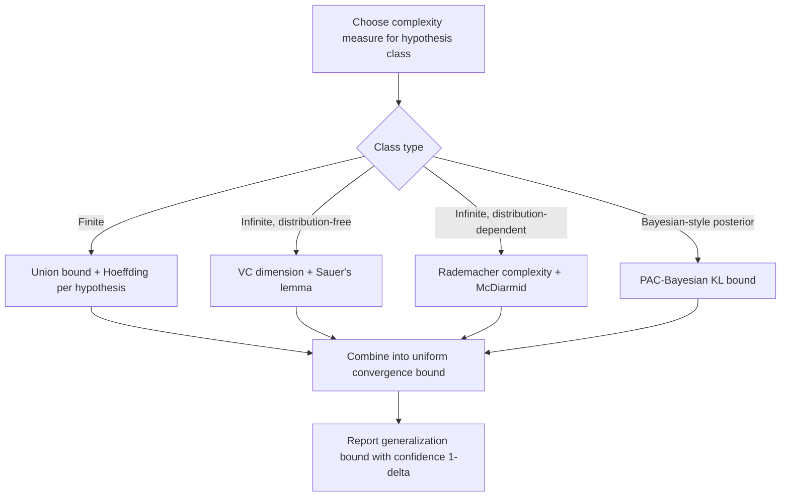

## Concentration Inequalities in Generalization Bounds

### Definition and Motivation

Concentration inequalities are probabilistic bounds that describe how a random variable — typically a function of many independent (or weakly dependent) random inputs — concentrates around its expected value. In machine learning, they provide the mathematical basis for **generalization bounds**: statements that bound the gap between a model's performance on training data (empirical risk) and its expected performance on unseen data (true risk).

$$R(h) - \hat{R}_n(h) \leq \epsilon \quad \text{with probability at least } 1 - \delta$$

where $R(h)$ is the true (population) risk of hypothesis $h$, $\hat{R}_n(h)$ is the empirical risk measured on $n$ training samples, and $\epsilon$ depends on $n$, $\delta$, and complexity measures of the hypothesis class.

[Inference] The general reasoning connecting concentration inequalities to generalization is that if empirical risk concentrates tightly around true risk, then good training performance is more likely to correspond to good test performance — this is the standard motivating argument in statistical learning theory, restated here as reasoning rather than a confirmed guarantee about any specific model's behavior.

### Markov's Inequality

The most basic concentration result. For a non-negative random variable $X$ and $a > 0$:

$$P(X \geq a) \leq \frac{\mathbb{E}[X]}{a}$$

**Key Points**
- Requires only non-negativity and existence of the mean.
- Provides a weak bound in general — it does not use variance or higher moment information.
- Serves as the building block from which sharper inequalities (Chebyshev, Chernoff) are derived.

### Chebyshev's Inequality

Using the variance of a random variable $X$ with mean $\mu$:

$$P(|X - \mu| \geq a) \leq \frac{\text{Var}(X)}{a^2}$$

Chebyshev's inequality is derived by applying Markov's inequality to $(X - \mu)^2$. It gives a two-sided bound and is tighter than Markov's when variance information is available, but the bound still decays only polynomially ($1/a^2$) rather than exponentially.

### Hoeffding's Inequality

For independent, bounded random variables $X_1, \dots, X_n$ with $X_i \in [a_i, b_i]$, and $\bar{X} = \frac{1}{n}\sum_i X_i$:

$$P(\bar{X} - \mathbb{E}[\bar{X}] \geq t) \leq \exp\left( \frac{-2n^2 t^2}{\sum_{i=1}^n (b_i - a_i)^2} \right)$$

This is one of the most widely used concentration results in learning theory because it applies directly to averages of bounded losses (e.g., 0-1 loss, or any loss clipped to a bounded range).

**Key Points**
- Requires boundedness of each variable, not just independence.
- Produces exponential (rather than polynomial) decay in the deviation probability, which is substantially tighter for large $n$.
- Commonly used to bound the gap between empirical risk and true risk for a **single, fixed** hypothesis evaluated on $n$ i.i.d. samples.
- Does not by itself account for selecting a hypothesis from a large or infinite hypothesis class — that requires a union bound or complexity-based extension (see below).

### From a Single Hypothesis to a Hypothesis Class

Hoeffding's inequality bounds the deviation for one fixed hypothesis $h$. In practice, a learning algorithm selects $h$ *after* seeing the data, from among many candidates in a hypothesis class $\mathcal{H}$. This introduces a **multiple comparisons** problem: the hypothesis that looks best on the training sample may simply be the one that got "lucky," rather than the one with genuinely lowest true risk.

**Finite hypothesis class (union bound)**

For a finite class $|\mathcal{H}| = M$, applying Hoeffding's bound to each hypothesis individually and taking a union bound gives, with probability at least $1-\delta$, simultaneously for all $h \in \mathcal{H}$:

$$R(h) \leq \hat{R}_n(h) + \sqrt{\frac{\ln M + \ln(1/\delta)}{2n}}$$

[Inference] This bound illustrates the general principle that generalization error grows with the logarithm of hypothesis class size — a standard qualitative takeaway in learning theory texts, restated here as reasoning about the bound's form rather than a claim about performance of any specific algorithm.

**Infinite hypothesis classes** require a different complexity measure, since a naive union bound does not apply. This motivates VC dimension and Rademacher complexity.

### Concentration Inequality Hierarchy (svg_diagram)

<svg xmlns="http://www.w3.org/2000/svg" viewBox="0 0 800 320">
  <text x="400" y="28" text-anchor="middle" font-size="17" font-weight="bold" fill="#1a1a1a">Concentration Inequality Hierarchy (svg_diagram)</text>

  <rect x="40" y="60" width="220" height="70" rx="8" fill="#e8f0fe" stroke="#4285f4" stroke-width="2" />
  <text x="150" y="90" text-anchor="middle" font-size="13" fill="#1a1a1a">Markov's Inequality</text>
  <text x="150" y="108" text-anchor="middle" font-size="11" fill="#333">Uses: mean only</text>

  <line x1="150" y1="130" x2="150" y2="165" stroke="#666" stroke-width="2" marker-end="url(#arrowD)" />

  <rect x="40" y="175" width="220" height="70" rx="8" fill="#e6f4ea" stroke="#34a853" stroke-width="2" />
  <text x="150" y="205" text-anchor="middle" font-size="13" fill="#1a1a1a">Chebyshev's Inequality</text>
  <text x="150" y="223" text-anchor="middle" font-size="11" fill="#333">Uses: mean + variance</text>

  <line x1="260" y1="95" x2="330" y2="95" stroke="#999" stroke-width="1.5" stroke-dasharray="4,3" />
  <text x="295" y="85" text-anchor="middle" font-size="9" fill="#777">stronger tools →</text>

  <rect x="330" y="60" width="220" height="70" rx="8" fill="#fef7e0" stroke="#f9ab00" stroke-width="2" />
  <text x="440" y="85" text-anchor="middle" font-size="13" fill="#1a1a1a">Hoeffding's Inequality</text>
  <text x="440" y="103" text-anchor="middle" font-size="11" fill="#333">Uses: boundedness</text>
  <text x="440" y="119" text-anchor="middle" font-size="11" fill="#333">Exponential decay</text>

  <line x1="440" y1="130" x2="440" y2="165" stroke="#666" stroke-width="2" marker-end="url(#arrowD)" />

  <rect x="330" y="175" width="220" height="70" rx="8" fill="#fce8e6" stroke="#ea4335" stroke-width="2" />
  <text x="440" y="200" text-anchor="middle" font-size="13" fill="#1a1a1a">McDiarmid's Inequality</text>
  <text x="440" y="218" text-anchor="middle" font-size="11" fill="#333">Uses: bounded differences</text>
  <text x="440" y="234" text-anchor="middle" font-size="11" fill="#333">(general functions)</text>

  <rect x="620" y="120" width="150" height="70" rx="8" fill="#f3e8fd" stroke="#a142f4" stroke-width="2" />
  <text x="695" y="150" text-anchor="middle" font-size="12" fill="#1a1a1a">Bernstein /</text>
  <text x="695" y="168" text-anchor="middle" font-size="12" fill="#1a1a1a">Chernoff bounds</text>

  <line x1="550" y1="95" x2="615" y2="140" stroke="#999" stroke-width="1.5" stroke-dasharray="4,3" />
  <line x1="550" y1="210" x2="615" y2="165" stroke="#999" stroke-width="1.5" stroke-dasharray="4,3" />

  </svg>

### McDiarmid's Inequality (Bounded Differences)

Generalizes Hoeffding's inequality to arbitrary functions $f(X_1, \dots, X_n)$ of independent random variables, provided the function satisfies a **bounded differences** property: changing any single input $X_i$ changes the function's output by at most $c_i$.

$$P(f(X_1,\dots,X_n) - \mathbb{E}[f] \geq t) \leq \exp\left( \frac{-2t^2}{\sum_{i=1}^n c_i^2} \right)$$

This is important in learning theory because many quantities of interest — such as empirical Rademacher complexity itself — are functions of the training sample that satisfy bounded differences, even though they are not simple averages.

### Rademacher Complexity

Rademacher complexity measures the capacity of a hypothesis class by quantifying how well it can fit random noise. For a class $\mathcal{F}$ and sample $S = (x_1, \dots, x_n)$:

$$\hat{\mathfrak{R}}_S(\mathcal{F}) = \mathbb{E}_{\sigma} \left[ \sup_{f \in \mathcal{F}} \frac{1}{n} \sum_{i=1}^n \sigma_i f(x_i) \right]$$

where $\sigma_i$ are independent Rademacher random variables (uniform on $\{-1, +1\}$).

A standard generalization bound using Rademacher complexity (holding with probability at least $1-\delta$, for all $f \in \mathcal{F}$):

$$R(f) \leq \hat{R}_n(f) + 2\hat{\mathfrak{R}}_S(\mathcal{F}) + 3\sqrt{\frac{\ln(2/\delta)}{2n}}$$

**Key Points**
- Rademacher complexity directly measures the richness of the hypothesis class relative to the specific data distribution, unlike VC dimension, which is distribution-independent.
- The bound is derived by combining McDiarmid's inequality (to show concentration of the supremum of empirical process) with a symmetrization argument.
- Lower Rademacher complexity corresponds to a tighter (smaller) generalization gap bound.

### VC Dimension and Its Relation to Concentration Bounds

VC (Vapnik-Chervonenkis) dimension is a combinatorial complexity measure: the largest number of points that a hypothesis class can "shatter" (label in all possible ways). For a class with VC dimension $d$, a generalization bound of the following approximate form holds:

$$R(h) \leq \hat{R}_n(h) + O\left( \sqrt{\frac{d \ln(n/d) + \ln(1/\delta)}{n}} \right)$$

[Unverified] The exact constants and log factors in VC-based generalization bounds vary across textbook derivations and proof techniques; the form given here reflects a commonly cited approximate structure rather than a precise bound quoted from a specific verified source.

The connection to concentration inequalities: VC theory uses a combinatorial argument (the growth function and Sauer's lemma) combined with concentration results to control the supremum of deviations over an infinite hypothesis class — effectively replacing $\ln M$ from the finite-class union bound with a term governed by $d \ln(n/d)$.

### PAC-Bayesian Bounds

PAC-Bayesian theory provides an alternative style of generalization bound that incorporates a prior distribution $P$ over hypotheses and compares it to a (data-dependent) posterior $Q$. A representative form (McAllester-style bound), holding with probability at least $1-\delta$:

$$\mathbb{E}_{h \sim Q}[R(h)] \leq \mathbb{E}_{h \sim Q}[\hat{R}_n(h)] + \sqrt{\frac{\text{KL}(Q \| P) + \ln(2\sqrt{n}/\delta)}{2n}}$$

[Unverified] Multiple variants of PAC-Bayesian bounds exist in the literature with differing constants and log terms depending on the specific proof (McAllester, Seeger, Catoni, and others); the form above is representative of the general structure rather than a bound quoted verbatim from a specific cited paper.

**Key Points**
- PAC-Bayesian bounds are notable for remaining non-vacuous in some deep learning settings where VC-dimension-based bounds are typically far too loose to be informative [Inference — this is a claim frequently made in more recent PAC-Bayesian literature applied to neural networks, and depends on the specific bound, architecture, and dataset used; it is not a property that holds for every PAC-Bayesian bound or every model].
- The KL divergence term acts as a complexity penalty: a posterior $Q$ that diverges greatly from the prior $P$ (i.e., a highly data-fit-specific hypothesis) incurs a larger bound.

### Sub-Gaussian and Sub-Exponential Random Variables

Many concentration results are stated more generally in terms of **sub-Gaussian** random variables — those whose tail probabilities decay at least as fast as a Gaussian:

$$P(|X - \mathbb{E}[X]| \geq t) \leq 2\exp\left(-\frac{t^2}{2\sigma^2}\right)$$

for some parameter $\sigma^2$ (the sub-Gaussian proxy variance). Bounded random variables are automatically sub-Gaussian (this is essentially what Hoeffding's lemma establishes), but the sub-Gaussian framework extends to unbounded variables with sufficiently light tails (e.g., Gaussians themselves).

**Sub-exponential** random variables have heavier tails than sub-Gaussian but still decay faster than polynomial, relevant for quantities like squared Gaussian variables or certain loss functions that are unbounded but well-behaved.

### Bernstein's Inequality

Incorporates variance information alongside a boundedness assumption, giving a bound that interpolates between Gaussian-like behavior for small deviations and exponential-like behavior for larger deviations:

$$P(|\bar{X} - \mathbb{E}[\bar{X}]| \geq t) \leq 2\exp\left( \frac{-nt^2/2}{\sigma^2 + Mt/3} \right)$$

where $\sigma^2$ is the variance and $M$ bounds $|X_i - \mathbb{E}[X_i]|$. When the true variance is small relative to the range, Bernstein's inequality gives tighter bounds than Hoeffding's, which ignores variance entirely.

### Application Flow: From Inequality to Generalization Bound (mermaid)

### Practical Role in Machine Learning

- **Model selection theory**: generalization bounds motivate structural risk minimization — preferring simpler models when the reduction in empirical risk from added complexity does not outweigh the increase in the bound's complexity term.
- **Deep learning theory**: classical bounds (VC-dimension-based) are frequently reported as vacuous (far exceeding 100% error) for large neural networks, motivating alternative approaches such as norm-based bounds, compression-based bounds, and PAC-Bayesian bounds [Inference — the claim that classical VC bounds are typically vacuous for large modern networks is widely stated in deep learning theory literature, but "vacuous" outcomes depend on the specific architecture, dataset, and bound formulation being evaluated, and this is not a claim that can be generalized to every network or every bound without qualification].
- **Confidence intervals for risk estimates**: concentration inequalities underlie the statistical validity of held-out test set evaluation, since the empirical test error is itself a random variable subject to sampling fluctuation.

I do not have access to information confirming which specific bound formulations (exact constants, log factors) are used in any particular current library, paper, or production ML system, as this would require checking primary current sources.

### Related Topics

- VC dimension and shattering coefficients in depth
- Rademacher and Gaussian complexity computation for specific model classes
- PAC-Bayesian theory and data-dependent priors
- Uniform convergence and empirical process theory
- Norm-based and compression-based generalization bounds for deep networks
- Concentration of measure in high-dimensional probability