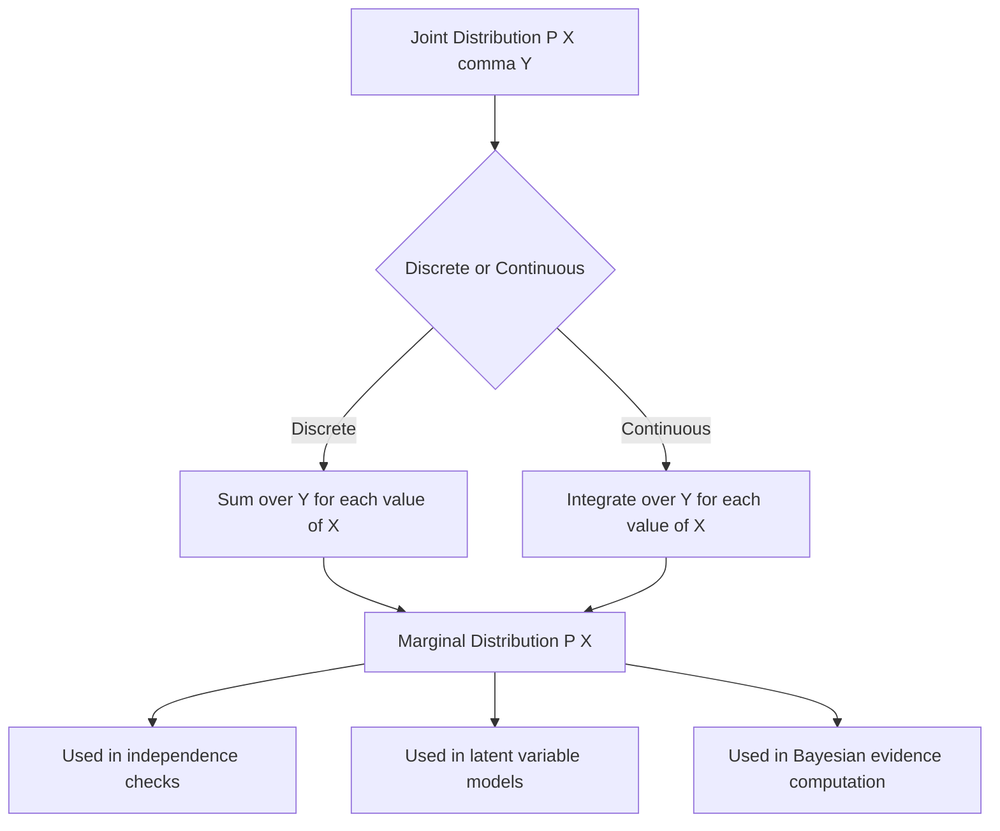

## Marginal Distributions

### Definition

Given a joint distribution over two or more random variables, a marginal distribution is the probability distribution of a subset of those variables, obtained by summing (discrete case) or integrating (continuous case) over the remaining variables.

For two discrete random variables $X$ and $Y$ with joint probability mass function $P(X, Y)$, the marginal distribution of $X$ is:

$$P(X = x) = \sum_{y} P(X = x, Y = y)$$

For continuous random variables with joint probability density function $f(X, Y)$, the marginal density of $X$ is:

$$f_X(x) = \int_{-\infty}^{\infty} f(x, y) \, dy$$

This process is often called "marginalizing out" $Y$.

### Intuition

The marginal distribution answers the question: "What is the distribution of $X$ alone, ignoring $Y$ entirely?" It discards information about how $X$ and $Y$ relate to each other, retaining only the standalone behavior of $X$.

The term "marginal" originates from the historical practice of writing row and column sums in the margins of a joint probability table.

### Discrete Example

Consider two binary random variables: $X$ (weather: Rain or Sun) and $Y$ (commute mode: Car or Bike), with the following joint distribution:

| | $Y$ = Car | $Y$ = Bike | Marginal $P(X)$ |
|---|---|---|---|
| $X$ = Rain | 0.30 | 0.10 | 0.40 |
| $X$ = Sun | 0.20 | 0.40 | 0.60 |
| Marginal $P(Y)$ | 0.50 | 0.50 | 1.00 |

The marginal distribution of $X$ is obtained by summing across each row:

$$P(X = \text{Rain}) = 0.30 + 0.10 = 0.40$$
$$P(X = \text{Sun}) = 0.20 + 0.40 = 0.60$$

Similarly, the marginal distribution of $Y$ is obtained by summing down each column.

### Continuous Example

Suppose $X$ and $Y$ have a joint density $f(x, y) = x + y$ for $0 \le x \le 1, 0 \le y \le 1$. The marginal density of $X$ is:

$$f_X(x) = \int_0^1 (x + y) \, dy = \left[xy + \frac{y^2}{2}\right]_0^1 = x + \frac{1}{2}$$

This gives a valid density function for $x \in [0, 1]$, since integrating $f_X(x)$ over that range yields 1.

### Relationship to Joint and Conditional Distributions

Marginal, joint, and conditional distributions are connected through:

$$P(X, Y) = P(X \mid Y) \, P(Y)$$

Marginalizing recovers $P(X)$ from the joint by summing over all values of $Y$:

$$P(X) = \sum_y P(X \mid Y = y) \, P(Y = y)$$

This identity is the basis of the law of total probability and is foundational to Bayesian inference, where marginal likelihoods are computed by integrating out latent variables or parameters.

### Marginal Distributions of More Than Two Variables

For a joint distribution over $n$ variables $X_1, X_2, \dots, X_n$, the marginal distribution of any subset can be obtained by summing or integrating over the complement of that subset. For example, with three variables $X, Y, Z$:

$$f_{X,Y}(x, y) = \int_{-\infty}^{\infty} f(x, y, z) \, dz$$

This yields the joint marginal of $X$ and $Y$, marginalizing out $Z$.

### Relevance to Machine Learning

- **Feature independence checks**: comparing a marginal distribution to a conditional distribution helps assess whether two variables are statistically independent, which is [Inference] relevant to feature selection and simplifying model assumptions.
- **Latent variable models**: in models such as Gaussian Mixture Models or Hidden Markov Models, the marginal likelihood of observed data is computed by integrating out latent variables — this is central to the Expectation-Maximization algorithm.
- **Bayesian inference**: the marginal likelihood (evidence) $P(D) = \int P(D \mid \theta) P(\theta) \, d\theta$ is used for model comparison and is a core quantity in Bayesian model selection.
- **Marginal effects in probabilistic graphical models**: inference algorithms such as belief propagation and variable elimination compute marginal distributions over subsets of nodes in a graph.

### Diagram: Marginalization from a Joint Distribution

<svg xmlns="http://www.w3.org/2000/svg" viewBox="0 0 640 380">
  <text x="320" y="25" text-anchor="middle" font-size="16" font-weight="bold" fill="#1a1a1a">Marginalization: Joint → Marginal (svg_diagram)</text>

  
  <rect x="60" y="60" width="220" height="180" fill="none" stroke="#333" stroke-width="1.5" />
  <line x1="60" y1="100" x2="280" y2="100" stroke="#333" stroke-width="1" />
  <line x1="170" y1="60" x2="170" y2="240" stroke="#333" stroke-width="1" />
  <line x1="60" y1="160" x2="280" y2="160" stroke="#333" stroke-width="1" />
  <line x1="60" y1="200" x2="280" y2="200" stroke="#333" stroke-width="1" />

  <text x="170" y="80" text-anchor="middle" font-size="13" fill="#1a1a1a">Joint P(X, Y)</text>
  <text x="115" y="135" text-anchor="middle" font-size="12" fill="#333">0.30</text>
  <text x="225" y="135" text-anchor="middle" font-size="12" fill="#333">0.10</text>
  <text x="115" y="185" text-anchor="middle" font-size="12" fill="#333">0.20</text>
  <text x="225" y="185" text-anchor="middle" font-size="12" fill="#333">0.40</text>

  <text x="115" y="220" text-anchor="middle" font-size="11" fill="#555">Y=Car</text>
  <text x="225" y="220" text-anchor="middle" font-size="11" fill="#555">Y=Bike</text>

  
  <path d="M 300 150 L 380 150" stroke="#555" stroke-width="2" marker-end="url(#arrow)" />
  <text x="340" y="140" text-anchor="middle" font-size="11" fill="#555">sum over Y</text>

  <rect x="400" y="100" width="180" height="100" fill="none" stroke="#2b6cb0" stroke-width="1.5" />
  <text x="490" y="90" text-anchor="middle" font-size="13" fill="#1a1a1a">Marginal P(X)</text>
  <line x1="400" y1="150" x2="580" y2="150" stroke="#2b6cb0" stroke-width="1" />
  <text x="490" y="130" text-anchor="middle" font-size="12" fill="#2b6cb0">P(X=Rain) = 0.40</text>
  <text x="490" y="180" text-anchor="middle" font-size="12" fill="#2b6cb0">P(X=Sun) = 0.60</text>

  <text x="320" y="270" text-anchor="middle" font-size="11" fill="#555">Each row of the joint table is summed to produce the marginal of X</text>
  <text x="170" y="260" text-anchor="middle" font-size="11" fill="#333">0.40</text>
  <text x="170" y="220" text-anchor="middle" font-size="0" fill="none" />
</svg>

### Marginalization Process Flow

### Common Pitfalls

- Confusing the marginal distribution with the conditional distribution — the marginal $P(X)$ ignores $Y$ entirely, while $P(X \mid Y)$ depends on a specific value of $Y$.
- Assuming marginals fully determine the joint distribution — in general, knowing $P(X)$ and $P(Y)$ separately does not recover $P(X, Y)$ unless independence is confirmed. [Inference]
- Forgetting to normalize after integrating/summing when working with unnormalized densities, which can lead to invalid probability distributions.

**Related Topics**
- Joint distributions and joint density functions
- Conditional distributions and conditional independence
- Law of total probability
- Bayesian marginal likelihood (evidence)
- Covariance and correlation between random variables
- Marginalization in graphical models (belief propagation, variable elimination)