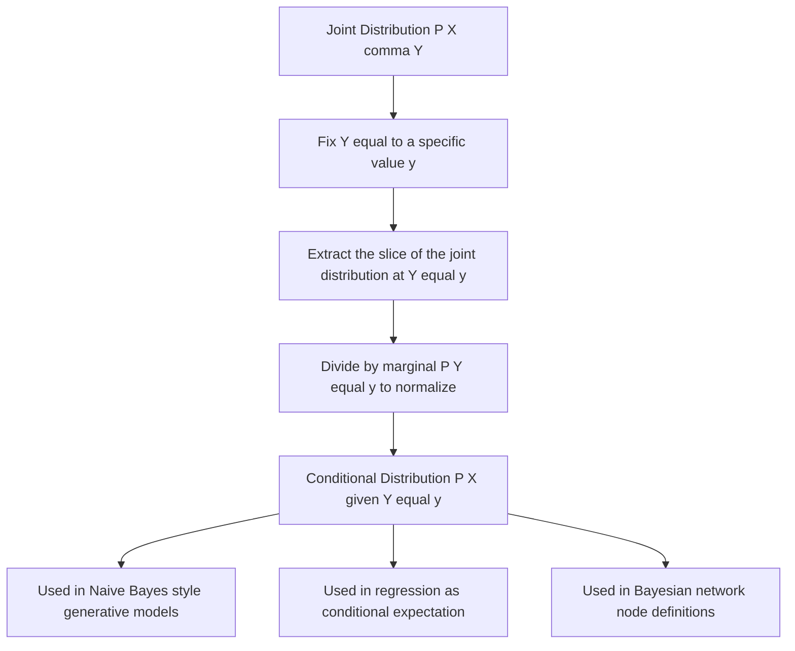

## Conditional Distributions

### Definition

A conditional distribution describes the probability distribution of one random variable given that another random variable takes a specific, fixed value. For discrete random variables $X$ and $Y$, the conditional probability mass function of $X$ given $Y = y$ is:

$$P(X = x \mid Y = y) = \frac{P(X = x, Y = y)}{P(Y = y)}, \quad \text{provided } P(Y = y) > 0$$

For continuous random variables with joint density $f(x, y)$, the conditional density of $X$ given $Y = y$ is:

$$f_{X \mid Y}(x \mid y) = \frac{f(x, y)}{f_Y(y)}, \quad \text{provided } f_Y(y) > 0$$

### Intuition

The conditional distribution answers: "Given that I already know $Y = y$, what is the distribution of $X$ now?" It restricts attention to the "slice" of the joint distribution where $Y = y$ holds, then renormalizes so the resulting distribution sums or integrates to 1.

### Discrete Example

Using the same joint distribution from the marginal distributions topic:

| | $Y$ = Car | $Y$ = Bike | Marginal $P(X)$ |
|---|---|---|---|
| $X$ = Rain | 0.30 | 0.10 | 0.40 |
| $X$ = Sun | 0.20 | 0.40 | 0.60 |
| Marginal $P(Y)$ | 0.50 | 0.50 | 1.00 |

The conditional distribution of $X$ given $Y = \text{Car}$ is:

$$P(X = \text{Rain} \mid Y = \text{Car}) = \frac{0.30}{0.50} = 0.60$$
$$P(X = \text{Sun} \mid Y = \text{Car}) = \frac{0.20}{0.50} = 0.40$$

These two values sum to 1, confirming a valid conditional distribution over $X$.

### Continuous Example

Using the joint density $f(x, y) = x + y$ for $0 \le x \le 1$, $0 \le y \le 1$, with marginal $f_Y(y) = y + \frac{1}{2}$, the conditional density of $X$ given $Y = y$ is:

$$f_{X \mid Y}(x \mid y) = \frac{x + y}{y + \frac{1}{2}}$$

This is a valid density in $x$ for a fixed value of $y$, since integrating over $x \in [0, 1]$ yields 1.

### Relationship to Joint and Marginal Distributions

$$P(X, Y) = P(X \mid Y) \, P(Y) = P(Y \mid X) \, P(X)$$

This identity is the basis of Bayes' theorem:

$$P(X \mid Y) = \frac{P(Y \mid X) \, P(X)}{P(Y)}$$

### Conditional Distributions and Independence

$X$ and $Y$ are statistically independent if and only if:

$$P(X \mid Y = y) = P(X) \quad \text{for all } y$$

Equivalently, $f_{X,Y}(x, y) = f_X(x) \, f_Y(y)$ for all $x, y$. In the discrete example above, $P(X = \text{Rain} \mid Y = \text{Car}) = 0.60 \neq P(X = \text{Rain}) = 0.40$, so $X$ and $Y$ are dependent.

### Relevance to Machine Learning

- **Generative models**: many generative classifiers (e.g., Naive Bayes) model $P(X \mid Y)$, the conditional distribution of features given a class label, then apply Bayes' theorem to obtain $P(Y \mid X)$ for prediction.
- **Discriminative models**: logistic regression and similar methods directly model the conditional distribution $P(Y \mid X)$ of the label given the features, rather than the full joint distribution. [Inference] This is generally considered more directly aligned with the prediction task itself, though this framing is a common pedagogical simplification rather than a strict mathematical necessity.
- **Regression as a conditional expectation**: standard regression models estimate $E[Y \mid X]$, the mean of the conditional distribution of $Y$ given $X$.
- **Probabilistic graphical models**: Bayesian networks are defined by a set of conditional distributions, one for each node given its parents, from which the full joint distribution is reconstructed via the chain rule.
- **Sequence models**: autoregressive models (e.g., certain language models) factorize a joint distribution over a sequence into a product of conditional distributions, each token conditioned on preceding tokens. [Unverified] The specific factorization and conditioning structure varies by architecture and implementation, and I do not have access to verify behavior of any particular unspecified model.

### Diagram: Conditioning as a Slice of the Joint Distribution

<svg xmlns="http://www.w3.org/2000/svg" viewBox="0 0 640 380">
  <text x="320" y="25" text-anchor="middle" font-size="16" font-weight="bold" fill="#1a1a1a">Conditional Distribution as a Slice (svg_diagram)</text>

  
  <rect x="60" y="60" width="220" height="180" fill="none" stroke="#333" stroke-width="1.5" />
  <line x1="60" y1="100" x2="280" y2="100" stroke="#333" stroke-width="1" />
  <line x1="170" y1="60" x2="170" y2="240" stroke="#333" stroke-width="1" />
  <line x1="60" y1="160" x2="280" y2="160" stroke="#333" stroke-width="1" />
  <line x1="60" y1="200" x2="280" y2="200" stroke="#333" stroke-width="1" />

  <text x="170" y="80" text-anchor="middle" font-size="13" fill="#1a1a1a">Joint P(X, Y)</text>

  
  <rect x="60" y="100" width="110" height="100" fill="#fde68a" fill-opacity="0.5" stroke="none" />

  <text x="115" y="135" text-anchor="middle" font-size="12" fill="#1a1a1a">0.30</text>
  <text x="225" y="135" text-anchor="middle" font-size="12" fill="#999">0.10</text>
  <text x="115" y="185" text-anchor="middle" font-size="12" fill="#1a1a1a">0.20</text>
  <text x="225" y="185" text-anchor="middle" font-size="12" fill="#999">0.40</text>

  <text x="115" y="220" text-anchor="middle" font-size="11" fill="#555">Y=Car</text>
  <text x="225" y="220" text-anchor="middle" font-size="11" fill="#999">Y=Bike</text>

  
  <path d="M 300 150 L 380 150" stroke="#555" stroke-width="2" marker-end="url(#arrow2)" />
  <text x="340" y="140" text-anchor="middle" font-size="11" fill="#555">normalize by P(Y=Car)</text>

  <rect x="400" y="100" width="180" height="100" fill="none" stroke="#b45309" stroke-width="1.5" />
  <text x="490" y="90" text-anchor="middle" font-size="13" fill="#1a1a1a">P(X | Y=Car)</text>
  <line x1="400" y1="150" x2="580" y2="150" stroke="#b45309" stroke-width="1" />
  <text x="490" y="130" text-anchor="middle" font-size="12" fill="#b45309">P(Rain|Car) = 0.60</text>
  <text x="490" y="180" text-anchor="middle" font-size="12" fill="#b45309">P(Sun|Car) = 0.40</text>

  <text x="320" y="270" text-anchor="middle" font-size="11" fill="#555">Only the highlighted column is used, then rescaled to sum to 1</text>
</svg>

### Conditional Distribution Workflow

### Common Pitfalls

- Dividing by a marginal probability of zero, which makes the conditional distribution undefined. [Inference] This is generally handled by restricting conditioning to values of $Y$ with nonzero probability or density.
- Confusing $P(X \mid Y)$ with $P(Y \mid X)$ — these are generally different distributions and are related only through Bayes' theorem, not interchangeable.
- Assuming a conditional distribution computed from a specific value of $Y$ generalizes to all values of $Y$; the conditional distribution is defined separately for each value of $Y$ unless independence holds.

**Related Topics**
- Bayes' theorem and posterior distributions
- Independence and conditional independence
- Conditional expectation and regression
- Bayesian networks and factorized joint distributions
- Naive Bayes classifiers
- Chain rule of probability for joint distributions