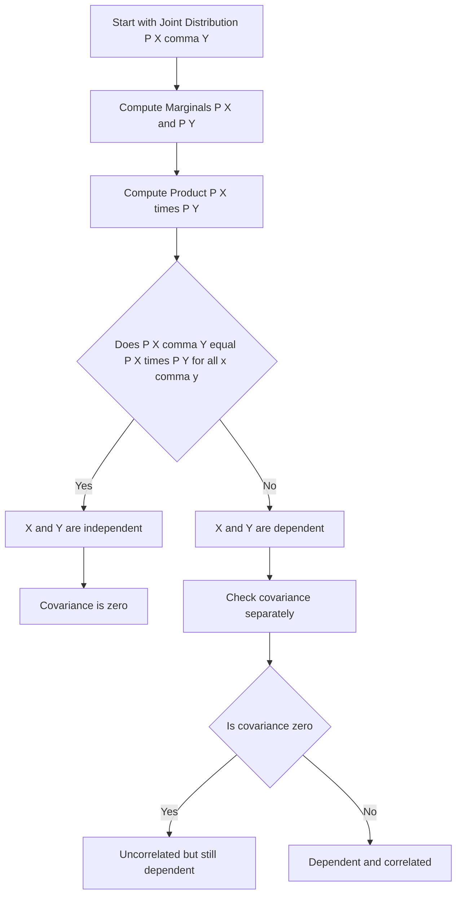

## Independence of Random Variables

### Definition

Two random variables $X$ and $Y$ are statistically independent if knowledge of one provides no information about the other. Formally, for discrete random variables:

$$P(X = x, Y = y) = P(X = x) \, P(Y = y) \quad \text{for all } x, y$$

For continuous random variables with joint density $f(x, y)$ and marginal densities $f_X(x)$, $f_Y(y)$:

$$f(x, y) = f_X(x) \, f_Y(y) \quad \text{for all } x, y$$

Equivalently, independence holds if and only if the conditional distribution equals the marginal distribution:

$$P(X \mid Y = y) = P(X) \quad \text{for all } y \text{ with } P(Y=y) > 0$$

### Intuition

Independence means the joint distribution factorizes cleanly into the product of the individual marginal distributions. There is no residual dependency structure to capture — observing $Y$ does not shift the distribution of $X$ in any way.

### Discrete Example: Dependent Case

Recall the joint distribution from earlier topics:

| | $Y$ = Car | $Y$ = Bike | Marginal $P(X)$ |
|---|---|---|---|
| $X$ = Rain | 0.30 | 0.10 | 0.40 |
| $X$ = Sun | 0.20 | 0.40 | 0.60 |
| Marginal $P(Y)$ | 0.50 | 0.50 | 1.00 |

Checking independence requires comparing the joint to the product of marginals:

$$P(X=\text{Rain}) \cdot P(Y=\text{Car}) = 0.40 \times 0.50 = 0.20$$

The actual joint probability is $P(X=\text{Rain}, Y=\text{Car}) = 0.30$, which does not equal $0.20$. Since the product of marginals does not match the joint value, $X$ and $Y$ are dependent in this example.

### Discrete Example: Independent Case

Consider a modified joint distribution:

| | $Y$ = Car | $Y$ = Bike | Marginal $P(X)$ |
|---|---|---|---|
| $X$ = Rain | 0.20 | 0.20 | 0.40 |
| $X$ = Sun | 0.30 | 0.30 | 0.60 |
| Marginal $P(Y)$ | 0.50 | 0.50 | 1.00 |

Checking one cell: $P(X=\text{Rain}) \cdot P(Y=\text{Car}) = 0.40 \times 0.50 = 0.20$, which matches $P(X=\text{Rain}, Y=\text{Car}) = 0.20$. This equality must hold for every cell in the table for independence to be confirmed, and in this constructed example it does.

### Continuous Example

If $X$ and $Y$ have joint density $f(x, y) = 4xy$ for $0 \le x \le 1$, $0 \le y \le 1$, the marginals are:

$$f_X(x) = \int_0^1 4xy \, dy = 2x, \qquad f_Y(y) = \int_0^1 4xy \, dx = 2y$$

Checking the product: $f_X(x) \, f_Y(y) = 2x \cdot 2y = 4xy = f(x, y)$. Since this equality holds for all $x, y$ in the domain, $X$ and $Y$ are independent in this example.

By contrast, the earlier example $f(x, y) = x + y$ does not factor into a product of functions of $x$ alone and $y$ alone, so those variables are dependent.

### Independence vs. Uncorrelatedness

Independence implies zero covariance:

$$\text{Cov}(X, Y) = E[XY] - E[X]E[Y] = 0 \quad \text{if } X \perp Y$$

The converse does not hold in general. [Inference] Two variables can have zero covariance (uncorrelated) while still being dependent, because covariance only captures linear relationships and can miss nonlinear dependencies. A commonly cited illustrative case is $X \sim \text{Uniform}(-1, 1)$ and $Y = X^2$: these are uncorrelated but clearly dependent, since $Y$ is fully determined by $X$. [Unverified] I have not derived or verified the covariance calculation for this specific case here, so this should be checked independently before being relied upon.

### Independence of More Than Two Variables

Random variables $X_1, X_2, \dots, X_n$ are mutually independent if:

$$P(X_1, X_2, \dots, X_n) = \prod_{i=1}^{n} P(X_i)$$

Mutual independence is a stronger condition than pairwise independence (every pair being independent). [Inference] It is possible for a set of variables to be pairwise independent without being mutually independent, though constructing and verifying such an example is nontrivial and is not derived here.

### Relevance to Machine Learning

- **Naive Bayes classifiers**: this method assumes conditional independence of features given the class label, i.e., $P(X_1, \dots, X_n \mid Y) = \prod_i P(X_i \mid Y)$. This assumption is a modeling simplification and does not necessarily hold in real datasets. [Unverified] Whether this assumption is violated, and to what degree, depends entirely on the specific dataset in question and cannot be stated generally.
- **i.i.d. assumption**: many machine learning algorithms assume training examples are independent and identically distributed. [Inference] This assumption underlies standard generalization bounds and cross-validation procedures, though the degree to which real-world data satisfies it is dataset-specific and not something that can be confirmed in general.
- **Feature selection**: statistical independence tests (e.g., chi-squared tests for categorical variables) are used to assess whether a feature carries information about a target variable.
- **Latent variable models**: many models assume conditional independence between observed variables given a latent variable, which simplifies the joint distribution into a product of conditionals.
- **Dimensionality reduction**: Independent Component Analysis (ICA) explicitly seeks a transformation of the data into components that are statistically independent, in contrast to Principal Component Analysis, which only enforces uncorrelatedness.

### Diagram: Independence as Factorization

<svg xmlns="http://www.w3.org/2000/svg" viewBox="0 0 640 320">
  <text x="320" y="25" text-anchor="middle" font-size="16" font-weight="bold" fill="#1a1a1a">Independence as Factorization (svg_diagram)</text>

  <rect x="60" y="70" width="180" height="70" fill="none" stroke="#333" stroke-width="1.5" rx="4" />
  <text x="150" y="110" text-anchor="middle" font-size="13" fill="#1a1a1a">P(X, Y)</text>
  <text x="150" y="128" text-anchor="middle" font-size="10" fill="#555">joint distribution</text>

  <text x="270" y="112" text-anchor="middle" font-size="16" fill="#555">=</text>

  <rect x="310" y="70" width="140" height="70" fill="none" stroke="#2b6cb0" stroke-width="1.5" rx="4" />
  <text x="380" y="105" text-anchor="middle" font-size="13" fill="#2b6cb0">P(X)</text>
  <text x="380" y="122" text-anchor="middle" font-size="10" fill="#555">marginal</text>

  <text x="460" y="112" text-anchor="middle" font-size="16" fill="#555">×</text>

  <rect x="480" y="70" width="140" height="70" fill="none" stroke="#b45309" stroke-width="1.5" rx="4" />
  <text x="550" y="105" text-anchor="middle" font-size="13" fill="#b45309">P(Y)</text>
  <text x="550" y="122" text-anchor="middle" font-size="10" fill="#555">marginal</text>

  <text x="320" y="190" text-anchor="middle" font-size="12" fill="#1a1a1a">Holds only when X and Y are independent</text>
  <text x="320" y="215" text-anchor="middle" font-size="11" fill="#555">If P(X,Y) ≠ P(X)·P(Y) for any x,y pair, X and Y are dependent</text>

  <rect x="120" y="250" width="400" height="50" fill="#fef2f2" stroke="#dc2626" stroke-width="1" rx="4" />
  <text x="320" y="272" text-anchor="middle" font-size="11" fill="#991b1b">Zero covariance does not imply independence —</text>
  <text x="320" y="288" text-anchor="middle" font-size="11" fill="#991b1b">nonlinear dependence can remain undetected by correlation alone</text>
</svg>

### Independence Assessment Workflow

### Common Pitfalls

- Assuming zero correlation implies independence — this is [Inference] incorrect in general, since correlation only measures linear association.
- Confirming independence using only one cell of a joint table — the factorization condition must hold for every combination of values, not just a single pair.
- Conflating pairwise independence with mutual independence for three or more variables — [Inference] these are logically distinct conditions, and pairwise checks alone are not sufficient to establish mutual independence.
- Assuming the Naive Bayes conditional independence assumption holds for a specific real dataset without testing it. [Unverified] Whether the assumption is reasonable depends entirely on the dataset and cannot be assumed generally.

**Related Topics**
- Conditional independence
- Covariance and correlation
- Chi-squared test for independence
- Naive Bayes classifiers and the i.i.d. assumption
- Independent Component Analysis (ICA)
- Copulas and dependence structures beyond linear correlation