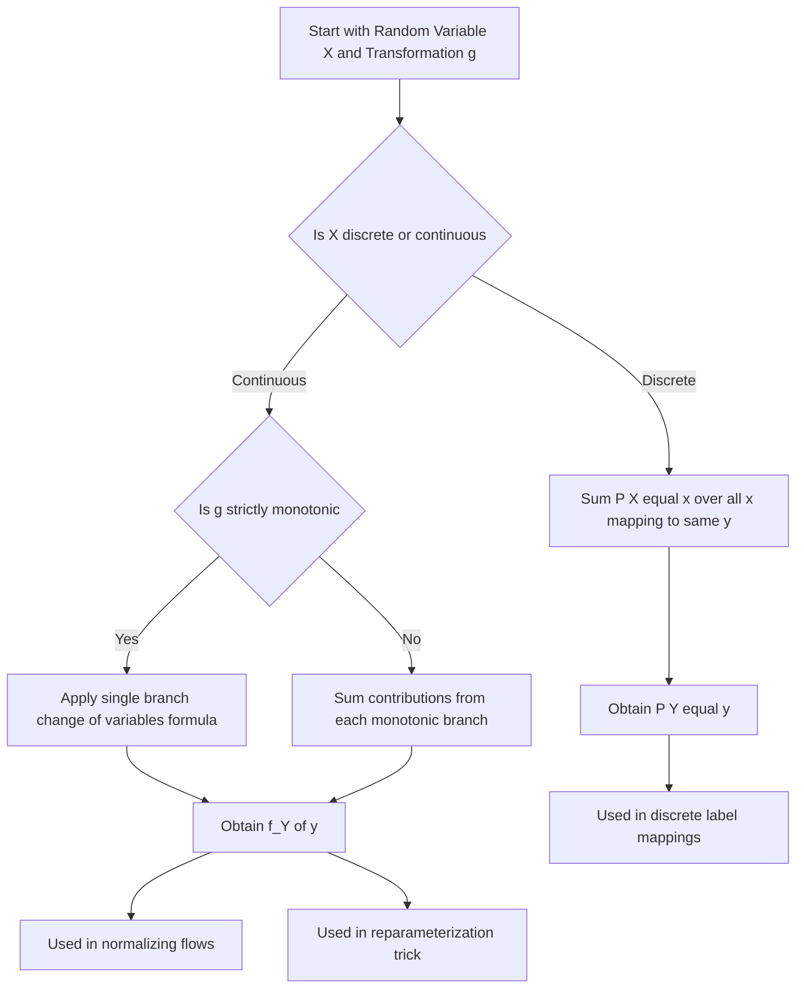

## Transformations of Random Variables

### Definition

A transformation of a random variable involves applying a function $g$ to a random variable $X$ to produce a new random variable $Y = g(X)$. The central task is determining the distribution of $Y$ given the distribution of $X$ and the form of $g$.

### Discrete Case

For a discrete random variable $X$ with probability mass function $P(X = x)$, and $Y = g(X)$, the distribution of $Y$ is obtained by summing probabilities over all $x$ values that map to the same $y$:

$$P(Y = y) = \sum_{x : g(x) = y} P(X = x)$$

### Continuous Case: Monotonic Transformations

If $g$ is a strictly monotonic (increasing or decreasing) and differentiable function, and $X$ has density $f_X(x)$, the density of $Y = g(X)$ is given by the change of variables formula:

$$f_Y(y) = f_X(g^{-1}(y)) \left| \frac{d}{dy} g^{-1}(y) \right|$$

The absolute value of the derivative term is called the Jacobian, and it corrects for how the transformation stretches or compresses probability density.

### Continuous Example: Linear Transformation

Let $X \sim \text{Uniform}(0, 1)$, so $f_X(x) = 1$ for $0 \le x \le 1$. Define $Y = 2X + 3$. The inverse transformation is $x = g^{-1}(y) = \frac{y-3}{2}$, and:

$$\frac{d}{dy} g^{-1}(y) = \frac{1}{2}$$

The valid range for $y$ is $3 \le y \le 5$. The resulting density is:

$$f_Y(y) = f_X\left(\frac{y-3}{2}\right) \cdot \left|\frac{1}{2}\right| = 1 \cdot \frac{1}{2} = \frac{1}{2}, \quad 3 \le y \le 5$$

This confirms $Y \sim \text{Uniform}(3, 5)$, consistent with the general fact that a linear transformation of a uniform random variable is itself uniform.

### Continuous Example: Nonlinear Transformation

Let $X \sim \text{Uniform}(0, 1)$ and define $Y = X^2$. The inverse is $x = \sqrt{y}$, and:

$$\frac{d}{dy}\sqrt{y} = \frac{1}{2\sqrt{y}}$$

The resulting density is:

$$f_Y(y) = f_X(\sqrt{y}) \cdot \frac{1}{2\sqrt{y}} = \frac{1}{2\sqrt{y}}, \quad 0 \le y \le 1$$

Unlike the linear case, this density is not uniform. It increases without bound as $y \to 0$, illustrating that nonlinear transformations can substantially reshape a distribution.

### Non-Monotonic Transformations

When $g$ is not monotonic, the change of variables formula must account for multiple branches of the inverse function. For $Y = X^2$ with $X$ defined over a domain that includes both positive and negative values (e.g., $X \sim \text{Uniform}(-1, 1)$), there are two values of $x$ for each $y > 0$: $x = \sqrt{y}$ and $x = -\sqrt{y}$. The density becomes a sum over both branches:

$$f_Y(y) = f_X(\sqrt{y}) \left|\frac{d}{dy}\sqrt{y}\right| + f_X(-\sqrt{y}) \left|\frac{d}{dy}(-\sqrt{y})\right|$$

### Transformations of Multiple Random Variables

For a joint transformation $(Y_1, Y_2) = g(X_1, X_2)$ where $g$ is invertible, the joint density transforms using the determinant of the Jacobian matrix:

$$f_{Y_1, Y_2}(y_1, y_2) = f_{X_1, X_2}(g^{-1}(y_1, y_2)) \cdot |\det J|$$

where $J$ is the matrix of partial derivatives of the inverse transformation. [Inference] This generalizes the single-variable Jacobian correction to higher dimensions, though the specific computation depends on the particular transformation and is not derived further here.

### Expectation Under Transformation

For a transformation $Y = g(X)$, the expected value of $Y$ can be computed directly from the distribution of $X$ without first deriving the distribution of $Y$, using the law of the unconscious statistician:

$$E[Y] = E[g(X)] = \sum_x g(x) P(X=x) \quad \text{(discrete)}$$
$$E[Y] = E[g(X)] = \int_{-\infty}^{\infty} g(x) f_X(x) \, dx \quad \text{(continuous)}$$

A common point of confusion is that $E[g(X)] \neq g(E[X])$ in general, except when $g$ is linear. This inequality is formalized for convex functions by Jensen's inequality:

$$E[g(X)] \ge g(E[X]) \quad \text{if } g \text{ is convex}$$

### Relevance to Machine Learning

- **Feature engineering**: applying transformations such as log, square root, or Box-Cox to input features changes their distributional shape, which [Inference] is commonly done to reduce skewness or stabilize variance, though whether this improves a specific model's performance depends on the dataset and algorithm and cannot be assumed generally.
- **Normalizing flows**: this class of generative models constructs complex distributions by applying a sequence of invertible, differentiable transformations to a simple base distribution (e.g., a Gaussian), using the change of variables formula at each step. [Unverified] The specific architecture, transformation choices, and resulting expressiveness vary across implementations, and I do not have access to verify the behavior of any particular unspecified model or library.
- **Reparameterization trick**: used in variational autoencoders, this technique transforms a sample from a fixed base distribution (e.g., standard normal) into a sample from a target distribution via a differentiable transformation, enabling gradient-based optimization through stochastic nodes. [Inference] This is a widely cited technique in the variational inference literature, but I have not verified implementation-specific details here.
- **Loss function behavior**: understanding how transformations affect variance and higher moments is [Inference] relevant to interpreting how transformed targets (e.g., log-transformed regression targets) affect the scale and behavior of loss functions such as mean squared error, though the practical effect is model- and dataset-specific.

### Diagram: Density Transformation via Change of Variables

<svg xmlns="http://www.w3.org/2000/svg" viewBox="0 0 640 360">
  <text x="320" y="25" text-anchor="middle" font-size="16" font-weight="bold" fill="#1a1a1a">Change of Variables for Y = g(X) (svg_diagram)</text>

  <rect x="60" y="70" width="180" height="80" fill="none" stroke="#2b6cb0" stroke-width="1.5" rx="4" />
  <text x="150" y="100" text-anchor="middle" font-size="13" fill="#2b6cb0">f_X(x)</text>
  <text x="150" y="120" text-anchor="middle" font-size="10" fill="#555">density of X</text>
  <text x="150" y="138" text-anchor="middle" font-size="10" fill="#555">Uniform(0,1)</text>

  <path d="M 250 110 L 340 110" stroke="#555" stroke-width="2" marker-end="url(#arrow3)" />
  <text x="295" y="100" text-anchor="middle" font-size="10" fill="#555">Y = g(X)</text>

  <rect x="350" y="70" width="230" height="80" fill="none" stroke="#b45309" stroke-width="1.5" rx="4" />
  <text x="465" y="95" text-anchor="middle" font-size="13" fill="#b45309">f_Y(y) = f_X(g⁻¹(y)) · |d/dy g⁻¹(y)|</text>
  <text x="465" y="115" text-anchor="middle" font-size="10" fill="#555">density of Y, corrected by Jacobian</text>
  <text x="465" y="133" text-anchor="middle" font-size="10" fill="#555">g(x) = 2x + 3 → Uniform(3,5)</text>

  <rect x="120" y="190" width="400" height="60" fill="#f0fdf4" stroke="#16a34a" stroke-width="1" rx="4" />
  <text x="320" y="212" text-anchor="middle" font-size="11" fill="#166534">Linear transformations preserve distribution shape</text>
  <text x="320" y="230" text-anchor="middle" font-size="11" fill="#166534">(Uniform stays Uniform, scaled and shifted)</text>

  <rect x="120" y="270" width="400" height="60" fill="#fef2f2" stroke="#dc2626" stroke-width="1" rx="4" />
  <text x="320" y="292" text-anchor="middle" font-size="11" fill="#991b1b">Nonlinear transformations reshape the distribution</text>
  <text x="320" y="310" text-anchor="middle" font-size="11" fill="#991b1b">(Y = X² produces a non-uniform, unbounded-density shape near 0)</text>
</svg>

### Transformation Decision Workflow

### Common Pitfalls

- Forgetting the Jacobian (derivative) term when transforming continuous densities, which leads to an incorrectly scaled density function.
- Applying the single-branch change of variables formula to a non-monotonic transformation without accounting for multiple branches, which undercounts probability mass.
- Assuming $E[g(X)] = g(E[X])$ for a nonlinear function $g$ — this equality [Inference] generally fails except when $g$ is linear, as formalized by Jensen's inequality for convex or concave functions.
- Confusing a transformation of a random variable with a transformation of a dataset sample without accounting for how the underlying density changes accordingly.

**Related Topics**
- Jacobian matrices and multivariate change of variables
- Law of the unconscious statistician
- Jensen's inequality
- Moment generating functions under transformation
- Normalizing flows in generative modeling
- Reparameterization trick in variational inference