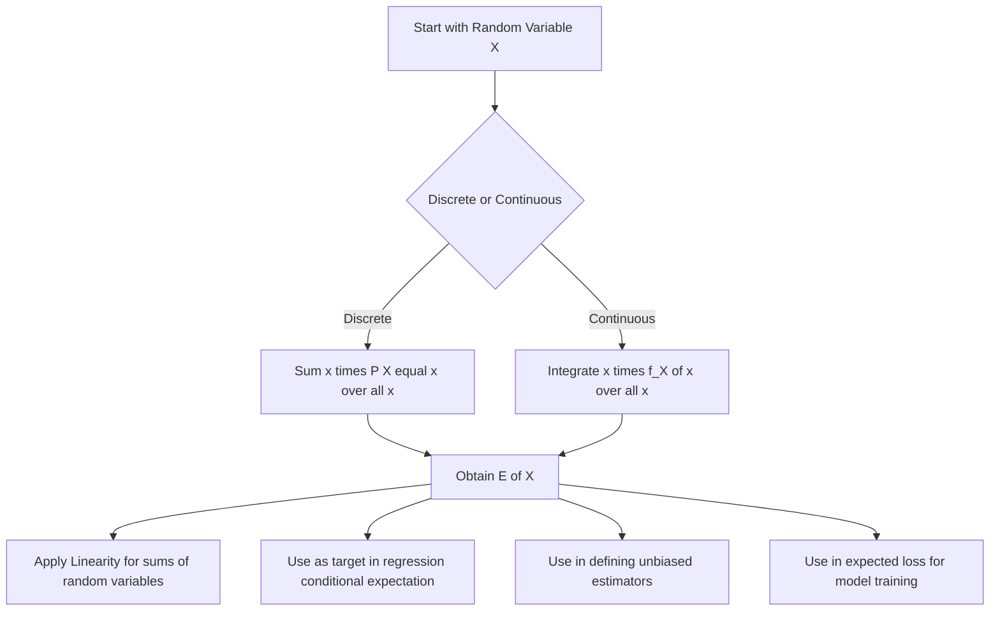

## Expected Value

### Definition

The expected value (or expectation) of a random variable is a weighted average of all possible values the variable can take, weighted by their probabilities. For a discrete random variable $X$ with probability mass function $P(X = x)$:

$$E[X] = \sum_x x \cdot P(X = x)$$

For a continuous random variable $X$ with probability density function $f_X(x)$:

$$E[X] = \int_{-\infty}^{\infty} x \cdot f_X(x) \, dx$$

### Intuition

The expected value represents the long-run average outcome if an experiment governed by the random variable were repeated an indefinitely large number of times. It is a single number summarizing the "center of mass" of a distribution, though it does not describe spread, shape, or other distributional properties on its own.

### Discrete Example

Consider a fair six-sided die, where $X$ represents the outcome of a roll. Each value $1$ through $6$ has probability $\frac{1}{6}$:

$$E[X] = \sum_{x=1}^{6} x \cdot \frac{1}{6} = \frac{1+2+3+4+5+6}{6} = \frac{21}{6} = 3.5$$

Note that $3.5$ is not a possible outcome of a single die roll — the expected value need not be a value the random variable can actually take.

### Continuous Example

Let $X \sim \text{Uniform}(0, 1)$, so $f_X(x) = 1$ for $0 \le x \le 1$:

$$E[X] = \int_0^1 x \cdot 1 \, dx = \left[\frac{x^2}{2}\right]_0^1 = \frac{1}{2}$$

This matches the general formula for a uniform distribution on $[a, b]$: $E[X] = \frac{a+b}{2}$.

### Expected Value of a Function of a Random Variable

Using the law of the unconscious statistician, the expected value of $g(X)$ can be computed without first deriving the distribution of $Y = g(X)$:

$$E[g(X)] = \sum_x g(x) \, P(X = x) \quad \text{(discrete)}$$
$$E[g(X)] = \int_{-\infty}^{\infty} g(x) \, f_X(x) \, dx \quad \text{(continuous)}$$

### Linearity of Expectation

For any random variables $X$ and $Y$, and constants $a$ and $b$:

$$E[aX + bY] = a\,E[X] + b\,E[Y]$$

This is [Inference] considered one of the most useful properties of expectation, because it holds regardless of whether $X$ and $Y$ are independent — a property not shared by variance or higher moments in general.

### Expected Value of Common Distributions

| Distribution | Expected Value |
|---|---|
| Bernoulli($p$) | $p$ |
| Binomial($n, p$) | $np$ |
| Poisson($\lambda$) | $\lambda$ |
| Uniform($a, b$) | $\frac{a+b}{2}$ |
| Normal($\mu, \sigma^2$) | $\mu$ |
| Exponential($\lambda$) | $\frac{1}{\lambda}$ |

These formulas are standard results derivable from the definition of expectation applied to each distribution's probability mass or density function.

### Existence of Expected Value

Not all distributions have a finite expected value. For a continuous random variable, $E[X]$ exists only if $\int_{-\infty}^{\infty} |x| f_X(x) \, dx < \infty$. The Cauchy distribution is a commonly cited example of a distribution whose expected value does not exist, because the relevant integral diverges. [Inference] This is a standard result in probability theory, though the specific divergence calculation is not derived here.

### Relevance to Machine Learning

- **Loss function minimization**: many machine learning objectives are framed as minimizing the expected value of a loss function over the data-generating distribution, i.e., $E[L(Y, \hat{Y})]$, though in practice this expectation is approximated using an empirical average over a finite training sample rather than computed exactly.
- **Bias of an estimator**: an estimator $\hat{\theta}$ is unbiased if $E[\hat{\theta}] = \theta$, where $\theta$ is the true parameter value. This concept underlies discussions of bias-variance tradeoff in model evaluation.
- **Expected reward in reinforcement learning**: policies are commonly evaluated and optimized based on the expected cumulative reward, $E\left[\sum_t \gamma^t r_t\right]$. [Unverified] The specific formulation, discount factor conventions, and optimization procedure vary across algorithms and implementations, and I do not have access to verify behavior of any particular unspecified system.
- **Conditional expectation in regression**: standard regression models estimate $E[Y \mid X]$, the conditional expectation of the target given the features, as the prediction target.
- **Expectation-Maximization algorithm**: this algorithm alternates between computing an expected value of a latent-variable log-likelihood (E-step) and maximizing it (M-step). [Unverified] The specific convergence behavior and performance of this algorithm depend on the particular model, initialization, and implementation, and I have not verified these details for any specific system here.

### Diagram: Expected Value as Center of Mass

<svg xmlns="http://www.w3.org/2000/svg" viewBox="0 0 640 300">
  <text x="320" y="25" text-anchor="middle" font-size="16" font-weight="bold" fill="#1a1a1a">Expected Value as Center of Mass (svg_diagram)</text>

  <line x1="60" y1="180" x2="580" y2="180" stroke="#333" stroke-width="1.5" />

  
  <rect x="90" y="150" width="30" height="30" fill="#2b6cb0" fill-opacity="0.6" />
  <text x="105" y="200" text-anchor="middle" font-size="11" fill="#333">1</text>

  <rect x="160" y="150" width="30" height="30" fill="#2b6cb0" fill-opacity="0.6" />
  <text x="175" y="200" text-anchor="middle" font-size="11" fill="#333">2</text>

  <rect x="230" y="150" width="30" height="30" fill="#2b6cb0" fill-opacity="0.6" />
  <text x="245" y="200" text-anchor="middle" font-size="11" fill="#333">3</text>

  <rect x="300" y="150" width="30" height="30" fill="#2b6cb0" fill-opacity="0.6" />
  <text x="315" y="200" text-anchor="middle" font-size="11" fill="#333">4</text>

  <rect x="370" y="150" width="30" height="30" fill="#2b6cb0" fill-opacity="0.6" />
  <text x="385" y="200" text-anchor="middle" font-size="11" fill="#333">5</text>

  <rect x="440" y="150" width="30" height="30" fill="#2b6cb0" fill-opacity="0.6" />
  <text x="455" y="200" text-anchor="middle" font-size="11" fill="#333">6</text>

  
  <polygon points="280,180 300,220 260,220" fill="#b45309" />
  <text x="280" y="240" text-anchor="middle" font-size="12" fill="#b45309">E[X] = 3.5</text>

  <text x="320" y="270" text-anchor="middle" font-size="11" fill="#555">Each outcome has equal weight (1/6); the balance point is the expected value</text>
</svg>

### Expected Value Computation Workflow

### Common Pitfalls

- Assuming the expected value must be a value the random variable can actually take — as shown in the die example, this is not required.
- Assuming every distribution has a finite expected value — distributions with sufficiently heavy tails, such as the Cauchy distribution, [Inference] do not have a defined expected value, based on standard divergence results in probability theory.
- Confusing $E[g(X)]$ with $g(E[X])$ for nonlinear $g$ — these are generally different, as governed by Jensen's inequality.
- Treating linearity of expectation as requiring independence between variables — [Inference] linearity holds regardless of dependence structure, based on the standard derivation of the property, though this specific point is not re-derived here.

**Related Topics**
- Variance and standard deviation
- Linearity of expectation and its proof
- Law of the unconscious statistician
- Moment generating functions
- Conditional expectation
- Bias-variance tradeoff in estimators