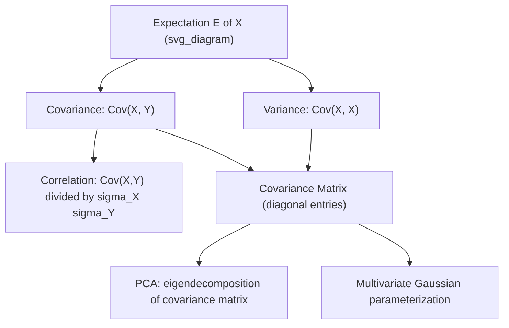

## Covariance

### Definition

Covariance measures the degree to which two random variables change together. For random variables $X$ and $Y$:

$$\text{Cov}(X, Y) = E[(X - E[X])(Y - E[Y])]$$

Expanding this gives the computational form:

$$\text{Cov}(X, Y) = E[XY] - E[X]E[Y]$$

### Interpretation

- **Positive covariance**: as $X$ increases, $Y$ tends to increase.
- **Negative covariance**: as $X$ increases, $Y$ tends to decrease.
- **Zero covariance**: no linear relationship on average. This does not imply independence — it only rules out linear dependence. Two variables can be uncorrelated (zero covariance) yet still statistically dependent through a nonlinear relationship.

### Key Properties

- $\text{Cov}(X, X) = \text{Var}(X)$
- $\text{Cov}(X, Y) = \text{Cov}(Y, X)$ (symmetric)
- $\text{Cov}(aX + b, cY + d) = ac \cdot \text{Cov}(X, Y)$ for constants $a, b, c, d$
- $\text{Cov}(X + Y, Z) = \text{Cov}(X, Z) + \text{Cov}(Y, Z)$ (bilinearity)
- If $X$ and $Y$ are independent, $\text{Cov}(X, Y) = 0$. The converse is not generally true.

### Sample Covariance

For a dataset with $n$ paired observations $(x_i, y_i)$:

$$\text{Cov}(X, Y) = \frac{1}{n-1} \sum_{i=1}^{n} (x_i - \bar{x})(y_i - \bar{y})$$

The $n-1$ denominator (Bessel's correction) is used for an unbiased estimator of population covariance when working from a sample. [Inference] The choice of $n$ vs $n-1$ is a standard convention in statistical estimation theory, consistent with the same correction used for sample variance.

### Covariance Matrix

For a random vector $\mathbf{X} = (X_1, X_2, \ldots, X_p)^T$, the covariance matrix $\Sigma$ is a $p \times p$ matrix where entry $(i, j)$ is $\text{Cov}(X_i, X_j)$:

$$\Sigma_{ij} = \text{Cov}(X_i, X_j)$$

Diagonal entries are variances ($\text{Cov}(X_i, X_i) = \text{Var}(X_i)$), and off-diagonal entries are pairwise covariances. This matrix is symmetric and positive semi-definite.

**Example**

For three features (height, weight, age), the covariance matrix has the structure:

$$\Sigma = \begin{pmatrix} \text{Var}(H) & \text{Cov}(H,W) & \text{Cov}(H,A) \\ \text{Cov}(W,H) & \text{Var}(W) & \text{Cov}(W,A) \\ \text{Cov}(A,H) & \text{Cov}(A,W) & \text{Var}(A) \end{pmatrix}$$

### Scale Dependence

Covariance is not scale-invariant. Its magnitude depends on the units of $X$ and $Y$, which makes raw covariance values hard to compare across variable pairs. This motivates correlation, which normalizes covariance by the standard deviations of both variables:

$$\rho(X, Y) = \frac{\text{Cov}(X, Y)}{\sigma_X \sigma_Y}$$

### Relevance to Machine Learning

- **Principal Component Analysis (PCA)**: relies on eigendecomposition of the covariance matrix to identify directions of maximum variance.
- **Multivariate Gaussian distributions**: parameterized directly by a mean vector and covariance matrix.
- **Feature engineering**: high covariance between features can indicate redundancy or multicollinearity, which affects some models (e.g., linear regression coefficient stability).
- **Portfolio optimization / risk modeling**: covariance between asset returns is used to model joint risk. [Unverified] Specific implementation practices vary by domain and application; this description is a general conceptual link, not a claim about any particular system's behavior.

### Visualization

<svg xmlns="http://www.w3.org/2000/svg" viewBox="0 0 640 420">
<text x="320" y="30" text-anchor="middle" font-size="18" font-weight="bold" fill="#1a1a1a">Covariance Patterns (svg_diagram)</text>

<g transform="translate(20,60)">
<text x="100" y="0" text-anchor="middle" font-size="14" font-weight="bold" fill="#1a1a1a">Positive Covariance</text>
<rect x="0" y="10" width="200" height="160" fill="none" stroke="#888" stroke-width="1" />
<line x1="0" y1="90" x2="200" y2="90" stroke="#ccc" stroke-width="1" />
<line x1="100" y1="10" x2="100" y2="170" stroke="#ccc" stroke-width="1" />
<circle cx="30" cy="150" r="4" fill="#2563eb" />
<circle cx="50" cy="130" r="4" fill="#2563eb" />
<circle cx="70" cy="120" r="4" fill="#2563eb" />
<circle cx="90" cy="100" r="4" fill="#2563eb" />
<circle cx="110" cy="90" r="4" fill="#2563eb" />
<circle cx="130" cy="70" r="4" fill="#2563eb" />
<circle cx="150" cy="55" r="4" fill="#2563eb" />
<circle cx="170" cy="35" r="4" fill="#2563eb" />
<line x1="20" y1="155" x2="180" y2="30" stroke="#2563eb" stroke-width="1" stroke-dasharray="4,3" opacity="0.5" />
</g>

<g transform="translate(240,60)">
<text x="100" y="0" text-anchor="middle" font-size="14" font-weight="bold" fill="#1a1a1a">Negative Covariance</text>
<rect x="0" y="10" width="200" height="160" fill="none" stroke="#888" stroke-width="1" />
<line x1="0" y1="90" x2="200" y2="90" stroke="#ccc" stroke-width="1" />
<line x1="100" y1="10" x2="100" y2="170" stroke="#ccc" stroke-width="1" />
<circle cx="30" cy="35" r="4" fill="#dc2626" />
<circle cx="50" cy="50" r="4" fill="#dc2626" />
<circle cx="70" cy="65" r="4" fill="#dc2626" />
<circle cx="90" cy="85" r="4" fill="#dc2626" />
<circle cx="110" cy="100" r="4" fill="#dc2626" />
<circle cx="130" cy="120" r="4" fill="#dc2626" />
<circle cx="150" cy="135" r="4" fill="#dc2626" />
<circle cx="170" cy="150" r="4" fill="#dc2626" />
<line x1="20" y1="30" x2="180" y2="155" stroke="#dc2626" stroke-width="1" stroke-dasharray="4,3" opacity="0.5" />
</g>

<g transform="translate(460,60)">
<text x="100" y="0" text-anchor="middle" font-size="14" font-weight="bold" fill="#1a1a1a">Near-Zero Covariance</text>
<rect x="0" y="10" width="160" height="160" fill="none" stroke="#888" stroke-width="1" />
<line x1="0" y1="90" x2="160" y2="90" stroke="#ccc" stroke-width="1" />
<line x1="80" y1="10" x2="80" y2="170" stroke="#ccc" stroke-width="1" />
<circle cx="25" cy="40" r="4" fill="#16a34a" />
<circle cx="140" cy="60" r="4" fill="#16a34a" />
<circle cx="60" cy="150" r="4" fill="#16a34a" />
<circle cx="110" cy="150" r="4" fill="#16a34a" />
<circle cx="30" cy="120" r="4" fill="#16a34a" />
<circle cx="130" cy="30" r="4" fill="#16a34a" />
<circle cx="80" cy="80" r="4" fill="#16a34a" />
<circle cx="20" cy="70" r="4" fill="#16a34a" />
</g>

<text x="320" y="255" text-anchor="middle" font-size="13" fill="#444">X-axis and Y-axis represent two random variables; each point is one observation.</text>

<g transform="translate(60,290)">
<rect x="0" y="0" width="520" height="110" fill="#f5f5f5" stroke="#ccc" stroke-width="1" rx="6" />
<text x="20" y="25" font-size="13" font-weight="bold" fill="#1a1a1a">Reading the patterns:</text>
<text x="20" y="48" font-size="12" fill="#333">Positive: points trend upward together (both increase jointly)</text>
<text x="20" y="68" font-size="12" fill="#333">Negative: points trend inversely (one increases as other decreases)</text>
<text x="20" y="88" font-size="12" fill="#333">Zero/near-zero: no consistent linear trend visible in the scatter</text>
</g>
</svg>

### Relationship to Variance and Correlation

**Related Topics**

- Correlation coefficient (Pearson, Spearman)
- Covariance matrix and eigendecomposition
- Principal Component Analysis (PCA)
- Multivariate Gaussian distribution
- Positive semi-definiteness of covariance matrices
- Multicollinearity in regression