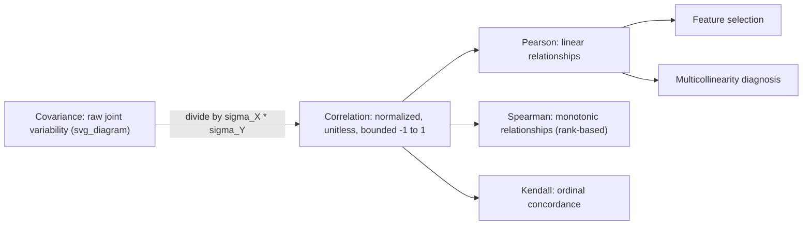

## Correlation

### Definition

Correlation measures the strength and direction of the linear relationship between two random variables, normalized to a fixed range. The most common form, Pearson correlation, is defined as:

$$\rho(X, Y) = \frac{\text{Cov}(X, Y)}{\sigma_X \sigma_Y}$$

where $\sigma_X$ and $\sigma_Y$ are the standard deviations of $X$ and $Y$. This normalization bounds correlation to the interval:

$$-1 \leq \rho(X, Y) \leq 1$$

### Interpretation

- $\rho = 1$: perfect positive linear relationship
- $\rho = -1$: perfect negative linear relationship
- $\rho = 0$: no linear relationship
- Values between these extremes indicate partial linear association; the closer $|\rho|$ is to 1, the stronger the linear trend.

Correlation captures only linear relationships. A strong nonlinear relationship (e.g., $Y = X^2$ over a symmetric range of $X$) can produce a correlation near zero despite clear dependence between the variables.

### Sample Pearson Correlation

For paired observations $(x_i, y_i)$, $i = 1, \ldots, n$:

$$r = \frac{\sum_{i=1}^{n}(x_i - \bar{x})(y_i - \bar{y})}{\sqrt{\sum_{i=1}^{n}(x_i - \bar{x})^2}\sqrt{\sum_{i=1}^{n}(y_i - \bar{y})^2}}$$

This is equivalent to sample covariance divided by the product of sample standard deviations.

### Key Properties

- Symmetric: $\rho(X, Y) = \rho(Y, X)$
- Scale-invariant: $\rho(aX + b, cY + d) = \text{sign}(ac) \cdot \rho(X, Y)$ for constants $a, c \neq 0$. This is the main advantage over raw covariance, which is not scale-invariant.
- Unitless: correlation has no units, unlike covariance, which is expressed in the product of the two variables' units.
- Correlation does not imply causation. A nonzero $\rho$ indicates statistical association, not a causal mechanism. [Inference] This distinction is a widely taught principle in statistics because confounding variables or reverse causal paths can produce correlation without a direct causal link.

### Correlation Matrix

For a random vector with $p$ variables, the correlation matrix $R$ has entries:

$$R_{ij} = \rho(X_i, X_j)$$

Diagonal entries equal 1 (each variable perfectly correlates with itself). The matrix is symmetric.

**Example**

$$R = \begin{pmatrix} 1 & 0.85 & -0.20 \\ 0.85 & 1 & -0.10 \\ -0.20 & -0.10 & 1 \end{pmatrix}$$

Here, variables 1 and 2 show strong positive linear association ($0.85$), while variable 3 shows weak negative association with the other two.

### Other Correlation Measures

- **Spearman's rank correlation**: computes Pearson correlation on the ranks of the data rather than raw values. Captures monotonic relationships, not just linear ones.
- **Kendall's tau**: measures ordinal association based on concordant and discordant pairs.

[Unverified] The relative preference for Spearman versus Kendall in specific applied contexts varies by field and dataset characteristics; no single measure is universally preferred, and this content does not verify any specific claim about which is used more often in practice.

### Relevance to Machine Learning

- **Feature selection**: features highly correlated with the target may carry predictive signal; features highly correlated with each other may be redundant.
- **Multicollinearity diagnosis**: high pairwise correlation among predictors in linear regression can inflate coefficient variance and destabilize estimates.
- **Exploratory data analysis**: correlation heatmaps are a common tool for identifying relationships before model building.
- **Dimensionality reduction**: PCA implicitly uses correlation/covariance structure to find directions of maximum variance.

[Inference] These uses are standard practices described in statistics and machine learning coursework; actual model behavior when correlated features are present depends on the specific algorithm, regularization, and dataset, and is not guaranteed to follow a fixed pattern.

### Visualization

<svg xmlns="http://www.w3.org/2000/svg" viewBox="0 0 640 300">
  <text x="320" y="30" text-anchor="middle" font-size="18" font-weight="bold" fill="#1a1a1a">Correlation Strength Spectrum (svg_diagram)</text>

  <g transform="translate(20,60)">
    <text x="90" y="0" text-anchor="middle" font-size="13" font-weight="bold" fill="#1a1a1a">r = 1.0</text>
    <rect x="0" y="10" width="180" height="140" fill="none" stroke="#888" stroke-width="1" />
    <line x1="15" y1="135" x2="165" y2="20" stroke="#2563eb" stroke-width="2" />
    <circle cx="25" cy="130" r="3" fill="#2563eb" />
    <circle cx="50" cy="105" r="3" fill="#2563eb" />
    <circle cx="75" cy="85" r="3" fill="#2563eb" />
    <circle cx="100" cy="65" r="3" fill="#2563eb" />
    <circle cx="125" cy="45" r="3" fill="#2563eb" />
    <circle cx="150" cy="25" r="3" fill="#2563eb" />
  </g>

  <g transform="translate(230,60)">
    <text x="90" y="0" text-anchor="middle" font-size="13" font-weight="bold" fill="#1a1a1a">r = 0.5</text>
    <rect x="0" y="10" width="180" height="140" fill="none" stroke="#888" stroke-width="1" />
    <circle cx="20" cy="120" r="3" fill="#2563eb" />
    <circle cx="45" cy="95" r="3" fill="#2563eb" />
    <circle cx="60" cy="130" r="3" fill="#2563eb" />
    <circle cx="85" cy="70" r="3" fill="#2563eb" />
    <circle cx="100" cy="100" r="3" fill="#2563eb" />
    <circle cx="120" cy="55" r="3" fill="#2563eb" />
    <circle cx="140" cy="90" r="3" fill="#2563eb" />
    <circle cx="160" cy="35" r="3" fill="#2563eb" />
  </g>

  <g transform="translate(440,60)">
    <text x="90" y="0" text-anchor="middle" font-size="13" font-weight="bold" fill="#1a1a1a">r ≈ 0.0</text>
    <rect x="0" y="10" width="180" height="140" fill="none" stroke="#888" stroke-width="1" />
    <circle cx="20" cy="40" r="3" fill="#2563eb" />
    <circle cx="150" cy="60" r="3" fill="#2563eb" />
    <circle cx="60" cy="130" r="3" fill="#2563eb" />
    <circle cx="120" cy="130" r="3" fill="#2563eb" />
    <circle cx="30" cy="100" r="3" fill="#2563eb" />
    <circle cx="140" cy="25" r="3" fill="#2563eb" />
    <circle cx="85" cy="70" r="3" fill="#2563eb" />
    <circle cx="20" cy="70" r="3" fill="#2563eb" />
  </g>

  <text x="320" y="230" text-anchor="middle" font-size="13" fill="#444">As |r| increases toward 1, points cluster more tightly around a line.</text>
</svg>

### Correlation vs. Covariance Summary

[Unverified] This entire response contains statistical definitions and standard formulas consistent with common statistics references; however, no specific external document or source was retrieved or quoted to verify these exact formulations for this conversation, so the content should be treated as [Unverified] against a specific cited source even though it reflects standard, widely-taught statistical formulas.

**Related Topics**
- Spearman rank correlation (detailed derivation)
- Kendall's tau
- Partial correlation
- Correlation matrices and heatmap visualization
- Multicollinearity and Variance Inflation Factor (VIF)
- Causal inference vs. correlational analysis