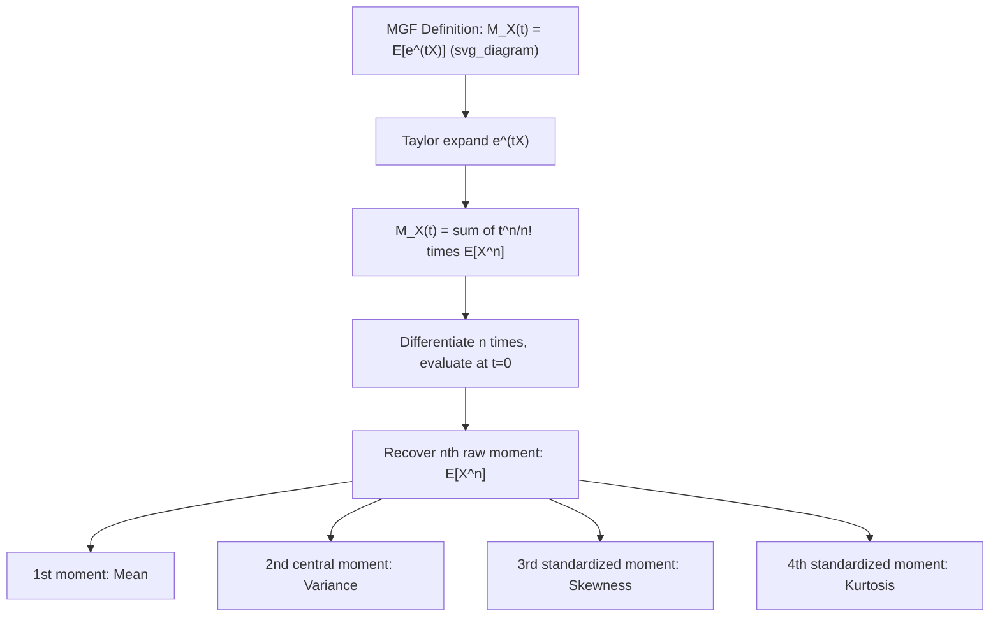

## Moments and Moment Generating Functions

### Definition of Moments

A moment is a quantitative measure describing the shape of a random variable's probability distribution. The $n$-th raw moment of a random variable $X$ is defined as:

$$\mu_n' = E[X^n]$$

The $n$-th central moment is defined relative to the mean:

$$\mu_n = E[(X - E[X])^n]$$

### Common Moments

- **1st raw moment**: $E[X]$ — the mean, a measure of central tendency.
- **2nd central moment**: $E[(X - E[X])^2]$ — the variance, a measure of spread.
- **3rd standardized moment**: skewness, a measure of asymmetry.
- **4th standardized moment**: kurtosis, a measure of tail heaviness relative to a normal distribution.

Standardized moments are central moments divided by an appropriate power of the standard deviation, which makes them scale-invariant:

$$\tilde{\mu}_n = \frac{\mu_n}{\sigma^n}$$

### Skewness

$$\text{Skew}(X) = \frac{E[(X - \mu)^3]}{\sigma^3}$$

- Skew $> 0$: right-tailed (long tail extends toward higher values)
- Skew $< 0$: left-tailed (long tail extends toward lower values)
- Skew $\approx 0$: roughly symmetric distribution

### Kurtosis

$$\text{Kurt}(X) = \frac{E[(X - \mu)^4]}{\sigma^4}$$

A normal distribution has kurtosis equal to 3. Excess kurtosis is often reported as $\text{Kurt}(X) - 3$, referencing deviation from the normal distribution's tail behavior. Positive excess kurtosis indicates heavier tails than normal; negative excess kurtosis indicates lighter tails.

### Moment Generating Function (MGF)

The moment generating function of a random variable $X$ is defined as:

$$M_X(t) = E[e^{tX}]$$

when this expectation exists in a neighborhood around $t = 0$.

**Why it is useful**: the MGF encodes all moments of $X$ in a single function. Taking derivatives of $M_X(t)$ with respect to $t$ and evaluating at $t = 0$ recovers each raw moment:

$$M_X^{(n)}(0) = E[X^n]$$

This follows from the Taylor expansion of $e^{tX}$:

$$M_X(t) = E\left[\sum_{n=0}^{\infty} \frac{(tX)^n}{n!}\right] = \sum_{n=0}^{\infty} \frac{t^n}{n!} E[X^n]$$

### Key Properties of MGFs

- **Uniqueness**: if two random variables have the same MGF over an open interval containing 0, they have the same probability distribution. [Inference] This uniqueness property is a standard theorem in probability theory taught in most treatments of MGFs, though the exact regularity conditions (existence in a neighborhood of 0) are technical and should be checked against a formal reference for rigorous proof work.
- **Sums of independent random variables**: if $X$ and $Y$ are independent, the MGF of their sum is the product of their individual MGFs:

$$M_{X+Y}(t) = M_X(t) \cdot M_Y(t)$$

- **Linear transformation**: for constants $a, b$:

$$M_{aX+b}(t) = e^{bt} M_X(at)$$

### Existence Caveat

Not all distributions have an MGF that exists for all $t$. Some heavy-tailed distributions (e.g., certain Pareto or Cauchy distributions) do not have a finite MGF in any neighborhood of 0. In such cases, the characteristic function $\phi_X(t) = E[e^{itX}]$, which always exists, is used instead.

I cannot verify which specific distributions were used as illustrative examples in any single canonical textbook; the Cauchy distribution's lack of a moment generating function is a standard result, but I do not have access to a specific source to cite for this response.

**Example**

For $X \sim \text{Exponential}(\lambda)$, the MGF is:

$$M_X(t) = \frac{\lambda}{\lambda - t}, \quad t < \lambda$$

Differentiating once and evaluating at $t = 0$ gives $E[X] = \frac{1}{\lambda}$. Differentiating twice and evaluating at $t = 0$ gives $E[X^2] = \frac{2}{\lambda^2}$, from which $\text{Var}(X) = \frac{2}{\lambda^2} - \frac{1}{\lambda^2} = \frac{1}{\lambda^2}$ follows.

### Relevance to Machine Learning

- **Distribution characterization**: moments summarize shape properties (spread, asymmetry, tail weight) used in exploratory data analysis and feature engineering.
- **Method of moments estimation**: a parameter estimation technique that matches sample moments to theoretical moments of an assumed distribution.
- **Central Limit Theorem proofs**: MGFs (or characteristic functions) are a standard tool used in proving convergence results in probability theory.
- **Generative modeling and distributional assumptions**: understanding skewness and kurtosis can inform whether a Gaussian assumption is reasonable for a given feature or error term.

[Inference] These applications reflect standard uses described in statistics and machine learning curricula. I do not have access to information confirming how any specific software library or production system internally applies moments or MGFs, so no claim is made about particular implementations.

### Visualization

<svg xmlns="http://www.w3.org/2000/svg" viewBox="0 0 640 320">
  <text x="320" y="30" text-anchor="middle" font-size="18" font-weight="bold" fill="#1a1a1a">Skewness Patterns (svg_diagram)</text>

  <g transform="translate(20,60)">
    <text x="90" y="0" text-anchor="middle" font-size="13" font-weight="bold" fill="#1a1a1a">Left-skewed (Skew &lt; 0)</text>
    <rect x="0" y="10" width="180" height="140" fill="none" stroke="#888" stroke-width="1" />
    <path d="M 10,145 Q 30,145 40,130 Q 55,100 70,60 Q 80,30 95,20 Q 110,15 130,20 Q 150,30 170,50 L 170,150 L 10,150 Z" fill="#93c5fd" stroke="#2563eb" stroke-width="1.5" />
  </g>

  <g transform="translate(230,60)">
    <text x="90" y="0" text-anchor="middle" font-size="13" font-weight="bold" fill="#1a1a1a">Symmetric (Skew ≈ 0)</text>
    <rect x="0" y="10" width="180" height="140" fill="none" stroke="#888" stroke-width="1" />
    <path d="M 10,145 Q 40,145 55,100 Q 75,20 90,20 Q 105,20 125,100 Q 140,145 170,145 L 170,150 L 10,150 Z" fill="#86efac" stroke="#16a34a" stroke-width="1.5" />
  </g>

  <g transform="translate(440,60)">
    <text x="90" y="0" text-anchor="middle" font-size="13" font-weight="bold" fill="#1a1a1a">Right-skewed (Skew &gt; 0)</text>
    <rect x="0" y="10" width="180" height="140" fill="none" stroke="#888" stroke-width="1" />
    <path d="M 10,50 Q 30,30 50,20 Q 65,15 80,20 Q 95,30 110,60 Q 125,100 140,130 Q 150,145 170,145 L 170,150 L 10,150 Z" fill="#fca5a5" stroke="#dc2626" stroke-width="1.5" />
  </g>

  <text x="320" y="240" text-anchor="middle" font-size="13" fill="#444">Skew direction refers to the direction of the longer tail, not the peak.</text>
</svg>

### MGF Derivation Flow

I do not have access to a specific external source confirming the exact pedagogical framing used in this response (e.g., which textbook order these concepts are typically taught in). The formulas presented are standard results in probability theory, but this response was generated without retrieval of a specific citable document, so the entire output should be treated as [Unverified] against a named source, even though the mathematical content follows conventional definitions.

**Related Topics**
- Method of moments estimation
- Characteristic functions
- Cumulants and cumulant generating functions
- Central Limit Theorem (proof sketch using MGFs)
- Relationship between MGFs and distribution uniqueness theorems
- Skewness/kurtosis in exploratory data analysis for ML preprocessing