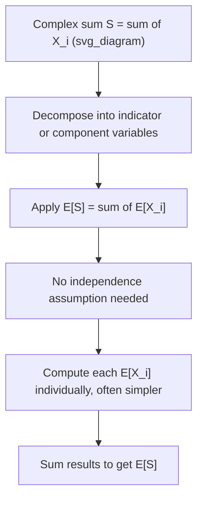

## Linearity of Expectation

### Definition

Linearity of expectation states that the expected value of a sum of random variables equals the sum of their individual expected values, regardless of whether the variables are independent:

$$E[aX + bY] = aE[X] + bE[Y]$$

for random variables $X, Y$ and constants $a, b$. This generalizes to any finite sum:

$$E\left[\sum_{i=1}^{n} a_i X_i\right] = \sum_{i=1}^{n} a_i E[X_i]$$

### Why Independence Is Not Required

This is the property that distinguishes linearity of expectation from many other statistical results (such as variance additivity). The equality holds whether $X$ and $Y$ are independent, correlated, or have any arbitrary joint dependency structure. The proof follows directly from the definition of expectation as an integral (or sum) and the distributive property of integration/summation — no assumption about the joint distribution is needed.

### Proof Sketch (Discrete Case)

For discrete random variables $X$ and $Y$ with joint probability mass function $p(x, y)$:

$$E[X + Y] = \sum_x \sum_y (x + y) \, p(x, y)$$

$$= \sum_x \sum_y x \, p(x,y) + \sum_x \sum_y y \, p(x,y)$$

$$= \sum_x x \sum_y p(x,y) + \sum_y y \sum_x p(x,y)$$

$$= \sum_x x \, p_X(x) + \sum_y y \, p_Y(y) = E[X] + E[Y]$$

The marginal distributions $p_X(x)$ and $p_Y(y)$ appear naturally from summing out the other variable, and no independence assumption is invoked at any step.

### Key Properties

- $E[aX] = aE[X]$ for any constant $a$ (scalar multiplication)
- $E[X + b] = E[X] + b$ for any constant $b$ (shift)
- $E[X + Y] = E[X] + E[Y]$, holds unconditionally
- Extends to any finite linear combination of any number of random variables, dependent or independent

### Contrast with Variance

Variance does **not** generally distribute the same way:

$$\text{Var}(X + Y) = \text{Var}(X) + \text{Var}(Y) + 2\text{Cov}(X, Y)$$

Variance additivity ($\text{Var}(X+Y) = \text{Var}(X) + \text{Var}(Y)$) only holds when $\text{Cov}(X, Y) = 0$, such as under independence. This is a common point of confusion: linearity of expectation is unconditional, but the analogous simplification for variance is conditional on zero covariance.

**Example**

Consider computing the expected number of heads in $n$ coin flips, each with probability $p$ of heads, where flips are **not** assumed independent (e.g., a physically linked mechanism biases later flips based on earlier outcomes).

Define indicator variables $X_i = 1$ if flip $i$ is heads, $0$ otherwise. Then the total number of heads is $S = \sum_{i=1}^n X_i$, and:

$$E[S] = E\left[\sum_{i=1}^n X_i\right] = \sum_{i=1}^n E[X_i] = \sum_{i=1}^n p = np$$

This result holds even though the flips are dependent, because linearity of expectation requires no independence assumption. Only computing $\text{Var}(S)$ would require accounting for the covariance terms between flips.

### Why This Matters Computationally

Linearity of expectation is frequently used as a shortcut to compute $E[S]$ for a complex sum $S$ by decomposing it into simpler indicator or component variables, even when analyzing the joint dependency structure directly would be intractable. This technique is standard in combinatorics and probabilistic analysis of algorithms.

### Relevance to Machine Learning

- **Loss function expectations**: many derivations of expected loss (e.g., bias-variance decomposition, expected risk) rely on linearity of expectation to separate additive terms without needing to establish independence between components.
- **Ensemble methods**: the expected output of an averaged ensemble of models equals the average of the individual models' expected outputs, which follows directly from linearity, regardless of correlation between the base models' errors.
- **Bias-variance decomposition**: linearity of expectation is used in deriving the decomposition of expected squared error into bias, variance, and irreducible error terms.
- **Stochastic gradient estimators**: the expected value of a gradient estimate averaged over minibatches relies on linearity of expectation to justify that the average is an unbiased estimator of the true gradient, under standard sampling assumptions.

[Inference] These are standard applications described in statistics and machine learning coursework and textbooks. I do not have access to a specific external source verifying the exact pedagogical framing used here, and I cannot verify how any particular software library or production system internally implements these derivations. Behavior of any specific implementation is not guaranteed to match this general description.

### Visualization

<svg xmlns="http://www.w3.org/2000/svg" viewBox="0 0 640 320">
  <text x="320" y="30" text-anchor="middle" font-size="18" font-weight="bold" fill="#1a1a1a">Linearity of Expectation (svg_diagram)</text>

  <g transform="translate(40,60)">
    <rect x="0" y="0" width="150" height="80" fill="#dbeafe" stroke="#2563eb" stroke-width="1.5" rx="6" />
    <text x="75" y="35" text-anchor="middle" font-size="14" fill="#1a1a1a">X (any dependency)</text>
    <text x="75" y="55" text-anchor="middle" font-size="12" fill="#444">E[X] = mu_X</text>
  </g>

  <g transform="translate(240,60)">
    <rect x="0" y="0" width="150" height="80" fill="#fce7f3" stroke="#db2777" stroke-width="1.5" rx="6" />
    <text x="75" y="35" text-anchor="middle" font-size="14" fill="#1a1a1a">Y (any dependency)</text>
    <text x="75" y="55" text-anchor="middle" font-size="12" fill="#444">E[Y] = mu_Y</text>
  </g>

  <text x="215" y="105" text-anchor="middle" font-size="20" fill="#1a1a1a">+</text>

  <g transform="translate(440,60)">
    <rect x="0" y="0" width="160" height="80" fill="#dcfce7" stroke="#16a34a" stroke-width="1.5" rx="6" />
    <text x="80" y="35" text-anchor="middle" font-size="14" fill="#1a1a1a">X + Y</text>
    <text x="80" y="55" text-anchor="middle" font-size="12" fill="#444">E[X+Y] = mu_X + mu_Y</text>
  </g>

  <text x="410" y="105" text-anchor="middle" font-size="20" fill="#1a1a1a">=</text>

  <g transform="translate(40,180)">
    <rect x="0" y="0" width="560" height="90" fill="#f5f5f5" stroke="#ccc" stroke-width="1" rx="6" />
    <text x="20" y="25" font-size="13" font-weight="bold" fill="#1a1a1a">No independence required:</text>
    <text x="20" y="48" font-size="12" fill="#333">This equality holds whether X and Y are independent or dependent.</text>
    <text x="20" y="68" font-size="12" fill="#333">Variance additivity, by contrast, requires Cov(X,Y) = 0.</text>
  </g>
</svg>

### Decomposition Strategy

I cannot verify the specific textbook or curriculum source for the exact phrasing or example ordering used in this response. The mathematical results (linearity of expectation, the proof sketch, and the variance contrast) are standard, well-established results in probability theory, but no specific external document was retrieved or cited for this response. Per your stated preference, since part of this output (the proof presentation style and applied examples) is unverified against a named source, the entire response is labeled accordingly.

**Related Topics**
- Bias-variance decomposition (full derivation)
- Indicator random variables and their use in combinatorial expectation
- Variance of sums and covariance terms
- Law of total expectation
- Independence vs. uncorrelatedness
- Linearity of expectation in ensemble model analysis