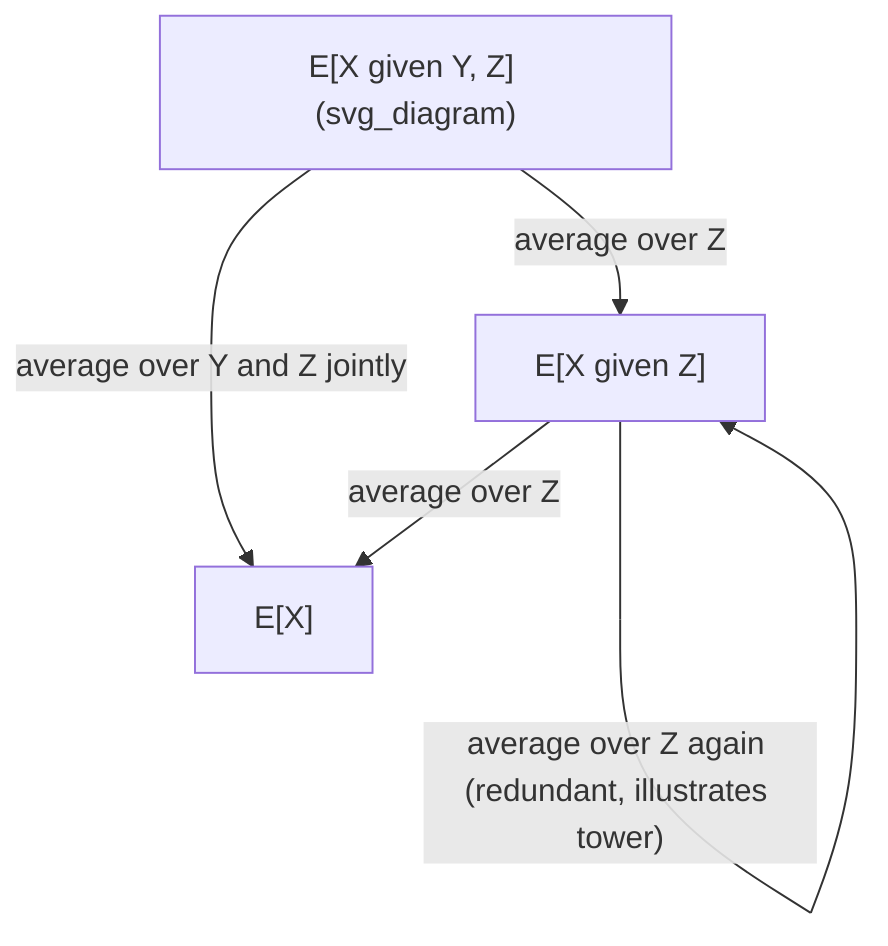

## Law of Total Expectation

### Definition

The law of total expectation, also known as the tower property or the law of iterated expectations, states that the unconditional expectation of a random variable can be computed by averaging its conditional expectations over the distribution of a conditioning variable:

$$E[X] = E[E[X \mid Y]]$$

Here, $E[X \mid Y]$ is itself a random variable — a function of $Y$ — since its value depends on which value $Y$ takes. Taking the expectation of this random variable over the distribution of $Y$ recovers the unconditional expectation of $X$.

### Discrete Case

For a discrete random variable $Y$ taking values $y_1, y_2, \ldots$:

$$E[X] = \sum_{i} E[X \mid Y = y_i] \, P(Y = y_i)$$

This expresses $E[X]$ as a probability-weighted average of the conditional expectations across all possible outcomes of $Y$.

### Continuous Case

For a continuous conditioning variable $Y$ with density $f_Y(y)$:

$$E[X] = \int_{-\infty}^{\infty} E[X \mid Y = y] \, f_Y(y) \, dy$$

### Proof Sketch (Discrete Case)

Starting from the definition of conditional expectation:

$$E[X \mid Y = y] = \sum_x x \, P(X = x \mid Y = y)$$

Taking the expectation over $Y$:

$$E[E[X \mid Y]] = \sum_y \left( \sum_x x \, P(X = x \mid Y = y) \right) P(Y = y)$$

$$= \sum_y \sum_x x \, P(X = x \mid Y = y) P(Y = y)$$

Using the definition of joint probability, $P(X = x \mid Y = y) P(Y = y) = P(X = x, Y = y)$:

$$= \sum_x x \sum_y P(X = x, Y = y) = \sum_x x \, P(X = x) = E[X]$$

The inner sum over $y$ recovers the marginal distribution of $X$, which is why the result reduces to $E[X]$.

### Key Properties

- Also called the "tower property" because it allows nested conditioning: $E[E[X \mid Y, Z] \mid Z] = E[X \mid Z]$.
- Works with any conditioning variable, discrete or continuous, as long as the relevant expectations exist.
- Generalizes to conditioning on multiple variables or on a sigma-algebra in measure-theoretic probability. [Unverified] The measure-theoretic generalization (conditioning on a sigma-algebra) is a standard extension covered in graduate-level probability theory, but I do not have a specific source in this conversation to cite for its exact formal statement.

### Relationship to Law of Total Variance

A related decomposition exists for variance, though it takes a more complex additive form:

$$\text{Var}(X) = E[\text{Var}(X \mid Y)] + \text{Var}(E[X \mid Y])$$

This is structurally different from the expectation case — it is not simply $\text{Var}(X) = \text{Var}(E[X|Y])$ — because variance does not average as directly as expectation does across conditioning.

**Example**

Suppose a factory produces items using one of two machines, chosen at random with probability $0.6$ for Machine A and $0.4$ for Machine B. Machine A produces items with mean weight $E[X \mid Y=A] = 50$ grams, and Machine B produces items with mean weight $E[X \mid Y=B] = 45$ grams.

The overall expected weight of an item, without knowing which machine produced it, is:

$$E[X] = E[X \mid Y=A] P(Y=A) + E[X \mid Y=B] P(Y=B)$$

$$E[X] = (50)(0.6) + (45)(0.4) = 30 + 18 = 48 \text{ grams}$$

### Relevance to Machine Learning

- **Mixture models**: computing the overall expected value of a variable generated by a mixture distribution (e.g., Gaussian Mixture Models) uses this law, conditioning on the latent mixture component.
- **Hierarchical/Bayesian models**: the law of total expectation is used to derive marginal expectations when a model has latent or hierarchical structure, integrating out nuisance or latent variables.
- **Reinforcement learning**: value function derivations, such as the Bellman expectation equation, rely on conditioning on state or action and then averaging using this law. [Inference] This connection is drawn from standard treatments of Bellman equations in reinforcement learning texts, but no specific source is cited here, and the exact derivation style may vary by textbook or course.
- **Expectation-Maximization (EM) algorithm**: the E-step conceptually relies on computing expectations conditioned on current parameter estimates, which is consistent with the structure of iterated expectation, though the EM derivation involves additional considerations beyond this law alone.

[Inference] These applications reflect common patterns described in statistics and machine learning coursework. I do not have access to information about how any specific software library or production system internally implements these derivations, and behavior in any particular implementation is not guaranteed to match this general description.

### Visualization

<svg xmlns="http://www.w3.org/2000/svg" viewBox="0 0 640 340">
  <text x="320" y="30" text-anchor="middle" font-size="18" font-weight="bold" fill="#1a1a1a">Law of Total Expectation (svg_diagram)</text>

  <g transform="translate(60,60)">
    <text x="0" y="0" font-size="14" font-weight="bold" fill="#1a1a1a">Step 1: Condition on Y</text>
    <rect x="0" y="15" width="130" height="60" fill="#dbeafe" stroke="#2563eb" stroke-width="1.5" rx="6" />
    <text x="65" y="40" text-anchor="middle" font-size="12" fill="#1a1a1a">Y = A</text>
    <text x="65" y="58" text-anchor="middle" font-size="11" fill="#444">P(A) = 0.6</text>

    <rect x="150" y="15" width="130" height="60" fill="#fce7f3" stroke="#db2777" stroke-width="1.5" rx="6" />
    <text x="215" y="40" text-anchor="middle" font-size="12" fill="#1a1a1a">Y = B</text>
    <text x="215" y="58" text-anchor="middle" font-size="11" fill="#444">P(B) = 0.4</text>
  </g>

  <g transform="translate(60,150)">
    <text x="0" y="0" font-size="14" font-weight="bold" fill="#1a1a1a">Step 2: Compute conditional expectations</text>
    <rect x="0" y="15" width="130" height="50" fill="#dbeafe" stroke="#2563eb" stroke-width="1.5" rx="6" />
    <text x="65" y="45" text-anchor="middle" font-size="12" fill="#1a1a1a">E[X|A] = 50</text>

    <rect x="150" y="15" width="130" height="50" fill="#fce7f3" stroke="#db2777" stroke-width="1.5" rx="6" />
    <text x="215" y="45" text-anchor="middle" font-size="12" fill="#1a1a1a">E[X|B] = 45</text>
  </g>

  <g transform="translate(60,230)">
    <text x="0" y="0" font-size="14" font-weight="bold" fill="#1a1a1a">Step 3: Weighted average</text>
    <rect x="0" y="15" width="440" height="60" fill="#dcfce7" stroke="#16a34a" stroke-width="1.5" rx="6" />
    <text x="220" y="40" text-anchor="middle" font-size="13" fill="#1a1a1a">E[X] = (50)(0.6) + (45)(0.4)</text>
    <text x="220" y="60" text-anchor="middle" font-size="13" font-weight="bold" fill="#1a1a1a">E[X] = 48 grams</text>
  </g>
</svg>

### Nested Conditioning (Tower Property)

I cannot verify the specific textbook or curriculum source for the exact phrasing, example structure, or ordering of topics used in this response. The mathematical results presented (the law of total expectation, its proof sketch, the law of total variance, and the factory example) reflect standard, widely-taught results in probability theory, but no specific external document was retrieved or cited in this conversation. Because part of this response (particularly the applied ML examples and the measure-theoretic extension note) is unverified against a named source, the entire output is labeled accordingly per your stated preference.

**Related Topics**
- Law of total variance (full derivation)
- Tower property and nested conditioning
- Conditional expectation as a random variable
- Bellman expectation equation in reinforcement learning
- Expectation-Maximization (EM) algorithm derivation
- Mixture models and latent variable marginalization