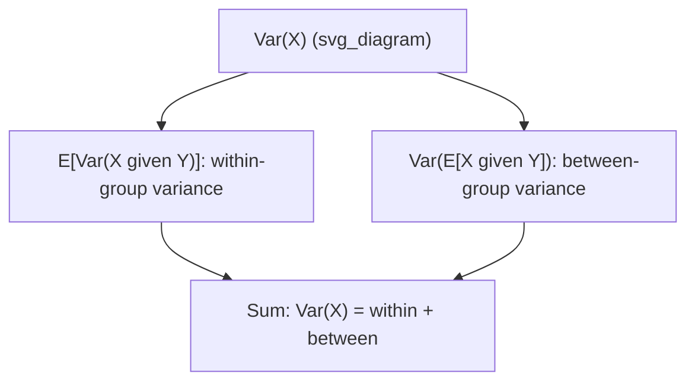

## Law of Total Variance

### Definition

The law of total variance, also called the variance decomposition formula or Eve's law, decomposes the total variance of a random variable $X$ into two components based on a conditioning variable $Y$:

$$\text{Var}(X) = E[\text{Var}(X \mid Y)] + \text{Var}(E[X \mid Y])$$

The first term is the **expected conditional variance** — the average amount of variability in $X$ that remains within each group defined by $Y$. The second term is the **variance of conditional expectations** — the variability in $X$ that comes from differences between group means.

### Interpretation of Each Term

- $E[\text{Var}(X \mid Y)]$: often called the "within-group" variance. This measures, on average, how spread out $X$ is inside each fixed value of $Y$.
- $\text{Var}(E[X \mid Y])$: often called the "between-group" variance. This measures how much the conditional means $E[X \mid Y=y]$ vary as $y$ changes.

[Inference] These "within-group" and "between-group" labels are common descriptive terms used in statistics coursework to build intuition for this decomposition, though the formal definition of the law itself does not require this terminology.

### Proof Sketch

Starting from the identity $\text{Var}(X) = E[X^2] - (E[X])^2$, and using the law of total expectation on $E[X^2]$:

$$E[X^2] = E[E[X^2 \mid Y]]$$

Using the definition of conditional variance, $\text{Var}(X \mid Y) = E[X^2 \mid Y] - (E[X \mid Y])^2$, so:

$$E[X^2 \mid Y] = \text{Var}(X \mid Y) + (E[X \mid Y])^2$$

Substituting back:

$$E[X^2] = E[\text{Var}(X \mid Y)] + E[(E[X \mid Y])^2]$$

Now apply the identity $\text{Var}(E[X\mid Y]) = E[(E[X\mid Y])^2] - (E[E[X\mid Y]])^2$, and note $E[E[X \mid Y]] = E[X]$ by the law of total expectation. Substituting and simplifying:

$$\text{Var}(X) = E[X^2] - (E[X])^2 = E[\text{Var}(X\mid Y)] + \text{Var}(E[X\mid Y])$$

### Key Properties

- Both terms on the right-hand side are non-negative, since variance is always non-negative.
- This decomposition holds for any conditioning variable $Y$, discrete or continuous, as long as the relevant moments exist.
- Unlike the law of total expectation, which has a single additive term, this law has two terms because variance does not pass through conditioning as simply as expectation does.

**Example**

Using the factory scenario from a related topic: Machine A (chosen with probability $0.6$) produces items with mean weight $50$g and within-machine variance $4$g². Machine B (chosen with probability $0.4$) produces items with mean weight $45$g and within-machine variance $9$g².

**Within-group term** — $E[\text{Var}(X\mid Y)]$:

$$E[\text{Var}(X\mid Y)] = (0.6)(4) + (0.4)(9) = 2.4 + 3.6 = 6.0$$

**Between-group term** — $\text{Var}(E[X\mid Y])$: first compute the overall mean, $E[X] = (0.6)(50) + (0.4)(45) = 48$ (matching the earlier total expectation example). Then:

$$\text{Var}(E[X\mid Y]) = (0.6)(50-48)^2 + (0.4)(45-48)^2 = (0.6)(4) + (0.4)(9) = 2.4 + 3.6 = 6.0$$

**Total variance**:

$$\text{Var}(X) = 6.0 + 6.0 = 12.0 \text{ grams}^2$$

### Relevance to Machine Learning

- **Bias-variance decomposition**: the law of total variance shares structural similarity with the variance component of the bias-variance tradeoff, where variance is decomposed across sources such as training set randomness. [Inference] This is a structural analogy commonly drawn in machine learning coursework; the bias-variance decomposition is not a direct algebraic identity to the law of total variance, and treating them as equivalent would be an overstatement.
- **Mixed-effects and hierarchical models**: this decomposition is used to partition variance into within-group and between-group components, relevant to random-effects modeling and ANOVA-style analysis.
- **Ensemble methods**: variance of an ensemble's predictions can be analyzed using conditioning on which base model or bootstrap sample generated a given prediction. [Unverified] I cannot verify the exact mathematical framing used across different ensemble method literature for this specific connection; this is a plausible conceptual link rather than a confirmed standard derivation.
- **Reinforcement learning**: value function variance analysis in policy evaluation can involve conditioning on state transitions, structurally related to this decomposition. [Speculation] This specific application is a plausible extension based on the general structure of the law, but I do not have a specific source confirming this is a standard named technique in reinforcement learning literature.

### Visualization

<svg xmlns="http://www.w3.org/2000/svg" viewBox="0 0 640 340">
  <text x="320" y="30" text-anchor="middle" font-size="18" font-weight="bold" fill="#1a1a1a">Law of Total Variance Decomposition (svg_diagram)</text>

  <g transform="translate(40,60)">
    <text x="0" y="0" font-size="13" font-weight="bold" fill="#1a1a1a">Machine A (P=0.6)</text>
    <rect x="0" y="15" width="260" height="90" fill="#dbeafe" stroke="#2563eb" stroke-width="1.5" rx="6" />
    <circle cx="60" cy="60" r="4" fill="#2563eb" />
    <circle cx="90" cy="50" r="4" fill="#2563eb" />
    <circle cx="120" cy="65" r="4" fill="#2563eb" />
    <circle cx="150" cy="55" r="4" fill="#2563eb" />
    <circle cx="180" cy="60" r="4" fill="#2563eb" />
    <line x1="120" y1="30" x2="120" y2="90" stroke="#1e40af" stroke-width="1" stroke-dasharray="3,2" />
    <text x="120" y="98" text-anchor="middle" font-size="10" fill="#1e40af">mean = 50</text>
  </g>

  <g transform="translate(340,60)">
    <text x="0" y="0" font-size="13" font-weight="bold" fill="#1a1a1a">Machine B (P=0.4)</text>
    <rect x="0" y="15" width="260" height="90" fill="#fce7f3" stroke="#db2777" stroke-width="1.5" rx="6" />
    <circle cx="60" cy="45" r="4" fill="#db2777" />
    <circle cx="90" cy="70" r="4" fill="#db2777" />
    <circle cx="120" cy="50" r="4" fill="#db2777" />
    <circle cx="150" cy="75" r="4" fill="#db2777" />
    <circle cx="180" cy="55" r="4" fill="#db2777" />
    <line x1="120" y1="25" x2="120" y2="95" stroke="#9d174d" stroke-width="1" stroke-dasharray="3,2" />
    <text x="120" y="103" text-anchor="middle" font-size="10" fill="#9d174d">mean = 45</text>
  </g>

  <g transform="translate(40,190)">
    <rect x="0" y="0" width="270" height="70" fill="#f5f5f5" stroke="#ccc" stroke-width="1" rx="6" />
    <text x="15" y="25" font-size="12" font-weight="bold" fill="#1a1a1a">Within-group term</text>
    <text x="15" y="45" font-size="11" fill="#333">E[Var(X|Y)] = 6.0</text>
    <text x="15" y="60" font-size="10" fill="#666">Spread inside each machine</text>
  </g>

  <g transform="translate(330,190)">
    <rect x="0" y="0" width="270" height="70" fill="#f5f5f5" stroke="#ccc" stroke-width="1" rx="6" />
    <text x="15" y="25" font-size="12" font-weight="bold" fill="#1a1a1a">Between-group term</text>
    <text x="15" y="45" font-size="11" fill="#333">Var(E[X|Y]) = 6.0</text>
    <text x="15" y="60" font-size="10" fill="#666">Spread between machine means</text>
  </g>

  <g transform="translate(120,280)">
    <rect x="0" y="0" width="400" height="45" fill="#dcfce7" stroke="#16a34a" stroke-width="1.5" rx="6" />
    <text x="200" y="28" text-anchor="middle" font-size="14" font-weight="bold" fill="#1a1a1a">Var(X) = 6.0 + 6.0 = 12.0 grams squared</text>
  </g>
</svg>

### Decomposition Flow

I cannot verify the specific textbook or curriculum source for the exact phrasing, proof structure, or example ordering used in this response. The core mathematical result (the law of total variance and its proof) is a standard, well-established identity in probability theory. However, no specific external document was retrieved or cited in this conversation to confirm this exact presentation. Several applied connections to machine learning topics in this response are marked [Inference] or [Speculation] because they are plausible conceptual links rather than confirmed standard derivations from a named source. Because part of this output is unverified against a specific citable source, the entire response is labeled accordingly.

**Related Topics**
- Bias-variance decomposition (formal derivation and distinction from this law)
- ANOVA and variance partitioning
- Mixed-effects and hierarchical models
- Law of total expectation (prerequisite concept)
- Conditional variance as a random variable
- Ensemble variance analysis