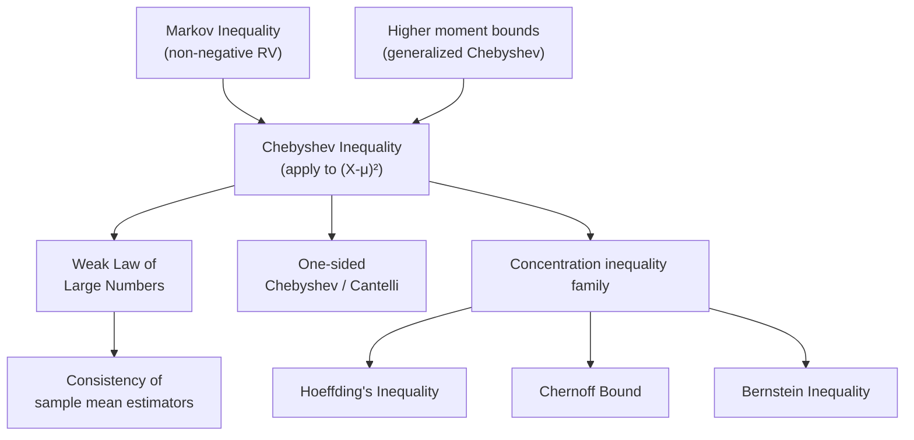

## Chebyshev Inequality

### Definition

Chebyshev's inequality provides a bound on the probability that a random variable deviates from its mean by more than a specified amount, using only the variance, without requiring knowledge of the underlying distribution.

For a random variable $X$ with finite mean $\mu = E[X]$ and finite variance $\sigma^2 = \text{Var}(X)$, for any $k > 0$:

$$P(|X - \mu| \geq k) \leq \frac{\sigma^2}{k^2}$$

An equivalent form expresses the deviation in units of standard deviation. Setting $k = t\sigma$:

$$P(|X - \mu| \geq t\sigma) \leq \frac{1}{t^2}$$

### Key Points

- The inequality applies to any distribution with finite mean and variance — no assumption of normality, symmetry, or unimodality is required.
- It is a "distribution-free" or "distribution-agnostic" bound, which makes it weaker (looser) than distribution-specific results but broadly applicable.
- The bound is generally conservative. For distributions with known shape (e.g., Gaussian), the actual tail probability is typically much smaller than what Chebyshev predicts.
- The inequality becomes informative only when $t > 1$; for $t \leq 1$, the bound exceeds or equals 1, which is trivially true for any probability and adds no information.
- It is a special case of the more general Markov's inequality, applied to the random variable $(X - \mu)^2$.

### Derivation

Chebyshev's inequality follows directly from Markov's inequality.

Markov's inequality states that for a non-negative random variable $Y$ and $a > 0$:

$$P(Y \geq a) \leq \frac{E[Y]}{a}$$

Let $Y = (X - \mu)^2$, which is non-negative, and let $a = k^2$. Applying Markov's inequality:

$$P((X-\mu)^2 \geq k^2) \leq \frac{E[(X-\mu)^2]}{k^2} = \frac{\sigma^2}{k^2}$$

Since $(X - \mu)^2 \geq k^2$ is equivalent to $|X - \mu| \geq k$, the result follows.

### Interpretation for Machine Learning

Chebyshev's inequality is used in machine learning contexts primarily as a theoretical tool rather than a practical everyday computation. Common applications include:

- **Concentration bounds**: Establishing that sample statistics (like the sample mean) concentrate around their expected value as sample size grows, which underlies proofs of the weak law of large numbers.
- **Generalization bounds**: Providing loose but distribution-free guarantees on how far an empirical estimate (e.g., empirical risk) might deviate from a true expected value, used in some learning-theory derivations.
- **Outlier flagging heuristics**: Since it holds for any distribution, it can justify simple rules like "flag values beyond $k$ standard deviations" without assuming normality, though thresholds derived this way are typically very conservative [Inference].
- **Sanity-checking tighter bounds**: Because it is one of the loosest concentration inequalities, it serves as a baseline against which sharper bounds (Chernoff, Hoeffding, Bernstein) are compared.

[Inference] In practice, most applied ML work favors tighter, distribution-aware bounds (like Hoeffding's or Chernoff bounds) when the relevant distributional assumptions hold, and reserves Chebyshev for cases where no such assumptions can be made.

### Worked Example

Suppose a feature $X$ in a dataset has mean $\mu = 50$ and standard deviation $\sigma = 5$, and the distribution shape is unknown.

**Question:** What is the upper bound on the probability that $X$ deviates from 50 by 15 or more?

Here $k = 15$, so:

$$P(|X - 50| \geq 15) \leq \frac{\sigma^2}{k^2} = \frac{25}{225} = \frac{1}{9} \approx 0.111$$

**Interpretation**: At most about 11.1% of the probability mass lies at or beyond 3 standard deviations ($k = 15 = 3\sigma$) from the mean, regardless of the distribution's shape. This matches the general $t$-form result: for $t = 3$, $P(|X-\mu| \geq 3\sigma) \leq 1/9$.

By contrast, if $X$ were known to be normally distributed, the actual probability of being 3 standard deviations from the mean is approximately 0.0027 (about 0.27%) — far tighter than Chebyshev's bound. This illustrates the cost of distribution-agnostic guarantees: correctness across all distributions comes at the price of looseness for any specific one.

### Comparison Table

| Property | Chebyshev Inequality | Markov Inequality | Hoeffding's Inequality |
| --- | --- | --- | --- |
| Requires | Finite mean, finite variance | Non-negative RV, finite mean | Bounded random variables |
| Bound tightness | Loose | Very loose | Tight (exponential decay) |
| Distribution assumptions | None | None | None (but requires boundedness) |
| Typical use | General concentration, LLN proofs | Building block for other bounds | Sample mean concentration, generalization bounds |

### Visualization

<svg xmlns="http://www.w3.org/2000/svg" viewBox="0 0 720 380" font-family="Arial, sans-serif">
<text x="360" y="28" text-anchor="middle" font-size="18" font-weight="bold" fill="#1a1a1a">Chebyshev Bound vs. Actual Normal Tail Probability (svg_diagram)</text>

<line x1="80" y1="320" x2="680" y2="320" stroke="#333" stroke-width="2" />
<line x1="80" y1="320" x2="80" y2="60" stroke="#333" stroke-width="2" />

<text x="380" y="355" text-anchor="middle" font-size="13" fill="#333">k (multiples of standard deviation, t)</text>

<text x="30" y="190" text-anchor="middle" font-size="13" fill="#333" transform="rotate(-90 30 190)">Upper bound on P(|X-μ| ≥ tσ)</text>

<line x1="200" y1="320" x2="200" y2="60" stroke="#eee" stroke-width="1" />
<line x1="320" y1="320" x2="320" y2="60" stroke="#eee" stroke-width="1" />
<line x1="440" y1="320" x2="440" y2="60" stroke="#eee" stroke-width="1" />
<line x1="560" y1="320" x2="560" y2="60" stroke="#eee" stroke-width="1" />
<line x1="680" y1="320" x2="680" y2="60" stroke="#eee" stroke-width="1" />

<text x="200" y="336" text-anchor="middle" font-size="12" fill="#333">1</text>

<text x="320" y="336" text-anchor="middle" font-size="12" fill="#333">2</text>

<text x="440" y="336" text-anchor="middle" font-size="12" fill="#333">3</text>

<text x="560" y="336" text-anchor="middle" font-size="12" fill="#333">4</text>

<text x="680" y="336" text-anchor="middle" font-size="12" fill="#333">5</text>

<text x="70" y="320" text-anchor="end" font-size="11" fill="#333">0.0</text>

<text x="70" y="256" text-anchor="end" font-size="11" fill="#333">0.25</text>

<text x="70" y="192" text-anchor="end" font-size="11" fill="#333">0.5</text>

<text x="70" y="128" text-anchor="end" font-size="11" fill="#333">0.75</text>

<text x="70" y="64" text-anchor="end" font-size="11" fill="#333">1.0</text>

<path d="M 140 64 Q 170 130 200 192 Q 260 270 320 300 Q 380 312 440 316 Q 500 318 560 319 Q 620 319.5 680 320" fill="none" stroke="`#c0392b`" stroke-width="3" />

<path d="M 140 250 Q 170 285 200 300 Q 260 314 320 318.5 Q 380 319.8 440 320 L 680 320" fill="none" stroke="`#2980b9`" stroke-width="3" stroke-dasharray="6,4" />

<rect x="480" y="70" width="18" height="4" fill="#c0392b" />
<text x="504" y="76" font-size="12" fill="#333">Chebyshev bound: 1/t²</text>
<rect x="480" y="94" width="18" height="4" fill="#2980b9" stroke-dasharray="6,4" />
<text x="504" y="100" font-size="12" fill="#333">Normal actual tail (illustrative)</text>

<text x="200" y="55" text-anchor="middle" font-size="11" fill="#666">t=1: bound = 1.0</text>

<text x="440" y="300" text-anchor="middle" font-size="11" fill="#666">t=3: bound ≈ 0.111</text>

</svg>

### Relationship to Other Concepts

### Limitations

- **Looseness**: The bound is often far from the true probability, especially for well-behaved distributions like the normal. This limits its practical use for precise probability estimation.
- **Requires finite variance**: If a distribution has infinite or undefined variance (e.g., certain heavy-tailed distributions like the Cauchy distribution), the inequality cannot be applied.
- **Symmetric bound only**: The standard form treats deviations above and below the mean symmetrically; it does not exploit any known asymmetry in the distribution. One-sided versions (Cantelli's inequality) address this partially.
- **Not tight for small $t$**: For $t \leq 1$, the bound is not useful since it does not restrict the probability below 1.

[Unverified] Specific numerical claims about how much tighter alternative bounds (Hoeffding, Bernstein) are in any given applied ML setting depend on the specific distribution and sample size involved, and general comparisons should not be treated as fixed guarantees across all use cases.

### Next Steps

- Chebyshev's inequality — one-sided variant (Cantelli's inequality)
- Weak Law of Large Numbers (formal proof using Chebyshev)
- Markov's inequality — full derivation and applications
- Hoeffding's inequality for bounded random variables
- Chernoff bounds and exponential concentration
- Central Limit Theorem — relationship to convergence in distribution
- Bernstein inequality and variance-aware concentration bounds