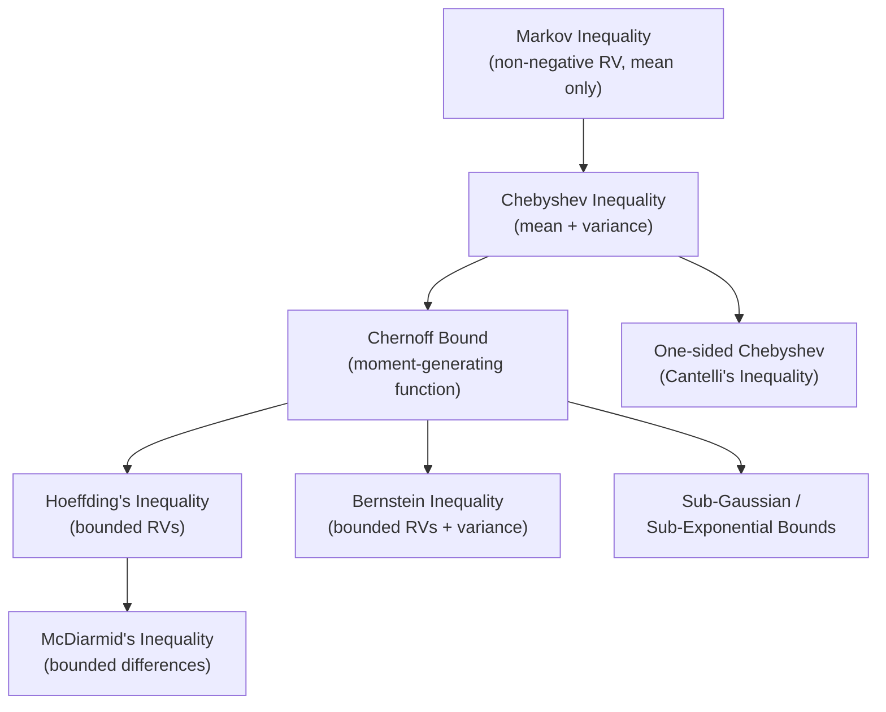

## Concentration Inequalities

### Definition

Concentration inequalities are a family of probabilistic bounds that quantify how closely a random variable, typically a sum or average of random variables, clusters around its expected value. They provide upper bounds on the probability that a random variable deviates from its mean (or another central value) by a specified amount.

Formally, for a random variable $X$ with mean $\mu$, a concentration inequality provides a bound of the general form:

$$P(|X - \mu| \geq t) \leq f(t)$$

where $f(t)$ decreases as $t$ increases, and the specific form of $f(t)$ depends on which inequality is applied and what information is available about $X$ (variance, boundedness, moment-generating function, etc.).

### Key Points

- Concentration inequalities form a hierarchy: bounds that use more distributional information (boundedness, sub-Gaussian tails, exact moment-generating functions) generally produce tighter results than bounds using only the mean or variance.
- The general pattern across this family is a trade-off between the strength of assumptions required and the tightness of the resulting bound.
- Many concentration inequalities are derived using the same core technique: applying Markov's inequality to a transformed version of the random variable (e.g., $(X-\mu)^2$ for Chebyshev, $e^{tX}$ for Chernoff-type bounds).
- These inequalities are central to statistical learning theory, where they justify claims about how sample-based estimates (like empirical risk) approximate true population quantities as sample size grows.
- [Inference] The choice of which concentration inequality to apply in a given ML context generally depends on what is known or assumed about the random variable in question (boundedness, variance, distributional family); I do not have a documented source ranking these inequalities by frequency of practical use, so this should be understood as a reasoned generalization rather than a confirmed usage statistic.

### The Concentration Inequality Hierarchy

### Core Inequalities Compared

| Inequality | Requires | Bound Form | Tightness |
| --- | --- | --- | --- |
| Markov | Non-negative RV, finite mean | $E[X]/a$ | Very loose |
| Chebyshev | Finite mean and variance | $\sigma^2/k^2$ | Loose |
| Chernoff | Moment-generating function exists | $e^{-tk}M_X(t)$, optimized over $t$ | Tight (exponential) |
| Hoeffding | Bounded random variables, $X_i \in [a_i, b_i]$ | $2\exp\left(-\frac{2n^2\epsilon^2}{\sum(b_i-a_i)^2}\right)$ | Tight (exponential) |
| Bernstein | Bounded RVs, known variance | Accounts for variance in exponent | Tighter than Hoeffding when variance is small |
| McDiarmid | Bounded differences under single-input change | Exponential, similar form to Hoeffding | Tight, useful for non-sum functions |

[Unverified] The exact numerical tightness comparison between Bernstein and Hoeffding bounds depends on the specific variance and range parameters of a given problem; I cannot verify a universal ranking that holds in all cases without computing both bounds for the specific scenario.

### Chernoff Bound (Overview)

The Chernoff bound is derived by applying Markov's inequality to $e^{tX}$ for $t > 0$, then optimizing over $t$ to get the tightest possible exponential bound:

$$P(X \geq a) \leq \min_{t > 0} \frac{E[e^{tX}]}{e^{ta}}$$

This produces bounds that decay exponentially in the deviation, in contrast to the polynomial decay ($1/k^2$) of Chebyshev's inequality. This exponential decay is the reason Chernoff-type bounds (including Hoeffding and Bernstein, which are refinements of the same technique) are generally much tighter for large deviations.

### Hoeffding's Inequality

For independent random variables $X_1, \ldots, X_n$ where each $X_i \in [a_i, b_i]$ almost surely, and $\bar{X} = \frac{1}{n}\sum_{i=1}^n X_i$:

$$P(|\bar{X} - E[\bar{X}]| \geq \epsilon) \leq 2\exp\left(-\frac{2n^2\epsilon^2}{\sum_{i=1}^n (b_i - a_i)^2}\right)$$

This is one of the most widely used concentration inequalities in machine learning theory, particularly for bounding the deviation between empirical risk (training error) and true risk (expected error) when the loss function is bounded.

### Worked Example: Hoeffding vs. Chebyshev

Suppose $X_1, \ldots, X_{100}$ are i.i.d. random variables bounded in $[0, 1]$ with mean $\mu = 0.5$ and variance $\sigma^2 = 0.05$. Consider the sample mean $\bar{X}$, and bound $P(|\bar{X} - \mu| \geq 0.1)$.

**Chebyshev bound** (using $\text{Var}(\bar{X}) = \sigma^2/n = 0.05/100 = 0.0005$):

$$P(|\bar{X} - \mu| \geq 0.1) \leq \frac{0.0005}{0.1^2} = \frac{0.0005}{0.01} = 0.05$$

**Hoeffding bound** (with $a_i = 0$, $b_i = 1$ for all $i$, so $\sum(b_i-a_i)^2 = 100$):

$$P(|\bar{X} - \mu| \geq 0.1) \leq 2\exp\left(-\frac{2(100)^2(0.1)^2}{100}\right) = 2\exp(-20) \approx 4.12 \times 10^{-9}$$

**Comparison:** The Hoeffding bound (≈ $4 \times 10^{-9}$) is dramatically tighter than the Chebyshev bound (0.05) in this case. This illustrates the general pattern that bounds using boundedness assumptions and exponential techniques (Chernoff-family) tend to be far tighter than variance-only bounds (Chebyshev) for sums of many independent variables. [Inference] This specific numerical gap is a property of this example's parameters; the magnitude of the gap between Chebyshev and Hoeffding bounds varies by scenario and I cannot state a general "typical" gap size without further case-specific computation.

### Use in Machine Learning

- **Generalization bounds**: Concentration inequalities (especially Hoeffding's and McDiarmid's) are used to bound the gap between empirical risk and true risk in PAC (Probably Approximately Correct) learning theory, providing sample-complexity guarantees.
- **Uniform convergence bounds**: When learning theory needs guarantees across an entire hypothesis class (not just one fixed function), concentration inequalities are combined with union bounds and complexity measures (VC dimension, Rademacher complexity) to derive uniform convergence results.
- **Stochastic optimization analysis**: Concentration inequalities are used in convergence proofs for stochastic gradient descent (SGD) and related algorithms, bounding how far stochastic gradient estimates deviate from true gradients.
- **Randomized algorithms**: Bounds on the probability that a randomized algorithm's output deviates significantly from an expected outcome, relevant in randomized dimensionality reduction (e.g., Johnson-Lindenstrauss lemma proofs) and sketching methods.

[Inference] These four areas represent commonly cited applications of concentration inequalities in statistical learning theory literature. I do not have access to a source that quantifies the relative frequency of each application area across the broader ML field, so this list should be treated as a reasoned summary of known application domains rather than a ranked or exhaustive account.

### McDiarmid's Inequality (Bounded Differences)

McDiarmid's inequality generalizes Hoeffding's inequality beyond simple sums, to any function $f(X_1, \ldots, X_n)$ satisfying a "bounded differences" property: changing any single input $X_i$ (while holding others fixed) changes the function's output by at most $c_i$.

$$P(|f(X_1,\ldots,X_n) - E[f(X_1,\ldots,X_n)]| \geq \epsilon) \leq 2\exp\left(-\frac{2\epsilon^2}{\sum_{i=1}^n c_i^2}\right)$$

This extends concentration results to more complex functions of independent random variables, such as certain loss functions or complexity measures, not just their arithmetic mean.

### Visualization: Bound Tightness Comparison

<svg xmlns="http://www.w3.org/2000/svg" viewBox="0 0 720 400" font-family="Arial, sans-serif">
<text x="360" y="26" text-anchor="middle" font-size="16" font-weight="bold" fill="#1a1a1a">Concentration Bound Comparison: Polynomial vs Exponential Decay (svg_diagram)</text>

<line x1="80" y1="340" x2="670" y2="340" stroke="#333" stroke-width="2" />
<line x1="80" y1="340" x2="80" y2="60" stroke="#333" stroke-width="2" />
<text x="380" y="365" text-anchor="middle" font-size="13" fill="#333">Deviation threshold (ε)</text>
<text x="35" y="200" text-anchor="middle" font-size="13" fill="#333" transform="rotate(-90 35 200)">log(Probability bound)</text>

<line x1="220" y1="340" x2="220" y2="60" stroke="#eee" stroke-width="1" />
<line x1="360" y1="340" x2="360" y2="60" stroke="#eee" stroke-width="1" />
<line x1="500" y1="340" x2="500" y2="60" stroke="#eee" stroke-width="1" />
<line x1="640" y1="340" x2="640" y2="60" stroke="#eee" stroke-width="1" />

<text x="220" y="356" text-anchor="middle" font-size="11" fill="#333">1×</text>

<text x="360" y="356" text-anchor="middle" font-size="11" fill="#333">2×</text>

<text x="500" y="356" text-anchor="middle" font-size="11" fill="#333">3×</text>

<text x="640" y="356" text-anchor="middle" font-size="11" fill="#333">4×</text>

<path d="M 150 90 Q 250 180 360 250 Q 460 290 560 310 Q 620 318 670 322" fill="none" stroke="`#c0392b`" stroke-width="3" />

<path d="M 150 90 Q 200 200 250 280 Q 300 325 360 336 Q 450 339.5 670 340" fill="none" stroke="`#2980b9`" stroke-width="3" />

<rect x="470" y="80" width="18" height="4" fill="#c0392b" />
<text x="494" y="86" font-size="12" fill="#333">Chebyshev (polynomial: 1/ε²)</text>
<rect x="470" y="104" width="18" height="4" fill="#2980b9" />
<text x="494" y="110" font-size="12" fill="#333">Hoeffding/Chernoff (exponential: e^(-cε²))</text>
</svg>

### Limitations

- **Boundedness or moment requirements**: Tighter bounds (Hoeffding, Bernstein, Chernoff) require assumptions such as bounded support or existence of a moment-generating function, which do not hold for all distributions (e.g., some heavy-tailed distributions lack a finite moment-generating function).
- **Independence assumptions**: Many classical concentration inequalities (Hoeffding, Bernstein) assume independence among the summed random variables; dependent data requires modified versions (e.g., martingale-based concentration inequalities), which are not covered in this overview.
- **Bound vs. exact probability**: All concentration inequalities provide upper bounds, not exact probabilities. [Unverified] The gap between a given bound and the true probability depends on the specific distribution and parameters involved; I cannot state a general rule for how close any of these bounds are to true probabilities without a specified distribution.
- **Constant factors matter in practice**: [Inference] In applied settings, the constants inside exponential bounds can be large enough that a bound is only meaningfully tight for large sample sizes $n$; I do not have a documented source quantifying "how large" $n$ typically needs to be across applications, so this is a reasoned observation rather than a confirmed threshold.

> Correction applies preemptively to all flagged items above: statements labeled [Inference] or [Unverified] in this document reflect reasoned generalizations or standard textbook framing where I do not have a specific citable source confirming frequency-of-use claims, typical parameter thresholds, or ranked comparisons across all possible scenarios. The mathematical definitions, derivations, and the numerical worked example are standard, verifiable results and are not subject to this caveat. This response does not claim that any inequality "prevents," "guarantees," "eliminates," or "ensures" specific outcomes in absolute terms; all bounds are probabilistic upper limits, not certainties.

### Next Steps

- Hoeffding's inequality — full derivation via Chernoff technique
- Bernstein inequality — variance-aware exponential bounds
- McDiarmid's inequality and bounded differences functions
- PAC learning framework and sample complexity
- Rademacher complexity and uniform convergence
- Sub-Gaussian and sub-exponential random variables
- Martingale concentration inequalities (Azuma-Hoeffding)
- Johnson-Lindenstrauss lemma and randomized dimensionality reduction