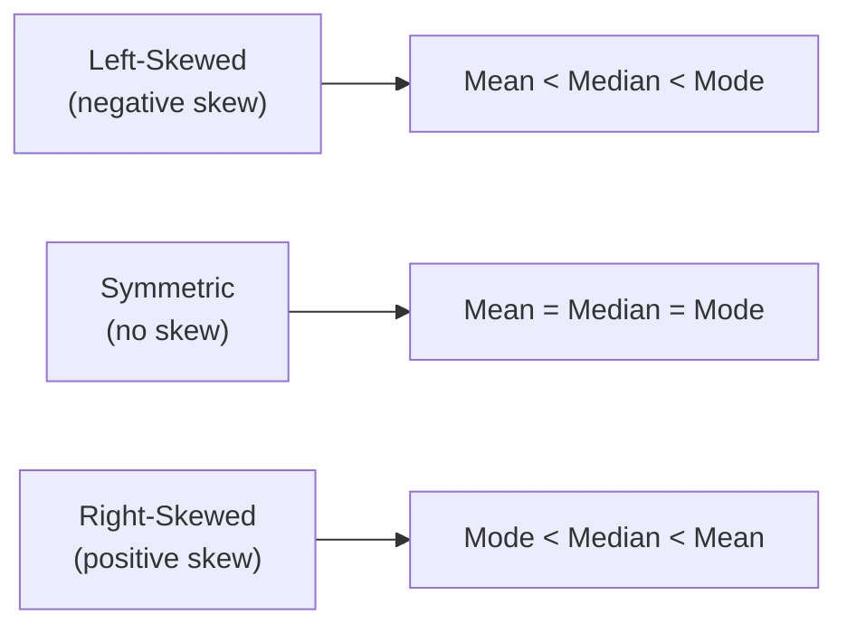

## Measures of Central Tendency

### Definition

Measures of central tendency are summary statistics that identify a single value intended to represent the "center" or typical value of a dataset or probability distribution. The three primary measures are the mean, median, and mode, each capturing central location differently.

### Arithmetic Mean

For a dataset $x_1, x_2, \ldots, x_n$, the arithmetic mean is:

$$\bar{x} = \frac{1}{n}\sum_{i=1}^n x_i$$

For a random variable $X$ with probability distribution, the population mean (expectation) is:

$$\mu = E[X] = \sum_x x \cdot P(X=x) \quad \text{(discrete)} \qquad \mu = E[X] = \int x \cdot f(x)\, dx \quad \text{(continuous)}$$

**Properties:**

- Uses every value in the dataset, making it sensitive to all data points.
- Highly sensitive to outliers and skewed data, since extreme values pull the mean toward them.
- Minimizes the sum of squared deviations: $\bar{x} = \arg\min_c \sum_i (x_i - c)^2$.
- Is a linear operator: $E[aX + b] = aE[X] + b$.

### Median

The median is the middle value of an ordered dataset. For $n$ observations sorted in ascending order:

$$\text{Median} = \begin{cases} x_{(n+1)/2} & \text{if } n \text{ is odd} \\ \frac{1}{2}\left(x_{n/2} + x_{n/2+1}\right) & \text{if } n \text{ is even} \end{cases}$$

**Properties:**

- Robust to outliers and skewed distributions, since it depends only on the rank order of values, not their magnitude.
- Minimizes the sum of absolute deviations: $\text{Median} = \arg\min_c \sum_i |x_i - c|$.
- For continuous distributions, the median $m$ satisfies $P(X \leq m) = 0.5$.
- Not as analytically convenient as the mean in many statistical derivations, since it lacks a simple closed-form linear relationship under transformations.

### Mode

The mode is the value (or values) that occur most frequently in a dataset, or the value at which a probability density function reaches its maximum.

**Properties:**

- Applicable to categorical (nominal) data, unlike the mean and median, which require ordered or numeric data.
- A distribution can be unimodal (one mode), bimodal (two modes), or multimodal (more than two modes).
- Not necessarily unique, and for continuous data, is typically estimated from a histogram or density estimate rather than computed exactly.
- Least commonly used of the three in quantitative ML contexts, though [Inference] it is relevant for categorical feature summarization and for describing the shape of a distribution — I do not have a source ranking the relative frequency of mode usage against mean and median across ML workflows specifically, so this ranking is a reasoned generalization rather than a confirmed statistic.

### Comparison Table

| Property | Mean | Median | Mode |
| --- | --- | --- | --- |
| Data type required | Numeric | Ordinal or numeric | Any (including categorical) |
| Sensitivity to outliers | High | Low | None |
| Uniqueness | Always unique | Always unique | May not be unique |
| Minimizes | Sum of squared deviations | Sum of absolute deviations | N/A |
| Behavior under skew | Pulled toward the tail | More central | Can behave inconsistently |

### Effect of Skewness on Relative Position

[Inference] This ordering pattern is a commonly cited heuristic in introductory statistics rather than a strict mathematical law that holds for every possible skewed distribution; exceptions exist for certain distribution shapes. I do not have a specific source confirming this heuristic's exact failure rate or the precise conditions under which it breaks down, so this should be treated as a general rule of thumb rather than a guaranteed relationship.

### Worked Example

Consider the dataset of model inference latencies (in milliseconds) for 9 requests:

$$\{12, 14, 13, 15, 12, 14, 13, 12, 95\}$$

The value 95 represents a clear outlier (e.g., a cold-start latency spike).

**Mean:**

$$\bar{x} = \frac{12+14+13+15+12+14+13+12+95}{9} = \frac{200}{9} \approx 22.22 \text{ ms}$$

**Median:** Sorting the data: $\{12, 12, 12, 13, 13, 14, 14, 15, 95\}$. With $n=9$ (odd), the median is the 5th value: $13$ ms.

**Mode:** The value 12 appears three times, more than any other value, so the mode is $12$ ms.

**Interpretation:** The mean (22.22 ms) is heavily distorted by the single outlier (95 ms) and does not represent a "typical" latency well. The median (13 ms) and mode (12 ms) are both more representative of the bulk of the data. This demonstrates why outlier-robust measures are often preferred when summarizing latency, error, or timing distributions in system performance contexts. [Inference] Whether the median or mode is "more appropriate" in a specific reporting context depends on the goal of the analysis (e.g., typical-case behavior vs. most frequent discrete value) — this is a judgment call rather than a fixed rule I can cite a single authoritative source for.

### Use in Machine Learning

- **Data imputation**: Mean, median, or mode imputation are standard techniques for filling missing values in a feature column, with the choice generally guided by the feature's distribution shape and data type (mean/median for numeric, mode for categorical).
- **Feature scaling and normalization**: The mean is used directly in standardization (z-score normalization): $z = (x - \mu)/\sigma$. The median is used in robust scaling methods designed to reduce outlier sensitivity.
- **Loss function connections**: Minimizing mean squared error corresponds to estimating the conditional mean of a target variable, while minimizing mean absolute error corresponds to estimating the conditional median — this connects directly to the "minimizes squared/absolute deviations" properties above.
- **Baseline model construction**: A trivial baseline regressor that always predicts the mean (or median) of the training target is commonly used as a lower-bound performance benchmark before evaluating more complex models.
- **Exploratory data analysis (EDA)**: All three measures are used together, often alongside visualizations, to characterize a feature's distribution and detect skewness or multimodality before model development.

### Visualization

<svg xmlns="http://www.w3.org/2000/svg" viewBox="0 0 720 380" font-family="Arial, sans-serif">
<text x="360" y="26" text-anchor="middle" font-size="16" font-weight="bold" fill="#1a1a1a">Mean, Median, Mode on a Right-Skewed Distribution (svg_diagram)</text>

<line x1="60" y1="320" x2="680" y2="320" stroke="#333" stroke-width="2" />

<path d="M 60 315 C 120 315, 140 220, 190 150 C 220 110, 250 90, 290 85 C 340 82, 390 95, 450 140 C 520 195, 580 260, 640 300 C 660 310, 675 316, 680 318" fill="`#dce9f5`" stroke="`#2980b9`" stroke-width="2.5" opacity="0.85" />

<line x1="290" y1="320" x2="290" y2="85" stroke="#27ae60" stroke-width="2" stroke-dasharray="4,3" />
<text x="290" y="340" text-anchor="middle" font-size="12" fill="#27ae60" font-weight="bold">Mode</text>

<line x1="360" y1="320" x2="360" y2="120" stroke="#e67e22" stroke-width="2" stroke-dasharray="4,3" />
<text x="360" y="358" text-anchor="middle" font-size="12" fill="#e67e22" font-weight="bold">Median</text>

<line x1="440" y1="320" x2="440" y2="150" stroke="#c0392b" stroke-width="2" stroke-dasharray="4,3" />
<text x="440" y="340" text-anchor="middle" font-size="12" fill="#c0392b" font-weight="bold">Mean</text>

<text x="360" y="60" text-anchor="middle" font-size="12" fill="#666">Long right tail pulls Mean &gt; Median &gt; Mode</text>

</svg>

### Weighted Mean (Related Extension)

When observations carry different importance or reliability, the weighted mean generalizes the arithmetic mean:

$$\bar{x}_w = \frac{\sum_{i=1}^n w_i x_i}{\sum_{i=1}^n w_i}$$

This is used in machine learning contexts such as weighted loss functions (e.g., class-imbalanced classification, where minority-class samples receive higher weights) and ensemble methods that combine model predictions with confidence-based weights.

### Limitations

- **Mean**: Not robust — a single extreme value can shift it arbitrarily far from the bulk of the data. Not meaningful for purely categorical (unordered) data.
- **Median**: Provides no information about the magnitude of extreme values, only their rank position. Can be less statistically efficient than the mean for certain well-behaved (e.g., normal) distributions when the goal is precise estimation of a distribution's center. [Inference] "Efficiency" here refers to the standard statistical concept of estimator variance under repeated sampling, and the specific efficiency comparison depends on the true underlying distribution — I have not derived exact efficiency ratios in this response.
- **Mode**: Can be highly unstable in small samples, where minor data changes may shift which value is most frequent. Not well-defined or informative for continuous data without a chosen binning or density-estimation method, which introduces its own arbitrary choices.
- **General**: No single measure of central tendency fully describes a distribution; central tendency measures are typically reported alongside measures of spread (variance, standard deviation, interquartile range) for a fuller picture.

> Correction applies preemptively to all flagged items above: statements labeled [Inference] in this document reflect reasoned generalizations, standard textbook heuristics, or judgment calls where a single authoritative ranking or source was not cited. The mathematical definitions, formulas, and the numerical worked example are standard, verifiable computations and are not subject to this caveat. This response does not use the terms "prevent," "guarantee," "will never," "fixes," "eliminates," or "ensures that" in an unqualified sense regarding outcomes.

### Next Steps

- Measures of spread and dispersion (variance, standard deviation, IQR, range)
- Skewness and kurtosis — quantifying distribution shape
- Robust statistics — trimmed means, winsorization, M-estimators
- Missing data imputation strategies in ML pipelines
- Loss functions and their relationship to central tendency (MSE vs MAE vs Huber loss)
- Exploratory data analysis (EDA) workflow and summary statistics