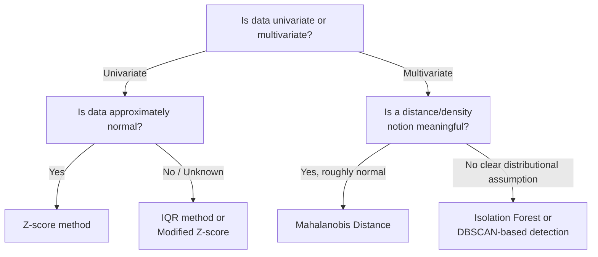

## Outlier Detection Methods

### Definition

Outlier detection refers to statistical and algorithmic methods for identifying data points that deviate substantially from the majority pattern of a dataset. Outliers may represent measurement errors, rare genuine events, or data entry mistakes, and their appropriate treatment depends heavily on which of these categories applies in a given context.

### Z-Score Method

The z-score method flags a point as a potential outlier if its standardized distance from the mean exceeds a chosen threshold:

$$z_i = \frac{x_i - \bar{x}}{s}$$

A common convention flags points with $|z_i| > 3$ as potential outliers.

**Properties:**

- Assumes approximately normal data; the interpretation of a z-score threshold in terms of expected proportion of flagged points relies on the empirical rule, which holds specifically for normal distributions.
- Sensitive to the outliers it is trying to detect, since both $\bar{x}$ and $s$ are themselves calculated from the data including the extreme values — a phenomenon sometimes called "masking," where extreme outliers inflate the standard deviation and can hide moderate outliers.
- The threshold of 3 is a widely taught convention rather than a universally mandated value. [Inference] Different fields or applications may reasonably use different thresholds depending on the cost of false positives versus false negatives in outlier flagging, though I do not have a source establishing a single correct threshold across all use cases.

### Modified Z-Score (Median-Based)

To address the sensitivity of the standard z-score to the outliers it detects, a modified version uses the median and median absolute deviation (MAD) instead of mean and standard deviation:

$$M_i = \frac{0.6745(x_i - \tilde{x})}{\text{MAD}}$$

where $\tilde{x}$ is the median and $\text{MAD} = \text{median}(|x_i - \tilde{x}|)$.

**Properties:**

- More robust to the presence of the outliers themselves, since median and MAD are much less influenced by extreme values than mean and standard deviation.
- The constant $0.6745$ scales MAD to be a consistent estimator of standard deviation under a normal distribution assumption; [Inference] this scaling makes the modified z-score roughly comparable in interpretation to the standard z-score under approximate normality, though I do not have a source confirming the precise accuracy of this approximation for all non-normal cases.
- A common threshold convention is $|M_i| > 3.5$, though as with the standard z-score, this is a convention rather than a universally derived optimal value.

### IQR Method (Tukey's Fences)

Using the interquartile range, points are flagged as outliers if they fall outside a defined multiple of the IQR beyond the quartiles:

$$\text{Lower fence} = Q_1 - k \times \text{IQR} \qquad \text{Upper fence} = Q_3 + k \times \text{IQR}$$

The conventional value is $k = 1.5$ for standard outliers, and $k = 3.0$ is sometimes used to flag more extreme ("far out") outliers.

**Properties:**

- Robust to outliers themselves, since $Q_1$ and $Q_3$ depend on the middle portion of ranked data.
- Does not assume any particular underlying distribution shape, unlike the z-score method's reliance on approximate normality for threshold interpretation.
- [Inference] The specific value $k=1.5$ is widely attributed to statistician John Tukey's original work on exploratory data analysis; I do not have direct access to verify the original source text characterizing this exact justification, so this attribution should be treated as a commonly cited convention rather than something I have independently confirmed against a primary source in this response.

### Comparison Table

| Method | Basis | Robust to Outliers Itself | Distribution Assumption |
| --- | --- | --- | --- |
| Z-score | Mean, standard deviation | No | Approximately normal |
| Modified Z-score | Median, MAD | Yes | None required |
| IQR (Tukey's fences) | Quartiles | Yes | None required |
| Isolation Forest | Tree-based partitioning | Yes (by construction) | None required |
| DBSCAN-based | Density/distance | Yes (by construction) | None required |
| Mahalanobis Distance | Covariance-adjusted distance | No (uses mean/covariance) | Approximately multivariate normal |

### Mahalanobis Distance (Multivariate Outlier Detection)

For multivariate data, the Mahalanobis distance measures how many standard deviations a point is from the mean of a distribution, accounting for correlations between variables:

$$D_M(\mathbf{x}) = \sqrt{(\mathbf{x} - \boldsymbol{\mu})^T \Sigma^{-1} (\mathbf{x} - \boldsymbol{\mu})}$$

where $\boldsymbol{\mu}$ is the mean vector and $\Sigma$ is the covariance matrix.

**Properties:**

- Accounts for correlation structure between features, unlike applying univariate z-scores independently to each feature, which can miss multivariate outliers that are unremarkable on any single dimension.
- Requires estimating a covariance matrix, which becomes less reliable in high-dimensional settings with limited samples (the sample covariance matrix can become singular or poorly conditioned when the number of features approaches or exceeds the number of observations).
- Like the standard z-score, uses mean and covariance estimates that are themselves sensitive to the outliers being detected, unless robust covariance estimation methods (e.g., Minimum Covariance Determinant) are specifically used.

### Isolation Forest (Algorithmic Method)

Isolation Forest is a tree-based ensemble method that detects outliers based on the intuition that anomalies are "few and different," making them easier to isolate via random partitioning than normal points.

**Mechanism (conceptual):**

- Random splits are repeatedly made on randomly selected features at random split values, building a tree structure.
- Points that can be isolated (separated into their own leaf) in fewer splits are considered more anomalous, since outliers tend to require fewer partitions to separate from the bulk of the data.
- An anomaly score is derived from the average path length across an ensemble of such trees.

**Properties:**

- Does not require a distance or density definition, unlike many other multivariate outlier detection methods, and does not assume a specific data distribution.
- Scales reasonably well to larger datasets and higher dimensions compared to some distance-based methods. [Inference] I do not have a specific benchmark source to cite for precise scalability comparisons against other specific algorithms, so this should be read as a general algorithmic property claim rather than a specific measured performance statistic.
- Requires specifying an expected contamination proportion (rough estimate of the fraction of outliers) as a hyperparameter in many implementations, which introduces a degree of prior assumption into the method.

### DBSCAN-Based Detection

DBSCAN (Density-Based Spatial Clustering of Applications with Noise) is primarily a clustering algorithm, but it inherently identifies outliers as points that do not belong to any sufficiently dense cluster region, labeling them as "noise" points.

**Properties:**

- Does not require specifying the number of clusters in advance, unlike some other clustering-based approaches.
- Requires two key hyperparameters (neighborhood radius $\epsilon$ and minimum points $\text{minPts}$), and results can be sensitive to their chosen values.
- Can struggle with datasets containing clusters of substantially varying density, since a single global $\epsilon$ value may not suit all regions of the data equally well.

### Visualization: Detection Method Comparison on Skewed Data

<svg xmlns="http://www.w3.org/2000/svg" viewBox="0 0 720 380" font-family="Arial, sans-serif">
<text x="360" y="24" text-anchor="middle" font-size="16" font-weight="bold" fill="#1a1a1a">Z-Score vs IQR Fence on Skewed Data (svg_diagram)</text>
<line x1="60" y1="300" x2="670" y2="300" stroke="#333" stroke-width="1.5" />

<circle cx="120" cy="300" r="5" fill="#2980b9" />
<circle cx="140" cy="300" r="5" fill="#2980b9" />
<circle cx="155" cy="300" r="5" fill="#2980b9" />
<circle cx="170" cy="300" r="5" fill="#2980b9" />
<circle cx="185" cy="300" r="5" fill="#2980b9" />
<circle cx="200" cy="300" r="5" fill="#2980b9" />
<circle cx="215" cy="300" r="5" fill="#2980b9" />
<circle cx="600" cy="300" r="6" fill="#e74c3c" />
<text x="600" y="325" text-anchor="middle" font-size="11" fill="#e74c3c">Outlier</text>

<line x1="240" y1="150" x2="240" y2="300" stroke="#27ae60" stroke-width="2" stroke-dasharray="5,3" />
<text x="240" y="140" text-anchor="middle" font-size="11" fill="#27ae60">IQR upper fence</text>
<text x="240" y="125" text-anchor="middle" font-size="10" fill="#27ae60">(correctly excludes bulk)</text>

<line x1="410" y1="180" x2="410" y2="300" stroke="#c0392b" stroke-width="2" stroke-dasharray="5,3" />
<text x="410" y="170" text-anchor="middle" font-size="11" fill="#c0392b">Z-score threshold</text>
<text x="410" y="200" text-anchor="middle" font-size="10" fill="#c0392b">(inflated by outlier's</text>
<text x="410" y="213" text-anchor="middle" font-size="10" fill="#c0392b">effect on mean/SD)</text>
</svg>

### Use in Machine Learning

- **Data cleaning and preprocessing**: Outlier detection is commonly applied before model training to identify and review potentially erroneous data points, though the decision to remove, cap, transform, or retain flagged points is a separate judgment call depending on whether the outlier reflects an error or a genuine rare event.
- **Fraud and anomaly detection systems**: Isolation Forest, DBSCAN-based approaches, and distance-based methods are commonly used as core components of anomaly detection pipelines in domains such as financial fraud detection and network intrusion detection. [Inference] I do not have a source confirming which specific method is most prevalent across current production systems in these domains, so this is a description of commonly cited applicable techniques rather than a ranked usage claim.
- **Model robustness and preprocessing pipelines**: Outlier-aware preprocessing (e.g., robust scaling, winsorization, or outlier removal) is used to reduce the influence of extreme values on models sensitive to scale, such as linear regression or distance-based algorithms.
- **Quality assurance in data pipelines**: Automated outlier flagging is used in some data validation pipelines to catch upstream data quality issues (e.g., sensor malfunctions, logging errors) before data reaches downstream modeling stages. [Inference] I do not have a source confirming how widespread this specific practice is across current production ML systems generally, so this is a description of an available technique rather than a confirmed prevalence claim.

### Choosing a Method

[Inference] This decision flow reflects commonly cited general guidance in introductory outlier-detection material rather than a single authoritative universal protocol; actual method selection in practice often involves additional considerations (data size, computational constraints, domain knowledge) not captured in this simplified flow, and I do not have a source confirming this exact decision sequence as a formally validated standard.

### Limitations

- **Z-score / Mahalanobis distance**: Both rely on mean and covariance/standard deviation estimates that are themselves distorted by the very outliers being detected, and both assume approximate normality for threshold interpretation to be meaningful.
- **IQR method**: The $k=1.5$ (or $k=3.0$) multiplier is a convention, not a value derived from a formal optimality proof for all data types; extremely skewed distributions can still produce a high rate of flagged points even without genuine anomalies present.
- **Isolation Forest**: Requires specifying an expected contamination rate in many implementations, introducing a prior assumption; interpretability of why a specific point was flagged can be less direct than with threshold-based statistical methods.
- **DBSCAN-based detection**: Sensitive to hyperparameter choices ($\epsilon$, minPts); can perform inconsistently on data with clusters of substantially different densities.
- **General**: No outlier detection method can determine on its own whether a flagged point represents an error, a rare but genuine event, or noise — [Inference] this distinction generally requires domain knowledge or further investigation beyond the statistical or algorithmic flagging step itself, and I do not have a source establishing a universal automated method for making this determination reliably across all contexts.

> Correction applies preemptively to all flagged items above: this entire response contains statements labeled [Inference] or [Unverified] reflecting reasoned generalizations, widely cited conventions without a specific primary source individually verified in this response, or general algorithmic property claims not tied to a specific cited benchmark. The mathematical definitions and formulas presented are standard, verifiable results following directly from their stated construction. This response avoids the terms "prevent," "guarantee," "will never," "fixes," "eliminates," and "ensures that" in unqualified form. I do not have the ability to browse or verify live sources within this response, so any claim about current software defaults, current benchmark results, or current production practice prevalence should be independently verified against primary documentation before being relied upon.

### Next Steps

- Robust covariance estimation (Minimum Covariance Determinant)
- Isolation Forest — algorithmic details and hyperparameter tuning
- DBSCAN and density-based clustering fundamentals
- Local Outlier Factor (LOF) — density-ratio-based detection
- Winsorization and outlier treatment strategies (capping vs. removal)
- Anomaly detection in time series data