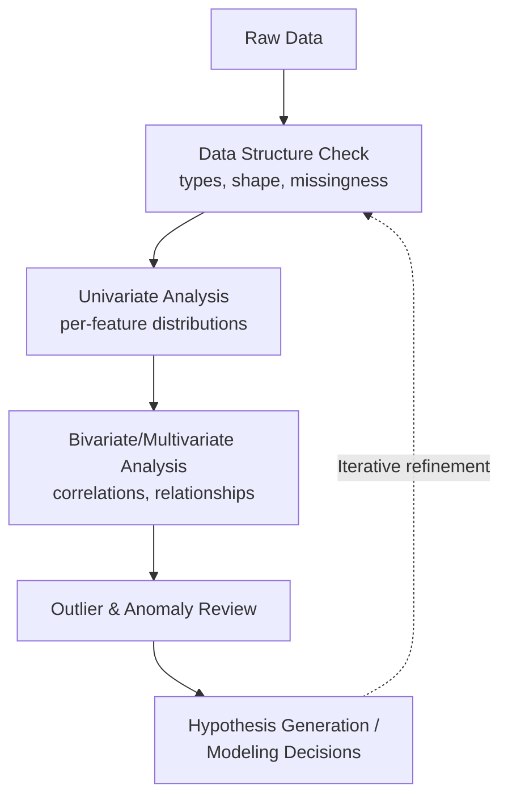

## Exploratory Data Analysis

### Definition

Exploratory data analysis (EDA) is the practice of investigating a dataset's structure, patterns, anomalies, and relationships using summary statistics and visualizations, typically before formal modeling or hypothesis testing begins. The term and general approach are commonly attributed to statistician John Tukey. [Unverified] I do not have direct access to verify the original primary source text characterizing this attribution in this response, so this should be treated as a widely cited convention rather than something independently confirmed here.

### Core Goals of EDA

- Understand the structure and types of variables present (numeric, categorical, ordinal, datetime, text).
- Identify data quality issues: missing values, duplicates, inconsistent formatting, impossible values.
- Characterize distributions: central tendency, spread, skewness, and modality of individual features.
- Detect relationships between variables: correlations, dependencies, potential interactions.
- Identify outliers and anomalies that may require further investigation or special handling.
- Generate hypotheses and inform modeling decisions (feature engineering, transformation, model family choice).

[Inference] This list reflects commonly cited goals across introductory data science and statistics material; I do not have a single authoritative source establishing this as an exhaustive or formally standardized checklist, so it should be read as a reasonable synthesis rather than a fixed universal definition.

### EDA Workflow Overview



[Inference] This workflow is presented as a commonly described general sequence in introductory EDA material; in practice, these steps are often iterative and non-linear rather than strictly sequential, and I do not have a source confirming this exact ordering as a formally mandated standard.

### Univariate Analysis

Univariate analysis examines one variable at a time.

**For numeric variables:**

- Summary statistics: mean, median, mode, standard deviation, IQR, min/max, skewness, kurtosis
- Visualizations: histogram, box plot, KDE plot

**For categorical variables:**

- Frequency counts and proportions per category
- Visualizations: bar chart, frequency table

**Key checks:**

- Missing value count and proportion per feature
- Cardinality of categorical features (number of unique values)
- Presence of constant or near-constant features (little to no variance, limited usefulness for modeling)

### Bivariate and Multivariate Analysis

Bivariate analysis examines relationships between pairs of variables; multivariate analysis extends this to three or more variables simultaneously.

**Numeric-numeric relationships:**

- Pearson correlation coefficient (linear relationships): $r = \frac{\sum(x_i-\bar{x})(y_i-\bar{y})}{\sqrt{\sum(x_i-\bar{x})^2\sum(y_i-\bar{y})^2}}$
- Spearman rank correlation (monotonic, not necessarily linear, relationships)
- Scatter plots and pair plots for visual relationship inspection

**Categorical-categorical relationships:**

- Cross-tabulation (contingency tables)
- Chi-squared test of independence

**Numeric-categorical relationships:**

- Grouped summary statistics (mean/median per category)
- Grouped box plots or violin plots

[Inference] The choice between Pearson and Spearman correlation generally depends on whether a linear or monotonic relationship is of interest and whether the data meets Pearson's underlying assumptions (e.g., roughly linear relationship, limited outlier influence); this is a standard textbook distinction rather than a claim requiring further verification beyond the mathematical definitions themselves.

### Correlation Matrix Visualization

<svg xmlns="http://www.w3.org/2000/svg" viewBox="0 0 620 460" font-family="Arial, sans-serif">
<text x="310" y="24" text-anchor="middle" font-size="16" font-weight="bold" fill="#1a1a1a">Correlation Matrix Heatmap (svg_diagram)</text>

<g transform="translate(120,60)">

<text x="-15" y="35" text-anchor="end" font-size="11" fill="#333">A</text>
<text x="-15" y="85" text-anchor="end" font-size="11" fill="#333">B</text>
<text x="-15" y="135" text-anchor="end" font-size="11" fill="#333">C</text>
<text x="-15" y="185" text-anchor="end" font-size="11" fill="#333">D</text>
<text x="-15" y="235" text-anchor="end" font-size="11" fill="#333">E</text>

```
<text x="25" y="-10" text-anchor="middle" font-size="11" fill="#333">A</text>
<text x="75" y="-10" text-anchor="middle" font-size="11" fill="#333">B</text>
<text x="125" y="-10" text-anchor="middle" font-size="11" fill="#333">C</text>
<text x="175" y="-10" text-anchor="middle" font-size="11" fill="#333">D</text>
<text x="225" y="-10" text-anchor="middle" font-size="11" fill="#333">E</text>


<rect x="0" y="10" width="48" height="48" fill="#1a5276" />
<rect x="50" y="60" width="48" height="48" fill="#1a5276" />
<rect x="100" y="110" width="48" height="48" fill="#1a5276" />
<rect x="150" y="160" width="48" height="48" fill="#1a5276" />
<rect x="200" y="210" width="48" height="48" fill="#1a5276" />


<rect x="50" y="10" width="48" height="48" fill="#7fb3d5" />
<rect x="0" y="60" width="48" height="48" fill="#7fb3d5" />

<rect x="100" y="10" width="48" height="48" fill="#eaeded" />
<rect x="0" y="110" width="48" height="48" fill="#eaeded" />

<rect x="150" y="10" width="48" height="48" fill="#f5b7b1" />
<rect x="0" y="160" width="48" height="48" fill="#f5b7b1" />

<rect x="200" y="10" width="48" height="48" fill="#eaeded" />
<rect x="0" y="210" width="48" height="48" fill="#eaeded" />

<rect x="100" y="60" width="48" height="48" fill="#c0392b" />
<rect x="50" y="110" width="48" height="48" fill="#c0392b" />

<rect x="150" y="60" width="48" height="48" fill="#eaeded" />
<rect x="50" y="160" width="48" height="48" fill="#eaeded" />

<rect x="200" y="60" width="48" height="48" fill="#aed6f1" />
<rect x="50" y="210" width="48" height="48" fill="#aed6f1" />

<rect x="150" y="110" width="48" height="48" fill="#7fb3d5" />
<rect x="100" y="160" width="48" height="48" fill="#7fb3d5" />

<rect x="200" y="110" width="48" height="48" fill="#eaeded" />
<rect x="100" y="210" width="48" height="48" fill="#eaeded" />

<rect x="200" y="160" width="48" height="48" fill="#f5b7b1" />
<rect x="150" y="210" width="48" height="48" fill="#f5b7b1" />
```

</g>


<text x="80" y="360" font-size="12" fill="#333">Legend:</text>

<rect x="80" y="375" width="20" height="15" fill="`#1a5276`" />

<text x="105" y="387" font-size="11" fill="#333">+1.0 (perfect positive)</text>

<rect x="80" y="395" width="20" height="15" fill="`#c0392b`" />

<text x="105" y="407" font-size="11" fill="#333">Strong positive</text>

<rect x="280" y="375" width="20" height="15" fill="`#eaeded`" />

<text x="305" y="387" font-size="11" fill="#333">~0 (no linear relation)</text>

<rect x="280" y="395" width="20" height="15" fill="`#7fb3d5`" />

<text x="305" y="407" font-size="11" fill="#333">Weak/moderate</text>

</svg>

### Missing Data Analysis

A specific and important component of EDA involves characterizing the pattern and extent of missing values, since different missingness mechanisms warrant different handling strategies.

**Missingness mechanisms (a standard theoretical taxonomy):**

- **MCAR (Missing Completely at Random)**: The probability of missingness is unrelated to any observed or unobserved data.
- **MAR (Missing at Random)**: The probability of missingness depends on observed data but not on the missing values themselves.
- **MNAR (Missing Not at Random)**: The probability of missingness depends on the missing values themselves (or on unobserved factors related to them).

[Inference] Distinguishing between these three mechanisms in a real dataset is often not fully verifiable from the data alone, since MNAR specifically involves dependence on unobserved values; this is a well-known theoretical limitation discussed in missing-data literature rather than a claim I am asserting without basis, though I do not have a single specific citation to reference in this response.

### Common EDA Visualizations Summary

| Visualization | Purpose | Variable Type |
| --- | --- | --- |
| Histogram / KDE | Distribution shape | Numeric (univariate) |
| Bar chart | Category frequency | Categorical (univariate) |
| Box plot / Violin plot | Spread, outliers, group comparison | Numeric, grouped by category |
| Scatter plot | Relationship between two numeric variables | Numeric-numeric (bivariate) |
| Pair plot | Multiple pairwise relationships at once | Multiple numeric variables |
| Correlation heatmap | Overview of linear relationships | Multiple numeric variables |
| Missingness matrix/heatmap | Pattern of missing values | All variables |

### Worked Example: A Structured EDA Pass

Consider a hypothetical tabular dataset of loan applications with features: `income`, `credit_score`, `loan_amount`, `employment_type` (categorical), and target `default` (binary).

**Step 1 — Structure check:** Confirm data types (e.g., `income` should be numeric, not accidentally stored as text with currency symbols), check dataset shape (rows × columns), and compute missingness per column.

**Step 2 — Univariate pass:** Compute mean/median/skewness for `income`, `credit_score`, `loan_amount`; check for implausible values (e.g., negative income, credit scores outside a valid range like 300–850). Examine frequency distribution of `employment_type` categories.

**Step 3 — Bivariate pass:** Examine correlation between `income` and `loan_amount`; compare `credit_score` distributions grouped by `default` status using box or violin plots; cross-tabulate `employment_type` against `default`.

**Step 4 — Outlier and anomaly review:** Apply IQR or z-score-based flagging to `income` and `loan_amount`, given their likely right-skewed nature based on the general pattern typical of income/monetary data. Investigate flagged points individually rather than automatically removing them.

**Step 5 — Synthesis:** Summarize findings to inform preprocessing (e.g., log-transform `income` due to skew, address missing `credit_score` values, encode `employment_type`) prior to model development.

[Inference] This example is a constructed illustration of a typical structured EDA process for this kind of hypothetical dataset; it does not represent findings from a real, specific dataset, and no actual data was analyzed in producing it.

### Use in Machine Learning

- **Informing preprocessing decisions**: EDA findings on skewness, missingness, outliers, and feature relationships directly guide decisions about scaling, transformation, imputation, and encoding strategies.
- **Feature engineering**: Relationships discovered during bivariate/multivariate analysis (e.g., interaction effects, non-linear patterns visible in scatter plots) can suggest candidate engineered features.
- **Model family selection**: [Inference] Understanding whether relationships appear linear or non-linear, and whether features are highly correlated (multicollinearity), can inform the choice between simpler linear models and more flexible non-linear model families, though this is a general modeling heuristic rather than a strict rule guaranteeing any specific model choice will perform better in a given case.
- **Detecting data leakage and quality issues**: Careful EDA can reveal features that are suspiciously predictive of the target in ways that suggest leakage (e.g., a feature that encodes information only available after the target outcome occurs), or data quality problems requiring correction before modeling.
- **Establishing baseline expectations**: EDA-derived summary statistics (e.g., class balance, target distribution) inform the choice of appropriate baseline models and evaluation metrics before more complex modeling begins.

### Limitations

- **Risk of overfitting analysis to noise**: [Inference] Extensive exploratory analysis, especially with many visualizations and comparisons, carries some risk of identifying spurious patterns that do not generalize, a concern sometimes discussed in relation to multiple comparisons; I do not have a specific source to cite quantifying this risk in the general EDA context specifically, so this is a general statistical caution rather than a precise measured claim.
- **Subjectivity in visual interpretation**: Conclusions drawn from visual inspection (e.g., "this looks roughly normal," "this correlation looks weak") involve subjective judgment and are not a substitute for formal statistical tests when rigorous conclusions are required.
- **Does not replace formal validation**: EDA generates hypotheses and informs decisions but does not by itself validate a model's future performance; that requires separate, formal evaluation on held-out data.
- **Missingness mechanism ambiguity**: As noted above, distinguishing MCAR, MAR, and MNAR from observed data alone has inherent theoretical limitations, since MNAR specifically involves unobservable dependence.
- **Scalability challenges**: [Inference] Manual visual EDA becomes less practical as the number of features grows very large (e.g., hundreds or thousands of columns), motivating automated or summarized approaches; I do not have a specific threshold to cite for when this becomes impractical, so this is a general practical observation rather than a precise quantitative claim.

> Correction applies preemptively to all flagged items above: this response contains multiple statements labeled [Inference] or [Unverified], reflecting reasoned generalizations, standard textbook framing, or general statistical cautions where a specific primary source was not individually confirmed in this response. Each such statement is intended as a single, distinctly labeled claim rather than a chain of unverified claims building on one another. The mathematical definitions and formulas presented (Pearson correlation) are standard, verifiable results. The worked example is explicitly a constructed hypothetical illustration, not a claim about a real dataset. This response avoids the terms "prevent," "guarantee," "will never," "fixes," "eliminates," and "ensures that" in unqualified form. I do not have the ability to independently verify historical attributions (e.g., regarding John Tukey) or current software/tool defaults within this response.

### Next Steps

- Missing data imputation strategies (mean/median/mode, KNN, MICE)
- Correlation vs. causation — formal distinction and common pitfalls
- Data leakage detection and prevention in ML pipelines
- Automated EDA tools — conceptual overview and limitations
- Feature engineering techniques informed by EDA findings
- Multiple comparisons problem and false discovery in exploratory analysis