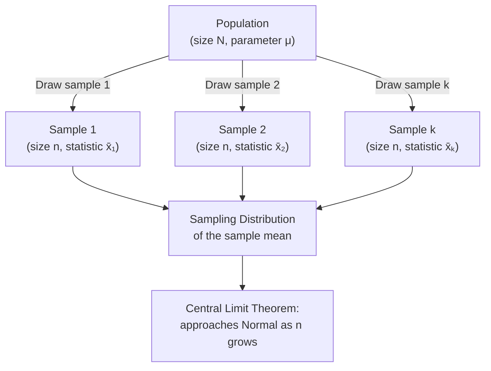

## Population versus Sample

### Definition

A population is the complete set of all individuals, items, or observations that share a defined characteristic and about which conclusions are to be drawn. A sample is a subset of the population, selected for actual observation or measurement, typically because observing the entire population is impractical, costly, or impossible.

### Key Distinction

| Concept | Population | Sample |
| --- | --- | --- |
| Size notation | $N$ | $n$ |
| Mean notation | $\mu$ (population mean) | $\bar{x}$ (sample mean) |
| Variance notation | $\sigma^2$ | $s^2$ |
| Standard deviation notation | $\sigma$ | $s$ |
| Proportion notation | $p$ | $\hat{p}$ |
| Status | Fixed, usually unknown, parameter | Observed, computed, statistic |

A value computed from a population (e.g., $\mu$) is called a **parameter**; a value computed from a sample (e.g., $\bar{x}$) is called a **statistic**. Statistics are used to estimate unknown parameters.

### Population Mean and Variance

$$\mu = \frac{1}{N}\sum_{i=1}^N x_i \qquad \sigma^2 = \frac{1}{N}\sum_{i=1}^N (x_i - \mu)^2$$

### Sample Mean and Variance

$$\bar{x} = \frac{1}{n}\sum_{i=1}^n x_i \qquad s^2 = \frac{1}{n-1}\sum_{i=1}^n (x_i - \bar{x})^2$$

**Key point:** The sample variance formula divides by $n-1$ rather than $n$. This is Bessel's correction, which adjusts for the fact that $\bar{x}$ is itself estimated from the same sample, which otherwise causes the naive $n$-divisor formula to systematically underestimate $\sigma^2$. This makes $s^2$ an unbiased estimator of $\sigma^2$, meaning $E[s^2] = \sigma^2$.

### Why Bessel's Correction Works (Brief Reasoning)

The sample mean $\bar{x}$ is calculated to minimize the sum of squared deviations within the sample itself, so deviations from $\bar{x}$ are, on average, slightly smaller than deviations from the true (unknown) population mean $\mu$ would be. Dividing by $n-1$ instead of $n$ compensates for this understatement. This is a standard, mathematically derivable result in statistical theory, not a matter of interpretation.

### Sampling

Sampling is the process of selecting a subset of a population for observation. The method of selection substantially affects whether conclusions drawn from the sample can be reasonably generalized to the population.

**Common sampling methods:**

- **Simple random sampling**: Every member of the population has an equal probability of selection.
- **Stratified sampling**: The population is divided into subgroups (strata) based on a characteristic, and samples are drawn from each stratum, often to ensure proportional representation.
- **Systematic sampling**: Members are selected at regular intervals from an ordered list (e.g., every 10th item).
- **Cluster sampling**: The population is divided into clusters (often based on geography or natural grouping), a subset of clusters is randomly selected, and all (or a further sample of) members within selected clusters are observed.
- **Convenience sampling**: Samples are drawn based on ease of access rather than a formal randomization procedure.

[Inference] Convenience sampling is widely discussed in statistical literature as being more prone to selection bias than probability-based methods (simple random, stratified, systematic, cluster sampling), since it does not guarantee that each population member has a known or equal chance of selection. I do not have a specific source to cite quantifying the typical magnitude of this bias across contexts, so this should be treated as a general methodological caution rather than a precise measured claim.

### Sampling Bias and Representativeness

A sample is intended to be representative of the population it is drawn from, but various forms of bias can undermine this:

- **Selection bias**: The sampling method systematically favors certain population members over others.
- **Survivorship bias**: The sample only includes members that "survived" some selection process, ignoring those that did not, which can distort conclusions.
- **Non-response bias**: In surveys or studies where participation is voluntary, individuals who choose to respond may systematically differ from those who do not.

[Inference] These bias categories are commonly cited in statistical and survey methodology literature as key threats to sample representativeness; I do not have a single specific citation to reference for this exact categorization in this response, so this should be read as standard methodological framing rather than something drawn from a specific verified source in this conversation.

### Sampling Distribution Concept

The sampling distribution is the probability distribution of a given statistic (e.g., the sample mean) across all possible samples of a fixed size drawn from the population. This concept underlies the Central Limit Theorem and forms the theoretical basis for confidence intervals and hypothesis testing.

### Worked Example

Suppose a hypothetical population consists of exactly 5 server response times (in ms): $\{10, 12, 14, 16, 18\}$, so $N = 5$.

**Population parameters:**

$$\mu = \frac{10+12+14+16+18}{5} = \frac{70}{5} = 14 \text{ ms}$$

$$\sigma^2 = \frac{(10-14)^2+(12-14)^2+(14-14)^2+(16-14)^2+(18-14)^2}{5} = \frac{16+4+0+4+16}{5} = \frac{40}{5} = 8 \text{ ms}^2$$

**Now suppose a sample of $n=3$ is drawn:** $\{10, 14, 18\}$

$$\bar{x} = \frac{10+14+18}{3} = \frac{42}{3} = 14 \text{ ms}$$

$$s^2 = \frac{(10-14)^2+(14-14)^2+(18-14)^2}{3-1} = \frac{16+0+16}{2} = \frac{32}{2} = 16 \text{ ms}^2$$

**Interpretation:** In this specific sample, $\bar{x} = 14$ happens to exactly match $\mu = 14$, though this is a property of this particular illustrative sample and is not something that holds for every possible sample of size 3 from this population — most samples would produce a sample mean at least somewhat different from the true population mean. The sample variance ($16$) differs from the population variance ($8$) in this case; this specific numeric discrepancy reflects the particular values selected in this one sample rather than a general property that sample variance is always larger than population variance. I have not computed the full sampling distribution across all possible samples of size 3 from this population in this response.

### Use in Machine Learning

- **Training data as a sample**: In supervised learning, the training dataset is generally treated as a sample drawn from an underlying (often unobservable) population distribution that the model aims to generalize to; this framing underlies concepts like generalization error and the distinction between training and true risk.
- **Statistical inference on model performance**: Confidence intervals and hypothesis tests on model metrics (e.g., comparing accuracy between two models) rely on treating evaluation results as sample statistics estimating some underlying population-level performance quantity.
- **Sampling bias in datasets**: [Inference] If a training dataset was collected using a non-representative sampling process, models trained on it may reflect corresponding biases in performance across different subgroups; I do not have a source confirming the precise mechanistic pathway or magnitude of this effect across all model types and datasets, so this is a general methodological concern discussed in ML fairness and generalization literature rather than a specific measured claim about any particular system's behavior.
- **Cross-validation and resampling**: Techniques like k-fold cross-validation, bootstrapping, and train/test splitting are built on treating available data as samples, using repeated resampling to estimate how a statistic (e.g., model accuracy) might vary across different possible samples from the same underlying population.
- **Stratified sampling in train/test splits**: Stratified sampling is commonly used when splitting data for classification tasks to preserve the class distribution proportions between training and test sets, particularly relevant for imbalanced datasets.

### Degrees of Freedom (Related Concept)

The $n-1$ divisor in sample variance is often explained via the concept of degrees of freedom: once the sample mean $\bar{x}$ is fixed, only $n-1$ of the $n$ deviations $(x_i - \bar{x})$ are free to vary independently, since they must sum to zero by construction. This is a standard mathematical explanation found in statistical theory.

### Limitations

- **Sample representativeness cannot be fully guaranteed by any single sampling method**: Even probability-based sampling methods (simple random, stratified, etc.) reduce but do not eliminate all forms of variability or potential bias between a specific sample and the true population; results still carry sampling variability, quantified through the sampling distribution.
- **Population is often not fully definable or accessible**: [Inference] In many practical machine learning contexts, the "population" a training sample is meant to represent (e.g., "all future users" or "all possible images") is an abstract, unobservable, and sometimes ambiguous construct rather than a fixed, enumerable set; I do not have a source formally resolving how this abstraction should be precisely defined across all ML application domains, so this is a conceptual observation rather than a settled technical claim.
- **Bessel's correction addresses bias, not all estimation error**: [Inference] While $s^2$ is an unbiased estimator of $\sigma^2$, unbiasedness alone does not mean $s^2$ from any single sample will be close to the true $\sigma^2$; small sample sizes can still produce substantial estimation variability even though the estimator is unbiased on average across repeated sampling. I have not derived the exact variance-of-the-estimator formula in this response, so this is stated as a general statistical distinction rather than a fully derived quantitative claim here.
- **Non-random sampling limits generalizability**: Conclusions or trained models based on non-probability sampling methods (e.g., convenience sampling) carry an increased and generally unquantifiable risk of not generalizing well to the broader population of interest.

> Correction applies preemptively to all flagged items above: this response contains statements labeled [Inference] where reasoning is logically derived from standard statistical framing but not tied to a specific primary source individually verified within this response. Each such label applies to a single, distinct claim rather than a chain of compounding unverified assumptions. The mathematical definitions, formulas, and the specific numerical worked example computations are standard, verifiable results following directly from their stated construction, and are not subject to these labels. This response does not use "prevent," "guarantee," "will never," "fixes," "eliminates," or "ensures that" in unqualified form. I do not have the ability to independently verify historical or attributional claims, or current software/tool implementation details, within this response.

### Next Steps

- Central Limit Theorem — formal statement and implications
- Confidence intervals — construction and interpretation
- Sampling distributions — theoretical properties
- Bootstrap resampling methods
- Bias-variance tradeoff in estimators
- Stratified k-fold cross-validation in ML pipelines