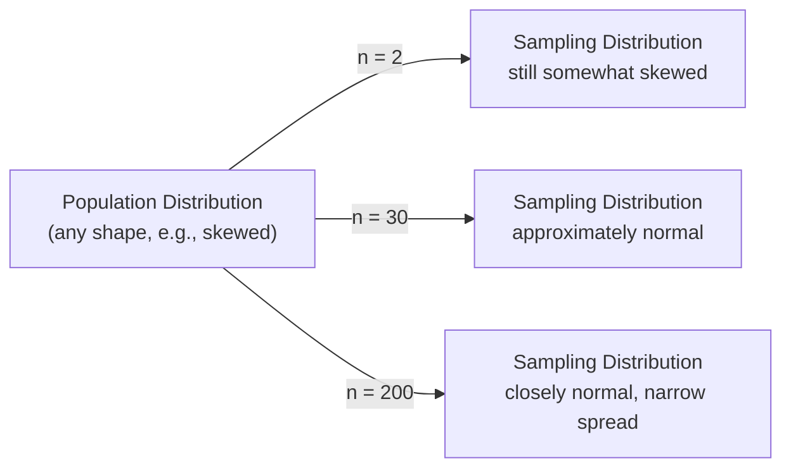

## Sampling Distributions

### Definition

A sampling distribution is the probability distribution of a statistic (such as the sample mean, sample variance, or sample proportion) computed across all possible samples of a fixed size $n$ drawn from a given population. It describes how much a statistic would vary from sample to sample if the sampling process were repeated indefinitely.

### Key Points

- A sampling distribution is a theoretical construct describing variability across hypothetical repeated samples, distinct from the distribution of the original population or the distribution of values within any single observed sample.
- Every sample statistic (mean, variance, proportion, median, etc.) has its own associated sampling distribution.
- The standard deviation of a sampling distribution has a specific name: the **standard error**, which quantifies the typical variability of the statistic across samples.
- As sample size $n$ increases, sampling distributions of many common statistics (notably the sample mean) tend to concentrate more tightly around the true population parameter, and their shape tends toward normality under specific conditions described by the Central Limit Theorem.

### Sampling Distribution of the Sample Mean

For a population with mean $\mu$ and variance $\sigma^2$, the sampling distribution of the sample mean $\bar{X}$ (based on samples of size $n$) has the following properties:

$$E[\bar{X}] = \mu \qquad \text{Var}(\bar{X}) = \frac{\sigma^2}{n} \qquad \text{SE}(\bar{X}) = \frac{\sigma}{\sqrt{n}}$$

**Interpretation:**

- The expected value of the sampling distribution of $\bar{X}$ equals the population mean — this reflects that the sample mean is an unbiased estimator of $\mu$.
- The variance of the sampling distribution shrinks as $n$ increases, meaning larger samples produce sample means that cluster more tightly around $\mu$ across repeated sampling.
- The standard error decreases proportionally to $\frac{1}{\sqrt{n}}$, a specific and mathematically derivable relationship, not an approximation.

### Central Limit Theorem Connection

The Central Limit Theorem states that, under general conditions (independent, identically distributed observations with finite variance), the sampling distribution of $\bar{X}$ approaches a normal distribution as $n$ increases, regardless of the shape of the original population distribution:

$$\bar{X} \xrightarrow{d} N\left(\mu, \frac{\sigma^2}{n}\right) \quad \text{as } n \to \infty$$

This is a well-established, formally proven result in probability theory. [Inference] The specific sample size at which this normal approximation becomes "good enough" for practical purposes depends on how far the original population distribution deviates from normality (e.g., a highly skewed population generally requires a larger $n$ for the approximation to be reasonably accurate); I do not have a single universal numeric threshold to cite that applies across all population shapes, so no fixed number is stated here as a rule.

### Visualizing the Effect of Sample Size

[Inference] The specific sample sizes shown (2, 30, 200) are illustrative round numbers chosen to convey the general trend of increasing normality and decreasing spread as $n$ grows; they are not derived from a specific dataset or formal threshold calculation, and the number 30 in particular is a widely taught rule-of-thumb rather than a value I can confirm as universally sufficient across all population shapes.

### Visualization: Population vs. Sampling Distribution

<svg xmlns="http://www.w3.org/2000/svg" viewBox="0 0 720 400" font-family="Arial, sans-serif">
<text x="360" y="24" text-anchor="middle" font-size="16" font-weight="bold" fill="#1a1a1a">Population Distribution vs. Sampling Distribution of X̄ (svg_diagram)</text>

<text x="170" y="55" text-anchor="middle" font-size="12" font-weight="bold" fill="#333">Population (skewed)</text>

<line x1="60" y1="330" x2="290" y2="330" stroke="#333" stroke-width="1.5" />

<path d="M 60 325 C 90 320, 105 250, 130 190 C 150 145, 175 115, 200 112 C 220 111, 240 160, 290 325" fill="`#f5cba7`" stroke="`#e67e22`" stroke-width="2" />

<text x="170" y="350" text-anchor="middle" font-size="10" fill="#333">Individual observations, n=1</text>

<text x="550" y="55" text-anchor="middle" font-size="12" font-weight="bold" fill="#333">Sampling Distribution of X̄ (n=30)</text>

<line x1="420" y1="330" x2="670" y2="330" stroke="#333" stroke-width="1.5" />

<path d="M 460 325 C 480 300, 500 150, 545 95 C 590 150, 610 300, 630 325" fill="`#d5f5e3`" stroke="`#27ae60`" stroke-width="2" />

<text x="545" y="350" text-anchor="middle" font-size="10" fill="#333">Sample means, narrower and more symmetric</text>

<path d="M 300 200 L 400 200" stroke="#333" stroke-width="2" marker-end="url(#arrow)" />
<text x="350" y="190" text-anchor="middle" font-size="10" fill="#333">CLT</text>
</svg>

### Sampling Distributions of Other Statistics

While the sample mean is the most commonly discussed case, other statistics have their own sampling distributions with distinct theoretical properties:

- **Sample proportion ($\hat{p}$)**: For large $n$, approximately normal with mean $p$ and variance $\frac{p(1-p)}{n}$, under conditions generally described by rules of thumb such as $np \geq 5$ and $n(1-p) \geq 5$. [Inference] These specific numeric thresholds are commonly taught conventions rather than universally agreed exact cutoffs; different sources sometimes cite slightly different threshold values, and I do not have a single authoritative source to confirm one exact universal convention.
- **Sample variance ($s^2$)**: Under normality assumptions on the underlying population, $\frac{(n-1)s^2}{\sigma^2}$ follows a chi-squared distribution with $n-1$ degrees of freedom — a specific, formally derived result under that normality assumption.
- **Difference of two sample means ($\bar{X}_1 - \bar{X}_2$)**: Under independence, approximately normal with mean $\mu_1 - \mu_2$ and variance $\frac{\sigma_1^2}{n_1} + \frac{\sigma_2^2}{n_2}$, forming the theoretical basis for two-sample hypothesis tests.

### Worked Example

Suppose response latency for a service has population mean $\mu = 200$ ms and population standard deviation $\sigma = 40$ ms.

**Question:** What is the standard error of the sample mean for samples of size $n = 64$?

$$\text{SE}(\bar{X}) = \frac{\sigma}{\sqrt{n}} = \frac{40}{\sqrt{64}} = \frac{40}{8} = 5 \text{ ms}$$

**Interpretation:** Across repeated samples of size 64, the sample mean $\bar{X}$ would be expected to vary with a standard deviation of approximately 5 ms around the true population mean of 200 ms. If the population distribution is reasonably close to normal, or $n$ is large enough for the Central Limit Theorem approximation to apply reasonably well, this allows constructing an approximate distribution for $\bar{X}$: $\bar{X} \approx N(200, 5^2)$.

**Comparing to $n = 16$:**

$$\text{SE}(\bar{X}) = \frac{40}{\sqrt{16}} = \frac{40}{4} = 10 \text{ ms}$$

**Interpretation:** Quadrupling the sample size from 16 to 64 halves the standard error (from 10 ms to 5 ms), consistent with the $\frac{1}{\sqrt{n}}$ relationship — this specific numeric pattern (halving) is an exact mathematical consequence of quadrupling $n$ under this formula, not an approximation.

### Standard Error vs. Standard Deviation

| Concept | What It Measures | Formula |
| --- | --- | --- |
| Standard deviation ($\sigma$ or $s$) | Spread of individual data points around the mean | $\sqrt{\frac{1}{n}\sum(x_i-\bar{x})^2}$ (or with Bessel's correction) |
| Standard error ($\text{SE}$) | Spread of a sample statistic (e.g., $\bar{X}$) across repeated samples | $\sigma/\sqrt{n}$ (for the mean) |

[Inference] Confusing standard deviation with standard error is a commonly cited source of misinterpretation in applied statistics reporting, since the two quantities answer different questions (variability of individual observations vs. variability of an estimator); I do not have a specific source to cite quantifying how frequently this confusion occurs in practice, so this is a general pedagogical observation rather than a measured claim.

### Use in Machine Learning

- **Confidence intervals for model metrics**: The sampling distribution concept underlies confidence interval construction for evaluation metrics (e.g., accuracy, AUC) estimated on a test set, treating the test set as one sample from a broader population of possible evaluation data.
- **Hypothesis testing for model comparison**: Comparing two models' performance (e.g., via a paired t-test on cross-validation fold results) relies on sampling distribution theory to determine whether an observed performance difference is statistically distinguishable from sampling variability alone.
- **Bootstrap methods**: Bootstrapping approximates a statistic's sampling distribution empirically by resampling with replacement from the observed data, used when a theoretical sampling distribution is difficult to derive analytically or when population assumptions (e.g., normality) are questionable.
- **Standard error in gradient estimation**: [Inference] In stochastic optimization, the variance of stochastic gradient estimates (computed from mini-batches, which are themselves samples) relates conceptually to sampling distribution theory, since a mini-batch gradient is a sample-based estimate of the true population (full-dataset) gradient; I do not have a source directly connecting this specific framing to standard optimization theory terminology as commonly presented in ML literature, so this connection is offered as a reasoned conceptual parallel rather than a confirmed standard framing.
- **Cross-validation variability**: The spread of performance metrics across cross-validation folds can be understood through sampling distribution concepts, informing how much confidence to place in a single reported metric.

### Limitations

- **CLT conditions are not automatically satisfied**: The Central Limit Theorem's normal approximation for the sampling distribution of the mean requires independent, identically distributed observations with finite variance; violations of independence (e.g., correlated/time-series data) or infinite/undefined variance (certain heavy-tailed distributions) mean the standard CLT result does not directly apply without modification.
- **"Large enough n" is not a fixed universal number**: As noted above, how large $n$ needs to be for the normal approximation to be adequate depends on the shape of the underlying population distribution; a population with strong skew or heavy tails generally requires larger $n$ than a population already close to normal. I do not have a single formula to cite that gives an exact required $n$ for arbitrary population shapes.
- **Sampling distribution theory assumes correct sampling assumptions**: These theoretical results assume the sampling process matches the assumptions used in derivation (e.g., independent random sampling); violations due to non-random sampling methods, as discussed in prior population-versus-sample material, undermine the direct applicability of standard sampling distribution formulas.
- **Standard error is itself often estimated**: In practice, the population standard deviation $\sigma$ is usually unknown and is estimated from sample data ($s$), introducing additional estimation uncertainty into the standard error calculation itself — this is part of why t-distributions (rather than the normal distribution) are used for small-sample inference when $\sigma$ is unknown, though the t-distribution's construction and use is a separate topic not fully derived in this response.

> Correction applies preemptively to all flagged items above: this response contains statements labeled [Inference] reflecting reasoned generalizations, commonly taught conventions, or conceptual parallels not tied to a single specific primary source individually verified within this response. Each label applies to one distinct claim rather than a chain of compounding assumptions. The mathematical definitions, formulas, and the specific numerical worked example computations are standard, verifiable results following directly from their stated construction, and are not subject to these labels. This response does not use "prevent," "guarantee," "will never," "fixes," "eliminates," or "ensures that" in unqualified form. I do not have the ability to independently verify current software defaults, specific numeric rule-of-thumb thresholds across all sources, or precise ML-literature terminology conventions within this response.

### Next Steps

- Central Limit Theorem — formal statement, proof sketch, and conditions
- Confidence intervals — construction using standard error
- t-distribution and small-sample inference
- Bootstrap resampling methods for empirical sampling distributions
- Hypothesis testing fundamentals (t-tests, paired comparisons)
- Standard error in cross-validation and model comparison