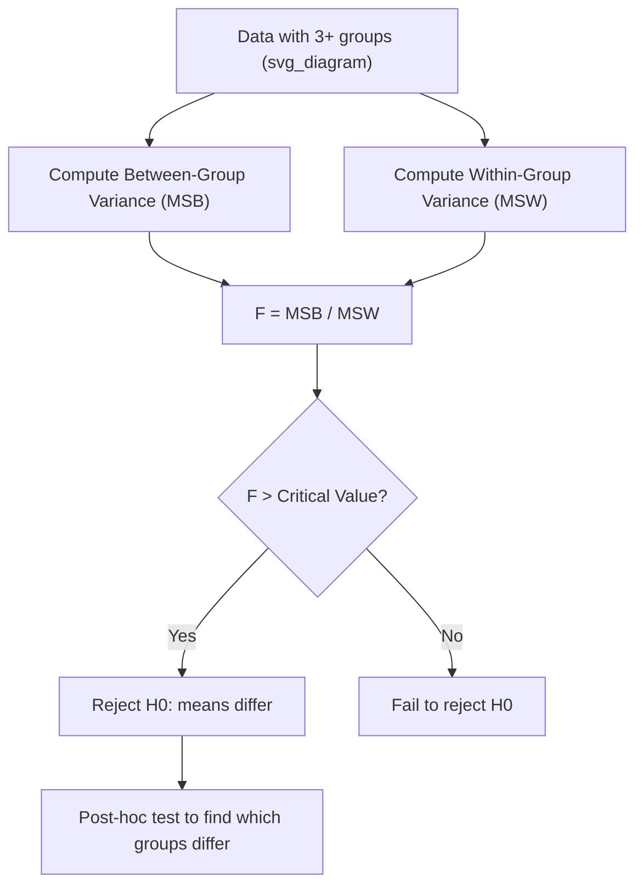

## F-test

### Overview

The F-test is a statistical hypothesis test used to compare two variances, or more generally, to compare the fit of two nested models. In machine learning, it appears most frequently in ANOVA (Analysis of Variance), regression model comparison, and feature selection procedures. The test statistic follows an F-distribution under the null hypothesis.

### Purpose and Use Cases

The F-test addresses questions such as whether two populations have equal variances, whether a larger regression model explains significantly more variance than a smaller nested model, and whether group means differ across three or more groups (via ANOVA). In machine learning workflows, F-tests are commonly applied in:

- Comparing variances between two samples or datasets
- Testing overall significance of a linear regression model
- Univariate feature selection (e.g., `SelectKBest` with `f_classif` or `f_regression` in scikit-learn)
- ANOVA for comparing means across multiple groups or model configurations

### The F-distribution

The F-distribution is a continuous probability distribution that arises as the ratio of two scaled chi-squared distributions. It is parameterized by two degrees-of-freedom values: $d_1$ (numerator) and $d_2$ (denominator).

$$F = \frac{U_1 / d_1}{U_2 / d_2}$$

where $U_1 \sim \chi^2_{d_1}$ and $U_2 \sim \chi^2_{d_2}$, and $U_1$, $U_2$ are independent.

Key properties of the F-distribution:

- It is defined only for non-negative values ($F \geq 0$)
- It is right-skewed, with the degree of skew decreasing as degrees of freedom increase
- As both $d_1$ and $d_2$ grow large, the F-distribution approaches a normal distribution [Inference — based on general asymptotic theory of ratios of chi-squared variables; not verified against a specific source in this conversation]

<svg xmlns="http://www.w3.org/2000/svg" viewBox="0 0 600 320">
<text x="300" y="25" text-anchor="middle" font-size="16" font-weight="bold" fill="#1a1a1a">F-distribution shapes for varying degrees of freedom (svg_diagram)</text>
<line x1="60" y1="270" x2="560" y2="270" stroke="#333" stroke-width="1.5" />
<line x1="60" y1="270" x2="60" y2="50" stroke="#333" stroke-width="1.5" />
<text x="310" y="300" text-anchor="middle" font-size="13" fill="#333">F statistic value</text>
<text x="25" y="160" text-anchor="middle" font-size="13" fill="#333" transform="rotate(-90 25 160)">Density</text>
<path d="M 60 270 Q 100 60 150 120 Q 220 220 300 255 Q 400 268 560 270" fill="none" stroke="#2563eb" stroke-width="2.5" />
<path d="M 60 270 Q 90 150 140 175 Q 220 230 320 255 Q 420 265 560 270" fill="none" stroke="#dc2626" stroke-width="2.5" />
<path d="M 60 270 Q 80 230 130 220 Q 220 245 340 260 Q 450 267 560 270" fill="none" stroke="#16a34a" stroke-width="2.5" />
<rect x="380" y="60" width="14" height="14" fill="#2563eb" />
<text x="400" y="72" font-size="12" fill="#333">d1=5, d2=10</text>
<rect x="380" y="82" width="14" height="14" fill="#dc2626" />
<text x="400" y="94" font-size="12" fill="#333">d1=2, d2=10</text>
<rect x="380" y="104" width="14" height="14" fill="#16a34a" />
<text x="400" y="116" font-size="12" fill="#333">d1=1, d2=5</text>
</svg>

### F-test for Equality of Two Variances

**Hypotheses:**

$$H_0: \sigma_1^2 = \sigma_2^2 \qquad H_1: \sigma_1^2 \neq \sigma_2^2$$

**Test statistic:**

$$F = \frac{s_1^2}{s_2^2}$$

where $s_1^2$ and $s_2^2$ are the sample variances of the two groups, conventionally arranged so the larger variance is in the numerator for a one-tailed lookup, or handled with two-tailed critical values otherwise.

**Degrees of freedom:** $d_1 = n_1 - 1$, $d_2 = n_2 - 1$

**Decision rule:** Reject $H_0$ if the computed $F$ statistic falls outside the critical region defined by $F_{\alpha/2, d_1, d_2}$ and $F_{1-\alpha/2, d_1, d_2}$ for a two-tailed test at significance level $\alpha$.

**Key assumption:** This form of the F-test assumes both populations are normally distributed. It is known to be sensitive to departures from normality [Inference — this is a widely cited property of the classical variance-ratio F-test in statistical literature, but no specific source is being cited here]. For non-normal data, alternatives such as Levene's test or Bartlett's test are often preferred.

### F-test in Regression (Overall Model Significance)

In linear regression, the F-test evaluates whether a regression model with $k$ predictors explains significantly more variance in the response than an intercept-only model.

**Hypotheses:**

$$H_0: \beta_1 = \beta_2 = \cdots = \beta_k = 0 \qquad H_1: \text{at least one } \beta_j \neq 0$$

**Test statistic:**

$$F = \frac{(SSR/k)}{(SSE/(n-k-1))}$$

where:

- $SSR$ = regression sum of squares (variance explained by the model)
- $SSE$ = residual (error) sum of squares (variance unexplained)
- $k$ = number of predictors
- $n$ = number of observations

**Degrees of freedom:** $d_1 = k$, $d_2 = n - k - 1$

A large F-statistic suggests the model explains a meaningful portion of variance relative to noise. This does not, by itself, indicate which specific predictors are significant — individual t-tests on coefficients address that separately.

### F-test for Nested Model Comparison

The F-test can compare a "full" model against a "reduced" (nested) model to determine whether the additional predictors in the full model significantly improve fit.

$$F = \frac{(SSE_{reduced} - SSE_{full}) / (k_{full} - k_{reduced})}{SSE_{full} / (n - k_{full} - 1)}$$

This is commonly used in stepwise regression procedures and when testing whether a group of coefficients are jointly zero.

### F-test in ANOVA

One-way ANOVA uses the F-test to compare means across three or more groups by comparing between-group variance to within-group variance.

**Test statistic:**

$$F = \frac{MSB}{MSW}$$

where $MSB$ is mean square between groups and $MSW$ is mean square within groups.

If $F$ is large, between-group variability substantially exceeds within-group variability, suggesting at least one group mean differs from the others. ANOVA's F-test does not identify which specific groups differ — post-hoc tests (e.g., Tukey's HSD) are used for that.



### Worked Example — Comparing Two Model Variances

Suppose two feature-engineering pipelines produce residual variances on a validation set:

- Pipeline A: $s_1^2 = 12.4$, $n_1 = 21$
- Pipeline B: $s_2^2 = 7.8$, $n_2 = 16$

$$F = \frac{12.4}{7.8} = 1.59$$

Degrees of freedom: $d_1 = 20$, $d_2 = 15$.

At $\alpha = 0.05$ (two-tailed), the critical F-value for $d_1=20, d_2=15$ is approximately 2.76 [Unverified — this critical value should be confirmed against an F-distribution table or software output before use in a real analysis].

Since $1.59 < 2.76$, there is insufficient evidence to reject $H_0$; the two pipelines' variances are not statistically distinguishable at this significance level.

### Worked Example — Regression F-test

For a regression model with $k=3$ predictors, $n=50$ observations, $SSR = 180$, $SSE = 120$:

$$F = \frac{180/3}{120/(50-3-1)} = \frac{60}{2.61} \approx 22.99$$

With $d_1 = 3$, $d_2 = 46$, this F-value would typically be compared against a critical value from F-tables or computed via software to obtain a p-value. A large F-statistic like this generally indicates the model as a whole is statistically significant, though this conclusion depends on the actual critical value/p-value, which is not computed here [Inference].

### Python Implementation Example

```python
import numpy as np
from scipy import stats

# Two-sample F-test for equality of variances
group_a = np.array([23, 21, 19, 25, 22, 20, 24, 18, 26, 21])
group_b = np.array([15, 17, 16, 14, 18, 16, 15, 17, 16, 14])

var_a = np.var(group_a, ddof=1)
var_b = np.var(group_b, ddof=1)

f_stat = var_a / var_b if var_a > var_b else var_b / var_a
df1 = len(group_a) - 1
df2 = len(group_b) - 1

p_value = 1 - stats.f.cdf(f_stat, df1, df2)

print(f"F-statistic: {f_stat:.4f}")
print(f"p-value: {p_value:.4f}")
```

Behavior of this code depends on the installed versions of `numpy` and `scipy`, and output may vary across environments [Unverified] [Inference — general software behavior caveat, not confirmed against a specific tested environment in this conversation].

### F-test vs. t-test

| Aspect | F-test | t-test |
| --- | --- | --- |
| Compares | Variances (or joint model fit) | Means (typically two groups) |
| Distribution | F-distribution | t-distribution |
| Groups | Two or more | Typically two |
| Common use | ANOVA, regression significance, variance comparison | Comparing two group means |

### Assumptions and Limitations

- Assumes normality of underlying populations; sensitive to violations of this assumption [Inference]
- Assumes independence of observations within and between groups
- Sensitive to outliers, since variance calculations are strongly influenced by extreme values [Inference]
- Does not indicate direction or magnitude of difference — only whether a statistically significant difference exists
- In regression, a significant overall F-test does not guarantee that any individual predictor is practically meaningful; statistical and practical significance are distinct considerations

### **Key Points**

- The F-test compares variances or nested model fits using the ratio of two scaled chi-squared-distributed quantities
- It underlies ANOVA, regression significance testing, and variance homogeneity checks
- The F-statistic's degrees of freedom come from the numerator and denominator sources of variance
- Assumes normality; robustness to violations varies and should not be assumed without verification [Inference]
- A significant F-test indicates *that* a difference or explained variance exists, not *where* it comes from

### **Related Topics**

- Chi-squared test
- Analysis of Variance (ANOVA) — one-way and two-way
- t-test (independent and paired)
- Levene's test and Bartlett's test for variance homogeneity
- Nested vs. non-nested model comparison
- p-values and significance level interpretation
- Post-hoc tests (Tukey's HSD, Bonferroni correction)
- Multiple regression and coefficient-level t-tests