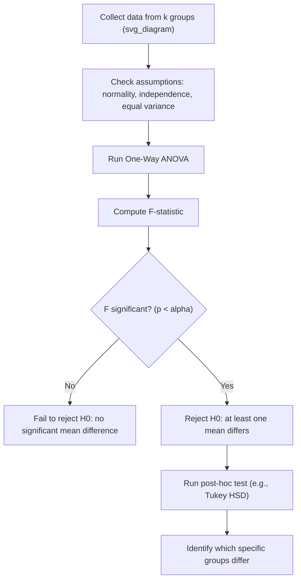

## ANOVA

### Overview

Analysis of Variance (ANOVA) is a statistical method used to test whether the means of three or more groups differ significantly. It works by partitioning total observed variance into components attributable to different sources — between-group variance and within-group variance — and comparing them via an F-test. In machine learning, ANOVA appears in feature selection, experimental design analysis, and comparing model performance across multiple configurations.

### Why Not Multiple t-tests

A natural alternative to ANOVA would be running pairwise t-tests between every group. This approach inflates the family-wise error rate: as the number of comparisons grows, the probability of at least one false positive increases substantially. ANOVA addresses this by testing all group means simultaneously with a single test, controlling the overall Type I error rate at the chosen significance level. [Inference — this is standard statistical reasoning behind ANOVA's motivation, not drawn from a specific cited source in this conversation]

### Types of ANOVA

- **One-way ANOVA**: Tests differences in means across levels of a single categorical factor
- **Two-way ANOVA**: Tests effects of two categorical factors simultaneously, including their interaction effect
- **Repeated measures ANOVA**: Used when the same subjects are measured under different conditions
- **MANOVA (Multivariate ANOVA)**: Extends ANOVA to multiple dependent variables simultaneously

### Hypotheses (One-Way ANOVA)

$$H_0: \mu_1 = \mu_2 = \cdots = \mu_k$$


$$H_1: \text{at least one } \mu_i \text{ differs from the others}$$

where $k$ is the number of groups.

### Partitioning Variance

ANOVA decomposes total variability in the data into two components:

$$SS_{Total} = SS_{Between} + SS_{Within}$$

- $SS_{Total}$: total sum of squares — variability of all observations from the grand mean
- $SS_{Between}$ (also $SSB$): variability of group means from the grand mean, weighted by group size
- $SS_{Within}$ (also $SSW$ or $SSE$): variability of individual observations from their own group mean

$$SS_{Between} = \sum_{i=1}^{k} n_i (\bar{x}_i - \bar{x})^2$$


$$SS_{Within} = \sum_{i=1}^{k} \sum_{j=1}^{n_i} (x_{ij} - \bar{x}_i)^2$$

where $n_i$ is the size of group $i$, $\bar{x}_i$ is the mean of group $i$, and $\bar{x}$ is the grand mean across all observations.

### Mean Squares and the F-statistic

$$MSB = \frac{SS_{Between}}{k - 1}$$


$$MSW = \frac{SS_{Within}}{N - k}$$


$$F = \frac{MSB}{MSW}$$

where $N$ is the total number of observations across all groups, and $k$ is the number of groups. Degrees of freedom are $d_1 = k-1$ (between) and $d_2 = N-k$ (within).

A large $F$ value indicates between-group variability substantially exceeds within-group variability, suggesting group means are not all equal. The decision to reject $H_0$ is made by comparing the computed $F$ to a critical value from the F-distribution at the chosen $\alpha$, or by evaluating the associated p-value.

### ANOVA Summary Table Structure

| Source | Sum of Squares | df | Mean Square | F |
| --- | --- | --- | --- | --- |
| Between groups | $SS_{Between}$ | $k-1$ | $MSB$ | $MSB/MSW$ |
| Within groups | $SS_{Within}$ | $N-k$ | $MSW$ | — |
| Total | $SS_{Total}$ | $N-1$ | — | — |

### Diagram: ANOVA Variance Partitioning

<svg xmlns="http://www.w3.org/2000/svg" viewBox="0 0 620 340">
<text x="310" y="25" text-anchor="middle" font-size="16" font-weight="bold" fill="#1a1a1a">ANOVA variance decomposition (svg_diagram)</text>
<rect x="220" y="50" width="180" height="45" rx="6" fill="#e0e7ff" stroke="#4338ca" stroke-width="1.5" />
<text x="310" y="77" text-anchor="middle" font-size="13" fill="#1a1a1a">Total Variance (SS_Total)</text>
<line x1="270" y1="95" x2="150" y2="140" stroke="#333" stroke-width="1.5" />
<line x1="350" y1="95" x2="470" y2="140" stroke="#333" stroke-width="1.5" />
<rect x="60" y="140" width="180" height="55" rx="6" fill="#dbeafe" stroke="#2563eb" stroke-width="1.5" />
<text x="150" y="163" text-anchor="middle" font-size="12" fill="#1a1a1a">Between-Group</text>
<text x="150" y="180" text-anchor="middle" font-size="12" fill="#1a1a1a">Variance (SSB)</text>
<rect x="380" y="140" width="180" height="55" rx="6" fill="#fee2e2" stroke="#dc2626" stroke-width="1.5" />
<text x="470" y="163" text-anchor="middle" font-size="12" fill="#1a1a1a">Within-Group</text>
<text x="470" y="180" text-anchor="middle" font-size="12" fill="#1a1a1a">Variance (SSW)</text>

<text x="150" y="220" text-anchor="middle" font-size="12" fill="#333">Group means vs.</text>

<text x="150" y="235" text-anchor="middle" font-size="12" fill="#333">grand mean</text>

<text x="470" y="220" text-anchor="middle" font-size="12" fill="#333">Observations vs.</text>

<text x="470" y="235" text-anchor="middle" font-size="12" fill="#333">own group mean</text>

<line x1="150" y1="195" x2="150" y2="260" stroke="#2563eb" stroke-width="1.2" stroke-dasharray="4,3" />
<line x1="470" y1="195" x2="470" y2="260" stroke="#dc2626" stroke-width="1.2" stroke-dasharray="4,3" />
<rect x="220" y="270" width="180" height="45" rx="6" fill="#f3f4f6" stroke="#4b5563" stroke-width="1.5" />
<text x="310" y="297" text-anchor="middle" font-size="13" fill="#1a1a1a">F = MSB / MSW</text>
</svg>

### Assumptions of ANOVA

- **Independence**: observations within and across groups are independent of one another
- **Normality**: the dependent variable is approximately normally distributed within each group
- **Homogeneity of variance (homoscedasticity)**: groups have approximately equal variances

Violations of these assumptions can affect the reliability of ANOVA's conclusions. [Inference — this is standard statistical guidance regarding ANOVA robustness, not verified against a specific source here] Formal checks include the Shapiro-Wilk test for normality and Levene's test or Bartlett's test for equality of variances. When assumptions are substantially violated, non-parametric alternatives such as the Kruskal-Wallis test are often used instead.

### Post-Hoc Testing

A significant ANOVA result indicates that at least one group mean differs from the others, but it does not identify which specific group(s) differ. Post-hoc tests are used afterward to make pairwise comparisons while controlling for multiple testing, including:

- **Tukey's HSD (Honestly Significant Difference)**
- **Bonferroni correction**
- **Scheffé's test**
- **Dunnett's test** (comparing against a single control group)



### Worked Example — One-Way ANOVA

Three model configurations are evaluated on validation accuracy across 5 runs each:

| Config A | Config B | Config C |
| --- | --- | --- |
| 0.82 | 0.79 | 0.88 |
| 0.85 | 0.81 | 0.90 |
| 0.83 | 0.78 | 0.87 |
| 0.86 | 0.80 | 0.89 |
| 0.84 | 0.77 | 0.91 |

Group means: $\bar{x}_A = 0.840$, $\bar{x}_B = 0.790$, $\bar{x}_C = 0.890$

Grand mean: $\bar{x} = 0.8400$

$SS_{Between} = 5[(0.840-0.840)^2 + (0.790-0.840)^2 + (0.890-0.840)^2] = 5[0 + 0.0025 + 0.0025] = 0.025$

$SS_{Within}$ requires summing squared deviations within each group from its own mean. Based on the listed values, this computation yields approximately $SS_{Within} \approx 0.0128$ [Unverified — this intermediate value should be recalculated independently before use, as manual computation is error-prone].

$df_{between} = 3-1 = 2$, $df_{within} = 15-3 = 12$

$MSB = 0.025/2 = 0.0125$, $MSW \approx 0.0128/12 \approx 0.00107$ [Unverified — depends on the unverified $SS_{Within}$ value above]

$F \approx 0.0125/0.00107 \approx 11.68$ [Unverified — chained from prior unverified intermediate values; should be recomputed with statistical software before being relied upon]

This F-value would then be compared to a critical value from the F-distribution with $d_1=2, d_2=12$, or converted to a p-value, to reach a conclusion. [Inference]

### Python Implementation Example

```python
import numpy as np
from scipy import stats

config_a = [0.82, 0.85, 0.83, 0.86, 0.84]
config_b = [0.79, 0.81, 0.78, 0.80, 0.77]
config_c = [0.88, 0.90, 0.87, 0.89, 0.91]

f_stat, p_value = stats.f_oneway(config_a, config_b, config_c)

print(f"F-statistic: {f_stat:.4f}")
print(f"p-value: {p_value:.6f}")
```

I cannot verify the exact numerical output of this code without executing it. Behavior may also vary depending on installed library versions. [Unverified] [Inference]

### ANOVA in Machine Learning Contexts

- **Feature selection**: `f_classif` in scikit-learn's `SelectKBest` uses one-way ANOVA F-values to rank features by how well they separate classes
- **Hyperparameter comparison**: comparing model performance across multiple configurations or random seeds
- **Experimental design**: analyzing results from designed experiments with multiple treatment groups
- **A/B/n testing**: extending beyond two-variant tests to compare three or more variants simultaneously

### Two-Way ANOVA — Brief Note

Two-way ANOVA evaluates two independent categorical factors and their potential interaction effect on a continuous outcome. It partitions variance into four components: main effect of factor 1, main effect of factor 2, interaction effect between factors 1 and 2, and residual (error) variance. This allows detection of cases where the effect of one factor depends on the level of another factor. [Inference — general description of two-way ANOVA structure; not tied to a specific source in this conversation]

### **Key Points**

- ANOVA tests whether three or more group means differ by comparing between-group and within-group variance
- The F-statistic is the ratio of mean square between groups to mean square within groups
- A significant ANOVA result indicates a difference exists somewhere among groups, not where
- Post-hoc tests are required to identify which specific groups differ
- Core assumptions are independence, normality within groups, and homogeneity of variance — violations may affect result reliability [Inference]

### **Related Topics**

- F-test and F-distribution
- Post-hoc tests: Tukey's HSD, Bonferroni correction, Scheffé's test
- Kruskal-Wallis test (non-parametric alternative to ANOVA)
- Two-way ANOVA and interaction effects
- Levene's test and Bartlett's test for variance homogeneity
- Shapiro-Wilk test for normality
- Multiple comparison problem and family-wise error rate
- Feature selection methods in machine learning