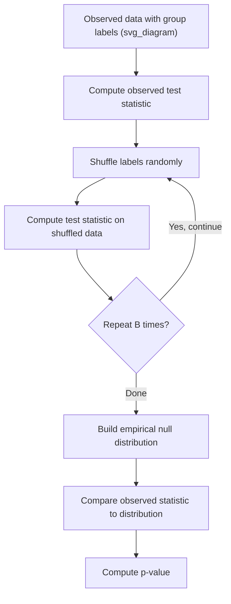

## Permutation Tests

### Overview

A permutation test is a nonparametric method for hypothesis testing that determines statistical significance by directly computing or estimating the distribution of a test statistic under $H_0$, using the observed data itself. Rather than relying on a theoretical reference distribution (like the t- or F-distribution), permutation tests repeatedly reshuffle (permute) the observed data labels to build an empirical null distribution against which the observed test statistic is compared. In machine learning, permutation tests are used for model validation, feature importance assessment, and comparing model performance without relying on distributional assumptions.

### Core Logic

Under the null hypothesis of no association or no difference between groups, the specific labeling of observations into groups is considered arbitrary — any relabeling should be equally likely to produce a similar test statistic. Permutation tests exploit this by generating many relabeled versions of the data, computing the test statistic for each, and comparing the observed statistic's position within this generated distribution.

$$p\text{-value} = \frac{\#(\text{permuted statistics} \geq \text{observed statistic}) + 1}{B + 1}$$

where $B$ is the number of permutations performed. The $+1$ in numerator and denominator accounts for the observed statistic itself being one valid arrangement under $H_0$. [Inference — this is a standard formulation described in permutation testing literature; not verified against a specific cited source in this conversation]

### General Procedure

1. Compute the test statistic (e.g., difference in means, correlation coefficient) on the original, observed data
2. Randomly shuffle the group labels or pairings while keeping the data values fixed
3. Recompute the test statistic on the shuffled data
4. Repeat steps 2–3 many times (e.g., 1,000 to 10,000 permutations) to build an empirical null distribution
5. Compare the observed statistic to this empirical distribution to obtain a p-value



### Exact vs. Approximate Permutation Tests

- **Exact permutation test**: enumerates *all* possible permutations of the data. This is only computationally feasible for small sample sizes, since the number of possible permutations grows factorially with sample size
- **Approximate (Monte Carlo) permutation test**: randomly samples a large but finite number of permutations ($B$) rather than enumerating all of them, providing an approximation to the exact p-value

For most practical machine learning applications with even moderate sample sizes, exact enumeration is computationally infeasible, so Monte Carlo approximation is used instead. [Inference]

### Permutation Test for Two-Sample Mean Difference

**Hypotheses:**

$$H_0: \text{the two groups come from the same distribution}$$


$$H_1: \text{the two groups differ (e.g., in mean)}$$

**Observed statistic:**

$$T_{obs} = \bar{x}_1 - \bar{x}_2$$

**Procedure:** Pool both samples, randomly reassign observations into two groups of the original sizes $n_1$ and $n_2$, recompute the mean difference, and repeat. The p-value is the proportion of permuted mean differences at least as extreme as $T_{obs}$.

### Diagram: Permutation Test Null Distribution

<svg xmlns="http://www.w3.org/2000/svg" viewBox="0 0 620 340">
<text x="310" y="25" text-anchor="middle" font-size="16" font-weight="bold" fill="#1a1a1a">Empirical null distribution from permutations (svg_diagram)</text>
<line x1="60" y1="280" x2="580" y2="280" stroke="#333" stroke-width="1.5" />
<line x1="60" y1="280" x2="60" y2="60" stroke="#333" stroke-width="1.5" />
<text x="320" y="310" text-anchor="middle" font-size="12" fill="#333">Permuted test statistic value</text>
<rect x="100" y="240" width="20" height="40" fill="#93c5fd" />
<rect x="125" y="200" width="20" height="80" fill="#93c5fd" />
<rect x="150" y="160" width="20" height="120" fill="#93c5fd" />
<rect x="175" y="130" width="20" height="150" fill="#93c5fd" />
<rect x="200" y="110" width="20" height="170" fill="#93c5fd" />
<rect x="225" y="100" width="20" height="180" fill="#93c5fd" />
<rect x="250" y="110" width="20" height="170" fill="#93c5fd" />
<rect x="275" y="130" width="20" height="150" fill="#93c5fd" />
<rect x="300" y="160" width="20" height="120" fill="#93c5fd" />
<rect x="325" y="200" width="20" height="80" fill="#93c5fd" />
<rect x="350" y="240" width="20" height="40" fill="#93c5fd" />
<line x1="470" y1="65" x2="470" y2="280" stroke="#dc2626" stroke-width="2.5" stroke-dasharray="6,4" />
<text x="470" y="55" text-anchor="middle" font-size="12" fill="#dc2626" font-weight="bold">Observed statistic</text>

<text x="500" y="150" font-size="11" fill="#333">Region beyond</text>

<text x="500" y="165" font-size="11" fill="#333">observed value</text>

<text x="500" y="180" font-size="11" fill="#333">→ contributes to p-value</text>

</svg>

### Worked Example — Permutation Test for Two-Sample Comparison

Two model training strategies produce validation accuracies:

- Strategy A: $[0.84, 0.86, 0.83, 0.87]$, mean $= 0.850$
- Strategy B: $[0.80, 0.81, 0.79, 0.82]$, mean $= 0.805$

Observed statistic: $T_{obs} = 0.850 - 0.805 = 0.045$

To conduct this test properly, all $\binom{8}{4} = 70$ possible relabelings (since this is a small enough sample for exact enumeration) would need to be evaluated, or a Monte Carlo approximation with many random shuffles would need to be run. I have not performed this full enumeration or simulation here, so I cannot state a resulting p-value. I cannot verify a numeric result without actually carrying out the permutation procedure, and I will not present an estimated p-value as fact.

The general interpretation: if very few of the 70 possible relabelings produce a mean difference as large as or larger than $0.045$ in absolute value, the result would be considered statistically significant at a correspondingly small p-value threshold.

### Python Implementation Example

```python
import numpy as np

def permutation_test(group_a, group_b, n_permutations=10000, seed=None):
    rng = np.random.default_rng(seed)
    observed_diff = np.mean(group_a) - np.mean(group_b)
    pooled = np.concatenate([group_a, group_b])
    n_a = len(group_a)
    count = 0
    for _ in range(n_permutations):
        rng.shuffle(pooled)
        perm_a = pooled[:n_a]
        perm_b = pooled[n_a:]
        perm_diff = np.mean(perm_a) - np.mean(perm_b)
        if abs(perm_diff) >= abs(observed_diff):
            count += 1
    p_value = (count + 1) / (n_permutations + 1)
    return observed_diff, p_value

group_a = np.array([0.84, 0.86, 0.83, 0.87])
group_b = np.array([0.80, 0.81, 0.79, 0.82])

diff, p_val = permutation_test(group_a, group_b, n_permutations=10000, seed=42)
print(f"Observed difference: {diff:.4f}")
print(f"p-value: {p_val:.4f}")
```

I cannot verify the exact numeric output of this code without executing it. Behavior of this code is also stochastic (dependent on the random shuffling process) and may differ slightly between runs unless a fixed seed produces identical results across environments, which itself is not guaranteed across all library versions or platforms. [Unverified] [Inference]

### Permutation Tests vs. Parametric Tests

| Aspect | Permutation Test | Parametric Test (e.g., t-test) |
| --- | --- | --- |
| Distributional assumption | None required | Assumes specific distribution (e.g., normal) |
| Reference distribution | Empirically generated from the data | Theoretical (e.g., t, F, chi-squared) |
| Computational cost | Higher, especially for large $B$ or exact enumeration | Lower, closed-form calculation |
| Small sample suitability | Can be exact for small samples | May be unreliable if normality is violated |
| Flexibility | Can be adapted to nearly any test statistic | Limited to statistics with known theoretical distributions |

### Permutation Feature Importance in Machine Learning

A widely used machine learning application of permutation logic is **permutation feature importance**, which assesses a feature's contribution to model performance by randomly shuffling that feature's values and measuring the resulting drop in model performance.

**Procedure:**

1. Train a model and record baseline performance (e.g., accuracy, $R^2$)
2. Randomly permute the values of a single feature across the dataset, breaking its relationship with the target
3. Recompute model performance on the permuted data
4. The importance score is the difference (or ratio) between baseline and permuted performance
5. Repeat for each feature of interest

This differs conceptually from the classical permutation *hypothesis test* described above, though both rely on the same underlying logic of breaking an association through relabeling/shuffling to assess its contribution. [Inference — this is a reasonable connection I am drawing between the two concepts based on their shared shuffling logic; it is not a claim sourced from a specific document in this conversation]

Permutation feature importance is considered less biased toward high-cardinality features than some impurity-based importance measures (e.g., default feature importance in some tree-based models), though this comparison depends on implementation details and dataset characteristics. [Unverified] [Inference — general claim about relative bias between importance methods; behavior can vary by implementation and is not confirmed against a specific source here]

### Permutation Tests for Model Comparison

Permutation tests can compare two models' performance (e.g., cross-validation accuracy scores) without assuming the score differences are normally distributed, which is useful since performance metrics across folds are often correlated and non-normal. [Inference — this is a commonly cited motivation in ML evaluation methodology discussions, not verified against a specific source here]

### Advantages and Limitations

**Advantages:**

- Makes minimal distributional assumptions about the underlying data
- Directly tied to the actual observed data rather than a theoretical approximation
- Flexible: can be applied to nearly any test statistic, not just means or variances
- Well suited to small sample sizes where asymptotic approximations may be unreliable

**Limitations:**

- Computationally expensive, particularly for large datasets or when many permutations are required
- Assumes exchangeability of observations under $H_0$ (i.e., that all labelings are equally likely under the null) — this assumption can be violated in data with dependence structures, such as time series or clustered data [Inference]
- Monte Carlo approximation introduces some randomness into the resulting p-value, though this can be reduced by increasing $B$ [Inference]
- Not inherently suited to complex study designs (e.g., certain repeated-measures or hierarchical structures) without careful adaptation of the shuffling scheme

### **Key Points**

- Permutation tests build an empirical null distribution by reshuffling observed data rather than relying on a theoretical distribution
- They require minimal distributional assumptions, mainly exchangeability under $H_0$ [Inference]
- Exact permutation tests enumerate all relabelings; Monte Carlo permutation tests approximate this with a large random sample of relabelings
- Permutation feature importance in machine learning applies similar shuffling logic to assess a feature's contribution to model performance, though it is conceptually distinct from a formal permutation hypothesis test [Inference]
- Permutation tests are computationally more expensive than parametric alternatives but avoid reliance on distributional assumptions

### **Related Topics**

- Bootstrap methods and resampling techniques
- Nonparametric tests (Mann-Whitney U, Kruskal-Wallis)
- Multiple testing correction
- Feature importance methods in machine learning (permutation-based vs. impurity-based)
- Cross-validation and model comparison methodology
- Monte Carlo simulation
- Exchangeability assumption in statistical inference