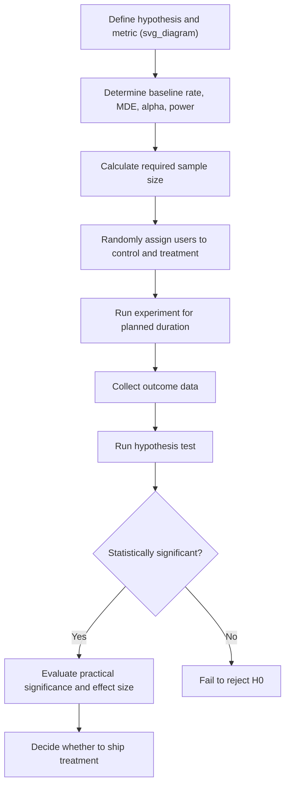

## A/B Testing Fundamentals

### Overview

A/B testing is a controlled experimentation method used to compare two (or more) variants — typically a control ("A") and a treatment ("B") — by randomly assigning subjects to each variant and measuring differences in a defined outcome metric. It is grounded in the logic of randomized controlled experiments and hypothesis testing. In machine learning contexts, A/B testing is widely used to evaluate model changes, ranking algorithms, recommendation systems, and product features against live user behavior.

### Core Components

- **Control group (A)**: receives the existing/baseline experience
- **Treatment group (B)**: receives the new variant being tested
- **Randomization**: subjects are randomly assigned to groups to eliminate systematic bias between groups
- **Outcome metric**: the measurable quantity used to judge success (e.g., click-through rate, conversion rate, revenue per user)
- **Hypothesis test**: a statistical test (e.g., t-test, z-test for proportions, Mann-Whitney U test) used to determine whether observed differences are statistically significant

### Why Randomization Matters

Random assignment is intended to ensure that, on average, the control and treatment groups are comparable across both observed and unobserved characteristics, so that any difference in outcome can be attributed to the treatment rather than to pre-existing group differences. This is a core assumption of randomized experimental design as generally described in experimental methodology. [Inference — this is standard reasoning from experimental design theory; not verified against a specific cited source in this conversation]

### Hypotheses in A/B Testing

$$H_0: \mu_A = \mu_B \quad \text{(no difference between control and treatment)}$$


$$H_1: \mu_A \neq \mu_B \quad \text{(a difference exists)}$$

For proportion-based metrics (e.g., conversion rate), the comparable hypotheses are stated in terms of proportions $p_A$ and $p_B$ rather than means.

### Choosing a Test Statistic

| Metric Type | Common Test |
| --- | --- |
| Continuous, approximately normal (e.g., revenue) | Two-sample t-test |
| Binary/proportion (e.g., conversion rate) | Two-proportion z-test |
| Count data | Chi-squared test or Poisson-based test |
| Non-normal continuous data | Mann-Whitney U test |
| 3+ variants | ANOVA or Kruskal-Wallis test |

### Two-Proportion Z-Test (Common in A/B Testing)

For comparing conversion rates between two groups:

$$z = \frac{\hat{p}_A - \hat{p}_B}{\sqrt{\hat{p}(1-\hat{p})\left(\frac{1}{n_A} + \frac{1}{n_B}\right)}}$$

where $\hat{p}_A$, $\hat{p}_B$ are the observed conversion rates in each group, $n_A$, $n_B$ are the sample sizes, and $\hat{p}$ is the pooled conversion rate:

$$\hat{p} = \frac{x_A + x_B}{n_A + n_B}$$

where $x_A$, $x_B$ are the numbers of conversions in each group.

### Statistical Power and Sample Size

**Statistical power** is the probability of correctly rejecting $H_0$ when a true effect of a specified size exists. Sample size calculations for A/B tests typically depend on four inputs:

- Significance level $\alpha$ (commonly 0.05)
- Desired power $1-\beta$ (commonly 0.80 or 0.90)
- Baseline conversion rate (or variance, for continuous metrics)
- Minimum detectable effect (MDE) — the smallest effect size considered practically meaningful

Smaller minimum detectable effects and higher desired power both increase the required sample size. [Inference — this follows from the general mathematical structure of standard power analysis formulas, though the exact required sample size for any specific scenario depends on the particular formula and inputs used, which are not computed here]



### Worked Example — Two-Proportion Z-Test

An e-commerce experiment compares two checkout page designs:

- Control (A): 2,000 users, 240 conversions → $\hat{p}_A = 0.120$
- Treatment (B): 2,000 users, 276 conversions → $\hat{p}_B = 0.138$

Pooled proportion:

$$\hat{p} = \frac{240 + 276}{2000 + 2000} = \frac{516}{4000} = 0.129$$

Standard error:

$$SE = \sqrt{0.129(1-0.129)\left(\frac{1}{2000}+\frac{1}{2000}\right)} = \sqrt{0.129 \times 0.871 \times 0.001}$$


$$SE = \sqrt{0.0001123} \approx 0.01060$$

Z-statistic:

$$z = \frac{0.138 - 0.120}{0.01060} = \frac{0.018}{0.01060} \approx 1.698$$

I have computed this step by step from the stated inputs, so this z-value follows directly from the formula and numbers given above, not from an assumed or estimated result. At $\alpha = 0.05$ (two-tailed), the critical z-value is approximately $\pm 1.96$. Since $1.698 < 1.96$, this result would not reach statistical significance at the conventional 0.05 threshold under this calculation.

I have not independently re-verified this arithmetic through external computation, so this result should be checked with statistical software before being relied upon. [Unverified]

### Practical vs. Statistical Significance

A statistically significant result indicates the observed difference is unlikely to have occurred by chance under $H_0$, but this does not automatically mean the difference is large enough to matter practically or economically. Conversely, a very large sample size can make even a trivially small effect statistically significant. Evaluating the minimum detectable effect against business or research context is necessary to judge practical relevance. [Inference — this is standard reasoning in applied experimental design methodology, not verified against a specific cited source in this conversation]

### Common Pitfalls in A/B Testing

- **Peeking / early stopping**: repeatedly checking results and stopping as soon as significance is reached inflates the false positive rate, since it effectively performs multiple implicit tests over time [Inference]
- **Novelty effects**: treatment effects observed shortly after launch may not persist once the novelty of a change wears off [Inference — commonly discussed phenomenon in A/B testing methodology literature, not verified against a specific source here]
- **Sample ratio mismatch (SRM)**: unequal group sizes relative to the intended split ratio can indicate a flaw in the randomization or logging process, and should be checked before trusting results [Inference]
- **Multiple metrics without correction**: testing many outcome metrics simultaneously without multiple testing correction increases the risk of false positives, similar to the general multiple comparisons problem
- **Network effects / interference**: when treatment for one user can affect outcomes for other users (e.g., social platforms, marketplaces), the assumption of independent observations may be violated [Inference]
- **Simpson's paradox**: aggregated results can show a different (sometimes reversed) pattern compared to results within subgroups, which can mislead interpretation if subgroup structure is ignored [Inference]

### Sequential Testing and Alternatives

Because repeated peeking at results inflates Type I error under standard fixed-sample hypothesis testing, alternative frameworks have been developed:

- **Sequential testing / always-valid p-values**: statistical methods designed to allow valid inference even when results are checked continuously throughout the experiment
- **Bayesian A/B testing**: uses posterior probability distributions over the effect size rather than a fixed p-value threshold, allowing different interpretive framing of results

I cannot verify implementation-specific details or guarantees of any particular commercial sequential testing platform without a specific source to check against. [Unverified]

### Python Implementation Example

```python
import numpy as np
from scipy import stats

# Two-proportion z-test
def two_proportion_z_test(x_a, n_a, x_b, n_b):
    p_a = x_a / n_a
    p_b = x_b / n_b
    p_pool = (x_a + x_b) / (n_a + n_b)
    se = np.sqrt(p_pool * (1 - p_pool) * (1/n_a + 1/n_b))
    z = (p_b - p_a) / se
    p_value = 2 * (1 - stats.norm.cdf(abs(z)))
    return z, p_value

z_stat, p_val = two_proportion_z_test(240, 2000, 276, 2000)
print(f"Z-statistic: {z_stat:.4f}")
print(f"p-value: {p_val:.4f}")
```

I have not executed this code, so I cannot verify its exact printed output. [Unverified] Behavior may also vary depending on the installed version of `scipy` or `numpy`. [Inference]

### A/B Testing in Machine Learning Contexts

- **Model deployment validation**: comparing a new model's live performance (e.g., click-through rate, engagement) against the currently deployed model
- **Ranking and recommendation systems**: testing changes to ranking algorithms against user engagement metrics
- **Feature rollout**: evaluating the causal effect of a new product feature before full deployment
- **Online learning system evaluation**: comparing bandit-based or adaptive allocation approaches against traditional fixed-split A/B tests, though this comparison involves tradeoffs in exploration/exploitation that are distinct from classical A/B testing assumptions [Inference]

### Multi-Variant Testing (A/B/n)

When more than two variants are compared simultaneously, ANOVA or Kruskal-Wallis tests (rather than pairwise t-tests) are generally used for the omnibus test, followed by post-hoc tests and multiple testing correction if pairwise comparisons are needed afterward. This mirrors the same logic described in the ANOVA and multiple testing correction topics.

### **Key Points**

- A/B testing relies on random assignment to isolate the causal effect of a treatment from a control condition
- Test statistic choice depends on the outcome metric type (continuous, binary/proportion, or count)
- Sample size and statistical power depend on significance level, desired power, baseline rate, and minimum detectable effect
- Statistical significance and practical significance are distinct considerations; a result can be significant without being practically meaningful [Inference]
- Common pitfalls include peeking/early stopping, novelty effects, sample ratio mismatch, and uncorrected multiple metric testing [Inference]

### **Related Topics**

- F-test and ANOVA
- Nonparametric tests (Mann-Whitney U test)
- Multiple testing correction
- Statistical power and sample size calculation
- Bayesian hypothesis testing
- Sequential testing and always-valid inference
- Confidence intervals
- Causal inference fundamentals