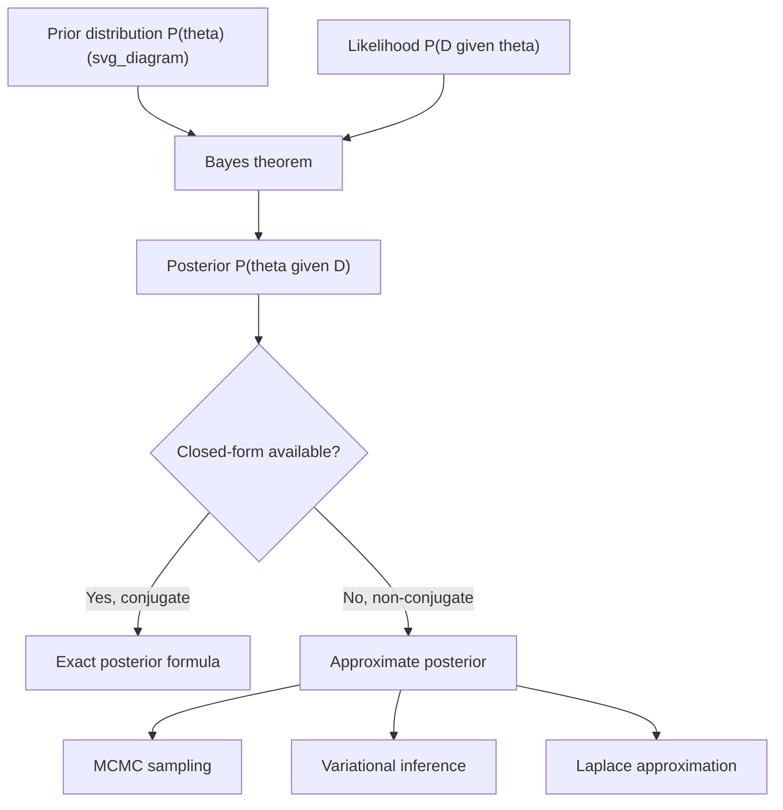

## Posterior Distribution

### Overview

A posterior distribution represents the updated probability distribution over a parameter after observing data, obtained by combining a prior distribution with the likelihood of the observed data via Bayes' theorem. It is the central object of inference in Bayesian statistics, encoding both the information contained in the data and the beliefs expressed by the prior. In machine learning, posterior distributions underlie Bayesian model fitting, uncertainty quantification, and probabilistic prediction.

### Formal Definition

$$P(\theta \mid D) = \frac{P(D \mid \theta)\, P(\theta)}{P(D)}$$

where:

- $P(\theta \mid D)$ is the posterior distribution over parameter $\theta$ given data $D$
- $P(D \mid \theta)$ is the likelihood
- $P(\theta)$ is the prior
- $P(D)$ is the marginal likelihood (evidence), computed as $P(D) = \int P(D \mid \theta) P(\theta)\, d\theta$

Since $P(D)$ does not depend on $\theta$, the posterior is often expressed proportionally:

$$P(\theta \mid D) \propto P(D \mid \theta)\, P(\theta)$$

meaning the posterior is proportional to likelihood times prior, with $P(D)$ serving only as a normalizing constant so the posterior integrates to 1.

### Conceptual Role

The posterior distribution answers the question: "Given what I believed before (the prior) and what the data show (the likelihood), what do I now believe about the parameter?" It reflects a combination of prior information and data-driven evidence, weighted according to their relative strength and precision. [Inference — this is a standard conceptual description found in Bayesian statistics literature, not verified against a specific cited source in this conversation]

### Worked Example — Beta-Binomial Posterior

Using the conjugate Beta-Binomial setup: if the prior is $\theta \sim \text{Beta}(\alpha, \beta)$ and $x$ successes are observed in $n$ trials, the posterior is:

$$\theta \mid x \sim \text{Beta}(\alpha + x,\ \beta + n - x)$$

**Numeric example:** prior $\text{Beta}(3, 3)$, and 14 successes observed in 25 trials.

$$\text{Posterior} = \text{Beta}(3+14,\ 3+25-14) = \text{Beta}(17, 14)$$

Posterior mean:

$$E[\theta \mid x] = \frac{17}{17+14} = \frac{17}{31} \approx 0.548$$

This value is derived directly from the standard formula for the mean of a Beta distribution applied to the stated posterior parameters, so it follows mathematically from the inputs given, not from an estimate.

<svg xmlns="http://www.w3.org/2000/svg" viewBox="0 0 620 340">
<text x="310" y="25" text-anchor="middle" font-size="16" font-weight="bold" fill="#1a1a1a">Prior, likelihood, and posterior relationship (svg_diagram)</text>
<line x1="60" y1="280" x2="580" y2="280" stroke="#333" stroke-width="1.5" />
<line x1="60" y1="280" x2="60" y2="50" stroke="#333" stroke-width="1.5" />
<text x="320" y="310" text-anchor="middle" font-size="12" fill="#333">theta</text>
<path d="M 60 240 Q 220 60 320 60 Q 420 60 580 240" fill="none" stroke="#93c5fd" stroke-width="2.5" />
<text x="130" y="90" font-size="12" fill="#2563eb" font-weight="bold">Prior</text>
<path d="M 60 275 Q 300 270 420 90 Q 480 270 580 278" fill="none" stroke="#fca5a5" stroke-width="2.5" />
<text x="440" y="120" font-size="12" fill="#dc2626" font-weight="bold">Likelihood</text>
<path d="M 60 279 Q 320 275 380 100 Q 440 275 580 279" fill="none" stroke="#16a34a" stroke-width="3" />
<text x="330" y="130" font-size="12" fill="#16a34a" font-weight="bold">Posterior</text>
</svg>

### Point Summaries of the Posterior

Because the posterior is a full distribution, several summary statistics are commonly reported to communicate it concisely:

- **Posterior mean**: $E[\theta \mid D]$, the expected value under the posterior
- **Posterior median**: the value splitting the posterior distribution into two equal-probability halves
- **Maximum a Posteriori (MAP) estimate**: the value of $\theta$ that maximizes the posterior density, $\hat{\theta}_{MAP} = \arg\max_\theta P(\theta \mid D)$
- **Posterior variance / standard deviation**: quantifies the spread or uncertainty of the posterior

These summaries can differ from one another, particularly for skewed posterior distributions, where mean, median, and mode do not coincide. [Inference — this is a general mathematical property of skewed distributions, not specific to any single cited source]

### Credible Intervals

A **credible interval** is a range of parameter values that contains a specified proportion (e.g., 95%) of the posterior probability mass.

$$P(\theta_{lower} \leq \theta \leq \theta_{upper} \mid D) = 0.95$$

This differs conceptually from a frequentist confidence interval. A 95% credible interval is generally interpreted as: given the model and prior, there is a 95% posterior probability that the true parameter lies within the interval. A 95% confidence interval instead makes a claim about the long-run behavior of the interval-construction procedure across repeated sampling, not a direct probability statement about the parameter for the specific interval observed. [Inference — this reflects a widely cited conceptual distinction in Bayesian vs. frequentist statistics literature; not verified against a specific source in this conversation]

### Credible Interval vs. Confidence Interval

| Aspect | Credible Interval (Bayesian) | Confidence Interval (Frequentist) |
| --- | --- | --- |
| Interpretation | Direct probability statement about $\theta$ given the data | Statement about long-run coverage across repeated samples |
| Requires prior | Yes | No |
| Parameter treated as | Random variable with a distribution | Fixed, unknown constant |

### Analytical vs. Approximate Posteriors

- **Conjugate cases**: when the prior is conjugate to the likelihood, the posterior has a closed-form expression (e.g., Beta-Binomial, Normal-Normal, Gamma-Poisson)
- **Non-conjugate cases**: for most realistic models, especially high-dimensional ones, the posterior does not have a closed-form solution and must be approximated

**Common approximation methods:**

- **Markov Chain Monte Carlo (MCMC)**: generates samples from the posterior distribution using methods such as Metropolis-Hastings or Hamiltonian Monte Carlo, allowing approximation of the posterior through the empirical distribution of samples
- **Variational Inference**: approximates the posterior with a simpler, tractable distribution by optimizing the parameters of that distribution to minimize a divergence measure (commonly the Kullback-Leibler divergence) relative to the true posterior
- **Laplace Approximation**: approximates the posterior with a Gaussian distribution centered at the MAP estimate, using the curvature of the log-posterior at that point [Inference — standard description found in Bayesian computational statistics literature; not verified against a specific source in this conversation]



### Python Implementation Example

```python
import numpy as np
from scipy import stats

# Beta-Binomial posterior
alpha_prior, beta_prior = 3, 3
successes, trials = 14, 25

alpha_post = alpha_prior + successes
beta_post = beta_prior + (trials - successes)

posterior = stats.beta(alpha_post, beta_post)

posterior_mean = posterior.mean()
credible_interval = posterior.interval(0.95)

print(f"Posterior mean: {posterior_mean:.4f}")
print(f"95% credible interval: {credible_interval}")
```

I have not executed this code, so I cannot verify its exact printed output. [Unverified] Behavior may also vary depending on the installed version of `scipy`. [Inference]

### Posterior Predictive Distribution

Beyond inference about the parameter itself, Bayesian analysis often uses the posterior to predict new, unobserved data points by integrating over the full posterior uncertainty in the parameter:

$$P(x_{new} \mid D) = \int P(x_{new} \mid \theta)\, P(\theta \mid D)\, d\theta$$

This approach incorporates parameter uncertainty directly into predictions, rather than conditioning on a single point estimate (such as the MAP or MLE) as if it were known with certainty. [Inference — this is a standard conceptual description of posterior predictive distributions in Bayesian statistics literature, not verified against a specific source in this conversation]

### Posterior Distributions in Machine Learning Contexts

- **Bayesian linear and logistic regression**: the posterior over regression coefficients captures uncertainty in the learned relationship, rather than producing a single fixed coefficient estimate
- **Bayesian neural networks**: the posterior over network weights is generally intractable for realistic network sizes and requires approximate inference methods such as variational inference or MCMC [Inference]
- **Gaussian processes**: the posterior is computed over functions, conditioned on observed data points, and has a closed-form expression under a Gaussian likelihood and Gaussian process prior [Inference]
- **Topic models (e.g., Latent Dirichlet Allocation)**: posterior distributions over latent topic assignments and topic-word distributions are typically approximated via variational inference or Gibbs sampling (a form of MCMC) [Inference — this reflects commonly cited estimation approaches in topic modeling literature, not verified against a specific source in this conversation]

I cannot verify implementation-specific behavior of any particular software library's posterior inference routines without checking a specific, named source. [Unverified]

### Sensitivity of the Posterior to Prior and Data

- With large amounts of informative data, the posterior tends to be dominated by the likelihood, and different reasonable prior choices tend to produce increasingly similar posteriors. [Inference — this is a widely stated asymptotic property in Bayesian statistics literature, not verified against a specific source in this conversation]
- With small or weakly informative data, the posterior can remain substantially influenced by the choice of prior. [Inference]
- Model misspecification (an incorrect likelihood or an inappropriate prior family) can bias the posterior regardless of the amount of data, since Bayesian updating assumes the specified model is a reasonable representation of the data-generating process. [Inference]

### Limitations and Considerations

- Computing or approximating the posterior for complex, high-dimensional models can be computationally demanding, particularly for MCMC methods, which may require substantial sampling to achieve reliable convergence [Inference]
- Variational inference is generally faster than MCMC but provides only an approximate posterior, and the quality of that approximation depends on the chosen variational family, which may not capture the true posterior's shape (e.g., multimodality) well [Inference]
- Diagnosing convergence and reliability of posterior approximations (e.g., MCMC chain diagnostics) is a nontrivial part of practical Bayesian workflow and is not guaranteed to be straightforward in all model settings [Inference]
- I cannot verify claims about the correctness or convergence behavior of any specific software implementation without a named, checkable source. [Unverified]

### **Key Points**

- The posterior distribution combines the prior and likelihood via Bayes' theorem to represent updated belief about a parameter after observing data
- Conjugate prior-likelihood pairs yield closed-form posteriors; otherwise, approximation methods such as MCMC, variational inference, or Laplace approximation are required [Inference]
- Credible intervals from the posterior have a direct probability interpretation, distinct from the repeated-sampling interpretation of frequentist confidence intervals [Inference]
- The posterior predictive distribution incorporates parameter uncertainty into predictions about new data [Inference]
- Posterior sensitivity to prior choice generally decreases as data quantity and informativeness increase, though this is not guaranteed in every specific case [Inference]

### **Related Topics**

- Prior distributions and Bayesian inference
- Likelihood function and Maximum Likelihood Estimation
- Markov Chain Monte Carlo (MCMC) methods
- Variational inference
- Credible intervals vs. confidence intervals
- Conjugate prior families
- Bayesian model comparison and Bayes factors
- Posterior predictive checks