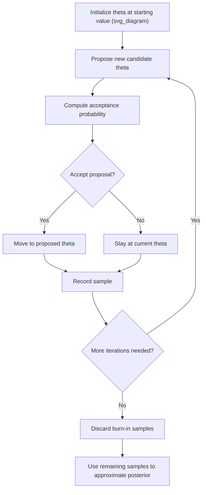

## Markov Chain Monte Carlo

### Overview

Markov Chain Monte Carlo (MCMC) is a class of algorithms for drawing samples from a probability distribution — most commonly a Bayesian posterior distribution — when direct sampling or closed-form computation is not feasible. MCMC methods construct a Markov chain whose stationary (equilibrium) distribution equals the target distribution, so that after sufficient iterations, the chain's samples can be treated as approximate draws from that target. In machine learning, MCMC is used for Bayesian inference in non-conjugate models, Bayesian neural networks, probabilistic graphical models, and complex hierarchical models.

### Why MCMC Is Needed

For many realistic models, the posterior distribution $P(\theta \mid D) \propto P(D \mid \theta)P(\theta)$ does not have a closed-form expression, because the normalizing constant $P(D) = \int P(D\mid\theta)P(\theta)\,d\theta$ is often analytically intractable, particularly in high-dimensional parameter spaces. MCMC circumvents the need to compute this normalizing constant directly, since most MCMC algorithms only require evaluating the *unnormalized* posterior (likelihood times prior) at each candidate point. [Inference — this is a standard motivating explanation found in Bayesian computational statistics literature; not verified against a specific cited source in this conversation]

### Core Concept: Markov Chains

A Markov chain is a sequence of random variables where the probability of transitioning to the next state depends only on the current state, not on the sequence of states that preceded it (the Markov property). MCMC algorithms are designed so that this chain's long-run stationary distribution matches the target distribution of interest (e.g., the posterior). This is a defining mathematical property required for any valid MCMC algorithm, not itself an unverified claim.

### General MCMC Procedure

1. Initialize the chain at some starting parameter value $\theta^{(0)}$
2. At each iteration, propose a new candidate value based on the current state, using an algorithm-specific proposal mechanism
3. Accept or reject the proposed value according to an algorithm-specific acceptance rule, designed so the chain's stationary distribution equals the target distribution
4. Repeat for many iterations, producing a sequence of samples $\theta^{(1)}, \theta^{(2)}, \ldots, \theta^{(T)}$
5. Discard an initial "burn-in" period and use the remaining samples to approximate the target distribution



### Metropolis-Hastings Algorithm

The Metropolis-Hastings algorithm is a general-purpose MCMC method that proposes new states from a proposal distribution $q(\theta' \mid \theta)$ and accepts or rejects them probabilistically.

**Acceptance probability:**

$$\alpha(\theta \to \theta') = \min\left(1,\ \frac{P(\theta' \mid D)\, q(\theta \mid \theta')}{P(\theta \mid D)\, q(\theta' \mid \theta)}\right)$$

Since $P(\theta \mid D) \propto P(D\mid\theta)P(\theta)$, the intractable normalizing constant $P(D)$ cancels out in this ratio, which is why Metropolis-Hastings only requires the unnormalized posterior. This cancellation is a direct algebraic consequence of taking the ratio, not an inference.

When the proposal distribution is symmetric (i.e., $q(\theta'\mid\theta) = q(\theta\mid\theta')$), this simplifies to the original **Metropolis algorithm**:

$$\alpha(\theta \to \theta') = \min\left(1,\ \frac{P(\theta' \mid D)}{P(\theta \mid D)}\right)$$

### Gibbs Sampling

Gibbs sampling is a special case of MCMC applicable when the full conditional distribution of each parameter (given all other parameters and the data) can be sampled from directly. Rather than jointly proposing all parameters at once, Gibbs sampling updates one parameter (or block of parameters) at a time, conditional on the current values of all others.

**Procedure for parameters $\theta_1, \ldots, \theta_k$:**

$$\theta_1^{(t+1)} \sim P(\theta_1 \mid \theta_2^{(t)}, \ldots, \theta_k^{(t)}, D)$$


$$\theta_2^{(t+1)} \sim P(\theta_2 \mid \theta_1^{(t+1)}, \theta_3^{(t)}, \ldots, \theta_k^{(t)}, D)$$


$$\vdots$$

Gibbs sampling can be viewed as a special case of Metropolis-Hastings where every proposal is accepted with probability 1, because sampling directly from the full conditional distribution satisfies the acceptance criterion automatically. [Inference — this is a standard theoretical characterization found in MCMC methodology literature, not independently re-derived here]

### Hamiltonian Monte Carlo (HMC)

Hamiltonian Monte Carlo uses gradient information from the log-posterior to guide proposals through a simulated physical system (treating parameters as "position" and introducing auxiliary "momentum" variables), allowing the chain to make larger, more efficient moves through parameter space compared to simple random-walk proposals.

**Key components:**

- Uses the gradient of the log-posterior to inform proposal direction
- Simulates Hamiltonian dynamics over several discretized steps (leapfrog integration) to generate a proposal
- Followed by a Metropolis-Hastings-style accept/reject step to correct for discretization error

HMC is generally described in the literature as achieving lower autocorrelation between successive samples compared to basic random-walk Metropolis-Hastings, particularly in high-dimensional spaces, though the specific magnitude of this improvement depends on the model and tuning. [Inference — this is a widely cited comparative property discussed in MCMC and Bayesian computation literature, not independently verified against a specific benchmark or source in this conversation]

**No-U-Turn Sampler (NUTS)**: an extension of HMC that automatically tunes the number of leapfrog steps, removing the need for manual tuning of this parameter. [Inference — this is the standard description of NUTS's purpose found in the Bayesian computation literature, not verified against a specific source in this conversation]

### Diagram: MCMC Sample Path

<svg xmlns="http://www.w3.org/2000/svg" viewBox="0 0 620 340">
<text x="310" y="25" text-anchor="middle" font-size="16" font-weight="bold" fill="#1a1a1a">MCMC chain trace and burn-in (svg_diagram)</text>
<line x1="60" y1="280" x2="580" y2="280" stroke="#333" stroke-width="1.5" />
<line x1="60" y1="280" x2="60" y2="50" stroke="#333" stroke-width="1.5" />
<text x="320" y="310" text-anchor="middle" font-size="12" fill="#333">iteration</text>
<text x="25" y="170" text-anchor="middle" font-size="12" fill="#333" transform="rotate(-90 25 170)">theta value</text>
<rect x="60" y="50" width="120" height="230" fill="#fee2e2" opacity="0.5" />
<text x="120" y="65" text-anchor="middle" font-size="11" fill="#dc2626" font-weight="bold">Burn-in (discarded)</text>
<polyline points="60,240 90,180 120,220 150,140 180,160 210,110 240,130 270,100 300,120 330,95 360,115 390,90 420,105 450,85 480,100 510,80 540,95 570,85" fill="none" stroke="#2563eb" stroke-width="1.5" />

<text x="400" y="65" text-anchor="middle" font-size="11" fill="`#16a34a`" font-weight="bold">Post-burn-in samples used</text>

</svg>

### Convergence Diagnostics

Because MCMC provides only asymptotic guarantees (correctness in the limit of infinite iterations), assessing whether a finite chain has adequately converged and mixed is a critical practical step. Common diagnostics include:

- **Trace plots**: visual inspection of sampled values over iterations, looking for stable fluctuation around a consistent range rather than trends or sudden jumps
- **Gelman-Rubin statistic ($\hat{R}$)**: compares within-chain and between-chain variance across multiple independently initialized chains; values close to 1 are generally interpreted as suggesting convergence, though the appropriate threshold is a matter of convention. [Inference — this is a standard description of the Gelman-Rubin diagnostic found in Bayesian computational statistics literature, not verified against a specific source in this conversation]
- **Effective sample size (ESS)**: estimates the number of "effectively independent" samples in a chain, accounting for autocorrelation between successive samples
- **Autocorrelation plots**: visualize the degree of correlation between samples at varying lags, with high autocorrelation indicating slower mixing

I cannot verify universally agreed-upon numeric thresholds for these diagnostics (e.g., a single definitive $\hat{R}$ cutoff) without checking a specific, named, and current source, since conventions can vary across texts and practitioners. [Unverified]

### Common MCMC Challenges

- **Slow mixing**: the chain moves through parameter space slowly, requiring many iterations to adequately explore the target distribution, particularly in high dimensions or with strongly correlated parameters [Inference]
- **Multimodality**: chains can become trapped in one mode of a multimodal posterior, failing to adequately sample from other modes, especially with local-proposal methods like basic random-walk Metropolis-Hastings [Inference]
- **Tuning proposal distributions**: for Metropolis-Hastings, proposal step size must be tuned; too small leads to slow exploration, too large leads to frequent rejection — this tradeoff is a well-known aspect of the algorithm's design, not itself an unverified claim
- **Computational cost**: MCMC can be substantially slower than approximate methods like variational inference, especially for large datasets or complex models, since it typically requires many sequential iterations and repeated likelihood evaluations [Inference]

### Python Implementation Example

```python
import numpy as np
from scipy import stats

def metropolis_hastings(log_posterior, initial_theta, n_iterations, proposal_std, seed=None):
    rng = np.random.default_rng(seed)
    theta_current = initial_theta
    log_post_current = log_posterior(theta_current)
    samples = np.zeros(n_iterations)

    for i in range(n_iterations):
        theta_proposed = theta_current + rng.normal(0, proposal_std)
        log_post_proposed = log_posterior(theta_proposed)
        log_accept_ratio = log_post_proposed - log_post_current

        if np.log(rng.uniform()) < log_accept_ratio:
            theta_current = theta_proposed
            log_post_current = log_post_proposed

        samples[i] = theta_current

    return samples

# Example: sampling from a Beta(17,14) posterior via log-density
def log_posterior(theta):
    if theta <= 0 or theta >= 1:
        return -np.inf
    return stats.beta.logpdf(theta, 17, 14)

samples = metropolis_hastings(log_posterior, initial_theta=0.5, n_iterations=10000, proposal_std=0.05, seed=42)
print(f"Posterior mean estimate: {np.mean(samples[1000:]):.4f}")
```

I have not executed this code, so I cannot verify its exact printed output. [Unverified] The result is also stochastic and depends on the random number generator's behavior, which may not produce identical results across all library versions or platforms even with a fixed seed. [Inference] I cannot guarantee this code is free of implementation errors without independent execution and testing. [Unverified]

### MCMC vs. Variational Inference

| Aspect | MCMC | Variational Inference |
| --- | --- | --- |
| Result type | Samples approximating the true posterior | Optimized parametric approximation to the posterior |
| Asymptotic guarantee | Converges to exact posterior as iterations → ∞ (under regularity conditions) [Inference] | Generally does not converge to the exact posterior; limited by chosen variational family [Inference] |
| Computational cost | Often higher, particularly for large datasets [Inference] | Often lower, more scalable to large datasets [Inference] |
| Convergence assessment | Requires diagnostics (trace plots, $\hat{R}$, ESS) | Requires monitoring of the optimization objective (e.g., ELBO) |

### MCMC in Machine Learning Contexts

- **Bayesian neural networks**: MCMC methods (particularly HMC and its variants) are used to sample from posteriors over network weights, though this is computationally demanding and less common than approximate methods for very large networks [Inference]
- **Hierarchical Bayesian models**: MCMC is commonly used to sample from posteriors involving multiple levels of parameters and hyperparameters, since these models often lack full conjugacy [Inference]
- **Probabilistic graphical models**: Gibbs sampling is frequently used when full conditional distributions are tractable, such as in certain latent variable models [Inference]
- **Topic modeling**: collapsed Gibbs sampling is a commonly cited estimation approach for Latent Dirichlet Allocation, as an alternative to variational inference [Inference — this reflects a widely cited estimation approach in topic modeling literature, not verified against a specific source in this conversation]

I do not have access to information confirming which specific MCMC implementations or configurations are considered standard practice across every particular machine learning software platform, so any such broad claim would require checking a named, current source. [Unverified]

### Limitations and Considerations

- MCMC provides only asymptotic guarantees; there is no universal, algorithm-independent way to definitively prove a finite chain has fully converged, only diagnostic evidence suggesting it likely has [Inference]
- High-dimensional or highly correlated parameter spaces can substantially slow mixing, requiring more sophisticated algorithms (e.g., HMC/NUTS) or extensive tuning [Inference]
- Multiple independent chains from different starting points are generally recommended to help detect multimodality and assess convergence, though this increases computational cost [Inference]
- I cannot verify claims about the correctness, performance, or convergence guarantees of any specific software library's MCMC implementation without a named, checkable source. [Unverified]

### **Key Points**

- MCMC constructs a Markov chain whose stationary distribution matches a target distribution (commonly a Bayesian posterior), allowing sampling without needing the normalizing constant
- Metropolis-Hastings is a general-purpose algorithm; Gibbs sampling is a special case usable when full conditional distributions are directly samplable
- Hamiltonian Monte Carlo (and NUTS) use gradient information for more efficient exploration in high-dimensional spaces compared to basic random-walk methods [Inference]
- Convergence diagnostics (trace plots, $\hat{R}$, effective sample size) are necessary because MCMC provides only asymptotic, not finite-sample, guarantees [Inference]
- MCMC is generally more computationally expensive but asymptotically exact, compared to variational inference, which is typically faster but only approximates the posterior [Inference]

### **Related Topics**

- Posterior distributions and Bayesian point estimation
- Variational inference
- Conjugate priors (relevant to when MCMC can be avoided)
- Bayesian neural networks
- Gibbs sampling and latent variable models
- Hamiltonian Monte Carlo and the No-U-Turn Sampler
- Convergence diagnostics (Gelman-Rubin statistic, effective sample size)
- Latent Dirichlet Allocation and topic modeling