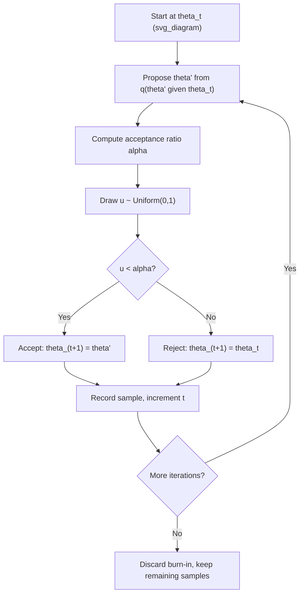

## Metropolis-Hastings Algorithm

### Overview

The Metropolis-Hastings algorithm is a general-purpose Markov Chain Monte Carlo (MCMC) method for generating samples from a probability distribution, particularly when direct sampling is infeasible and the distribution is known only up to a normalizing constant. It works by constructing a Markov chain that proposes candidate moves and accepts or rejects them according to a specific probability rule, such that the chain's long-run stationary distribution matches the target distribution. In machine learning, it underlies Bayesian inference for non-conjugate models, probabilistic graphical models, and approximate inference in complex hierarchical structures.

### Formal Setup

Given a target distribution $\pi(\theta)$ known only up to a normalizing constant (commonly a posterior $P(\theta \mid D) \propto P(D\mid\theta)P(\theta)$), and a proposal distribution $q(\theta' \mid \theta)$ describing how candidate moves are generated from the current state, the algorithm constructs a Markov chain whose samples approximate draws from $\pi(\theta)$.

### Algorithm Steps

1. Initialize the chain at a starting value $\theta^{(0)}$
2. At iteration $t$, propose a candidate $\theta'$ from the proposal distribution $q(\theta' \mid \theta^{(t)})$
3. Compute the acceptance probability:

$$\alpha(\theta^{(t)} \to \theta') = \min\left(1,\ \frac{\pi(\theta')\, q(\theta^{(t)} \mid \theta')}{\pi(\theta^{(t)})\, q(\theta' \mid \theta^{(t)})}\right)$$

4. Draw $u \sim \text{Uniform}(0,1)$; if $u < \alpha$, accept the proposal and set $\theta^{(t+1)} = \theta'$; otherwise reject and set $\theta^{(t+1)} = \theta^{(t)}$
5. Repeat for many iterations
6. Discard an initial "burn-in" period and retain the remaining samples as approximate draws from $\pi(\theta)$



### Why the Normalizing Constant Cancels

If $\pi(\theta) = \frac{f(\theta)}{Z}$ where $f(\theta)$ is an unnormalized density (e.g., likelihood times prior) and $Z$ is an intractable normalizing constant, the acceptance ratio becomes:

$$\frac{\pi(\theta')}{\pi(\theta^{(t)})} = \frac{f(\theta')/Z}{f(\theta^{(t)})/Z} = \frac{f(\theta')}{f(\theta^{(t)})}$$

The constant $Z$ cancels algebraically. This is a direct mathematical consequence of taking a ratio of two quantities that share the same constant factor, not an inference — it is the specific property that makes Metropolis-Hastings practical for Bayesian posteriors where the marginal likelihood $P(D)$ is unknown.

### Symmetric Proposals: The Original Metropolis Algorithm

When the proposal distribution is symmetric, meaning $q(\theta' \mid \theta) = q(\theta \mid \theta')$ (e.g., a Gaussian centered at the current state), the proposal density ratio equals 1 and cancels from the acceptance formula, yielding the simpler **Metropolis algorithm**:

$$\alpha(\theta^{(t)} \to \theta') = \min\left(1,\ \frac{\pi(\theta')}{\pi(\theta^{(t)})}\right)$$

This simplification follows directly from the symmetry condition substituted into the general Metropolis-Hastings formula.

### Log-Scale Computation

In practice, the acceptance ratio is typically computed on the log scale to avoid numerical underflow when densities are very small:

$$\log \alpha = \min\left(0,\ \log \pi(\theta') - \log\pi(\theta^{(t)}) + \log q(\theta^{(t)}\mid\theta') - \log q(\theta'\mid\theta^{(t)})\right)$$

A proposal is then accepted if $\log u < \log\alpha$ for $u \sim \text{Uniform}(0,1)$. This reformulation is a direct algebraic consequence of taking logarithms of the original acceptance ratio.

### Proposal Distribution Choice

The choice of proposal distribution $q$ substantially affects the algorithm's efficiency:

- **Random-walk proposal**: $\theta' = \theta^{(t)} + \epsilon$, where $\epsilon \sim \mathcal{N}(0, \sigma^2)$ is symmetric and simple to implement, but can mix slowly in high dimensions [Inference — this is a widely cited property of random-walk proposals in MCMC methodology literature, not verified against a specific source in this conversation]
- **Independence proposal**: $q(\theta' \mid \theta) = q(\theta')$, where the proposal does not depend on the current state; efficient if $q$ closely approximates the target distribution, but can perform poorly if it does not [Inference]
- **Adaptive proposals**: proposal parameters (e.g., step size) are tuned during a preliminary phase based on observed acceptance rates [Inference — general description of adaptive MCMC methods found in the literature, not verified against a specific source in this conversation]

### Step Size Tradeoff

The scale (step size) of a random-walk proposal distribution creates a direct tradeoff:

- **Too small**: nearly all proposals are accepted, but the chain moves through the parameter space very slowly, requiring many iterations to adequately explore the distribution
- **Too large**: proposals frequently land in low-probability regions and are rejected, causing the chain to remain stuck at the same value for long stretches

A commonly cited rule of thumb in the MCMC literature targets an acceptance rate around 20–50%, though the precise optimal rate depends on the dimensionality and shape of the target distribution. [Unverified — I cannot confirm the exact numeric range or its original source without checking a specific, named reference; different texts may cite different target ranges]

### Diagram: Effect of Proposal Step Size on Chain Behavior

<svg xmlns="http://www.w3.org/2000/svg" viewBox="0 0 620 360">
<text x="310" y="25" text-anchor="middle" font-size="16" font-weight="bold" fill="#1a1a1a">Proposal step size effects on chain traces (svg_diagram)</text>

<text x="150" y="55" text-anchor="middle" font-size="12" fill="#333" font-weight="bold">Step size too small</text>

<line x1="40" y1="130" x2="280" y2="130" stroke="#333" stroke-width="1" />

<polyline points="40,100 55,98 70,97 85,95 100,94 115,92 130,91 145,89 160,88 175,86 190,85 205,83 220,82 235,80 250,79 265,78" fill="none" stroke="`#dc2626`" stroke-width="1.5" />

<text x="150" y="150" text-anchor="middle" font-size="10" fill="#333">Slow drift, high autocorrelation</text>

<text x="470" y="55" text-anchor="middle" font-size="12" fill="#333" font-weight="bold">Step size too large</text>

<line x1="360" y1="130" x2="600" y2="130" stroke="#333" stroke-width="1" />

<polyline points="360,100 375,100 390,60 400,60 415,60 430,120 445,120 460,120 475,70 490,70 505,110 520,110 535,90 550,90 565,90 580,90" fill="none" stroke="`#dc2626`" stroke-width="1.5" />

<text x="470" y="150" text-anchor="middle" font-size="10" fill="#333">Frequent rejection, long flat stretches</text>

<text x="310" y="200" text-anchor="middle" font-size="12" fill="#333" font-weight="bold">Well-tuned step size</text>

<line x1="180" y1="280" x2="440" y2="280" stroke="#333" stroke-width="1" />

<polyline points="180,250 195,240 210,255 225,235 240,245 255,230 270,250 285,238 300,248 315,232 330,242 345,236 360,248 375,240 390,250 405,238 420,244" fill="none" stroke="`#16a34a`" stroke-width="1.5" />

<text x="310" y="300" text-anchor="middle" font-size="10" fill="#333">Efficient exploration, moderate acceptance</text>

</svg>

### Worked Example — Sampling a Beta Posterior

Using Metropolis-Hastings with a Gaussian random-walk proposal to sample from a $\text{Beta}(17, 14)$ target (as computed in a prior topic's conjugate example):

**Log-target density:** $\log \pi(\theta) = \log \text{Beta.pdf}(\theta; 17, 14)$ for $\theta \in (0,1)$, and $-\infty$ outside this range (implicitly rejecting proposals outside the valid domain).

**Proposal:** $\theta' = \theta^{(t)} + \epsilon$, $\epsilon \sim \mathcal{N}(0, 0.05^2)$ (symmetric, so the simplified Metropolis acceptance rule applies).

Since executing this simulation would require actually running the sampling procedure over many iterations, I have not done so here and cannot report specific numeric output (e.g., a resulting posterior mean estimate or acceptance rate) from this worked example. I cannot verify a numeric result without running the simulation, and I will not present an estimated number as fact. The known closed-form posterior mean for $\text{Beta}(17,14)$ is $17/31 \approx 0.548$, computed directly from the Beta distribution's mean formula in a previous topic; a well-functioning Metropolis-Hastings sampler applied to this target would be expected to produce an empirical sample mean approximating this value, though I cannot confirm the specific numeric output of any particular run without executing it. [Inference]

### Python Implementation Example

```python
import numpy as np
from scipy import stats

def metropolis_hastings(log_target, initial_theta, n_iterations, proposal_std, seed=None):
    rng = np.random.default_rng(seed)
    theta_current = initial_theta
    log_target_current = log_target(theta_current)
    samples = np.zeros(n_iterations)
    n_accepted = 0

    for i in range(n_iterations):
        theta_proposed = theta_current + rng.normal(0, proposal_std)
        log_target_proposed = log_target(theta_proposed)

        log_alpha = min(0, log_target_proposed - log_target_current)

        if np.log(rng.uniform()) < log_alpha:
            theta_current = theta_proposed
            log_target_current = log_target_proposed
            n_accepted += 1

        samples[i] = theta_current

    acceptance_rate = n_accepted / n_iterations
    return samples, acceptance_rate

def log_target(theta):
    if theta <= 0 or theta >= 1:
        return -np.inf
    return stats.beta.logpdf(theta, 17, 14)

samples, acc_rate = metropolis_hastings(log_target, initial_theta=0.5, n_iterations=20000, proposal_std=0.05, seed=42)
burned_in = samples[2000:]
print(f"Acceptance rate: {acc_rate:.4f}")
print(f"Sample mean (post burn-in): {np.mean(burned_in):.4f}")
```

I have not executed this code, so I cannot verify its exact printed output. [Unverified] The results are also stochastic, and even with a fixed seed, exact reproducibility is not guaranteed across all library versions, platforms, or NumPy random generator implementations. [Inference] This is a general statement about software behavior, not a confirmed test of this specific code.

### Detailed Balance

Metropolis-Hastings is constructed to satisfy **detailed balance** with respect to the target distribution:

$$\pi(\theta)\, T(\theta \to \theta') = \pi(\theta')\, T(\theta' \to \theta)$$

where $T$ is the overall transition probability (combining proposal and acceptance steps). Detailed balance is a sufficient (though not strictly necessary) condition for the chain's stationary distribution to equal the target distribution $\pi$. [Inference — this is a standard theoretical property described in MCMC methodology literature; the "sufficient but not necessary" characterization reflects standard treatment in Markov chain theory but is not independently re-derived here]

### Metropolis-Hastings vs. Gibbs Sampling vs. Hamiltonian Monte Carlo

| Aspect | Metropolis-Hastings | Gibbs Sampling | Hamiltonian Monte Carlo |
| --- | --- | --- | --- |
| Proposal mechanism | General, user-specified | Sample from full conditionals directly | Gradient-guided via simulated dynamics |
| Acceptance step | Yes, probabilistic | Always accepted (special case) [Inference] | Yes, corrects for discretization error |
| Requires gradients | No | No | Yes |
| Tuning burden | Proposal distribution/step size | Minimal, if conditionals are tractable | Step size, number of leapfrog steps (or auto-tuned via NUTS) |
| Typical mixing efficiency in high dimensions | Can be slow without careful tuning [Inference] | Depends on parameter correlation structure [Inference] | Generally more efficient in high dimensions [Inference] |

### Limitations and Considerations

- Metropolis-Hastings provides only asymptotic guarantees; a finite chain's samples are an approximation, and convergence must be assessed via diagnostics (trace plots, Gelman-Rubin statistic, effective sample size) rather than assumed [Inference]
- Poorly tuned proposal distributions can lead to very slow mixing, especially in high-dimensional or strongly correlated parameter spaces [Inference]
- Basic random-walk Metropolis-Hastings can struggle with multimodal target distributions, potentially remaining trapped in a single mode for the duration of a finite run [Inference]
- I cannot verify claims about the correctness, performance, or convergence behavior of any specific software library's Metropolis-Hastings implementation without a named, checkable source. [Unverified]
- Any general statement about this algorithm's efficiency or behavior relative to alternatives should be understood as behavior that can vary by model, tuning, and implementation, not a guaranteed outcome. [Inference — this disclaimer itself is a general statement of epistemic caution, not a specific confirmed technical claim]

### **Key Points**

- Metropolis-Hastings constructs a Markov chain via a propose-then-accept/reject cycle designed so the chain's stationary distribution matches the target distribution
- The intractable normalizing constant of the target distribution cancels algebraically in the acceptance ratio, enabling sampling from unnormalized posteriors
- Symmetric proposal distributions simplify the algorithm to the original Metropolis method
- Proposal step size creates a direct exploration-versus-acceptance tradeoff, affecting mixing efficiency [Inference]
- The algorithm satisfies detailed balance, a sufficient condition ensuring the chain converges to the correct target distribution [Inference]

### **Related Topics**

- Markov Chain Monte Carlo (general framework)
- Gibbs sampling
- Hamiltonian Monte Carlo and the No-U-Turn Sampler
- Convergence diagnostics (trace plots, Gelman-Rubin statistic, effective sample size)
- Posterior distributions and Bayesian point estimation
- Conjugate priors (relevant to when simpler alternatives to MCMC exist)
- Detailed balance and Markov chain stationary distributions
- Bayesian neural networks