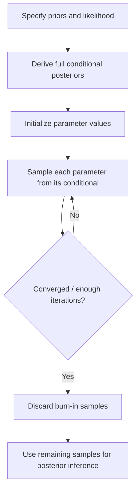

## Gibbs Sampling

### Overview

Gibbs sampling is a Markov Chain Monte Carlo (MCMC) algorithm used to generate samples from a joint probability distribution when direct sampling is difficult, but sampling from each variable's conditional distribution (given all other variables) is tractable. It is widely used in Bayesian statistics to approximate posterior distributions over multiple parameters.

Gibbs sampling is a special case of the Metropolis-Hastings algorithm in which every proposed sample is accepted, because samples are drawn directly from the true conditional distributions rather than from an arbitrary proposal distribution.

### Core Idea

Given a joint distribution $p(x_1, x_2, \dots, x_n)$ that is hard to sample from directly, Gibbs sampling constructs a Markov chain by iteratively sampling each variable from its full conditional distribution, holding all other variables fixed at their current values:

$$x_i^{(t+1)} \sim p(x_i \mid x_1^{(t+1)}, \dots, x_{i-1}^{(t+1)}, x_{i+1}^{(t)}, \dots, x_n^{(t)})$$

After many iterations, the sequence of sampled vectors $(x_1, x_2, \dots, x_n)$ converges to samples from the joint distribution $p(x_1, \dots, x_n)$, under standard regularity conditions.

**Key Points**

- Requires only the conditional distributions, not the full joint density or its normalizing constant.
- Every step is an accepted move — there is no rejection step, unlike general Metropolis-Hastings.
- Particularly useful in Bayesian models with conjugate priors, where conditional posteriors have closed-form expressions.
- Convergence to the target distribution is asymptotic; early samples are typically discarded ("burn-in").

### Algorithm Steps

1. Initialize $x_1^{(0)}, x_2^{(0)}, \dots, x_n^{(0)}$ with arbitrary starting values.
2. For each iteration $t = 1, 2, \dots, T$:
   - Sample $x_1^{(t)} \sim p(x_1 \mid x_2^{(t-1)}, \dots, x_n^{(t-1)})$
   - Sample $x_2^{(t)} \sim p(x_2 \mid x_1^{(t)}, x_3^{(t-1)}, \dots, x_n^{(t-1)})$
   - Continue sequentially through all variables, always using the most recently updated values.
3. Discard an initial "burn-in" period of samples to reduce the influence of the starting values.
4. Use the remaining samples to approximate the joint distribution, marginal distributions, or expectations of interest.

### Diagram: Gibbs Sampling Cycle

<svg xmlns="http://www.w3.org/2000/svg" viewBox="0 0 700 320" font-family="Arial, sans-serif">
<text x="350" y="28" font-size="18" font-weight="bold" text-anchor="middle" fill="#222">Gibbs Sampling Cycle (svg_diagram)</text>
<circle cx="120" cy="160" r="55" fill="#e8f0fe" stroke="#4a76d4" stroke-width="2" />
<text x="120" y="155" font-size="14" text-anchor="middle" fill="#222">Sample x1</text>
<text x="120" y="175" font-size="11" text-anchor="middle" fill="#555">given x2, x3...</text>
<circle cx="350" cy="90" r="55" fill="#e8f0fe" stroke="#4a76d4" stroke-width="2" />
<text x="350" y="85" font-size="14" text-anchor="middle" fill="#222">Sample x2</text>
<text x="350" y="105" font-size="11" text-anchor="middle" fill="#555">given x1, x3...</text>
<circle cx="580" cy="160" r="55" fill="#e8f0fe" stroke="#4a76d4" stroke-width="2" />
<text x="580" y="155" font-size="14" text-anchor="middle" fill="#222">Sample x3</text>
<text x="580" y="175" font-size="11" text-anchor="middle" fill="#555">given x1, x2...</text>
<circle cx="350" cy="240" r="45" fill="#fef3e0" stroke="#d4914a" stroke-width="2" />
<text x="350" y="245" font-size="13" text-anchor="middle" fill="#222">Record sample</text>
<path d="M170,140 Q260,100 300,95" fill="none" stroke="#666" stroke-width="2" marker-end="url(#arrow)" />
<path d="M400,100 Q490,120 535,140" fill="none" stroke="#666" stroke-width="2" marker-end="url(#arrow)" />
<path d="M555,205 Q460,230 395,235" fill="none" stroke="#666" stroke-width="2" marker-end="url(#arrow)" />
<path d="M310,225 Q210,200 165,185" fill="none" stroke="#666" stroke-width="2" marker-end="url(#arrow)" />
</svg>

### Worked Example: Bivariate Normal

Suppose we want to sample from a bivariate normal distribution:

$$\begin{pmatrix} x \\ y \end{pmatrix} \sim \mathcal{N}\left( \begin{pmatrix} 0 \\ 0 \end{pmatrix}, \begin{pmatrix} 1 & \rho \\ \rho & 1 \end{pmatrix} \right)$$

The conditional distributions are also normal and have closed forms:

$$x \mid y \sim \mathcal{N}(\rho y, \, 1 - \rho^2)$$

$$y \mid x \sim \mathcal{N}(\rho x, \, 1 - \rho^2)$$

**Steps:**

1. Initialize $x^{(0)} = 0$, $y^{(0)} = 0$.
2. Sample $x^{(1)} \sim \mathcal{N}(\rho y^{(0)}, 1-\rho^2)$.
3. Sample $y^{(1)} \sim \mathcal{N}(\rho x^{(1)}, 1-\rho^2)$.
4. Repeat for $T$ iterations, discarding burn-in samples.
5. The resulting $(x^{(t)}, y^{(t)})$ pairs approximate draws from the joint bivariate normal.

### Application in Bayesian Inference

In Bayesian models with multiple parameters $\theta_1, \theta_2, \dots, \theta_k$, Gibbs sampling is used to approximate the joint posterior $p(\theta_1, \dots, \theta_k \mid \text{data})$ when it cannot be computed analytically but each conditional posterior $p(\theta_i \mid \theta_{-i}, \text{data})$ is tractable — often due to conjugate prior-likelihood pairings.

**Common use cases:**

- Bayesian linear regression (sampling regression coefficients and error variance).
- Hierarchical Bayesian models (sampling group-level and individual-level parameters).
- Gaussian mixture models (sampling component assignments and component parameters).
- Latent Dirichlet Allocation (LDA) in topic modeling, where collapsed Gibbs sampling is commonly used.

### Conditional Conjugacy Example: Normal-Inverse-Gamma Model

For data $y_1, \dots, y_n \sim \mathcal{N}(\mu, \sigma^2)$ with priors $\mu \sim \mathcal{N}(\mu_0, \tau_0^2)$ and $\sigma^2 \sim \text{Inverse-Gamma}(a, b)$, the full conditionals are:

$$\mu \mid \sigma^2, y \sim \mathcal{N}\left( \frac{\tau_0^{-2}\mu_0 + n\sigma^{-2}\bar{y}}{\tau_0^{-2} + n\sigma^{-2}}, \, \left(\tau_0^{-2} + n\sigma^{-2}\right)^{-1} \right)$$

$$\sigma^2 \mid \mu, y \sim \text{Inverse-Gamma}\left(a + \frac{n}{2}, \, b + \frac{1}{2}\sum_{i=1}^n (y_i - \mu)^2\right)$$

Gibbs sampling alternates between drawing $\mu$ from its conditional normal and $\sigma^2$ from its conditional inverse-gamma, producing posterior samples for both parameters jointly.

### Convergence and Diagnostics

**Key Points**

- Gibbs sampling produces correlated (autocorrelated) samples, since each draw depends on the previous state.
- Convergence to the stationary distribution is not guaranteed within any fixed number of iterations; it is assessed empirically. [Inference]
- Common diagnostics include trace plots, autocorrelation plots, and the Gelman-Rubin statistic ($\hat{R}$) computed across multiple chains.
- Thinning (retaining every $k$-th sample) is sometimes used to reduce autocorrelation, though this may not always improve estimation efficiency. [Unverified]
- Poor mixing can occur when variables are highly correlated with each other, since updates move slowly through the parameter space in such cases.

### Advantages and Limitations

**Key Points**

- **Advantages:**
  - Simple to implement when conditional distributions are known in closed form.
  - No tuning of proposal distributions is required, unlike generic Metropolis-Hastings.
  - Naturally handles high-dimensional parameter spaces by breaking sampling into lower-dimensional conditional steps.
- **Limitations:**
  - Requires tractable conditional distributions; not all models permit this.
  - Can mix slowly when parameters are strongly correlated, requiring many iterations for reliable estimates.
  - Sequential, variable-by-variable updates can be computationally slower than some alternative samplers for certain model structures. [Inference]

### Gibbs Sampling vs. Other MCMC Methods

| Method | Requires Conditional Distributions | Acceptance Step | Typical Use Case |
| --- | --- | --- | --- |
| Gibbs Sampling | Yes | No (always accepts) | Conjugate or conditionally tractable models |
| Metropolis-Hastings | No | Yes | General-purpose sampling |
| Hamiltonian Monte Carlo | No (uses gradients) | Yes | High-dimensional continuous parameter spaces |
| No-U-Turn Sampler (NUTS) | No (uses gradients) | Yes | Automated efficient sampling (e.g., in Stan) |

### Conceptual Flow of Bayesian Use

### Practical Considerations

- Starting values should ideally be chosen to be reasonable relative to the expected parameter scale, as poor initialization can lengthen burn-in. [Inference]
- Running multiple chains with different starting points helps assess convergence and detect multimodality.
- Gibbs sampling can struggle in models with strong posterior correlation between parameters; reparameterization (e.g., centering or scaling) is sometimes used to improve mixing, though results may vary by model. [Unverified]
- Collapsed Gibbs sampling, where some variables are analytically integrated out before sampling, can improve efficiency in certain models such as LDA. [Inference]

**Next Steps**

- Metropolis-Hastings Algorithm
- Hamiltonian Monte Carlo and NUTS
- Markov Chain Monte Carlo Convergence Diagnostics
- Conjugate Priors in Bayesian Inference
- Bayesian Hierarchical Models
- Latent Dirichlet Allocation and Collapsed Gibbs Sampling
- Variational Inference (as an alternative to MCMC)