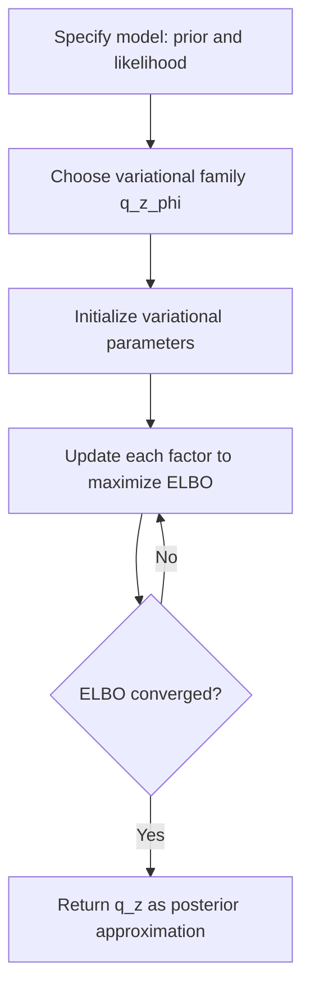

## Variational Inference

### Overview

Variational Inference (VI) is a technique in Bayesian statistics for approximating intractable posterior distributions using optimization rather than sampling. Instead of drawing samples from the posterior (as in MCMC methods like Gibbs sampling), VI reframes posterior inference as an optimization problem: find the member of a chosen family of simpler distributions that is closest to the true posterior.

VI is generally faster than MCMC methods, especially for large datasets and high-dimensional models, though it typically produces an approximation rather than samples that converge to the exact posterior. [Inference]

### Core Idea

Given observed data $x$ and latent variables/parameters $z$, the true posterior is:

$$p(z \mid x) = \frac{p(x, z)}{p(x)}$$

The marginal likelihood $p(x) = \int p(x, z)\, dz$ is often intractable to compute directly, especially in high dimensions. VI sidesteps this by choosing a family of tractable distributions $q(z; \phi)$, parameterized by variational parameters $\phi$, and optimizing $\phi$ so that $q(z; \phi)$ is as close as possible to $p(z \mid x)$.

Closeness is typically measured using the Kullback-Leibler (KL) divergence:

$$\phi^* = \arg\min_{\phi} \, \text{KL}\left(q(z; \phi) \,\|\, p(z \mid x)\right)$$

### The Evidence Lower Bound (ELBO)

Directly minimizing the KL divergence is not possible because it requires knowing $p(z \mid x)$, which is the very quantity being approximated. Instead, VI maximizes a related, tractable quantity called the Evidence Lower Bound (ELBO):

$$\text{ELBO}(\phi) = \mathbb{E}_{q(z;\phi)}\left[ \log p(x, z) \right] - \mathbb{E}_{q(z;\phi)}\left[ \log q(z; \phi) \right]$$

This can be derived from the identity:

$$\log p(x) = \text{ELBO}(\phi) + \text{KL}\left(q(z; \phi) \,\|\, p(z \mid x)\right)$$

Since $\log p(x)$ is fixed with respect to $\phi$, and KL divergence is always non-negative, maximizing the ELBO is equivalent to minimizing the KL divergence between $q$ and the true posterior.

**Key Points**

- The ELBO is a lower bound on the log marginal likelihood $\log p(x)$, sometimes called the "evidence."
- Maximizing the ELBO simultaneously tightens the bound and reduces the KL divergence to the true posterior.
- The ELBO can typically be computed or estimated even when $p(z \mid x)$ itself cannot.

### Diagram: Variational Inference Concept

<svg xmlns="http://www.w3.org/2000/svg" viewBox="0 0 700 300" font-family="Arial, sans-serif">
<text x="350" y="26" font-size="18" font-weight="bold" text-anchor="middle" fill="#222">Variational Inference: Approximation Concept (svg_diagram)</text>

<text x="120" y="60" font-size="13" font-weight="bold" fill="#333">Space of all distributions</text>

<ellipse cx="350" cy="170" rx="300" ry="110" fill="`#f5f5f5`" stroke="#aaa" stroke-width="1.5" />

<circle cx="480" cy="140" r="8" fill="#d4494a" />
<text x="495" y="130" font-size="13" fill="#d4494a">True posterior p(z|x)</text>
<ellipse cx="280" cy="200" rx="130" ry="60" fill="#e8f0fe" stroke="#4a76d4" stroke-width="2" />
<text x="280" y="200" font-size="12" text-anchor="middle" fill="#333">Variational family</text>
<text x="280" y="216" font-size="12" text-anchor="middle" fill="#333">q(z; phi)</text>
<circle cx="360" cy="185" r="7" fill="#3a8a4a" />
<text x="375" y="180" font-size="12" fill="#3a8a4a">Best approximation q*</text>
<line x1="480" y1="140" x2="360" y2="185" stroke="#888" stroke-width="1.5" stroke-dasharray="4,3" />
<text x="420" y="150" font-size="11" fill="#666">KL divergence</text>
</svg>

### Mean-Field Variational Inference

A common simplifying assumption is the **mean-field approximation**, where the variational distribution factorizes across latent variables:

$$q(z) = \prod_{i=1}^{m} q_i(z_i)$$

Each factor $q_i(z_i)$ is optimized independently, holding the others fixed, in a coordinate-ascent procedure. This is analogous in structure to Gibbs sampling's variable-by-variable updates, but instead of sampling, each step computes an optimal distributional form.

**Coordinate Ascent Variational Inference (CAVI) update rule:**

$$\log q_i^*(z_i) \propto \mathbb{E}_{q_{-i}}\left[ \log p(x, z) \right]$$

where $q_{-i}$ denotes the product of all variational factors except $q_i$.

### Algorithm Steps (CAVI)

1. Choose a variational family with a factorized (mean-field) form.
2. Initialize each factor $q_i(z_i)$.
3. Iterate until convergence:
   - For each latent variable $z_i$, update $q_i(z_i)$ using the CAVI update rule, holding other factors fixed.
   - Recompute the ELBO.
4. Stop when the ELBO change between iterations falls below a chosen threshold.
5. Use the final $q(z)$ as the approximate posterior.

### Worked Example: Univariate Gaussian with Unknown Mean and Variance

For data $x_1, \dots, x_n \sim \mathcal{N}(\mu, \tau^{-1})$ with priors $\mu \sim \mathcal{N}(\mu_0, \lambda_0^{-1})$ and $\tau \sim \text{Gamma}(a_0, b_0)$, mean-field VI assumes:

$$q(\mu, \tau) = q(\mu)\, q(\tau)$$

The optimal factors take recognizable parametric forms:

$$q^*(\mu) = \mathcal{N}(\mu_n, \lambda_n^{-1})$$

$$q^*(\tau) = \text{Gamma}(a_n, b_n)$$

where the updated parameters $\mu_n, \lambda_n, a_n, b_n$ depend on the data and on expectations taken with respect to the other factor. These are updated iteratively until the ELBO converges. This mirrors the conjugate-update structure seen in Gibbs sampling, but produces a full distributional approximation directly rather than a sequence of samples. [Inference]

### Conceptual Flow

### Comparison: Variational Inference vs. MCMC (e.g., Gibbs Sampling)

| Aspect | Variational Inference | MCMC (e.g., Gibbs Sampling) |
| --- | --- | --- |
| Approach | Optimization | Sampling |
| Output | Approximate distribution (parametric) | Samples approximating the true distribution |
| Speed | Generally faster, especially on large data | Generally slower, especially in high dimensions |
| Accuracy | Approximation may be biased or underdispersed | Asymptotically exact given enough samples |
| Scalability | Scales well with stochastic/mini-batch variants | Scaling can be more difficult |
| Convergence guarantee | Converges to a local optimum of the ELBO | Converges to the true posterior asymptotically |

**Key Points**

- VI trades some accuracy for computational speed, making it attractive for large-scale or real-time applications. [Inference]
- Mean-field VI tends to underestimate posterior variance because it ignores correlations between variables not captured by the factorized form. [Inference]
- MCMC methods like Gibbs sampling provide asymptotically exact inference but can be computationally expensive for large datasets.

### Stochastic Variational Inference (SVI)

For large datasets, **Stochastic Variational Inference** extends CAVI by using stochastic optimization (e.g., stochastic gradient ascent) on mini-batches of data rather than the full dataset at each update. This allows VI to scale to datasets that would be impractical for standard batch methods.

**Key Points**

- SVI uses noisy, unbiased estimates of the ELBO gradient computed from data subsamples.
- Learning rate schedules are typically required to ensure convergence, following stochastic approximation theory (e.g., Robbins-Monro conditions).
- SVI is widely used in large-scale topic modeling and other applications involving massive datasets. [Inference]

### Black-Box and Automatic Differentiation Variational Inference

Modern VI methods often avoid deriving model-specific update equations by hand:

- **Black-Box Variational Inference (BBVI):** Uses Monte Carlo estimates of the ELBO gradient, applicable to a broad range of models without requiring conjugacy.
- **Automatic Differentiation Variational Inference (ADVI):** Transforms constrained latent variables into an unconstrained space and uses automatic differentiation (as in probabilistic programming frameworks) to optimize the ELBO, removing the need for manual derivation of update rules.

These methods have made VI more broadly applicable to complex, non-conjugate models, though they may introduce additional variance into gradient estimates compared to closed-form CAVI updates. [Inference]

### Advantages and Limitations

**Key Points**

- **Advantages:**
  - Computationally efficient and scalable to large datasets.
  - Deterministic optimization procedure, often with well-defined convergence checks via the ELBO.
  - Naturally extends to stochastic and black-box settings for complex models.
- **Limitations:**
  - The chosen variational family may not be flexible enough to capture the true posterior's shape, introducing approximation bias.
  - Mean-field assumptions can understate posterior uncertainty by ignoring dependencies between variables.
  - Optimization can converge to local optima of the ELBO rather than a global optimum, and results may be sensitive to initialization. [Inference]

### Practical Considerations

- The choice of variational family involves a trade-off between computational tractability and approximation accuracy.
- Monitoring the ELBO over iterations is a standard way to assess convergence, though a converged ELBO does not guarantee the approximation is close to the true posterior in all respects. [Inference]
- For models where posterior correlations between parameters matter (e.g., for downstream uncertainty quantification), structured variational families (beyond mean-field) may be considered to better capture dependencies. [Inference]
- VI and MCMC are not mutually exclusive; some workflows use VI for fast initial approximations and MCMC for more precise refinement. [Inference]

**Next Steps**

- Kullback-Leibler Divergence and Information-Theoretic Measures
- Coordinate Ascent Variational Inference (CAVI) in Depth
- Stochastic Gradient Descent and Robbins-Monro Convergence Conditions
- Black-Box and Automatic Differentiation Variational Inference (ADVI)
- Comparing MCMC and VI for Posterior Approximation
- Variational Autoencoders (VAEs) as an Application of VI
- Structured and Normalizing Flow-Based Variational Families