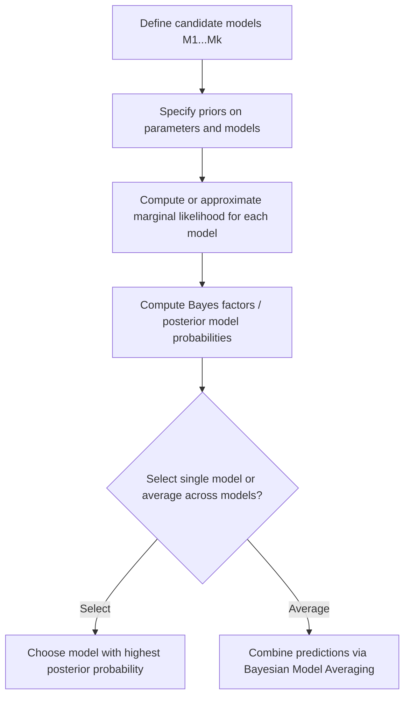

## Bayesian Model Comparison

### Overview

Bayesian model comparison is a framework for evaluating and choosing among competing statistical models using probability theory. Rather than relying solely on point estimates of fit, it incorporates prior beliefs about models and parameters, and formally accounts for model complexity through the marginal likelihood. It provides a coherent alternative to frequentist model selection criteria such as p-value-based hypothesis testing.

### Core Idea

Given a set of candidate models $M_1, M_2, \dots, M_k$ and observed data $D$, Bayesian model comparison evaluates each model's posterior probability using Bayes' theorem:

$$p(M_i \mid D) = \frac{p(D \mid M_i)\, p(M_i)}{p(D)}$$

where:

- $p(M_i)$ is the **prior probability** of model $i$ (belief before observing data),
- $p(D \mid M_i)$ is the **marginal likelihood** (or "evidence") of the data under model $i$,
- $p(D) = \sum_j p(D \mid M_j)\, p(M_j)$ is a normalizing constant across all models under consideration.

The marginal likelihood is obtained by integrating over the model's parameters $\theta_i$:

$$p(D \mid M_i) = \int p(D \mid \theta_i, M_i)\, p(\theta_i \mid M_i)\, d\theta_i$$

**Key Points**

- The marginal likelihood naturally penalizes model complexity: models with more parameters spread prior probability mass over a larger parameter space, which can lower the average likelihood unless the additional complexity is well-supported by the data. [Inference]
- This built-in complexity penalty is sometimes referred to as an automatic embodiment of Occam's razor within the Bayesian framework.
- Unlike many frequentist model selection procedures, Bayesian comparison does not require nested models.

### Bayes Factors

The **Bayes factor** quantifies the relative evidence for one model over another, given the data:

$$BF_{12} = \frac{p(D \mid M_1)}{p(D \mid M_2)}$$

Combined with prior odds, it yields posterior odds:

$$\frac{p(M_1 \mid D)}{p(M_2 \mid D)} = BF_{12} \times \frac{p(M_1)}{p(M_2)}$$

**Interpretation guidelines (Jeffreys' scale, commonly cited):**

| Bayes Factor $BF_{12}$ | Interpretation |
| --- | --- |
| 1 to 3 | Barely worth mentioning |
| 3 to 10 | Substantial evidence for $M_1$ |
| 10 to 30 | Strong evidence for $M_1$ |
| 30 to 100 | Very strong evidence for $M_1$ |
| > 100 | Decisive evidence for $M_1$ |

These thresholds are conventional guidelines rather than strict rules, and different sources propose varying scales. [Unverified]

### Diagram: Bayesian Model Comparison Workflow

<svg xmlns="http://www.w3.org/2000/svg" viewBox="0 0 700 340" font-family="Arial, sans-serif">
<text x="350" y="26" font-size="18" font-weight="bold" text-anchor="middle" fill="#222">Bayesian Model Comparison Workflow (svg_diagram)</text>
<rect x="40" y="60" width="180" height="60" rx="8" fill="#e8f0fe" stroke="#4a76d4" stroke-width="2" />
<text x="130" y="85" font-size="13" text-anchor="middle" fill="#222">Model M1</text>
<text x="130" y="103" font-size="11" text-anchor="middle" fill="#555">prior + likelihood</text>
<rect x="260" y="60" width="180" height="60" rx="8" fill="#e8f0fe" stroke="#4a76d4" stroke-width="2" />
<text x="350" y="85" font-size="13" text-anchor="middle" fill="#222">Model M2</text>
<text x="350" y="103" font-size="11" text-anchor="middle" fill="#555">prior + likelihood</text>
<rect x="480" y="60" width="180" height="60" rx="8" fill="#e8f0fe" stroke="#4a76d4" stroke-width="2" />
<text x="570" y="85" font-size="13" text-anchor="middle" fill="#222">Model Mk</text>
<text x="570" y="103" font-size="11" text-anchor="middle" fill="#555">prior + likelihood</text>
<line x1="130" y1="120" x2="130" y2="160" stroke="#666" stroke-width="2" marker-end="url(#arrow2)" />
<line x1="350" y1="120" x2="350" y2="160" stroke="#666" stroke-width="2" marker-end="url(#arrow2)" />
<line x1="570" y1="120" x2="570" y2="160" stroke="#666" stroke-width="2" marker-end="url(#arrow2)" />
<rect x="40" y="160" width="180" height="50" rx="8" fill="#fef3e0" stroke="#d4914a" stroke-width="2" />
<text x="130" y="190" font-size="12" text-anchor="middle" fill="#222">Marginal likelihood p(D|M1)</text>
<rect x="260" y="160" width="180" height="50" rx="8" fill="#fef3e0" stroke="#d4914a" stroke-width="2" />
<text x="350" y="190" font-size="12" text-anchor="middle" fill="#222">Marginal likelihood p(D|M2)</text>
<rect x="480" y="160" width="180" height="50" rx="8" fill="#fef3e0" stroke="#d4914a" stroke-width="2" />
<text x="570" y="190" font-size="12" text-anchor="middle" fill="#222">Marginal likelihood p(D|Mk)</text>
<line x1="130" y1="210" x2="330" y2="250" stroke="#666" stroke-width="2" marker-end="url(#arrow2)" />
<line x1="350" y1="210" x2="350" y2="250" stroke="#666" stroke-width="2" marker-end="url(#arrow2)" />
<line x1="570" y1="210" x2="370" y2="250" stroke="#666" stroke-width="2" marker-end="url(#arrow2)" />
<rect x="220" y="250" width="260" height="60" rx="8" fill="#e6f4ea" stroke="#3a8a4a" stroke-width="2" />
<text x="350" y="275" font-size="13" text-anchor="middle" fill="#222">Compute Bayes factors /</text>
<text x="350" y="293" font-size="13" text-anchor="middle" fill="#222">posterior model probabilities</text>
</svg>

### Worked Example: Comparing Two Coin-Bias Models

Suppose we observe $n = 20$ coin flips with $k = 14$ heads, and want to compare:

- **Model $M_1$:** The coin is fair, $\theta = 0.5$ (fixed).
- **Model $M_2$:** The coin's bias $\theta$ is unknown, with prior $\theta \sim \text{Beta}(1, 1)$ (uniform).

**Marginal likelihood under $M_1$ (fixed parameter):**

$$p(D \mid M_1) = \binom{20}{14} (0.5)^{14} (0.5)^{6}$$

**Marginal likelihood under $M_2$ (integrating over $\theta$):**

$$p(D \mid M_2) = \binom{20}{14} \int_0^1 \theta^{14}(1-\theta)^6 \, d\theta = \binom{20}{14} \, B(15, 7)$$

where $B(\cdot,\cdot)$ is the Beta function. Computing both quantities and taking their ratio gives the Bayes factor $BF_{21} = p(D \mid M_2) / p(D \mid M_1)$, which indicates how much more (or less) the data support the flexible model over the fixed-bias model. In this scenario, with results moderately skewed toward heads, evidence is often only modest and depends heavily on the specific prior chosen for $M_2$. [Inference]

### Computing the Marginal Likelihood

The marginal likelihood integral is often analytically intractable outside of conjugate settings, requiring approximation methods:

- **Conjugate models:** Closed-form solutions exist (as in the coin-bias example above).
- **Laplace approximation:** Approximates the posterior as Gaussian around its mode to estimate the integral.
- **Bridge sampling / importance sampling:** Uses samples from a proposal or posterior distribution to estimate the marginal likelihood.
- **Nested sampling:** Directly targets the marginal likelihood by transforming the integral into a one-dimensional problem over the prior's cumulative distribution.
- **Harmonic mean estimator:** Historically used but known to produce unstable or misleadingly overconfident estimates in many settings. [Unverified]

### Information Criteria as Approximations

When marginal likelihoods are difficult to compute, several information criteria offer approximate alternatives for model comparison, though they are grounded in different theoretical justifications:

$$\text{AIC} = -2 \log p(D \mid \hat\theta) + 2p$$

$$\text{BIC} = -2 \log p(D \mid \hat\theta) + p \log n$$

where $p$ is the number of parameters and $n$ is the sample size.

**Key Points**

- BIC is derived as a large-sample approximation to $-2 \log p(D \mid M)$ and is more directly connected to Bayesian model comparison than AIC. [Inference]
- AIC is grounded in minimizing expected prediction error (via Kullback-Leibler divergence) rather than approximating the marginal likelihood, and is generally considered a frequentist criterion.
- The **Widely Applicable Information Criterion (WAIC)** and **Leave-One-Out Cross-Validation (LOO-CV)** are more fully Bayesian alternatives that use the posterior distribution directly and tend to be preferred in modern Bayesian workflows. [Inference]

### Bayesian Model Averaging

Rather than selecting a single "best" model, **Bayesian Model Averaging (BMA)** combines predictions across all candidate models, weighted by their posterior probabilities:

$$p(y^* \mid D) = \sum_{i=1}^{k} p(y^* \mid D, M_i) \, p(M_i \mid D)$$

**Key Points**

- BMA accounts for model uncertainty explicitly, rather than conditioning all inference on a single selected model.
- This can improve predictive performance and produce better-calibrated uncertainty estimates compared to single-model selection, particularly when no model is clearly dominant. [Inference]
- BMA requires marginal likelihoods or reliable approximations for all candidate models, which can be computationally demanding.

### Conceptual Flow

### Comparison: Bayes Factors vs. Information Criteria

| Aspect | Bayes Factors | AIC / BIC / WAIC |
| --- | --- | --- |
| Theoretical basis | Full Bayesian marginal likelihood ratio | Asymptotic or predictive-error approximations |
| Sensitivity to priors | High — priors on parameters directly affect the marginal likelihood | Low or none (AIC), indirect (BIC) |
| Computational cost | Often high (requires integration) | Generally lower |
| Handles non-nested models | Yes | Yes (typically) |
| Model averaging support | Natural (via posterior model probabilities) | Less direct |

### Advantages and Limitations

**Key Points**

- **Advantages:**
  - Provides a coherent probabilistic framework for comparing models, including non-nested ones.
  - Naturally incorporates a complexity penalty without needing an ad hoc parameter-count adjustment.
  - Supports principled model averaging to account for model uncertainty.
- **Limitations:**
  - Bayes factors can be highly sensitive to the choice of prior, especially for parameters unique to more complex models; this is sometimes called the "Bayes factor prior sensitivity problem." [Inference]
  - Computing marginal likelihoods is often computationally demanding, especially in high-dimensional models.
  - Improper (non-normalizable) priors generally cannot be used directly in Bayes factor calculations, since the marginal likelihood becomes undefined. [Inference]

### Practical Considerations

- Sensitivity analysis — examining how conclusions change under different reasonable priors — is often recommended when reporting Bayes factors. [Inference]
- For predictive-focused applications, cross-validation-based criteria (such as LOO-CV or WAIC) are sometimes preferred over marginal-likelihood-based Bayes factors, particularly when the primary goal is predictive accuracy rather than formal hypothesis comparison. [Inference]
- Bayesian model comparison and null-hypothesis significance testing address related but distinct questions, and results from the two frameworks do not always align numerically. [Inference]
- In practice, software such as probabilistic programming frameworks often provides built-in utilities (e.g., bridge sampling, WAIC, LOO) to support these computations, reducing the need for manual derivation. [Unverified]

**Next Steps**

- Bayes Factors and Prior Sensitivity Analysis
- Laplace Approximation for Marginal Likelihoods
- Widely Applicable Information Criterion (WAIC) and Leave-One-Out Cross-Validation
- Bayesian Model Averaging in Practice
- Nested Sampling Methods
- Posterior Predictive Checks
- Hierarchical Bayesian Model Selection