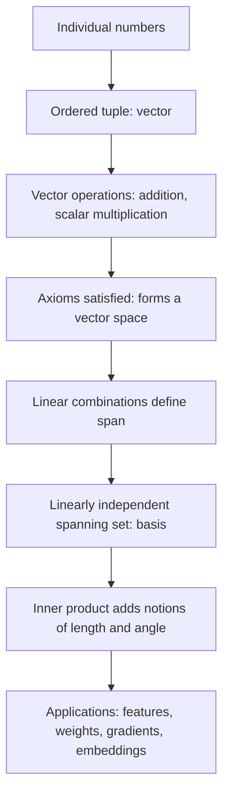

## Vectors and Vector Spaces

### Overview

Vectors and vector spaces form the foundational language of linear algebra used throughout machine learning — from representing data points and feature sets to defining model parameters and gradients. A solid understanding of vector operations, geometric interpretation, and the formal structure of vector spaces underlies nearly all statistical and machine learning algorithms.

### Vectors: Definition and Notation

A **vector** is an ordered collection of numbers, typically representing a point or direction in space. In machine learning, a vector often represents a data observation with multiple features:

$$\mathbf{x} = \begin{pmatrix} x_1 \\ x_2 \\ \vdots \\ x_n \end{pmatrix} \in \mathbb{R}^n$$

**Key Points**

- A vector with $n$ components is said to belong to $n$-dimensional real space, denoted $\mathbb{R}^n$.
- Vectors can represent geometric quantities (position, direction) or abstract data (feature vectors, model weights, gradients).
- Vectors are typically written as columns in machine learning contexts, with rows reserved for transposed vectors or matrix rows.

### Basic Vector Operations

**Addition:** Vectors of the same dimension are added component-wise.

$$\mathbf{u} + \mathbf{v} = \begin{pmatrix} u_1 + v_1 \\ u_2 + v_2 \\ \vdots \\ u_n + v_n \end{pmatrix}$$

**Scalar multiplication:** Each component is scaled by a constant $c$.

$$c\mathbf{v} = \begin{pmatrix} cv_1 \\ cv_2 \\ \vdots \\ cv_n \end{pmatrix}$$

**Dot product (inner product):** Produces a scalar from two vectors of equal dimension.

$$\mathbf{u} \cdot \mathbf{v} = \sum_{i=1}^n u_i v_i$$

**Key Points**

- The dot product is central to computing projections, similarity measures, and linear model predictions (e.g., $\hat{y} = \mathbf{w} \cdot \mathbf{x} + b$).
- Vector addition and scalar multiplication are the two operations that define a vector space formally (see below).

### Diagram: Vector Addition and Scalar Multiplication

<svg xmlns="http://www.w3.org/2000/svg" viewBox="0 0 700 320" font-family="Arial, sans-serif">
<text x="350" y="26" font-size="18" font-weight="bold" text-anchor="middle" fill="#222">Vector Addition (svg_diagram)</text>
<line x1="60" y1="270" x2="640" y2="270" stroke="#ccc" stroke-width="1" />
<line x1="80" y1="290" x2="80" y2="30" stroke="#ccc" stroke-width="1" />
<line x1="80" y1="270" x2="260" y2="140" stroke="#4a76d4" stroke-width="3" marker-end="url(#arrow3)" />
<text x="270" y="135" font-size="13" fill="#4a76d4">u</text>
<line x1="260" y1="140" x2="400" y2="90" stroke="#d4494a" stroke-width="3" marker-end="url(#arrow3)" />
<text x="405" y="85" font-size="13" fill="#d4494a">v</text>
<line x1="80" y1="270" x2="400" y2="90" stroke="#3a8a4a" stroke-width="3" stroke-dasharray="6,3" marker-end="url(#arrow3)" />
<text x="410" y="70" font-size="13" fill="#3a8a4a">u + v</text>
</svg>

### Vector Norms

A **norm** measures the length or magnitude of a vector. Common norms used in machine learning include:

**Euclidean norm (L2 norm):**

$$\|\mathbf{v}\|_2 = \sqrt{\sum_{i=1}^n v_i^2}$$

**Manhattan norm (L1 norm):**

$$\|\mathbf{v}\|_1 = \sum_{i=1}^n |v_i|$$

**General $p$-norm:**

$$\|\mathbf{v}\|_p = \left( \sum_{i=1}^n |v_i|^p \right)^{1/p}$$

**Key Points**

- The L2 norm corresponds to standard Euclidean distance and is used in ridge regression regularization.
- The L1 norm encourages sparsity and is used in lasso regression regularization.
- Norms must satisfy three properties: non-negativity, absolute homogeneity ($\|c\mathbf{v}\| = |c|\|\mathbf{v}\|$), and the triangle inequality ($\|\mathbf{u}+\mathbf{v}\| \le \|\mathbf{u}\| + \|\mathbf{v}\|$).

### Formal Definition of a Vector Space

A **vector space** $V$ over a field (typically $\mathbb{R}$) is a set equipped with two operations — vector addition and scalar multiplication — satisfying the following axioms for all $\mathbf{u}, \mathbf{v}, \mathbf{w} \in V$ and scalars $a, b$:

1. **Closure under addition:** $\mathbf{u} + \mathbf{v} \in V$
2. **Commutativity:** $\mathbf{u} + \mathbf{v} = \mathbf{v} + \mathbf{u}$
3. **Associativity of addition:** $(\mathbf{u} + \mathbf{v}) + \mathbf{w} = \mathbf{u} + (\mathbf{v} + \mathbf{w})$
4. **Additive identity:** There exists $\mathbf{0} \in V$ such that $\mathbf{v} + \mathbf{0} = \mathbf{v}$
5. **Additive inverse:** For every $\mathbf{v}$, there exists $-\mathbf{v}$ such that $\mathbf{v} + (-\mathbf{v}) = \mathbf{0}$
6. **Closure under scalar multiplication:** $a\mathbf{v} \in V$
7. **Distributivity over vector addition:** $a(\mathbf{u} + \mathbf{v}) = a\mathbf{u} + a\mathbf{v}$
8. **Distributivity over scalar addition:** $(a + b)\mathbf{v} = a\mathbf{v} + b\mathbf{v}$
9. **Associativity of scalar multiplication:** $a(b\mathbf{v}) = (ab)\mathbf{v}$
10. **Scalar identity:** $1\mathbf{v} = \mathbf{v}$

**Key Points**

- $\mathbb{R}^n$ with standard component-wise addition and scalar multiplication is the canonical example of a vector space.
- Other examples include spaces of polynomials, matrices, and functions, all of which satisfy these same axioms under appropriately defined operations.
- Any subset of a vector space that itself satisfies these axioms (or equivalently, is closed under addition and scalar multiplication and contains the zero vector) is called a **subspace**.

### Linear Combinations, Span, and Basis

A **linear combination** of vectors $\mathbf{v}_1, \dots, \mathbf{v}_k$ is any expression of the form:

$$c_1\mathbf{v}_1 + c_2\mathbf{v}_2 + \dots + c_k\mathbf{v}_k$$

for scalars $c_1, \dots, c_k$.

The **span** of a set of vectors is the set of all possible linear combinations of those vectors — geometrically, the subspace they can "reach."

A set of vectors is **linearly independent** if no vector in the set can be written as a linear combination of the others, equivalently if:

$$c_1\mathbf{v}_1 + c_2\mathbf{v}_2 + \dots + c_k\mathbf{v}_k = \mathbf{0} \implies c_1 = c_2 = \dots = c_k = 0$$

A **basis** of a vector space is a linearly independent set of vectors whose span equals the entire space. The number of vectors in a basis is called the **dimension** of the space.

**Key Points**

- Every vector in a space can be written uniquely as a linear combination of basis vectors.
- The standard basis for $\mathbb{R}^n$ consists of unit vectors $\mathbf{e}_1, \dots, \mathbf{e}_n$, each with a single 1 and zeros elsewhere.
- In machine learning, choosing an effective basis or representation (e.g., via PCA) is central to dimensionality reduction.

### Diagram: Span and Basis in 2D

<svg xmlns="http://www.w3.org/2000/svg" viewBox="0 0 700 320" font-family="Arial, sans-serif">
<text x="350" y="26" font-size="18" font-weight="bold" text-anchor="middle" fill="#222">Basis Vectors Spanning R2 (svg_diagram)</text>
<line x1="350" y1="290" x2="350" y2="40" stroke="#ccc" stroke-width="1" />
<line x1="60" y1="170" x2="640" y2="170" stroke="#ccc" stroke-width="1" />
<line x1="350" y1="170" x2="500" y2="170" stroke="#4a76d4" stroke-width="3" marker-end="url(#arrow4)" />
<text x="510" y="165" font-size="13" fill="#4a76d4">e1 = (1,0)</text>
<line x1="350" y1="170" x2="350" y2="70" stroke="#d4494a" stroke-width="3" marker-end="url(#arrow4)" />
<text x="360" y="65" font-size="13" fill="#d4494a">e2 = (0,1)</text>
<line x1="350" y1="170" x2="500" y2="70" stroke="#3a8a4a" stroke-width="3" stroke-dasharray="5,3" marker-end="url(#arrow4)" />
<text x="510" y="65" font-size="13" fill="#3a8a4a">v = 1.5*e1 + 1*e2</text>
</svg>

### Inner Product Spaces and Orthogonality

An **inner product** generalizes the dot product and induces both a norm and a notion of angle between vectors:

$$\cos\theta = \frac{\mathbf{u} \cdot \mathbf{v}}{\|\mathbf{u}\| \, \|\mathbf{v}\|}$$

Two vectors are **orthogonal** if their inner product is zero: $\mathbf{u} \cdot \mathbf{v} = 0$.

A set of vectors is **orthonormal** if all pairs are orthogonal and each vector has unit norm ($\|\mathbf{v}_i\| = 1$).

**Key Points**

- Orthogonality generalizes the geometric notion of perpendicularity to higher-dimensional and abstract vector spaces.
- Cosine similarity, derived directly from the inner product formula above, is widely used in machine learning to measure similarity between feature vectors (e.g., in text/document representations).
- Orthonormal bases simplify many computations, including projections and coordinate transformations, and appear in methods such as PCA (via eigenvectors) and QR decomposition.

### Worked Example: Computing Vector Operations

Let $\mathbf{u} = (3, 4)$ and $\mathbf{v} = (1, 2)$.

**Addition:**

$$\mathbf{u} + \mathbf{v} = (3+1,\ 4+2) = (4, 6)$$

**Dot product:**

$$\mathbf{u} \cdot \mathbf{v} = (3)(1) + (4)(2) = 3 + 8 = 11$$

**L2 norm of $\mathbf{u}$:**

$$\|\mathbf{u}\|_2 = \sqrt{3^2 + 4^2} = \sqrt{25} = 5$$

**Cosine similarity between $\mathbf{u}$ and $\mathbf{v}$:**

$$\cos\theta = \frac{11}{5 \times \sqrt{1^2+2^2}} = \frac{11}{5\sqrt{5}} \approx 0.9839$$

This indicates the two vectors point in nearly the same direction, since the cosine similarity is close to 1.

### Relevance to Machine Learning

**Key Points**

- **Feature representation:** Data observations are represented as vectors in $\mathbb{R}^n$, with each dimension corresponding to a feature.
- **Model parameters:** Weight vectors in linear models, neural network layers, and embeddings are all vectors (or collections of vectors) operated on via the rules above.
- **Similarity and distance:** Norms and inner products underlie distance metrics (e.g., Euclidean distance in k-nearest neighbors) and similarity measures (e.g., cosine similarity in recommendation systems and NLP embeddings).
- **Gradients:** The gradient of a scalar-valued function is itself a vector, and gradient descent optimization relies directly on vector addition and scalar multiplication (updating parameters by subtracting a scaled gradient vector).
- **Regularization:** L1 and L2 norms of weight vectors are added to loss functions to control model complexity.

### Conceptual Flow

### Advantages and Limitations of the Vector Space Framework

**Key Points**

- **Advantages:**
  - Provides a unified mathematical structure applicable to data, parameters, and transformations across nearly all ML algorithms.
  - Enables geometric intuition (distance, angle, projection) to be applied to abstract, high-dimensional data.
  - Supports efficient computation via well-established linear algebra operations and libraries.
- **Limitations:**
  - Real-world data does not always naturally fit a flat (Euclidean) vector space; some data exhibit structure better captured by manifolds, graphs, or non-Euclidean geometries. [Inference]
  - High-dimensional vector spaces can suffer from the "curse of dimensionality," where distance-based measures become less discriminative as dimensionality grows. [Inference]
  - Choice of representation (basis, embedding) significantly affects downstream model performance, and there is no single universally optimal representation. [Inference]

### Practical Considerations

- Feature scaling (e.g., standardization) is often necessary before computing norms or distances, since features on different scales can disproportionately influence vector-based computations. [Inference]
- Sparse vectors (with many zero entries) are common in text and categorical data; specialized data structures and algorithms are often used to store and operate on them efficiently. [Unverified]
- Understanding vector spaces is a prerequisite for matrix operations, eigendecomposition, and later topics such as principal component analysis and singular value decomposition.

**Next Steps**

- Matrices and Matrix Operations
- Linear Transformations and Change of Basis
- Eigenvalues and Eigenvectors
- Principal Component Analysis (PCA)
- Singular Value Decomposition (SVD)
- Norms and Regularization in Machine Learning
- Distance Metrics in High-Dimensional Spaces