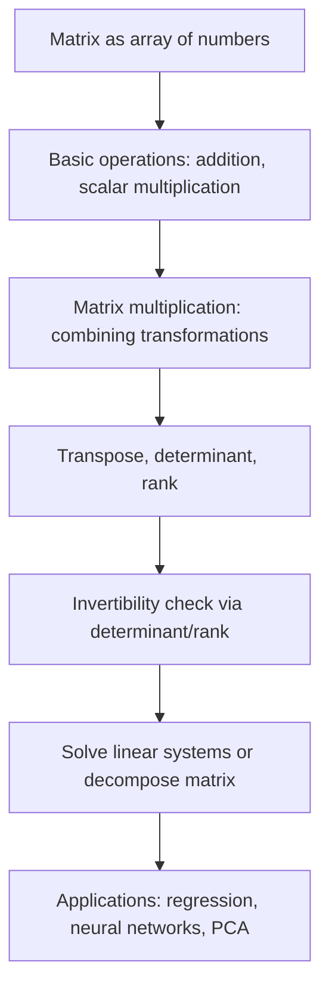

## Matrix Operations

### Overview

Matrices are rectangular arrays of numbers used to represent linear transformations, systems of equations, and structured data in machine learning. Matrix operations — addition, multiplication, transposition, inversion, and decomposition — form the computational backbone of algorithms ranging from linear regression to deep neural networks.

### Matrix Notation and Basic Structure

A matrix $A$ with $m$ rows and $n$ columns is written as:

$$A = \begin{pmatrix} a_{11} & a_{12} & \cdots & a_{1n} \\ a_{21} & a_{22} & \cdots & a_{2n} \\ \vdots & \vdots & \ddots & \vdots \\ a_{m1} & a_{m2} & \cdots & a_{mn} \end{pmatrix} \in \mathbb{R}^{m \times n}$$

**Key Points**

- $A$ is said to have dimensions (or shape) $m \times n$: $m$ rows and $n$ columns.
- A vector is a special case of a matrix with a single column ($n=1$) or single row ($m=1$).
- The entry in row $i$, column $j$ is denoted $a_{ij}$.

### Matrix Addition and Scalar Multiplication

**Addition:** Matrices of the same shape are added element-wise.

$$(A + B)_{ij} = a_{ij} + b_{ij}$$

**Scalar multiplication:** Every entry is scaled by a constant $c$.

$$(cA)_{ij} = c \cdot a_{ij}$$

**Key Points**

- Both operations require matrices of identical dimensions for addition; scalar multiplication applies to any matrix.
- These operations satisfy the same vector space axioms as vectors, since matrices of a given shape themselves form a vector space.

### Matrix Multiplication

For $A \in \mathbb{R}^{m \times n}$ and $B \in \mathbb{R}^{n \times p}$, the product $C = AB \in \mathbb{R}^{m \times p}$ is defined as:

$$c_{ij} = \sum_{k=1}^{n} a_{ik} b_{kj}$$

**Key Points**

- The number of columns in $A$ must equal the number of rows in $B$ for multiplication to be defined.
- Matrix multiplication is **not commutative** in general: $AB \neq BA$, even when both products are defined.
- Matrix multiplication **is associative**: $(AB)C = A(BC)$.
- Matrix multiplication **distributes** over addition: $A(B + C) = AB + AC$.

### Diagram: Matrix Multiplication Dimensions

<svg xmlns="http://www.w3.org/2000/svg" viewBox="0 0 700 260" font-family="Arial, sans-serif">
<text x="350" y="26" font-size="18" font-weight="bold" text-anchor="middle" fill="#222">Matrix Multiplication Shapes (svg_diagram)</text>
<rect x="60" y="70" width="140" height="90" fill="#e8f0fe" stroke="#4a76d4" stroke-width="2" />
<text x="130" y="120" font-size="14" text-anchor="middle" fill="#222">A</text>
<text x="130" y="180" font-size="12" text-anchor="middle" fill="#555">(m x n)</text>

<text x="230" y="120" font-size="20" text-anchor="middle" fill="#333">x</text>

<rect x="260" y="50" width="90" height="130" fill="#fef3e0" stroke="#d4914a" stroke-width="2" />
<text x="305" y="120" font-size="14" text-anchor="middle" fill="#222">B</text>
<text x="305" y="200" font-size="12" text-anchor="middle" fill="#555">(n x p)</text>

<text x="390" y="120" font-size="20" text-anchor="middle" fill="#333">=</text>

<rect x="420" y="70" width="90" height="90" fill="#e6f4ea" stroke="#3a8a4a" stroke-width="2" />
<text x="465" y="120" font-size="14" text-anchor="middle" fill="#222">C</text>
<text x="465" y="180" font-size="12" text-anchor="middle" fill="#555">(m x p)</text>

<text x="350" y="225" font-size="12" text-anchor="middle" fill="#666">Inner dimensions (n) must match</text>

</svg>

### Worked Example: Matrix Multiplication

Let:

$$A = \begin{pmatrix} 1 & 2 \\ 3 & 4 \end{pmatrix}, \quad B = \begin{pmatrix} 5 & 6 \\ 7 & 8 \end{pmatrix}$$

$$AB = \begin{pmatrix} (1)(5)+(2)(7) & (1)(6)+(2)(8) \\ (3)(5)+(4)(7) & (3)(6)+(4)(8) \end{pmatrix} = \begin{pmatrix} 19 & 22 \\ 43 & 50 \end{pmatrix}$$

Computing $BA$ instead:

$$BA = \begin{pmatrix} (5)(1)+(6)(3) & (5)(2)+(6)(4) \\ (7)(1)+(8)(3) & (7)(2)+(8)(4) \end{pmatrix} = \begin{pmatrix} 23 & 34 \\ 31 & 46 \end{pmatrix}$$

Since $AB \neq BA$, this confirms matrix multiplication is not commutative.

### Transpose

The **transpose** of a matrix $A \in \mathbb{R}^{m \times n}$, denoted $A^T \in \mathbb{R}^{n \times m}$, swaps its rows and columns:

$$(A^T)_{ij} = a_{ji}$$

**Key Points**

- $(A^T)^T = A$
- $(A + B)^T = A^T + B^T$
- $(AB)^T = B^T A^T$ (note the reversed order)
- A matrix is **symmetric** if $A = A^T$, which requires $A$ to be square.

### Identity Matrix and Matrix Inverse

The **identity matrix** $I_n$ is a square matrix with 1s on the diagonal and 0s elsewhere, satisfying $AI = IA = A$ for any compatible matrix $A$.

The **inverse** of a square matrix $A$, denoted $A^{-1}$, satisfies:

$$AA^{-1} = A^{-1}A = I$$

**Key Points**

- Not all matrices have an inverse; a matrix must be square and have nonzero determinant to be invertible.
- A matrix without an inverse is called **singular**.
- For a $2 \times 2$ matrix $A = \begin{pmatrix} a & b \\ c & d \end{pmatrix}$, the inverse is:

$$A^{-1} = \frac{1}{ad - bc}\begin{pmatrix} d & -b \\ -c & a \end{pmatrix}$$

provided $ad - bc \neq 0$.

- $(AB)^{-1} = B^{-1}A^{-1}$ when both $A$ and $B$ are invertible (note the reversed order, analogous to the transpose rule).
- Computing matrix inverses directly is computationally expensive and numerically unstable for large matrices; alternative methods (e.g., solving linear systems via decomposition) are generally preferred in practice. [Inference]

### Determinant

The **determinant** of a square matrix, $\det(A)$ or $|A|$, is a scalar summarizing certain properties of the matrix, including whether it is invertible.

For a $2 \times 2$ matrix:

$$\det(A) = ad - bc$$

**Key Points**

- $\det(A) = 0$ if and only if $A$ is singular (non-invertible).
- $\det(A)$ can be interpreted geometrically as the (signed) scaling factor of area or volume under the linear transformation represented by $A$.
- $\det(AB) = \det(A)\det(B)$
- $\det(A^T) = \det(A)$

### Rank

The **rank** of a matrix is the dimension of the vector space spanned by its rows (equivalently, its columns) — the number of linearly independent rows or columns.

**Key Points**

- A matrix has **full rank** if its rank equals the smaller of its number of rows or columns.
- A square matrix is invertible if and only if it has full rank (equivalently, nonzero determinant).
- Rank plays a central role in determining the solvability and uniqueness of solutions to linear systems, and in techniques such as low-rank matrix approximation used in recommender systems and dimensionality reduction. [Inference]

### Special Matrix Types

| Matrix Type | Definition | Relevance in ML |
| --- | --- | --- |
| Diagonal | Nonzero entries only on the main diagonal | Simplifies computation; appears in eigendecomposition |
| Symmetric | $A = A^T$ | Covariance matrices, kernel matrices |
| Orthogonal | $A^T A = A A^{-1} = I$ | Rotation matrices, PCA basis transformations |
| Positive definite | $\mathbf{x}^T A \mathbf{x} > 0$ for all nonzero $\mathbf{x}$ | Covariance matrices, Hessians in optimization |
| Sparse | Most entries are zero | Text data, large-scale graph and recommendation data |

### Solving Linear Systems

Matrix operations are central to solving systems of linear equations of the form:

$$A\mathbf{x} = \mathbf{b}$$

If $A$ is square and invertible, the unique solution is:

$$\mathbf{x} = A^{-1}\mathbf{b}$$

**Key Points**

- Directly computing $A^{-1}$ is generally avoided in practice due to computational cost and numerical instability; methods such as LU decomposition, QR decomposition, or Cholesky decomposition are typically preferred for solving such systems. [Inference]
- In machine learning, this structure appears directly in the normal equations for ordinary least squares regression: $\hat{\boldsymbol\beta} = (X^TX)^{-1}X^Ty$.
- When $A$ is not square or not invertible (e.g., in overdetermined systems), a pseudo-inverse or least-squares approach is used instead.

### Relevance to Machine Learning

**Key Points**

- **Data representation:** Datasets are commonly represented as design matrices, with rows as observations and columns as features.
- **Linear models:** Predictions in linear regression, logistic regression, and related models are computed via matrix-vector multiplication: $\hat{y} = Xw$.
- **Neural networks:** Each layer's forward pass typically involves a matrix multiplication between inputs and weight matrices, followed by a nonlinear activation function.
- **Covariance and correlation:** Covariance matrices, central to PCA and multivariate Gaussian distributions, are symmetric positive semi-definite matrices.
- **Dimensionality reduction:** Techniques such as PCA and SVD rely directly on matrix decomposition to identify lower-dimensional structure in data.
- **Optimization:** Second-order optimization methods use the Hessian matrix (a matrix of second derivatives) to inform parameter updates.

### Conceptual Flow

### Advantages and Limitations

**Key Points**

- **Advantages:**
  - Provides a compact, computationally efficient representation for large-scale linear operations on data.
  - Well-established numerical libraries (e.g., BLAS, LAPACK) enable fast, optimized matrix computations.
  - Matrix formalism generalizes naturally to tensor operations used in deep learning frameworks.
- **Limitations:**
  - Direct matrix inversion is computationally expensive, generally $O(n^3)$ for an $n \times n$ matrix, and can be numerically unstable for ill-conditioned matrices. [Inference]
  - Very high-dimensional or large-scale matrices can pose memory and computational challenges without specialized sparse or approximate methods. [Inference]
  - Some real-world relationships are inherently nonlinear, limiting the applicability of purely linear matrix-based models without transformation or kernel methods. [Inference]

### Practical Considerations

- Numerical libraries (e.g., NumPy, LAPACK-backed implementations) use optimized decomposition-based methods rather than naive inversion formulas, particularly for larger matrices. [Unverified]
- Ill-conditioned matrices (where the determinant is close to zero, or the condition number is large) can lead to numerically unstable inverses; regularization techniques (e.g., ridge regression's addition of $\lambda I$) are often used to address this. [Inference]
- Understanding matrix rank and conditioning is important when diagnosing issues such as multicollinearity in regression models.

**Next Steps**

- Eigenvalues and Eigenvectors
- Matrix Decompositions: LU, QR, Cholesky
- Singular Value Decomposition (SVD)
- Positive Definite Matrices and Covariance Structures
- Principal Component Analysis (PCA)
- The Pseudo-Inverse and Least Squares Solutions
- Condition Number and Numerical Stability