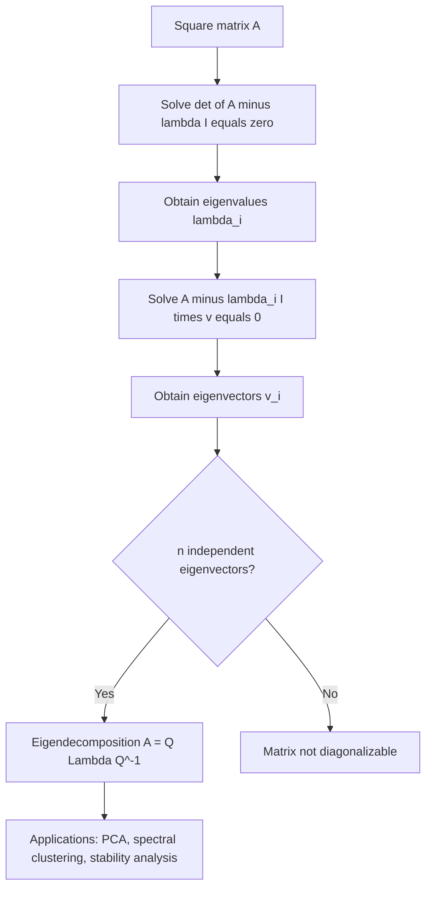

## Eigenvalues and Eigenvectors

### Overview

Eigenvalues and eigenvectors describe how a linear transformation acts on special directions in space — directions that are only scaled, not rotated, by the transformation. This concept underlies many core machine learning techniques, including principal component analysis, spectral clustering, and the analysis of covariance structures and optimization landscapes.

### Definition

For a square matrix $A \in \mathbb{R}^{n \times n}$, a nonzero vector $\mathbf{v}$ is an **eigenvector** of $A$ if there exists a scalar $\lambda$ such that:

$$A\mathbf{v} = \lambda\mathbf{v}$$

The scalar $\lambda$ is called the corresponding **eigenvalue**.

**Key Points**

- Applying $A$ to an eigenvector $\mathbf{v}$ produces a vector pointing in the same (or exactly opposite) direction, scaled by $\lambda$.
- Eigenvectors are defined up to scalar multiples: if $\mathbf{v}$ is an eigenvector, so is $c\mathbf{v}$ for any nonzero scalar $c$. Eigenvectors are conventionally normalized to unit length.
- Only square matrices have eigenvalues and eigenvectors in the standard sense.

### Diagram: Geometric Interpretation

<svg xmlns="http://www.w3.org/2000/svg" viewBox="0 0 700 300" font-family="Arial, sans-serif">
<text x="350" y="26" font-size="18" font-weight="bold" text-anchor="middle" fill="#222">Eigenvector Direction Preserved (svg_diagram)</text>
<line x1="350" y1="270" x2="350" y2="40" stroke="#ccc" stroke-width="1" />
<line x1="60" y1="160" x2="640" y2="160" stroke="#ccc" stroke-width="1" />
<line x1="350" y1="160" x2="470" y2="90" stroke="#4a76d4" stroke-width="3" marker-end="url(#arrow5)" />
<text x="480" y="85" font-size="13" fill="#4a76d4">v (eigenvector)</text>
<line x1="350" y1="160" x2="560" y2="20" stroke="#d4494a" stroke-width="3" marker-end="url(#arrow5)" />
<text x="565" y="20" font-size="13" fill="#d4494a">Av = lambda*v</text>
<line x1="350" y1="160" x2="470" y2="230" stroke="#3a8a4a" stroke-width="3" marker-end="url(#arrow5)" />
<text x="480" y="245" font-size="13" fill="#3a8a4a">w (non-eigenvector)</text>
<line x1="350" y1="160" x2="530" y2="260" stroke="#d4914a" stroke-width="3" stroke-dasharray="5,3" marker-end="url(#arrow5)" />
<text x="540" y="275" font-size="13" fill="#d4914a">Aw (direction changes)</text>
</svg>

### Computing Eigenvalues: The Characteristic Equation

Rearranging the eigenvalue equation:

$$A\mathbf{v} = \lambda\mathbf{v} \quad\Longrightarrow\quad (A - \lambda I)\mathbf{v} = \mathbf{0}$$

For a nonzero solution $\mathbf{v}$ to exist, the matrix $(A - \lambda I)$ must be singular, meaning:

$$\det(A - \lambda I) = 0$$

This equation, expanded, is a polynomial in $\lambda$ called the **characteristic polynomial**. Its roots are the eigenvalues of $A$.

**Key Points**

- An $n \times n$ matrix has exactly $n$ eigenvalues (counted with algebraic multiplicity), which may be real or complex, and may repeat.
- Once an eigenvalue $\lambda$ is found, the corresponding eigenvector(s) are obtained by solving $(A - \lambda I)\mathbf{v} = \mathbf{0}$.

### Worked Example

Let:

$$A = \begin{pmatrix} 4 & 1 \\ 2 & 3 \end{pmatrix}$$

**Step 1: Characteristic equation**

$$\det(A - \lambda I) = \det\begin{pmatrix} 4-\lambda & 1 \\ 2 & 3-\lambda \end{pmatrix} = (4-\lambda)(3-\lambda) - (1)(2)$$

$$= \lambda^2 - 7\lambda + 10 = 0$$

**Step 2: Solve for eigenvalues**

$$(\lambda - 5)(\lambda - 2) = 0 \implies \lambda_1 = 5, \ \lambda_2 = 2$$

**Step 3: Find eigenvector for $\lambda_1 = 5$**

$$(A - 5I)\mathbf{v} = \begin{pmatrix} -1 & 1 \\ 2 & -2 \end{pmatrix}\mathbf{v} = \mathbf{0}$$

This gives $-v_1 + v_2 = 0$, so $v_1 = v_2$. An eigenvector is $\mathbf{v}_1 = \begin{pmatrix} 1 \\ 1 \end{pmatrix}$.

**Step 4: Find eigenvector for $\lambda_2 = 2$**

$$(A - 2I)\mathbf{v} = \begin{pmatrix} 2 & 1 \\ 2 & 1 \end{pmatrix}\mathbf{v} = \mathbf{0}$$

This gives $2v_1 + v_2 = 0$, so $v_2 = -2v_1$. An eigenvector is $\mathbf{v}_2 = \begin{pmatrix} 1 \\ -2 \end{pmatrix}$.

### Key Properties

**Key Points**

- **Trace and eigenvalues:** The sum of eigenvalues equals the trace of the matrix: $\sum_i \lambda_i = \text{tr}(A)$.
- **Determinant and eigenvalues:** The product of eigenvalues equals the determinant: $\prod_i \lambda_i = \det(A)$.
- **Invertibility:** A matrix is invertible if and only if none of its eigenvalues are zero.
- **Symmetric matrices:** Real symmetric matrices always have real eigenvalues, and their eigenvectors corresponding to distinct eigenvalues are orthogonal. This is especially relevant since covariance matrices are symmetric.
- **Similar matrices:** Matrices related by $B = P^{-1}AP$ share the same eigenvalues as $A$, though generally different eigenvectors.

### Eigendecomposition

If a matrix $A$ has $n$ linearly independent eigenvectors, it can be **diagonalized** as:

$$A = Q\Lambda Q^{-1}$$

where $Q$ is a matrix whose columns are the eigenvectors of $A$, and $\Lambda$ is a diagonal matrix containing the corresponding eigenvalues.

**Key Points**

- Not all matrices are diagonalizable; a matrix must have $n$ linearly independent eigenvectors (i.e., be "non-defective") for this decomposition to exist.
- For **symmetric matrices**, the eigendecomposition simplifies to $A = Q\Lambda Q^T$, where $Q$ is orthogonal ($Q^T = Q^{-1}$), since eigenvectors of symmetric matrices can always be chosen to be orthonormal.
- Eigendecomposition simplifies many matrix computations; for example, $A^k = Q\Lambda^k Q^{-1}$, avoiding repeated matrix multiplication.

### Diagram: Eigendecomposition Structure

<svg xmlns="http://www.w3.org/2000/svg" viewBox="0 0 700 220" font-family="Arial, sans-serif">
<text x="350" y="26" font-size="18" font-weight="bold" text-anchor="middle" fill="#222">Eigendecomposition A = Q Lambda Q^-1 (svg_diagram)</text>
<rect x="50" y="60" width="100" height="100" fill="#e8f0fe" stroke="#4a76d4" stroke-width="2" />
<text x="100" y="115" font-size="16" text-anchor="middle" fill="#222">A</text>

<text x="175" y="115" font-size="20" text-anchor="middle" fill="#333">=</text>

<rect x="200" y="60" width="100" height="100" fill="#fef3e0" stroke="#d4914a" stroke-width="2" />
<text x="250" y="115" font-size="14" text-anchor="middle" fill="#222">Q</text>
<text x="250" y="180" font-size="11" text-anchor="middle" fill="#555">eigenvectors</text>

<text x="325" y="115" font-size="20" text-anchor="middle" fill="#333">x</text>

<rect x="350" y="60" width="100" height="100" fill="#e6f4ea" stroke="#3a8a4a" stroke-width="2" />
<text x="400" y="115" font-size="14" text-anchor="middle" fill="#222">Lambda</text>
<text x="400" y="180" font-size="11" text-anchor="middle" fill="#555">eigenvalues</text>

<text x="475" y="115" font-size="20" text-anchor="middle" fill="#333">x</text>

<rect x="500" y="60" width="100" height="100" fill="#fef3e0" stroke="#d4914a" stroke-width="2" />
<text x="550" y="115" font-size="14" text-anchor="middle" fill="#222">Q^-1</text>
</svg>

### Relevance to Machine Learning

**Key Points**

- **Principal Component Analysis (PCA):** PCA computes the eigenvectors and eigenvalues of the data's covariance matrix; eigenvectors define the principal component directions, and eigenvalues indicate the variance explained along each direction.
- **Spectral clustering:** Uses eigenvectors of a graph Laplacian matrix to embed data into a lower-dimensional space where clusters become more separable.
- **Stability analysis:** In iterative algorithms (e.g., gradient descent, Markov chains), the eigenvalues of relevant matrices determine convergence behavior — for instance, whether an iterative process converges or diverges.
- **Covariance structure:** Eigenvalues of a covariance matrix indicate the spread of data along each principal direction; all eigenvalues of a valid covariance matrix are non-negative, since covariance matrices are positive semi-definite.
- **Optimization landscapes:** Eigenvalues of the Hessian matrix at a critical point indicate whether it is a local minimum (all eigenvalues positive), local maximum (all negative), or saddle point (mixed signs).
- **PageRank and graph algorithms:** The dominant eigenvector of a transition matrix underlies algorithms such as PageRank. [Inference]

### Positive Definiteness and Eigenvalues

A symmetric matrix $A$ is:

- **Positive definite** if all eigenvalues are strictly positive ($\lambda_i > 0$ for all $i$).
- **Positive semi-definite** if all eigenvalues are non-negative ($\lambda_i \ge 0$ for all $i$).
- **Negative definite** if all eigenvalues are strictly negative.
- **Indefinite** if eigenvalues have mixed signs.

**Key Points**

- Covariance matrices are always positive semi-definite by construction.
- Positive definiteness of the Hessian at a critical point is a standard condition for confirming a local minimum in optimization problems.
- Positive definite matrices are always invertible, since none of their eigenvalues are zero.

### Power Iteration (Conceptual)

For large matrices, computing all eigenvalues exactly can be computationally expensive. **Power iteration** is a simple iterative method to approximate the dominant (largest-magnitude) eigenvalue and its eigenvector:

1. Start with a random vector $\mathbf{v}^{(0)}$.
2. Repeatedly compute $\mathbf{v}^{(t+1)} = \dfrac{A\mathbf{v}^{(t)}}{\|A\mathbf{v}^{(t)}\|}$.
3. As $t \to \infty$, $\mathbf{v}^{(t)}$ converges toward the eigenvector associated with the largest-magnitude eigenvalue, under suitable conditions (e.g., a unique dominant eigenvalue). [Inference]

**Key Points**

- Power iteration is conceptually simple but may converge slowly if the two largest eigenvalues are close in magnitude. [Inference]
- More robust and efficient algorithms (e.g., QR algorithm, Lanczos methods) are generally used in practice for computing full or partial eigendecompositions of large matrices. [Unverified]

### Conceptual Flow

### Advantages and Limitations

**Key Points**

- **Advantages:**
  - Reveals intrinsic structure of a linear transformation, independent of the coordinate system used.
  - Enables dimensionality reduction and noise filtering by focusing on directions of highest variance (as in PCA).
  - Provides theoretical tools for understanding convergence and stability of iterative algorithms.
- **Limitations:**
  - Not all matrices are diagonalizable, which can complicate certain analyses for defective matrices. [Inference]
  - Computing full eigendecompositions is computationally expensive, generally around $O(n^3)$ for an $n \times n$ matrix, which can be prohibitive for very large matrices. [Inference]
  - Eigenvalues and eigenvectors of non-symmetric matrices can be complex-valued, which may complicate interpretation in some applications. [Inference]

### Practical Considerations

- For covariance or kernel matrices, symmetry guarantees real eigenvalues and orthogonal eigenvectors, which simplifies both computation and interpretation.
- In high-dimensional settings, computing only the top few eigenvalues/eigenvectors (e.g., via truncated or randomized methods) is often more practical than a full eigendecomposition. [Inference]
- Numerical libraries typically use specialized, stable algorithms (e.g., QR algorithm) rather than directly solving the characteristic polynomial, since root-finding on high-degree polynomials can be numerically unstable. [Unverified]

**Next Steps**

- Principal Component Analysis (PCA)
- Singular Value Decomposition (SVD)
- Positive Definite Matrices and the Hessian in Optimization
- Spectral Clustering
- Covariance Matrices and Multivariate Gaussian Distributions
- Power Iteration and the QR Algorithm
- Condition Number and Numerical Stability