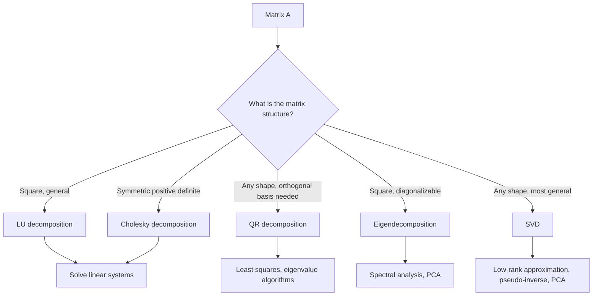

## Matrix Decompositions

### Overview

Matrix decomposition (or factorization) expresses a matrix as a product of simpler, structured matrices that reveal underlying properties or simplify computation. Decompositions such as LU, QR, Cholesky, eigendecomposition, and singular value decomposition are foundational tools throughout machine learning, used for solving linear systems, performing dimensionality reduction, and improving numerical stability.

### Why Decompose Matrices

**Key Points**

- Directly computing operations like matrix inversion is computationally expensive and numerically unstable for large or ill-conditioned matrices. [Inference]
- Decompositions break a complex matrix operation into a sequence of simpler operations (e.g., solving triangular systems), which are computationally cheaper and more numerically stable.
- Different decompositions are suited to different matrix structures (square, symmetric, positive definite, rectangular) and different tasks (solving systems, dimensionality reduction, least squares).

### LU Decomposition

**LU decomposition** factors a square matrix $A$ into the product of a lower triangular matrix $L$ and an upper triangular matrix $U$:

$$A = LU$$

In practice, a permutation matrix $P$ is often included to improve numerical stability:

$$PA = LU$$

**Key Points**

- $L$ has 1s on its diagonal and zeros above; $U$ has arbitrary values on and above its diagonal, zeros below.
- LU decomposition is primarily used to solve linear systems $A\mathbf{x} = \mathbf{b}$ efficiently by solving two triangular systems in sequence: $L\mathbf{y} = \mathbf{b}$, then $U\mathbf{x} = \mathbf{y}$.
- Not all matrices admit an LU decomposition without pivoting (row permutation); partial pivoting is standard practice to maintain numerical stability. [Inference]
- Once computed, the same LU factors can be reused to solve $A\mathbf{x} = \mathbf{b}$ for multiple right-hand sides $\mathbf{b}$ efficiently.

### Diagram: LU Decomposition

<svg xmlns="http://www.w3.org/2000/svg" viewBox="0 0 700 200" font-family="Arial, sans-serif">
<text x="350" y="26" font-size="18" font-weight="bold" text-anchor="middle" fill="#222">LU Decomposition (svg_diagram)</text>
<rect x="60" y="60" width="100" height="100" fill="#e8f0fe" stroke="#4a76d4" stroke-width="2" />
<text x="110" y="115" font-size="15" text-anchor="middle" fill="#222">A</text>

<text x="195" y="115" font-size="20" text-anchor="middle" fill="#333">=</text>

<polygon points="240,160 240,60 340,160" fill="#fef3e0" stroke="#d4914a" stroke-width="2" />
<text x="270" y="150" font-size="13" text-anchor="middle" fill="#222">L</text>

<text x="375" y="115" font-size="20" text-anchor="middle" fill="#333">x</text>

<polygon points="420,60 520,60 420,160" fill="#e6f4ea" stroke="#3a8a4a" stroke-width="2" />
<text x="440" y="90" font-size="13" text-anchor="middle" fill="#222">U</text>

<text x="270" y="180" font-size="11" text-anchor="middle" fill="#555">lower triangular</text>

<text x="470" y="180" font-size="11" text-anchor="middle" fill="#555">upper triangular</text>

</svg>

### QR Decomposition

**QR decomposition** factors a matrix $A \in \mathbb{R}^{m \times n}$ (with $m \ge n$) into:

$$A = QR$$

where $Q \in \mathbb{R}^{m \times n}$ has orthonormal columns ($Q^TQ = I$), and $R \in \mathbb{R}^{n \times n}$ is upper triangular.

**Key Points**

- QR decomposition can be computed via methods such as Gram-Schmidt orthogonalization, Householder reflections, or Givens rotations, with the latter two generally preferred for numerical stability. [Inference]
- Commonly used to solve least-squares problems: for $A\mathbf{x} \approx \mathbf{b}$, the solution minimizing $\|A\mathbf{x} - \mathbf{b}\|_2$ can be obtained via $R\mathbf{x} = Q^T\mathbf{b}$, avoiding the numerically problematic computation of $(A^TA)^{-1}$ directly.
- Useful for computing eigenvalues via the QR algorithm, an iterative method that repeatedly applies QR decomposition to converge toward a matrix's eigenvalues. [Inference]

### Cholesky Decomposition

For a symmetric positive definite matrix $A$, the **Cholesky decomposition** expresses:

$$A = LL^T$$

where $L$ is a lower triangular matrix with positive diagonal entries.

**Key Points**

- Applicable only to symmetric positive definite matrices, a common structure for covariance matrices and Gram matrices in machine learning.
- Computationally more efficient than LU decomposition for suitable matrices, requiring roughly half the operations, since it exploits symmetry. [Inference]
- Widely used for efficiently sampling from multivariate Gaussian distributions: if $\mathbf{z} \sim \mathcal{N}(0, I)$, then $\mathbf{x} = \mu + L\mathbf{z} \sim \mathcal{N}(\mu, A)$, where $A = LL^T$ is the desired covariance matrix.
- Also used in solving linear systems and in certain optimization algorithms requiring matrix square roots.

### Worked Example: Cholesky Decomposition

Let:

$$A = \begin{pmatrix} 4 & 2 \\ 2 & 5 \end{pmatrix}$$

We seek $L = \begin{pmatrix} l_{11} & 0 \\ l_{21} & l_{22} \end{pmatrix}$ such that $LL^T = A$.

$$l_{11} = \sqrt{4} = 2$$

$$l_{21} = \frac{2}{l_{11}} = \frac{2}{2} = 1$$

$$l_{22} = \sqrt{5 - l_{21}^2} = \sqrt{5 - 1} = 2$$

$$L = \begin{pmatrix} 2 & 0 \\ 1 & 2 \end{pmatrix}, \quad LL^T = \begin{pmatrix} 4 & 2 \\ 2 & 5 \end{pmatrix} = A$$

### Eigendecomposition (Recap)

For a square matrix $A$ with $n$ linearly independent eigenvectors:

$$A = Q\Lambda Q^{-1}$$

For symmetric matrices, this simplifies to $A = Q\Lambda Q^T$ with orthogonal $Q$.

**Key Points**

- Eigendecomposition applies only to square matrices, and requires the matrix to have a full set of linearly independent eigenvectors to exist in this exact form.
- Widely used in PCA, where the covariance matrix is eigendecomposed to identify principal directions of variance.
- Covered in detail in the eigenvalues and eigenvectors topic; included here for comparison with other decompositions.

### Singular Value Decomposition (SVD)

**SVD** generalizes eigendecomposition to any matrix, including non-square and non-symmetric matrices. For $A \in \mathbb{R}^{m \times n}$:

$$A = U\Sigma V^T$$

where $U \in \mathbb{R}^{m \times m}$ and $V \in \mathbb{R}^{n \times n}$ are orthogonal matrices, and $\Sigma \in \mathbb{R}^{m \times n}$ is diagonal (in the generalized sense) with non-negative entries called **singular values**, conventionally ordered from largest to smallest.

**Key Points**

- SVD exists for **every** matrix, regardless of shape, rank, or symmetry — a key advantage over eigendecomposition. [Inference]
- The columns of $U$ are called left singular vectors; the columns of $V$ are right singular vectors.
- Singular values are the square roots of the eigenvalues of $A^TA$ (or equivalently $AA^T$).
- Truncated SVD (keeping only the largest $k$ singular values/vectors) provides the best rank-$k$ approximation of $A$ in terms of minimizing reconstruction error, a result formalized by the Eckart-Young theorem.

### Diagram: SVD Structure

<svg xmlns="http://www.w3.org/2000/svg" viewBox="0 0 700 220" font-family="Arial, sans-serif">
<text x="350" y="26" font-size="18" font-weight="bold" text-anchor="middle" fill="#222">SVD: A = U Sigma V^T (svg_diagram)</text>
<rect x="40" y="60" width="110" height="100" fill="#e8f0fe" stroke="#4a76d4" stroke-width="2" />
<text x="95" y="115" font-size="15" text-anchor="middle" fill="#222">A</text>
<text x="95" y="180" font-size="11" text-anchor="middle" fill="#555">(m x n)</text>

<text x="180" y="115" font-size="20" text-anchor="middle" fill="#333">=</text>

<rect x="210" y="60" width="90" height="100" fill="#fef3e0" stroke="#d4914a" stroke-width="2" />
<text x="255" y="115" font-size="14" text-anchor="middle" fill="#222">U</text>
<text x="255" y="180" font-size="11" text-anchor="middle" fill="#555">(m x m)</text>

<text x="320" y="115" font-size="20" text-anchor="middle" fill="#333">x</text>

<rect x="350" y="80" width="90" height="60" fill="#e6f4ea" stroke="#3a8a4a" stroke-width="2" />
<text x="395" y="115" font-size="13" text-anchor="middle" fill="#222">Sigma</text>
<text x="395" y="160" font-size="11" text-anchor="middle" fill="#555">(m x n)</text>

<text x="460" y="115" font-size="20" text-anchor="middle" fill="#333">x</text>

<rect x="490" y="60" width="110" height="100" fill="#fef3e0" stroke="#d4914a" stroke-width="2" />
<text x="545" y="115" font-size="14" text-anchor="middle" fill="#222">V^T</text>
<text x="545" y="180" font-size="11" text-anchor="middle" fill="#555">(n x n)</text>
</svg>

### Comparison of Decomposition Methods

| Decomposition | Applies To | Form | Typical Use |
| --- | --- | --- | --- |
| LU | Square matrices | $A = LU$ (or $PA=LU$) | Solving linear systems |
| QR | Any matrix ($m \ge n$) | $A = QR$ | Least squares, eigenvalue algorithms |
| Cholesky | Symmetric positive definite | $A = LL^T$ | Efficient solving, Gaussian sampling |
| Eigendecomposition | Square, diagonalizable | $A = Q\Lambda Q^{-1}$ | PCA, spectral analysis |
| SVD | Any matrix | $A = U\Sigma V^T$ | Dimensionality reduction, low-rank approximation, pseudo-inverse |

### Relevance to Machine Learning

**Key Points**

- **Linear regression:** QR or Cholesky decomposition is commonly used to solve the normal equations more stably than direct matrix inversion. [Inference]
- **PCA:** Can be computed either via eigendecomposition of the covariance matrix or, more numerically stably, via SVD of the (centered) data matrix directly. [Inference]
- **Recommender systems:** Low-rank matrix factorization, closely related to truncated SVD, is used to approximate large, sparse user-item rating matrices.
- **Gaussian processes and multivariate Gaussians:** Cholesky decomposition of covariance matrices enables efficient sampling and likelihood computation.
- **Pseudo-inverse:** The Moore-Penrose pseudo-inverse, used for solving least-squares problems with non-invertible or non-square matrices, is computed directly from the SVD: $A^+ = V\Sigma^+U^T$.
- **Numerical stability in deep learning:** Some optimization and initialization schemes use orthogonal matrices (obtainable via QR decomposition) to help maintain stable gradient magnitudes. [Inference]

### Conceptual Flow

### Advantages and Limitations

**Key Points**

- **Advantages:**
  - Decompositions improve numerical stability and computational efficiency compared to naive matrix operations like direct inversion.
  - SVD in particular provides a universally applicable tool for rank reduction, noise filtering, and pseudo-inverse computation.
  - Specialized decompositions (e.g., Cholesky) exploit matrix structure for significant computational savings.
- **Limitations:**
  - Choosing the appropriate decomposition requires understanding the matrix's structure (symmetric, positive definite, square, etc.), adding complexity to implementation choices. [Inference]
  - Computing decompositions like full SVD can still be computationally expensive for very large matrices, generally on the order of $O(mn \cdot \min(m,n))$, motivating randomized or truncated variants. [Inference]
  - Some decompositions (e.g., Cholesky) fail or require modification if the matrix does not strictly satisfy the required properties (e.g., is only positive semi-definite rather than strictly positive definite). [Inference]

### Practical Considerations

- Numerical linear algebra libraries (e.g., LAPACK-backed implementations) generally select or recommend decomposition methods based on matrix structure to balance stability and efficiency. [Unverified]
- Regularization (e.g., adding a small multiple of the identity matrix) is sometimes used to ensure a matrix is strictly positive definite before applying Cholesky decomposition, especially when working with estimated covariance matrices. [Inference]
- Randomized SVD and other approximate decomposition methods are often used in large-scale machine learning settings where computing a full, exact decomposition is impractical. [Inference]

**Next Steps**

- Singular Value Decomposition (SVD) in Depth
- Principal Component Analysis (PCA)
- Least Squares Regression via QR Decomposition
- Low-Rank Matrix Approximation and Recommender Systems
- Multivariate Gaussian Sampling via Cholesky Decomposition
- Moore-Penrose Pseudo-Inverse
- Numerical Stability in Linear Algebra Computations