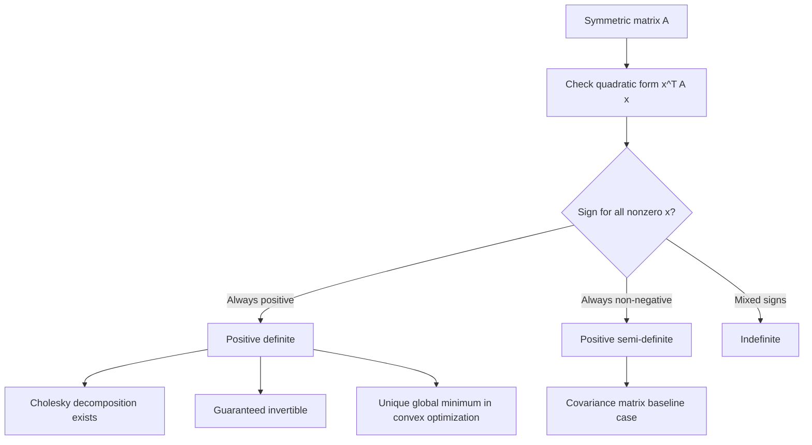

## Positive Definite Matrices

### Overview

Positive definite matrices are a special class of symmetric matrices that generalize the notion of "positivity" from scalars to higher dimensions. They arise naturally as covariance matrices, kernel (Gram) matrices, and Hessians of convex functions, and their properties underlie critical guarantees in optimization, probability, and numerical stability throughout machine learning.

### Definition

A symmetric matrix $A \in \mathbb{R}^{n \times n}$ is **positive definite** if, for every nonzero vector $\mathbf{x} \in \mathbb{R}^n$:

$$\mathbf{x}^T A \mathbf{x} > 0$$

It is **positive semi-definite** if the inequality is weakened to allow equality:

$$\mathbf{x}^T A \mathbf{x} \ge 0 \quad \text{for all } \mathbf{x}$$

**Key Points**

- The quantity $\mathbf{x}^TA\mathbf{x}$ is called a **quadratic form**; positive definiteness requires this form to be strictly positive for every nonzero input direction.
- Positive definiteness is typically defined for symmetric matrices; for non-symmetric matrices, the definition is sometimes applied to the symmetric part, $\frac{1}{2}(A + A^T)$. [Inference]
- Negative definite and negative semi-definite matrices are defined analogously, with the inequalities reversed.
- A matrix that is neither positive nor negative (semi-)definite, with quadratic form values of both signs, is called **indefinite**.

### Diagram: Quadratic Form Geometry

<svg xmlns="http://www.w3.org/2000/svg" viewBox="0 0 700 260" font-family="Arial, sans-serif">
<text x="350" y="26" font-size="18" font-weight="bold" text-anchor="middle" fill="#222">Quadratic Form Shapes (svg_diagram)</text>

<text x="130" y="60" font-size="13" text-anchor="middle" fill="#333">Positive definite</text>

<ellipse cx="130" cy="150" rx="70" ry="45" fill="none" stroke="`#4a76d4`" stroke-width="2" />

<ellipse cx="130" cy="150" rx="45" ry="28" fill="none" stroke="`#4a76d4`" stroke-width="2" />

<ellipse cx="130" cy="150" rx="20" ry="12" fill="none" stroke="`#4a76d4`" stroke-width="2" />

<text x="130" y="225" font-size="11" text-anchor="middle" fill="#555">bowl shape, unique minimum</text>

<text x="350" y="60" font-size="13" text-anchor="middle" fill="#333">Indefinite</text>

<path d="M280,150 Q350,90 420,150 Q350,210 280,150" fill="none" stroke="`#d4494a`" stroke-width="2" />

<path d="M300,120 L400,180 M300,180 L400,120" stroke="`#d4494a`" stroke-width="1.5" stroke-dasharray="3,3" />

<text x="350" y="225" font-size="11" text-anchor="middle" fill="#555">saddle shape</text>

<text x="570" y="60" font-size="13" text-anchor="middle" fill="#333">Positive semi-definite</text>

<path d="M510,170 L630,170" stroke="`#3a8a4a`" stroke-width="2" />

<ellipse cx="570" cy="150" rx="60" ry="20" fill="none" stroke="`#3a8a4a`" stroke-width="2" />

<text x="570" y="225" font-size="11" text-anchor="middle" fill="#555">valley (flat direction)</text>

</svg>

### Equivalent Characterizations

A symmetric matrix $A$ is positive definite if and only if any one (and hence all) of the following hold:

**Key Points**

- **Eigenvalue criterion:** All eigenvalues of $A$ are strictly positive ($\lambda_i > 0$ for all $i$).
- **Leading principal minors:** All leading principal minors (determinants of the top-left $k \times k$ submatrices, for $k = 1, \dots, n$) are strictly positive — known as **Sylvester's criterion**.
- **Cholesky existence:** $A$ can be written as $A = LL^T$ for some lower triangular matrix $L$ with strictly positive diagonal entries.
- **Full rank via decomposition:** $A = B^TB$ for some matrix $B$ with full column rank.

For positive semi-definiteness, the corresponding conditions use non-negative eigenvalues, non-negative principal minors, and allow $B$ to be rank-deficient.

### Worked Example: Checking Positive Definiteness

Let:

$$A = \begin{pmatrix} 2 & -1 \\ -1 & 2 \end{pmatrix}$$

**Method 1: Eigenvalues**

$$\det(A - \lambda I) = (2-\lambda)^2 - 1 = \lambda^2 - 4\lambda + 3 = 0 \implies \lambda_1 = 1, \ \lambda_2 = 3$$

Both eigenvalues are positive, so $A$ is positive definite.

**Method 2: Sylvester's criterion**

- Leading $1 \times 1$ minor: $2 > 0$ ✓
- Leading $2 \times 2$ minor (full determinant): $(2)(2) - (-1)(-1) = 4 - 1 = 3 > 0$ ✓

Both leading principal minors are positive, confirming $A$ is positive definite — consistent with the eigenvalue result.

### Why Symmetric Positive Definite Matrices Matter

**Key Points**

- **Covariance matrices:** Any valid covariance matrix is symmetric positive semi-definite by construction, since $\text{Var}(\mathbf{a}^T\mathbf{x}) = \mathbf{a}^T\Sigma\mathbf{a} \ge 0$ for any vector $\mathbf{a}$. Strict positive definiteness holds when no linear combination of variables is deterministic (i.e., the covariance matrix is non-singular).
- **Convex optimization:** A twice-differentiable function is (strictly) convex on a region if its Hessian matrix is positive (semi-)definite throughout that region — a key condition for confirming unique global minima.
- **Kernel methods:** Valid kernel functions in methods like support vector machines and Gaussian processes must produce positive semi-definite Gram matrices (Mercer's condition), ensuring the kernel corresponds to an inner product in some feature space.
- **Numerical stability:** Positive definite matrices are always invertible and admit a numerically stable Cholesky decomposition, making them computationally favorable in many algorithms.

### Positive Definiteness and Optimization

For a twice-differentiable function $f(\mathbf{x})$, the Hessian matrix $H$ at a critical point $\mathbf{x}^*$ (where $\nabla f(\mathbf{x}^*) = \mathbf{0}$) determines the nature of that point:

| Hessian at Critical Point | Classification |
| --- | --- |
| Positive definite | Local minimum |
| Negative definite | Local maximum |
| Indefinite | Saddle point |
| Positive/negative semi-definite (not definite) | Inconclusive; higher-order analysis needed |

**Key Points**

- This second-derivative test generalizes the single-variable case (where $f''(x) > 0$ indicates a local minimum) to multivariable functions.
- If the Hessian is positive definite across the entire domain, the function is strictly convex, guaranteeing that any local minimum is also the unique global minimum. [Inference]
- Many machine learning loss functions (e.g., ordinary least squares, ridge regression) have positive semi-definite or positive definite Hessians, which supports reliable convergence for gradient-based optimization methods. [Inference]

### Ensuring Positive Definiteness in Practice

**Key Points**

- Estimated covariance matrices (e.g., from limited sample data) can sometimes be only positive semi-definite or even numerically indefinite due to estimation error or insufficient sample size relative to dimensionality. [Inference]
- A common remedy is **regularization**, adding a small positive multiple of the identity matrix: $A_{\text{reg}} = A + \epsilon I$, which shifts all eigenvalues up by $\epsilon$ and guarantees strict positive definiteness for suitably chosen $\epsilon > 0$.
- This technique appears directly in ridge regression, where $(X^TX + \lambda I)$ is guaranteed invertible even if $X^TX$ alone is singular or ill-conditioned.
- Regularization of this form also improves the numerical conditioning of the matrix, which can improve stability in downstream computations such as Cholesky decomposition or matrix inversion. [Inference]

### Relevance to Machine Learning

**Key Points**

- **Ridge regression:** Adds $\lambda I$ to $X^TX$ specifically to ensure positive definiteness and a unique, stable solution.
- **Gaussian distributions:** The multivariate normal density requires a positive definite covariance matrix; its inverse (the precision matrix) must exist for the density to be well-defined.
- **Gaussian processes:** The kernel (covariance) matrix over training points must be positive semi-definite for the process to be a valid probabilistic model.
- **Newton's method and second-order optimization:** Relies on the Hessian being positive definite to guarantee that each update step moves toward a minimum rather than a saddle point or maximum. [Inference]
- **Support vector machines:** The kernel matrix used in the dual optimization problem must be positive semi-definite for the underlying quadratic program to be convex and reliably solvable.

### Conceptual Flow

### Advantages and Limitations

**Key Points**

- **Advantages:**
  - Guarantees invertibility, enabling stable and efficient solutions to linear systems and optimization problems.
  - Supports the numerically efficient Cholesky decomposition, reducing computational cost relative to general matrix factorizations.
  - Provides a reliable second-order condition for confirming local minima in optimization.
- **Limitations:**
  - Verifying positive definiteness (e.g., via eigenvalues or Sylvester's criterion) adds computational overhead, particularly for large matrices. [Inference]
  - Real-world estimated matrices (e.g., sample covariance matrices with limited data) may fail to be strictly positive definite, requiring regularization or other corrective steps. [Inference]
  - Positive semi-definite matrices (with zero eigenvalues) lack a unique inverse, which can complicate certain algorithms unless handled explicitly (e.g., via pseudo-inverses). [Inference]

### Practical Considerations

- When working with sample covariance matrices in high-dimensional settings (especially when the number of features approaches or exceeds the number of observations), positive semi-definiteness rather than strict positive definiteness is common, motivating regularized covariance estimation. [Inference]
- Attempting a Cholesky decomposition is sometimes used as a practical numerical test for positive definiteness, since the decomposition fails (or produces complex/undefined values) if the matrix is not positive definite. [Unverified]
- Software libraries often provide dedicated functions to check positive (semi-)definiteness or to compute the nearest positive definite matrix to a given matrix, which can be useful when correcting numerically imperfect covariance estimates. [Unverified]

**Next Steps**

- Convex Optimization and the Hessian Matrix
- Ridge Regression and Regularization
- Covariance Matrices and Multivariate Gaussian Distributions
- Cholesky Decomposition
- Kernel Methods and Mercer's Condition
- Newton's Method and Second-Order Optimization
- Condition Number and Numerical Stability