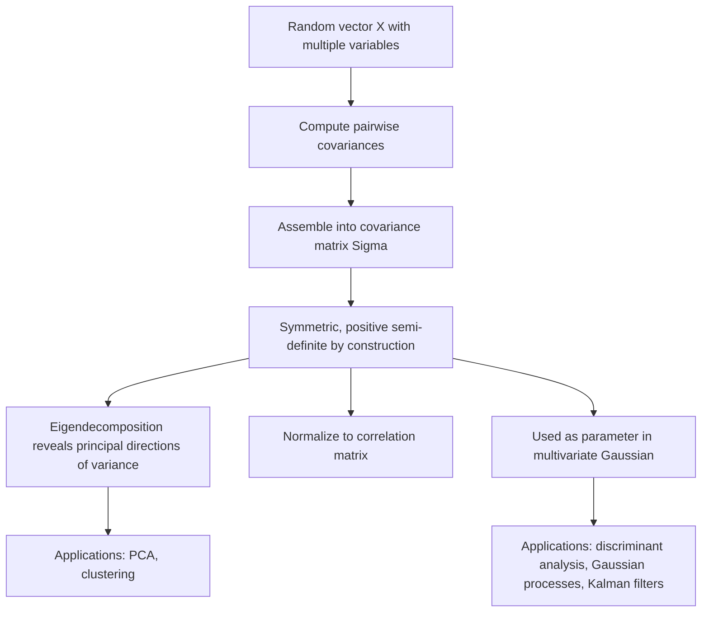

## Covariance Matrices

### Overview

A covariance matrix summarizes how multiple random variables vary together, extending the concept of variance from a single variable to many. Covariance matrices are central to multivariate statistics and machine learning, underlying methods such as principal component analysis, Gaussian distributions, portfolio optimization, and many multivariate model diagnostics.

### Definition

For a random vector $\mathbf{X} = (X_1, X_2, \dots, X_n)^T$ with mean $\boldsymbol\mu = \mathbb{E}[\mathbf{X}]$, the **covariance matrix** $\Sigma$ is defined as:

$$\Sigma = \mathbb{E}\left[ (\mathbf{X} - \boldsymbol\mu)(\mathbf{X} - \boldsymbol\mu)^T \right]$$

Each entry of $\Sigma$ is given by:

$$\Sigma_{ij} = \text{Cov}(X_i, X_j) = \mathbb{E}\left[ (X_i - \mu_i)(X_j - \mu_j) \right]$$

**Key Points**
- The diagonal entries $\Sigma_{ii}$ are the variances of each individual variable: $\Sigma_{ii} = \text{Var}(X_i)$.
- The off-diagonal entries $\Sigma_{ij}$ ($i \ne j$) capture the covariance between pairs of variables, indicating whether they tend to increase or decrease together.
- The covariance matrix is always symmetric, since $\text{Cov}(X_i, X_j) = \text{Cov}(X_j, X_i)$.
- The covariance matrix is always positive semi-definite, and positive definite when no variable is an exact linear combination of the others.

### Sample Covariance Matrix

Given $n$ observations of $p$ variables arranged in a data matrix $X \in \mathbb{R}^{n \times p}$ (rows as observations, columns as variables), the **sample covariance matrix** is estimated as:

$$S = \frac{1}{n-1} (X - \bar{X})^T (X - \bar{X})$$

where $\bar{X}$ denotes the matrix of column means, broadcast across rows (i.e., each column is centered by subtracting its mean).

**Key Points**
- The divisor $n-1$ (rather than $n$) provides an unbiased estimator of the population covariance matrix, following the same logic as Bessel's correction in univariate variance estimation.
- $S$ is symmetric and positive semi-definite by construction; it is positive definite when $n > p$ and the data does not contain exact linear dependencies among variables. [Inference]
- When $p > n$ (more variables than observations), $S$ is necessarily rank-deficient and therefore only positive semi-definite, not positive definite. [Inference]

### Diagram: Covariance Matrix Structure

<svg xmlns="http://www.w3.org/2000/svg" viewBox="0 0 700 260" font-family="Arial, sans-serif">
  <text x="350" y="26" font-size="18" font-weight="bold" text-anchor="middle" fill="#222">Covariance Matrix Structure (svg_diagram)</text>

  <rect x="220" y="60" width="260" height="160" fill="none" stroke="#333" stroke-width="1.5" />
  <line x1="220" y1="113" x2="480" y2="113" stroke="#ddd" />
  <line x1="220" y1="166" x2="480" y2="166" stroke="#ddd" />
  <line x1="307" y1="60" x2="307" y2="220" stroke="#ddd" />
  <line x1="393" y1="60" x2="393" y2="220" stroke="#ddd" />

  <rect x="220" y="60" width="87" height="53" fill="#e8f0fe" />
  <rect x="307" y="113" width="86" height="53" fill="#e8f0fe" />
  <rect x="393" y="166" width="87" height="54" fill="#e8f0fe" />

  <text x="263" y="90" font-size="12" text-anchor="middle" fill="#222">Var(X1)</text>
  <text x="350" y="143" font-size="12" text-anchor="middle" fill="#222">Var(X2)</text>
  <text x="437" y="196" font-size="12" text-anchor="middle" fill="#222">Var(X3)</text>

  <text x="350" y="90" font-size="11" text-anchor="middle" fill="#555">Cov(X1,X2)</text>
  <text x="263" y="143" font-size="11" text-anchor="middle" fill="#555">Cov(X2,X1)</text>

  <text x="350" y="220" font-size="12" text-anchor="middle" fill="#666">diagonal = variances, off-diagonal = covariances</text>
</svg>

### Correlation Matrix

The **correlation matrix** normalizes the covariance matrix so all diagonal entries equal 1, making relationships comparable across variables of different scales:

$$R_{ij} = \frac{\Sigma_{ij}}{\sqrt{\Sigma_{ii}\Sigma_{jj}}} = \frac{\text{Cov}(X_i, X_j)}{\sigma_i \sigma_j}$$

**Key Points**
- Correlation values range between $-1$ and $1$, with $1$ indicating perfect positive linear association, $-1$ perfect negative linear association, and $0$ indicating no linear association.
- Unlike covariance, correlation is unaffected by the scale (units) of the original variables, making it easier to interpret and compare across variable pairs.
- The correlation matrix can be derived from the covariance matrix as $R = D^{-1}\Sigma D^{-1}$, where $D$ is a diagonal matrix of standard deviations $\sigma_i$.

### Worked Example

Consider two variables measured across observations, with sample covariance matrix:

$$S = \begin{pmatrix} 4 & 3 \\ 3 & 9 \end{pmatrix}$$

**Interpretation:**
- $\text{Var}(X_1) = 4 \implies \sigma_1 = 2$
- $\text{Var}(X_2) = 9 \implies \sigma_2 = 3$
- $\text{Cov}(X_1, X_2) = 3$ (positive, indicating the variables tend to move together)

**Correlation:**

$$r_{12} = \frac{3}{\sqrt{4}\sqrt{9}} = \frac{3}{2 \times 3} = 0.5$$

A correlation of 0.5 indicates a moderate positive linear relationship between $X_1$ and $X_2$.

**Positive definiteness check (Sylvester's criterion):**
- Leading $1\times1$ minor: $4 > 0$ ✓
- Determinant: $(4)(9) - (3)(3) = 36 - 9 = 27 > 0$ ✓

Both conditions hold, confirming $S$ is positive definite.

### Geometric Interpretation

**Key Points**
- The eigenvectors of a covariance matrix indicate the principal directions of variation in the data; the corresponding eigenvalues indicate the amount of variance along each direction.
- Geometrically, the covariance matrix defines an ellipse (in 2D) or ellipsoid (in higher dimensions) representing regions of constant probability density under a multivariate Gaussian assumption — with axes aligned to the eigenvectors and lengths proportional to the square roots of the eigenvalues.
- This eigenstructure is exactly what Principal Component Analysis exploits: the first principal component corresponds to the eigenvector with the largest eigenvalue (direction of maximum variance).

### Diagram: Covariance Ellipse and Eigenvectors

<svg xmlns="http://www.w3.org/2000/svg" viewBox="0 0 700 300" font-family="Arial, sans-serif">
  <text x="350" y="26" font-size="18" font-weight="bold" text-anchor="middle" fill="#222">Covariance Ellipse (svg_diagram)</text>

  <line x1="350" y1="270" x2="350" y2="50" stroke="#ccc" stroke-width="1" />
  <line x1="80" y1="160" x2="620" y2="160" stroke="#ccc" stroke-width="1" />

  <g transform="translate(350,160) rotate(-30)">
    <ellipse cx="0" cy="0" rx="180" ry="80" fill="#e8f0fe" stroke="#4a76d4" stroke-width="2" opacity="0.6" />
    <line x1="-180" y1="0" x2="180" y2="0" stroke="#d4494a" stroke-width="2" marker-end="url(#arrow6)" />
    <line x1="0" y1="-80" x2="0" y2="80" stroke="#3a8a4a" stroke-width="2" marker-end="url(#arrow6)" />
  </g>

  <text x="520" y="80" font-size="12" fill="#d4494a">Largest eigenvector (PC1)</text>
  <text x="470" y="260" font-size="12" fill="#3a8a4a">Smaller eigenvector (PC2)</text>

  </svg>

### Covariance Matrix in the Multivariate Gaussian Distribution

The multivariate normal density for $\mathbf{x} \in \mathbb{R}^n$ is defined as:

$$p(\mathbf{x}) = \frac{1}{(2\pi)^{n/2} |\Sigma|^{1/2}} \exp\left( -\frac{1}{2}(\mathbf{x}-\boldsymbol\mu)^T \Sigma^{-1} (\mathbf{x}-\boldsymbol\mu) \right)$$

**Key Points**
- The covariance matrix $\Sigma$ must be positive definite for this density to be well-defined, since it requires computing $\Sigma^{-1}$ and $|\Sigma| > 0$.
- The inverse $\Sigma^{-1}$, called the **precision matrix**, appears directly in the exponent and encodes conditional independence structure: a zero entry in the precision matrix implies conditional independence between the corresponding pair of variables given all others. [Inference]
- This relationship between precision matrices and conditional independence underlies Gaussian graphical models, used to represent dependency structure among many variables. [Inference]

### Relevance to Machine Learning

**Key Points**
- **Principal Component Analysis (PCA):** Directly eigendecomposes the (centered) data's covariance matrix to identify directions of maximal variance for dimensionality reduction.
- **Gaussian discriminant analysis and Gaussian mixture models:** Estimate class-conditional or component-conditional covariance matrices to model the shape and orientation of data clusters.
- **Mahalanobis distance:** Uses the inverse covariance matrix to measure distance while accounting for correlations and differing variances among features: $D_M(\mathbf{x}) = \sqrt{(\mathbf{x}-\boldsymbol\mu)^T \Sigma^{-1} (\mathbf{x}-\boldsymbol\mu)}$.
- **Kalman filters and Gaussian processes:** Propagate and update covariance matrices to represent evolving uncertainty over time or across input space.
- **Portfolio optimization and risk modeling:** Covariance matrices of asset returns are used to quantify diversification benefits and total portfolio risk. [Inference]
- **Feature correlation analysis:** Correlation matrices (derived from covariance matrices) are commonly used in exploratory data analysis to detect multicollinearity before model fitting.

### High-Dimensional Estimation Challenges

**Key Points**
- When the number of variables $p$ is large relative to the number of observations $n$, the sample covariance matrix becomes a poor and often singular estimator of the true population covariance. [Inference]
- **Shrinkage estimators** combine the sample covariance matrix with a structured target (e.g., a scaled identity matrix) to produce a better-conditioned, regularized estimate, particularly useful when $p$ approaches or exceeds $n$. [Inference]
- Regularized estimation approaches (e.g., graphical lasso) can additionally encourage sparsity in the precision matrix, aiding interpretability in high-dimensional conditional independence structure. [Inference]
- Ill-conditioned covariance estimates can cause numerical instability in downstream computations such as matrix inversion or Cholesky decomposition, motivating the regularization techniques discussed under positive definite matrices. [Inference]

### Conceptual Flow

### Advantages and Limitations

**Key Points**
- **Advantages:**
  - Provides a compact summary of pairwise linear relationships among many variables simultaneously.
  - Forms the mathematical foundation for numerous multivariate techniques, from PCA to Gaussian-based probabilistic models.
  - Symmetric positive semi-definite structure enables efficient, stable computation via specialized decompositions (e.g., Cholesky).
- **Limitations:**
  - Covariance and correlation only capture **linear** relationships; variables with strong nonlinear dependence can show near-zero covariance despite being strongly related. [Inference]
  - Sample covariance matrices are unreliable estimators in high-dimensional, low-sample-size settings, often requiring regularization or shrinkage. [Inference]
  - Covariance matrices are sensitive to outliers, since they rely on squared deviations from the mean; robust covariance estimators are sometimes used as an alternative. [Inference]

### Practical Considerations

- Standardizing variables (converting to correlation rather than covariance) is often preferable before analyses like PCA when variables are measured on very different scales, to prevent high-variance features from dominating the analysis purely due to units. [Inference]
- Checking whether an estimated covariance matrix is positive definite (rather than only positive semi-definite) is important before relying on its inverse in downstream computations such as the multivariate Gaussian density or Mahalanobis distance. [Inference]
- In high-dimensional settings, dedicated shrinkage or regularization methods for covariance estimation are generally preferred over the raw sample covariance matrix. [Unverified]

**Next Steps**
- Principal Component Analysis (PCA)
- Multivariate Gaussian Distribution
- Mahalanobis Distance
- Gaussian Graphical Models and Precision Matrices
- Shrinkage Estimation and the Graphical Lasso
- Gaussian Discriminant Analysis
- Positive Definite Matrices