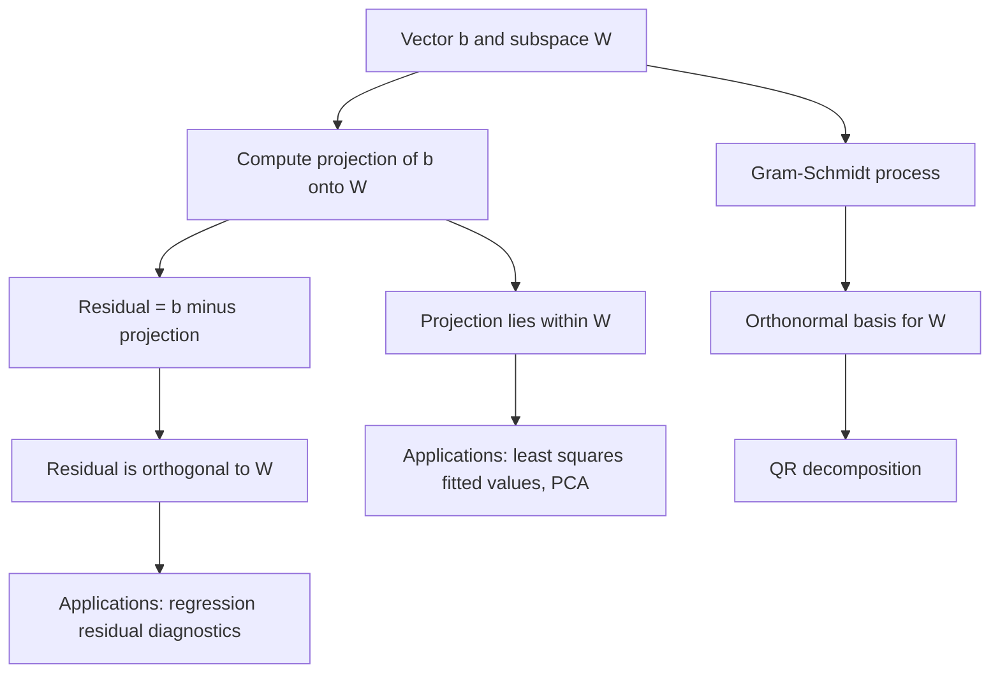

## Projections and Orthogonality

### Overview

Projections and orthogonality describe how vectors relate to subspaces — specifically, how to decompose a vector into a component lying within a subspace and a component perpendicular to it. These ideas underlie least squares regression, dimensionality reduction, orthogonalization procedures, and the geometric interpretation of many machine learning algorithms.

### Orthogonality Recap

Two vectors $\mathbf{u}, \mathbf{v} \in \mathbb{R}^n$ are **orthogonal** if their inner product is zero:

$$\mathbf{u} \cdot \mathbf{v} = \mathbf{u}^T\mathbf{v} = 0$$

A set of vectors is **orthonormal** if all pairs are orthogonal and each vector has unit norm.

**Key Points**
- Orthogonality generalizes the geometric notion of perpendicularity to any dimension.
- Orthogonal vectors are automatically linearly independent (provided none is the zero vector), since no nonzero linear combination of mutually orthogonal vectors can equal zero. [Inference]
- Orthonormal sets are particularly convenient because coordinates with respect to them can be computed via simple inner products, without needing to solve a linear system.

### Vector Projection onto Another Vector

The **projection** of a vector $\mathbf{b}$ onto a vector $\mathbf{a}$ is the component of $\mathbf{b}$ that lies along the direction of $\mathbf{a}$:

$$\text{proj}_{\mathbf{a}}(\mathbf{b}) = \frac{\mathbf{a}^T\mathbf{b}}{\mathbf{a}^T\mathbf{a}} \, \mathbf{a}$$

**Key Points**
- The scalar coefficient $\dfrac{\mathbf{a}^T\mathbf{b}}{\mathbf{a}^T\mathbf{a}}$ represents how far along $\mathbf{a}$ the projection extends.
- The **residual** $\mathbf{b} - \text{proj}_{\mathbf{a}}(\mathbf{b})$ is orthogonal to $\mathbf{a}$ by construction, which can be verified by checking that its dot product with $\mathbf{a}$ equals zero.
- This decomposes $\mathbf{b}$ into two orthogonal components: one parallel to $\mathbf{a}$, and one perpendicular to it.

### Diagram: Vector Projection

<svg xmlns="http://www.w3.org/2000/svg" viewBox="0 0 700 280" font-family="Arial, sans-serif">
  <text x="350" y="26" font-size="18" font-weight="bold" text-anchor="middle" fill="#222">Projection of b onto a (svg_diagram)</text>

  <line x1="80" y1="220" x2="600" y2="220" stroke="#ccc" stroke-width="1" />

  <line x1="100" y1="220" x2="480" y2="220" stroke="#4a76d4" stroke-width="3" marker-end="url(#arrow7)" />
  <text x="490" y="225" font-size="13" fill="#4a76d4">a</text>

  <line x1="100" y1="220" x2="350" y2="80" stroke="#d4494a" stroke-width="3" marker-end="url(#arrow7)" />
  <text x="330" y="70" font-size="13" fill="#d4494a">b</text>

  <line x1="100" y1="220" x2="300" y2="220" stroke="#3a8a4a" stroke-width="3" marker-end="url(#arrow7)" />
  <text x="270" y="240" font-size="12" fill="#3a8a4a">proj_a(b)</text>

  <line x1="300" y1="220" x2="350" y2="80" stroke="#d4914a" stroke-width="2" stroke-dasharray="5,3" />
  <text x="360" y="150" font-size="12" fill="#d4914a">residual (orthogonal)</text>

  <path d="M290,220 L300,220 L300,210" fill="none" stroke="#666" stroke-width="1.5" />

  </svg>

### Worked Example: Vector Projection

Let $\mathbf{a} = (3, 0)$ and $\mathbf{b} = (2, 4)$.

$$\text{proj}_{\mathbf{a}}(\mathbf{b}) = \frac{(3)(2) + (0)(4)}{(3)^2 + (0)^2}(3, 0) = \frac{6}{9}(3, 0) = \left(2, 0\right)$$

**Residual:**
$$\mathbf{b} - \text{proj}_{\mathbf{a}}(\mathbf{b}) = (2,4) - (2,0) = (0, 4)$$

**Verification of orthogonality:**
$$(3,0) \cdot (0,4) = 0 + 0 = 0 \ ✓$$

The residual is indeed orthogonal to $\mathbf{a}$, confirming the decomposition.

### Projection onto a Subspace

More generally, given a subspace $W$ spanned by the columns of a matrix $A \in \mathbb{R}^{n \times k}$ (assumed to have linearly independent columns), the projection of a vector $\mathbf{b}$ onto $W$ is:

$$\text{proj}_W(\mathbf{b}) = A(A^TA)^{-1}A^T\mathbf{b}$$

The matrix $P = A(A^TA)^{-1}A^T$ is called the **projection matrix** (or hat matrix) onto the column space of $A$.

**Key Points**
- $P$ satisfies $P^2 = P$ (idempotency: projecting twice has the same effect as projecting once) and $P^T = P$ (symmetry), which are the two defining properties of an orthogonal projection matrix.
- The residual vector $\mathbf{b} - P\mathbf{b}$ is orthogonal to every vector in the subspace $W$, not just to a single direction.
- When $A$'s columns are orthonormal, $A^TA = I$, simplifying the projection to $P = AA^T$.

### Connection to Least Squares Regression

**Key Points**
- In ordinary least squares regression, the fitted values $\hat{\mathbf{y}} = X\hat{\boldsymbol\beta}$ are exactly the orthogonal projection of the observed response vector $\mathbf{y}$ onto the column space of the design matrix $X$.
- This is precisely why the normal equations take the form $X^TX\hat{\boldsymbol\beta} = X^T\mathbf{y}$: they arise from requiring the residual $\mathbf{y} - X\hat{\boldsymbol\beta}$ to be orthogonal to every column of $X$.
- Geometrically, least squares finds the point in the column space of $X$ that is closest (in Euclidean distance) to $\mathbf{y}$ — and this closest point is always the orthogonal projection.

### Diagram: Least Squares as Orthogonal Projection

<svg xmlns="http://www.w3.org/2000/svg" viewBox="0 0 700 300" font-family="Arial, sans-serif">
  <text x="350" y="26" font-size="18" font-weight="bold" text-anchor="middle" fill="#222">Least Squares as Projection (svg_diagram)</text>

  <polygon points="100,240 550,240 480,90 200,90" fill="#f0f4fa" stroke="#aaa" stroke-width="1.5" />
  <text x="180" y="260" font-size="12" fill="#666">Column space of X</text>

  <circle cx="380" cy="80" r="6" fill="#d4494a" />
  <text x="395" y="70" font-size="13" fill="#d4494a">y (observed)</text>

  <circle cx="340" cy="170" r="6" fill="#3a8a4a" />
  <text x="350" y="190" font-size="13" fill="#3a8a4a">y-hat = Xb (projection)</text>

  <line x1="380" y1="80" x2="340" y2="170" stroke="#d4914a" stroke-width="2" stroke-dasharray="5,3" />
  <text x="400" y="120" font-size="12" fill="#d4914a">residual (orthogonal to column space)</text>

  <line x1="200" y1="240" x2="340" y2="170" stroke="#4a76d4" stroke-width="1.5" />
</svg>

### Gram-Schmidt Orthogonalization

The **Gram-Schmidt process** converts a set of linearly independent vectors $\{\mathbf{v}_1, \dots, \mathbf{v}_k\}$ into an orthonormal set $\{\mathbf{q}_1, \dots, \mathbf{q}_k\}$ spanning the same subspace.

**Procedure:**

$$\mathbf{u}_1 = \mathbf{v}_1, \qquad \mathbf{q}_1 = \frac{\mathbf{u}_1}{\|\mathbf{u}_1\|}$$

$$\mathbf{u}_k = \mathbf{v}_k - \sum_{i=1}^{k-1} \text{proj}_{\mathbf{q}_i}(\mathbf{v}_k), \qquad \mathbf{q}_k = \frac{\mathbf{u}_k}{\|\mathbf{u}_k\|}$$

**Key Points**
- Each new vector is obtained by subtracting off its projections onto all previously computed orthonormal vectors, leaving only the component orthogonal to the existing set.
- This process underlies QR decomposition: the resulting orthonormal vectors form the columns of $Q$, while the projection coefficients form the entries of the upper triangular matrix $R$.
- Classical Gram-Schmidt can suffer from numerical instability due to rounding errors; a **modified Gram-Schmidt** variant improves stability by orthogonalizing sequentially against updated (already-orthogonalized) vectors rather than the originals. [Inference]

### Orthogonal Complement

The **orthogonal complement** of a subspace $W \subseteq \mathbb{R}^n$, denoted $W^{\perp}$, is the set of all vectors orthogonal to every vector in $W$:

$$W^{\perp} = \{ \mathbf{x} \in \mathbb{R}^n : \mathbf{x}^T\mathbf{w} = 0 \text{ for all } \mathbf{w} \in W \}$$

**Key Points**
- Every vector $\mathbf{b} \in \mathbb{R}^n$ can be uniquely decomposed as $\mathbf{b} = \mathbf{b}_W + \mathbf{b}_{W^{\perp}}$, where $\mathbf{b}_W \in W$ and $\mathbf{b}_{W^{\perp}} \in W^{\perp}$.
- The dimensions of a subspace and its orthogonal complement sum to the full dimension of the ambient space: $\dim(W) + \dim(W^{\perp}) = n$.
- In least squares regression, the residual vector lies in the orthogonal complement of the column space of $X$.

### Relevance to Machine Learning

**Key Points**
- **Least squares regression:** Fitted values are the orthogonal projection of the response onto the column space of the design matrix, as detailed above.
- **Principal Component Analysis:** Projects data onto a lower-dimensional subspace spanned by the top eigenvectors of the covariance matrix, chosen to maximize retained variance (equivalently, minimize squared projection residuals).
- **QR decomposition:** Built directly from Gram-Schmidt-style orthogonalization, used for numerically stable solutions to least squares and eigenvalue problems.
- **Orthogonal initialization in neural networks:** Some weight initialization schemes use orthogonal matrices to help maintain stable signal propagation through deep networks. [Inference]
- **Feature decorrelation:** Techniques such as whitening use orthogonal transformations to remove correlations between features, often as a preprocessing step before modeling. [Inference]
- **Gram matrices in kernel methods:** Rely on inner products (a generalization of the dot products underlying projection) to implicitly represent data in high-dimensional or infinite-dimensional feature spaces.

### Conceptual Flow

### Advantages and Limitations

**Key Points**
- **Advantages:**
  - Provides a geometric, interpretable framework for understanding regression fitting, dimensionality reduction, and decomposition methods.
  - Orthonormal bases simplify computation, since coordinates can be obtained via simple inner products rather than solving linear systems.
  - Projection matrices have well-understood algebraic properties (idempotency, symmetry) that support both theoretical analysis and efficient computation.
- **Limitations:**
  - Classical Gram-Schmidt orthogonalization can be numerically unstable in finite-precision arithmetic, generally motivating the use of modified Gram-Schmidt or Householder-based methods in practice. [Inference]
  - Computing projection matrices directly (via $A(A^TA)^{-1}A^T$) can be computationally inefficient and numerically unstable for large or ill-conditioned $A$; QR-based approaches are typically preferred. [Inference]
  - Orthogonal projection assumes a linear subspace structure, which may not capture more complex, nonlinear relationships in data without additional transformation (e.g., kernel methods). [Inference]

### Practical Considerations

- In regression diagnostics, the projection (hat) matrix's diagonal entries — sometimes called leverage values — are used to identify influential or high-leverage observations. [Inference]
- Numerical libraries typically compute least squares solutions via QR or SVD-based methods rather than explicitly forming the projection matrix, for improved stability and efficiency. [Unverified]
- Understanding orthogonal projection is a useful conceptual bridge between linear algebra fundamentals and the geometric interpretation of statistical model fitting.

**Next Steps**
- Least Squares Regression and the Normal Equations
- QR Decomposition
- Principal Component Analysis (PCA)
- Gram-Schmidt Process and Numerical Stability
- Kernel Methods and Feature Space Projections
- Regression Diagnostics: Leverage and Influence
- Orthogonal Matrices and Rotations