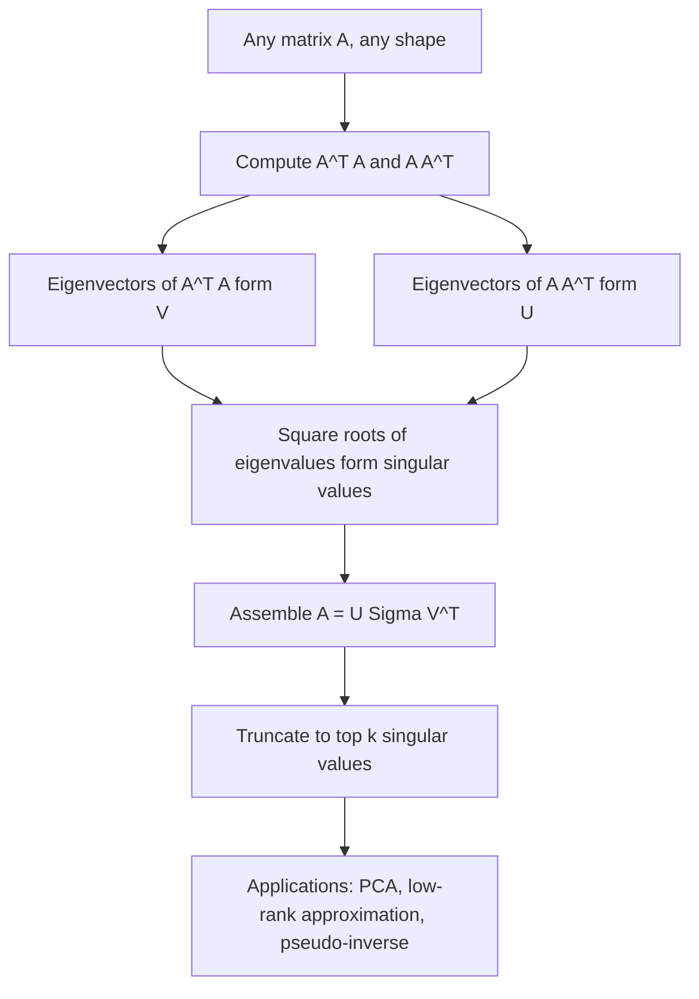

## Singular Value Decomposition

### Overview

Singular Value Decomposition (SVD) is a matrix factorization technique that decomposes any matrix into three components revealing its fundamental structure: rotation, scaling, and rotation again. Unlike eigendecomposition, SVD applies to every matrix regardless of shape or symmetry, making it one of the most broadly useful tools in linear algebra for machine learning, underlying PCA, recommender systems, pseudo-inverses, and low-rank approximation.

### Definition

For any matrix $A \in \mathbb{R}^{m \times n}$, the SVD expresses:

$$A = U\Sigma V^T$$

where:
- $U \in \mathbb{R}^{m \times m}$ is orthogonal ($U^TU = UU^T = I$), with columns called **left singular vectors**.
- $V \in \mathbb{R}^{n \times n}$ is orthogonal ($V^TV = VV^T = I$), with columns called **right singular vectors**.
- $\Sigma \in \mathbb{R}^{m \times n}$ is diagonal (in the generalized rectangular sense), with non-negative entries $\sigma_1 \ge \sigma_2 \ge \dots \ge 0$ called **singular values**, arranged in decreasing order.

**Key Points**
- Every real matrix has an SVD, regardless of rank, shape, or symmetry — a key advantage over eigendecomposition, which requires square, diagonalizable matrices.
- The number of nonzero singular values equals the rank of $A$.
- Singular values are always non-negative real numbers, even when $A$ itself has complex or negative entries.

### Geometric Interpretation

**Key Points**
- SVD reveals that any linear transformation can be decomposed into three simple steps: a rotation/reflection (by $V^T$), a scaling along orthogonal axes (by $\Sigma$), and another rotation/reflection (by $U$).
- Geometrically, the unit sphere in $\mathbb{R}^n$ is mapped by $A$ to an ellipsoid in $\mathbb{R}^m$; the singular values are the lengths of the ellipsoid's principal semi-axes, and the singular vectors indicate their directions.
- This decomposition applies to any linear map, offering a universal geometric picture even when the transformation changes dimensionality (i.e., $m \neq n$).

### Diagram: SVD as Rotation-Scale-Rotation

<svg xmlns="http://www.w3.org/2000/svg" viewBox="0 0 700 260" font-family="Arial, sans-serif">
  <text x="350" y="26" font-size="18" font-weight="bold" text-anchor="middle" fill="#222">SVD: Rotate, Scale, Rotate (svg_diagram)</text>

  <circle cx="120" cy="150" r="55" fill="none" stroke="#4a76d4" stroke-width="2" />
  <text x="120" y="225" font-size="12" text-anchor="middle" fill="#555">Unit circle</text>

  <text x="210" y="155" font-size="16" text-anchor="middle" fill="#333">V^T</text>
  <path d="M195,150 L245,150" stroke="#666" stroke-width="2" marker-end="url(#arrow8)" />

  <ellipse cx="330" cy="150" rx="55" ry="55" fill="none" stroke="#d4494a" stroke-width="2" transform="rotate(20 330 150)" />
  <text x="330" y="225" font-size="12" text-anchor="middle" fill="#555">Rotated</text>

  <text x="420" y="155" font-size="16" text-anchor="middle" fill="#333">Sigma</text>
  <path d="M405,150 L455,150" stroke="#666" stroke-width="2" marker-end="url(#arrow8)" />

  <ellipse cx="540" cy="150" rx="80" ry="35" fill="none" stroke="#3a8a4a" stroke-width="2" transform="rotate(20 540 150)" />
  <text x="540" y="225" font-size="12" text-anchor="middle" fill="#555">Scaled ellipse</text>

  </svg>

### Relationship to Eigendecomposition

**Key Points**
- The right singular vectors (columns of $V$) are the eigenvectors of $A^TA$, and the left singular vectors (columns of $U$) are the eigenvectors of $AA^T$.
- The singular values are the square roots of the (non-negative) eigenvalues of $A^TA$ (equivalently $AA^T$): $\sigma_i = \sqrt{\lambda_i(A^TA)}$.
- For a symmetric positive semi-definite matrix, the SVD coincides exactly with the eigendecomposition, since $U = V$ and the singular values equal the eigenvalues.
- This relationship means SVD can, in principle, be computed via eigendecomposition of $A^TA$ or $AA^T$, though specialized numerical algorithms are generally preferred for direct, stable computation of the SVD itself. [Inference]

### Worked Example (Conceptual)

Let:

$$A = \begin{pmatrix} 3 & 0 \\ 4 & 5 \end{pmatrix}$$

Computing $A^TA$:

$$A^TA = \begin{pmatrix} 3 & 4 \\ 0 & 5 \end{pmatrix}\begin{pmatrix} 3 & 0 \\ 4 & 5 \end{pmatrix} = \begin{pmatrix} 25 & 20 \\ 20 & 25 \end{pmatrix}$$

The eigenvalues of $A^TA$ can be found from its characteristic equation:

$$(25-\lambda)^2 - 400 = 0 \implies \lambda = 25 \pm 20 \implies \lambda_1 = 45, \ \lambda_2 = 5$$

The singular values of $A$ are therefore:

$$\sigma_1 = \sqrt{45} \approx 6.71, \qquad \sigma_2 = \sqrt{5} \approx 2.24$$

The corresponding right singular vectors $V$ are the (normalized) eigenvectors of $A^TA$, and the left singular vectors $U$ can then be recovered via $\mathbf{u}_i = \dfrac{1}{\sigma_i} A\mathbf{v}_i$.

### Truncated SVD and Low-Rank Approximation

SVD can be written as a sum of rank-1 matrices:

$$A = \sum_{i=1}^{r} \sigma_i \, \mathbf{u}_i \mathbf{v}_i^T$$

where $r$ is the rank of $A$. Keeping only the top $k < r$ terms gives the **truncated SVD**:

$$A_k = \sum_{i=1}^{k} \sigma_i \, \mathbf{u}_i \mathbf{v}_i^T$$

**Key Points**
- The **Eckart-Young theorem** establishes that $A_k$ is the best possible rank-$k$ approximation to $A$, in the sense of minimizing the Frobenius norm (or spectral norm) of the reconstruction error, among all rank-$k$ matrices.
- Because singular values are sorted in decreasing order, the first few terms typically capture most of the "energy" or variance in the matrix, especially when singular values decay quickly. [Inference]
- Truncated SVD provides a principled way to compress data or reduce noise, retaining the components that account for the most structure while discarding smaller, often noise-dominated components.

### Diagram: Truncated SVD (Low-Rank Approximation)

<svg xmlns="http://www.w3.org/2000/svg" viewBox="0 0 700 220" font-family="Arial, sans-serif">
  <text x="350" y="26" font-size="18" font-weight="bold" text-anchor="middle" fill="#222">Truncated SVD Rank-k Approximation (svg_diagram)</text>

  <rect x="40" y="60" width="110" height="110" fill="#e8f0fe" stroke="#4a76d4" stroke-width="2" />
  <text x="95" y="120" font-size="14" text-anchor="middle" fill="#222">A</text>
  <text x="95" y="190" font-size="11" text-anchor="middle" fill="#555">full rank</text>

  <text x="185" y="120" font-size="20" text-anchor="middle" fill="#333">≈</text>

  <rect x="220" y="80" width="90" height="70" fill="#fef3e0" stroke="#d4914a" stroke-width="2" />
  <text x="265" y="120" font-size="12" text-anchor="middle" fill="#222">Uk</text>

  <text x="330" y="120" font-size="20" text-anchor="middle" fill="#333">x</text>

  <rect x="360" y="100" width="50" height="30" fill="#e6f4ea" stroke="#3a8a4a" stroke-width="2" />
  <text x="385" y="120" font-size="11" text-anchor="middle" fill="#222">Sk</text>

  <text x="430" y="120" font-size="20" text-anchor="middle" fill="#333">x</text>

  <rect x="460" y="80" width="90" height="70" fill="#fef3e0" stroke="#d4914a" stroke-width="2" />
  <text x="505" y="120" font-size="12" text-anchor="middle" fill="#222">Vk^T</text>

  <text x="350" y="195" font-size="12" text-anchor="middle" fill="#666">smaller k retains dominant structure, reduces size</text>
</svg>

### Moore-Penrose Pseudo-Inverse

For matrices that are not square or not invertible, the **pseudo-inverse** $A^+$ generalizes the concept of matrix inversion and is computed directly from the SVD:

$$A^+ = V\Sigma^+U^T$$

where $\Sigma^+$ is formed by taking the reciprocal of each nonzero singular value and transposing the resulting matrix.

**Key Points**
- The pseudo-inverse provides the minimum-norm least-squares solution to $A\mathbf{x} = \mathbf{b}$, whether the system is overdetermined, underdetermined, or exactly determined but singular.
- When $A$ is square and invertible, $A^+ = A^{-1}$, so the pseudo-inverse is a strict generalization of the standard inverse.
- This makes SVD directly useful for solving least squares regression problems in a numerically stable way, particularly when the design matrix is rank-deficient or ill-conditioned. [Inference]

### Relevance to Machine Learning

**Key Points**
- **Principal Component Analysis:** PCA can be computed directly via SVD of the centered data matrix, avoiding the need to explicitly form the (potentially less numerically stable) covariance matrix. [Inference]
- **Dimensionality reduction:** Truncated SVD is used directly as a dimensionality reduction technique, particularly for sparse data such as term-document matrices in natural language processing (sometimes called Latent Semantic Analysis).
- **Recommender systems:** Matrix factorization approaches for collaborative filtering are closely related to (and often initialized or motivated by) truncated SVD of the user-item ratings matrix.
- **Noise reduction and compression:** Truncated SVD is used in image compression and denoising, retaining dominant structure while discarding smaller singular values associated with noise. [Inference]
- **Pseudo-inverse and least squares:** SVD-based computation of the pseudo-inverse provides a numerically robust way to solve regression problems, especially with multicollinear or rank-deficient design matrices.
- **Condition number:** The ratio of the largest to smallest singular value, $\kappa(A) = \sigma_{\max}/\sigma_{\min}$, quantifies numerical sensitivity and is a standard diagnostic for potential instability in matrix computations.

### Conceptual Flow

### Advantages and Limitations

**Key Points**
- **Advantages:**
  - Applies universally to any matrix, regardless of shape, rank, or symmetry, unlike eigendecomposition.
  - Provides the mathematically optimal low-rank approximation under the Eckart-Young theorem, with strong theoretical guarantees.
  - Directly enables numerically stable computation of the pseudo-inverse for least squares problems.
- **Limitations:**
  - Computing a full SVD is computationally expensive, generally on the order of $O(mn \cdot \min(m,n))$ for an $m \times n$ matrix, which can be prohibitive for very large matrices. [Inference]
  - Truncated or randomized SVD introduces approximation error, and choosing the truncation rank $k$ often requires judgment or additional criteria (e.g., examining the singular value spectrum). [Inference]
  - Interpreting singular vectors directly can be difficult in some applications, since they are abstract linear combinations of original features rather than the features themselves. [Inference]

### Practical Considerations

- Examining a scree plot of singular values (or their squares) is a common way to choose an appropriate truncation rank $k$, looking for an "elbow" where additional components contribute diminishing structure. [Inference]
- For very large or sparse matrices, randomized SVD algorithms can approximate the top singular values/vectors much more efficiently than computing a full, exact SVD. [Inference]
- Numerical libraries generally implement SVD using specialized, stable algorithms (e.g., based on bidiagonalization) rather than the conceptual eigendecomposition-of-$A^TA$ approach shown above, since the latter can be less numerically stable due to squaring the condition number. [Unverified]

**Next Steps**
- Principal Component Analysis (PCA)
- Low-Rank Matrix Approximation and Recommender Systems
- Moore-Penrose Pseudo-Inverse and Least Squares
- Latent Semantic Analysis in NLP
- Randomized SVD for Large-Scale Data
- Condition Number and Numerical Stability
- Matrix Decompositions Overview