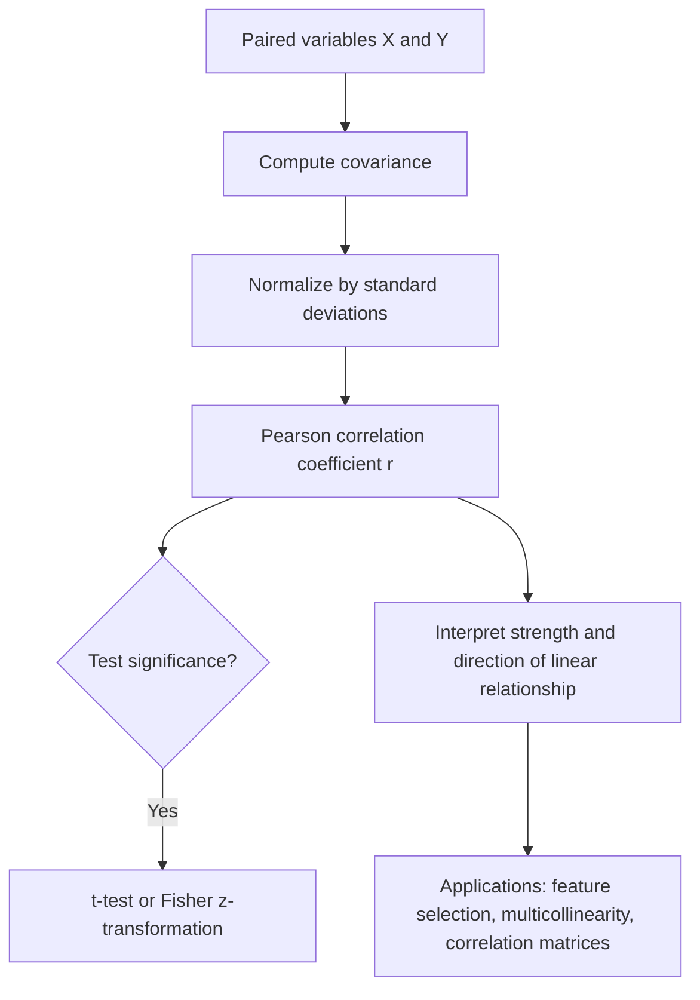

## Pearson Correlation

### Overview

Pearson correlation measures the strength and direction of the linear relationship between two continuous variables. It is one of the most widely used statistics in exploratory data analysis and machine learning, informing feature selection, multicollinearity detection, and the interpretation of relationships between variables before modeling.

### Definition

The **Pearson correlation coefficient** between two random variables $X$ and $Y$ is defined as:

$$\rho_{X,Y} = \frac{\text{Cov}(X,Y)}{\sigma_X \sigma_Y} = \frac{\mathbb{E}\left[(X-\mu_X)(Y-\mu_Y)\right]}{\sigma_X \sigma_Y}$$

For a sample of $n$ paired observations $(x_i, y_i)$, the **sample Pearson correlation coefficient** $r$ is:

$$r = \frac{\sum_{i=1}^{n}(x_i - \bar{x})(y_i - \bar{y})}{\sqrt{\sum_{i=1}^{n}(x_i - \bar{x})^2} \sqrt{\sum_{i=1}^{n}(y_i - \bar{y})^2}}$$

**Key Points**
- $r$ always lies in the range $[-1, 1]$.
- $r = 1$ indicates a perfect positive linear relationship; $r = -1$ indicates a perfect negative linear relationship; $r = 0$ indicates no linear relationship.
- $r$ is a normalized version of covariance, making it scale-invariant and comparable across variable pairs measured in different units.
- Pearson correlation is symmetric: $r_{X,Y} = r_{Y,X}$.

### Diagram: Correlation Patterns

<svg xmlns="http://www.w3.org/2000/svg" viewBox="0 0 700 260" font-family="Arial, sans-serif">
  <text x="350" y="26" font-size="18" font-weight="bold" text-anchor="middle" fill="#222">Pearson Correlation Patterns (svg_diagram)</text>

  <text x="110" y="55" font-size="13" text-anchor="middle" fill="#333">r close to 1</text>
  <line x1="50" y1="200" x2="170" y2="200" stroke="#ccc" />
  <line x1="50" y1="200" x2="50" y2="80" stroke="#ccc" />
  <circle cx="60" cy="190" r="3" fill="#4a76d4" /><circle cx="80" cy="170" r="3" fill="#4a76d4" />
  <circle cx="95" cy="150" r="3" fill="#4a76d4" /><circle cx="115" cy="130" r="3" fill="#4a76d4" />
  <circle cx="130" cy="110" r="3" fill="#4a76d4" /><circle cx="150" cy="95" r="3" fill="#4a76d4" />

  <text x="350" y="55" font-size="13" text-anchor="middle" fill="#333">r close to 0</text>
  <line x1="290" y1="200" x2="410" y2="200" stroke="#ccc" />
  <line x1="290" y1="200" x2="290" y2="80" stroke="#ccc" />
  <circle cx="310" cy="150" r="3" fill="#d4914a" /><circle cx="330" cy="110" r="3" fill="#d4914a" />
  <circle cx="350" cy="180" r="3" fill="#d4914a" /><circle cx="365" cy="130" r="3" fill="#d4914a" />
  <circle cx="380" cy="160" r="3" fill="#d4914a" /><circle cx="395" cy="95" r="3" fill="#d4914a" />

  <text x="590" y="55" font-size="13" text-anchor="middle" fill="#333">r close to -1</text>
  <line x1="530" y1="200" x2="650" y2="200" stroke="#ccc" />
  <line x1="530" y1="200" x2="530" y2="80" stroke="#ccc" />
  <circle cx="540" cy="95" r="3" fill="#d4494a" /><circle cx="560" cy="115" r="3" fill="#d4494a" />
  <circle cx="575" cy="135" r="3" fill="#d4494a" /><circle cx="595" cy="155" r="3" fill="#d4494a" />
  <circle cx="610" cy="175" r="3" fill="#d4494a" /><circle cx="630" cy="190" r="3" fill="#d4494a" />
</svg>

### Worked Example

Consider paired observations:

| $x_i$ | $y_i$ |
|---|---|
| 1 | 2 |
| 2 | 4 |
| 3 | 5 |
| 4 | 4 |
| 5 | 6 |

**Step 1: Compute means**
$$\bar{x} = 3, \qquad \bar{y} = 4.2$$

**Step 2: Compute deviations and products**

| $x_i - \bar{x}$ | $y_i - \bar{y}$ | Product | $(x_i-\bar{x})^2$ | $(y_i-\bar{y})^2$ |
|---|---|---|---|---|
| -2 | -2.2 | 4.4 | 4 | 4.84 |
| -1 | -0.2 | 0.2 | 1 | 0.04 |
| 0 | 0.8 | 0.0 | 0 | 0.64 |
| 1 | -0.2 | -0.2 | 1 | 0.04 |
| 2 | 1.8 | 3.6 | 4 | 3.24 |

**Step 3: Sum and compute $r$**

$$\sum \text{products} = 8.0, \quad \sum(x_i-\bar{x})^2 = 10, \quad \sum(y_i-\bar{y})^2 = 8.8$$

$$r = \frac{8.0}{\sqrt{10}\sqrt{8.8}} = \frac{8.0}{\sqrt{88}} \approx \frac{8.0}{9.38} \approx 0.853$$

A value of approximately 0.85 indicates a strong positive linear relationship between $x$ and $y$.

### Hypothesis Testing for Correlation

The significance of a sample correlation can be tested against the null hypothesis $H_0: \rho = 0$ (no linear relationship in the population) using a t-statistic:

$$t = r\sqrt{\frac{n-2}{1-r^2}}$$

which follows a t-distribution with $n-2$ degrees of freedom under $H_0$.

**Key Points**
- This test assumes the underlying variables are approximately bivariate normally distributed; violations of this assumption can affect the validity of the resulting p-value. [Inference]
- Statistical significance (a small p-value) indicates the observed correlation is unlikely under the null hypothesis of no linear relationship, but does not by itself indicate a strong or practically meaningful relationship, especially with large sample sizes.
- Confidence intervals for $\rho$ are often constructed using the Fisher z-transformation, $z = \text{arctanh}(r) = \frac{1}{2}\ln\left(\frac{1+r}{1-r}\right)$, which has an approximately normal sampling distribution.

### Key Properties and Assumptions

**Key Points**
- **Linearity assumption:** Pearson correlation specifically measures linear association; it can be misleadingly close to zero even when a strong nonlinear relationship exists between variables.
- **Sensitivity to outliers:** Because it relies on squared deviations (through variances) and cross-products, Pearson correlation can be substantially influenced by a small number of outlying observations. [Inference]
- **Not causal:** A high correlation does not imply that one variable causes changes in the other; correlation may reflect a common underlying cause, coincidence, or a confounding relationship.
- **Scale invariance:** $r$ is unaffected by linear transformations of either variable (e.g., unit conversions), aside from a possible sign flip if the transformation reverses direction.
- **Restriction of range:** Correlation estimates can be attenuated (biased toward zero) when the observed range of one or both variables is restricted relative to the full population range. [Inference]

### Correlation vs. Covariance

| Aspect | Covariance | Pearson Correlation |
|---|---|---|
| Scale | Depends on units of both variables | Unitless, always in $[-1, 1]$ |
| Interpretability | Magnitude not directly interpretable | Magnitude directly indicates strength |
| Comparability across pairs | Not directly comparable | Directly comparable |
| Formula relationship | $\text{Cov}(X,Y)$ | $\text{Cov}(X,Y) / (\sigma_X \sigma_Y)$ |

### Relevance to Machine Learning

**Key Points**
- **Feature selection:** Pearson correlation between features and a continuous target variable is commonly used as a simple, fast filter method to identify potentially predictive linear features.
- **Multicollinearity detection:** High pairwise correlations among predictor variables can indicate multicollinearity, which can destabilize coefficient estimates in linear regression models.
- **Correlation matrices:** Extending pairwise Pearson correlation across many variables produces a correlation matrix, widely used in exploratory data analysis and as an input to methods such as PCA.
- **Preprocessing decisions:** Highly correlated feature pairs are sometimes flagged for removal or combination during feature engineering to reduce redundancy. [Inference]
- **Limitations for feature selection:** Because Pearson correlation only detects linear relationships, it can overlook features with strong nonlinear predictive value, motivating the use of complementary measures (e.g., mutual information, rank-based correlations) in some workflows. [Inference]

### Comparison with Other Correlation Measures

| Measure | Captures | Robust to Outliers | Monotonic Nonlinear Relationships |
|---|---|---|---|
| Pearson | Linear relationships | No | No |
| Spearman | Monotonic relationships (via ranks) | More robust | Yes |
| Kendall's tau | Monotonic relationships (via concordant/discordant pairs) | More robust | Yes |

**Key Points**
- Spearman and Kendall correlations operate on ranks rather than raw values, making them more robust to outliers and capable of detecting monotonic but nonlinear relationships that Pearson correlation would understate. [Inference]
- Pearson correlation remains the standard choice when the linearity assumption is reasonable and the goal is to characterize the strength of a linear association specifically.

### Conceptual Flow

### Advantages and Limitations

**Key Points**
- **Advantages:**
  - Simple to compute and widely understood, with an intuitive scale from $-1$ to $1$.
  - Directly interpretable in terms of the strength and direction of a linear relationship.
  - Forms the basis for many downstream techniques, including covariance-matrix-based methods like PCA.
- **Limitations:**
  - Captures only linear association, potentially missing important nonlinear relationships. [Inference]
  - Sensitive to outliers, which can inflate or deflate the estimated correlation substantially. [Inference]
  - Statistical significance does not equate to practical importance, particularly with large sample sizes where even small correlations can be statistically significant.
  - Assumes the relationship (if any) is adequately summarized by a single linear coefficient, which can be misleading for data with heteroscedasticity or nonlinear structure. [Inference]

### Practical Considerations

- Visualizing data with a scatter plot alongside computing $r$ is generally recommended, since very different data patterns (including nonlinear ones) can produce similar or identical correlation coefficients — a phenomenon famously illustrated by Anscombe's quartet. [Inference]
- When outliers or non-normality are a concern, Spearman's rank correlation is often used as a more robust alternative. [Inference]
- Correlation should not be interpreted as evidence of causation without additional experimental or causal-inference reasoning, since observed correlations may result from confounding variables or coincidence. [Inference]

**Next Steps**
- Spearman Rank Correlation and Kendall's Tau
- Covariance Matrices
- Multicollinearity and Variance Inflation Factor
- Anscombe's Quartet and the Importance of Visualization
- Mutual Information as a Nonlinear Association Measure
- Correlation vs. Causation
- Feature Selection Methods in Machine Learning